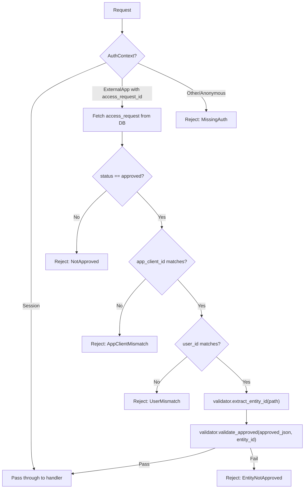
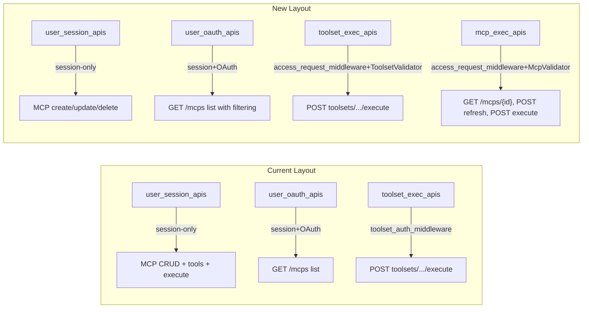

# Generic Access Request Auth Middleware for MCPs

## Context

Currently, `toolset_auth_middleware` in [crates/auth_middleware/src/toolset_auth_middleware.rs](crates/auth_middleware/src/toolset_auth_middleware.rs) handles both access-request validation AND domain-specific checks (type enabled, instance configured) for toolset execution. MCP routes are session-only with no OAuth support.

The goal is to:

1. Refactor to a generic, trait-based access_request_auth_middleware that handles ONLY access-request validation
2. Move domain-specific checks to route handlers
3. Extend the access request system to support MCP servers (requested by URL)
4. Enable OAuth access to MCP routes via the new middleware

## Key Design Decisions

- **No backward compatibility** -- format changes are breaking, no migration needed
- **Consistent approved JSON format** between toolsets and MCPs:

```json
{
  "toolsets": [
    { "toolset_type": "builtin-exa-search", "status": "approved", "instance": { "id": "uuid" } }
  ],
  "mcps": [
    {
      "url": "https://mcp.deepwiki.com/mcp",
      "status": "approved",
      "instance": { "id": "uuid", "status": "approved" }
    }
  ]
}
```

- **Requested JSON** uses type-level keys: `{"toolset_types": [...], "mcp_servers": [{"url": "..."}]}`
- **Approved JSON** uses instance-level keys: `{"toolsets": [...], "mcps": [...]}`
- **Singular `instance`** per approval item (not array) -- one instance per request, may extend later
- **Middleware scope**: Only access-request checks (OAuth flow). Session users pass through. Domain validation moves to handlers.
- **Trait-based design**: `AccessRequestValidator` trait with methods for entity ID extraction and approved-list validation
- **Remove** `GET /mcps/{id}/tools` endpoint (tools already in `GET /mcps` and `GET /mcps/{id}` responses)

## Implementation Order

**Part A**: Toolset middleware refactoring first -- rename, make generic, update approved format, move domain checks to handler, all tests pass, local commit.

**Part B**: MCP support -- add MCP types, validator, routes, frontend, e2e tests.

## Architecture

### Middleware Flow (OAuth only -- Session passes through)




### Route Composition Changes




---

# PART A: Toolset Middleware Refactoring

Complete Part A fully, run `make test.backend`, then local commit before starting Part B.

## A.1: Update Approved JSON Format

### Domain types (`objs` crate)

**File**: [crates/objs/src/access_request.rs](crates/objs/src/access_request.rs)

Replace existing `ToolsetApproval` (which had `instance_id: Option<String>`) with:

```rust
#[derive(Debug, Clone, Serialize, Deserialize, ToSchema, PartialEq)]
pub struct ToolsetApproval {
  pub toolset_type: String,
  pub status: String,
  #[serde(skip_serializing_if = "Option::is_none")]
  pub instance: Option<ToolsetInstance>,
}

#[derive(Debug, Clone, Serialize, Deserialize, ToSchema, PartialEq)]
pub struct ToolsetInstance {
  pub id: String,
}
```

### Service layer

**File**: [crates/services/src/access_request_service/service.rs](crates/services/src/access_request_service/service.rs)

Update serialization from `"toolset_types"` key to `"toolsets"` in:

- `create_draft` -- `requested` JSON stays as `{"toolset_types": [...]}`
- `approve_request` -- `approved` JSON changes to `{"toolsets": [{ toolset_type, status, instance: { id } }]}`

### Route DTOs

**File**: [crates/routes_app/src/routes_apps/types.rs](crates/routes_app/src/routes_apps/types.rs)

Update `ApprovedResources`:

```rust
pub struct ApprovedResources {
  #[serde(default)]
  pub toolsets: Vec<ToolsetApproval>,  // was: toolset_types
}
```

Update `ApproveAccessRequestBody` to use the new field name.

### Approval handler

Update `approve_access_request_handler` to construct `ToolsetApproval` with `instance` instead of `instance_id`.

## A.2: Rename Middleware File and Error Types

**Rename**: `toolset_auth_middleware.rs` -> `access_request_auth_middleware.rs`

**Rename error**: `ToolsetAuthError` -> `AccessRequestAuthError`

Generic variants:

- `MissingAuth`
- `AccessRequestNotFound { access_request_id }`
- `AccessRequestNotApproved { access_request_id, status }`
- `AppClientMismatch { expected, found }`
- `UserMismatch { expected, found }`
- `EntityNotApproved { entity_id }`
- `InvalidApprovedJson { error }`
- `EntityNotFound`
- `DbError`

Remove toolset-specific variants: `ToolsetNotFound`, `ToolsetNotApproved`, `ToolsetNotConfigured`.

Update [crates/auth_middleware/src/lib.rs](crates/auth_middleware/src/lib.rs) exports.

## A.3: Implement Generic Middleware

### Define `AccessRequestValidator` trait

```rust
pub trait AccessRequestValidator: Send + Sync + 'static {
  fn extract_entity_id(&self, path: &str) -> Result<String, AccessRequestAuthError>;
  fn validate_approved(&self, approved_json: &Option<String>, entity_id: &str) -> Result<(), AccessRequestAuthError>;
}
```

### Generic middleware function

```rust
pub fn access_request_auth_middleware<V: AccessRequestValidator>(
  validator: Arc<V>,
) -> impl Fn(State<Arc<dyn RouterState>>, Request<Body>, Next) -> ... + Clone
```

Or use closure-based `from_fn_with_state` pattern:

```rust
pub async fn access_request_auth_middleware_fn(
  validator: Arc<dyn AccessRequestValidator>,
  State(state): State<Arc<dyn RouterState>>,
  req: Request<Body>,
  next: Next,
) -> Result<Response, ApiError>
```

Common logic:

1. Extract `AuthContext` from extensions
2. **Session** -> pass through (return `next.run(req)`)
3. **ExternalApp with access_request_id** -> validate access request (status, app_client_id, user_id), then call `validator.validate_approved()`
4. **Other** -> `MissingAuth`

Remove: `validate_toolset_configuration()` and `validate_toolset_approved_list()` from the common flow. The former moves to handler, the latter becomes `ToolsetAccessRequestValidator::validate_approved()`.

## A.4: Implement `ToolsetAccessRequestValidator`

```rust
pub struct ToolsetAccessRequestValidator;

impl AccessRequestValidator for ToolsetAccessRequestValidator {
  fn extract_entity_id(&self, path: &str) -> Result<String, AccessRequestAuthError> {
    // Extract UUID from path (same logic as current extract_toolset_id_from_path)
  }

  fn validate_approved(&self, approved_json: &Option<String>, entity_id: &str) -> Result<(), AccessRequestAuthError> {
    // Parse approved JSON, look up "toolsets" array
    // Find entry where instance.id == entity_id and status == "approved"
    // Return EntityNotApproved if not found
  }
}
```

## A.5: Move Domain Checks to Handler

**File**: [crates/routes_app/src/routes_toolsets/](crates/routes_app/src/routes_toolsets/)

Move from middleware to `execute_toolset_handler`:

- `tool_service.is_type_enabled(&toolset.toolset_type)` check
- `toolset.enabled` check
- `toolset.has_api_key` check

These checks currently live in `validate_toolset_configuration()` in the middleware. Move them into the handler after the auth middleware has passed.

## A.6-A.7: Update Services and Route DTOs

Update all places that serialize/deserialize the approved JSON:

- Service: `approve_request()` serializes `{"toolsets": [...]}`
- Handler: `approve_access_request_handler` constructs `ToolsetApproval` with `instance`
- Review handler: reads `approved` JSON with new format

## A.8: Tests and Commit

1. Update all middleware tests in `access_request_auth_middleware.rs` to use new trait-based approach and new JSON format
2. Update route tests that construct approved JSON (`toolsets-auth-restrictions` e2e test fixture data, routes_app unit tests)
3. Update service tests for new approved format
4. Run `make test.backend` -- all tests pass
5. Run `cargo fmt`
6. Local commit: `refactor(auth): rename toolset_auth_middleware to generic access_request_auth_middleware with trait-based validation`

---

# PART B: MCP Access Request Support

## B.1: Add MCP Domain Types

**File**: [crates/objs/src/access_request.rs](crates/objs/src/access_request.rs)

```rust
#[derive(Debug, Clone, Serialize, Deserialize, ToSchema, PartialEq)]
pub struct McpServerRequest {
  pub url: String,
}

#[derive(Debug, Clone, Serialize, Deserialize, ToSchema, PartialEq)]
pub struct McpApproval {
  pub url: String,
  pub status: String,
  #[serde(skip_serializing_if = "Option::is_none")]
  pub instance: Option<McpInstance>,
}

#[derive(Debug, Clone, Serialize, Deserialize, ToSchema, PartialEq)]
pub struct McpInstance {
  pub id: String,
  pub status: String,
}
```

## B.2: Implement `McpAccessRequestValidator`

```rust
pub struct McpAccessRequestValidator;

impl AccessRequestValidator for McpAccessRequestValidator {
  fn extract_entity_id(&self, path: &str) -> Result<String, AccessRequestAuthError> {
    // Extract UUID from path (same pattern as toolset)
  }

  fn validate_approved(&self, approved_json: &Option<String>, entity_id: &str) -> Result<(), AccessRequestAuthError> {
    // Parse approved JSON, look up "mcps" array
    // Find entry where instance.id == entity_id and instance.status == "approved"
  }
}
```

## B.3: Update Access Request Service for MCPs

**File**: [crates/services/src/access_request_service/service.rs](crates/services/src/access_request_service/service.rs)

- `create_draft`: serialize `mcp_servers` into `requested` JSON alongside `toolset_types`. Validate each URL exists in `mcp_servers` table and is enabled.
- `approve_request`: accept `McpApproval` list, serialize into `approved` JSON alongside `toolsets`. Validate each instance belongs to user and server URL matches.

## B.4: Update Route DTOs and Handlers

**File**: [crates/routes_app/src/routes_apps/types.rs](crates/routes_app/src/routes_apps/types.rs)

```rust
pub struct RequestedResources {
  #[serde(default)]
  pub toolset_types: Vec<ToolsetTypeRequest>,
  #[serde(default)]
  pub mcp_servers: Vec<McpServerRequest>,
}

pub struct ApprovedResources {
  #[serde(default)]
  pub toolsets: Vec<ToolsetApproval>,
  #[serde(default)]
  pub mcps: Vec<McpApproval>,
}
```

Update handlers:

- **create_access_request_handler**: Accept `mcp_servers` in request body
- **get_access_request_review_handler**: Return user's MCP instances matching requested URLs
- **approve_access_request_handler**: Validate MCP instance approvals (exists, user owns, server URL matches, enabled)

## B.5: MCP Route Restructuring

**File**: [crates/routes_app/src/routes.rs](crates/routes_app/src/routes.rs)

Split MCP routes into three groups:

- **user_session_apis** (session-only): `POST /mcps`, `PUT /mcps/{id}`, `DELETE /mcps/{id}`
- **user_oauth_apis** (session+OAuth): `GET /mcps` (with handler-level filtering by approved instance IDs for OAuth)
- **mcp_exec_apis** (new, session+OAuth+middleware): `GET /mcps/{id}`, `POST /mcps/{id}/tools/refresh`, `POST /mcps/{id}/tools/{tool_name}/execute`

The `mcp_exec_apis` uses `access_request_auth_middleware` with `McpAccessRequestValidator`:

```rust
let mcp_exec_apis = Router::new()
  .route(&format!("{ENDPOINT_MCPS}/{{id}}"), get(get_mcp_handler))
  .route(&format!("{ENDPOINT_MCPS}/{{id}}/tools/refresh"), post(refresh_mcp_tools_handler))
  .route(&format!("{ENDPOINT_MCPS}/{{id}}/tools/{{tool_name}}/execute"), post(execute_mcp_tool_handler))
  .route_layer(from_fn_with_state(state.clone(), move |state, req, next| {
    access_request_auth_middleware_fn(Arc::new(McpAccessRequestValidator), state, req, next)
  }))
  .route_layer(from_fn_with_state(state.clone(), move |state, req, next| {
    api_auth_middleware(ResourceRole::User, None, Some(UserScope::User), state, req, next)
  }));
```

Remove `GET /mcps/{id}/tools` endpoint (tools already in `GET /mcps` and `GET /mcps/{id}` via `tools_cache`).

Update `GET /mcps` list handler: when `AuthContext::ExternalApp`, fetch access request, extract approved MCP instance IDs, filter list.

## B.6: Frontend Updates

**File**: Access request review page in `crates/bodhi/src/`

- Display MCP servers (by URL) alongside toolset types on review page
- Show user's MCP instances connected to each requested URL
- Allow instance-level selection and approval/denial

## B.7: Update test-oauth-app and Page Objects

**test-oauth-app** (`crates/lib_bodhiserver_napi/test-oauth-app/`):

- Add `requestedMcpServers` input field to config form

**ConfigSection** (`tests-js/pages/sections/ConfigSection.mjs`):

- Add `requestedMcpServers` selector, fill in `configureOAuthForm()`

**AccessRequestReviewPage** (`tests-js/pages/AccessRequestReviewPage.mjs`):

- Add `approveWithMcps(selections)` and `approveWithResources({ toolsets, mcps })`

**McpFixtures** (`tests-js/fixtures/mcpFixtures.mjs`):

- Add OAuth-specific factory methods

## B.8: E2E Tests (`specs/mcps/mcps-oauth.spec.mjs`)

### Test: Full MCP OAuth flow with DeepWiki (mirrors toolset Case 1)

```
Phase 1: Session login, create MCP server (admin) + instance, refresh tools, get UUID
Phase 2: Configure test-oauth-app with requestedMcpServers: [{ url: "https://mcp.deepwiki.com/mcp" }]
Phase 3: Submit access request -> review page -> approve instance -> callback -> token exchange
Phase 4: REST page - GET /mcps (filtered), GET /mcps/{id}, POST refresh, POST execute read_wiki_structure
```

### Test: OAuth WITHOUT access_request_scope -> execute denied (mirrors Case 2)

### Test: OAuth WITHOUT mcp_servers + fake scope -> invalid_scope (mirrors Case 3)

### Test: OAuth WITHOUT mcp_servers + no extra scope -> empty list (mirrors Case 4)

### Test: OAuth blocked from MCP CRUD (POST/PUT/DELETE -> 401)

### Test: OAuth cannot access unapproved MCP instance (-> 403)

### Test: Mixed access request with BOTH toolsets AND mcp_servers

```
Configure with both requestedToolsets and requestedMcpServers
Approve both on review page
Verify: GET /toolsets returns toolset, GET /mcps returns MCP, execute both works
```

---

## Key Files to Modify

**Part A (Toolset refactoring):**


| Crate             | File                                    | Change                                                                    |
| ----------------- | --------------------------------------- | ------------------------------------------------------------------------- |
| `objs`            | `src/access_request.rs`                 | Update ToolsetApproval format (instance instead of instance_id)           |
| `auth_middleware` | `src/toolset_auth_middleware.rs`        | Rename to `access_request_auth_middleware.rs`, trait-based generic        |
| `auth_middleware` | `src/lib.rs`                            | Update exports                                                            |
| `services`        | `src/access_request_service/service.rs` | Update approved JSON format (toolsets key, instance field)                |
| `routes_app`      | `src/routes_apps/types.rs`              | Update ApprovedResources (toolsets field)                                 |
| `routes_app`      | `src/routes_apps/handlers.rs`           | Update approval handler for new format                                    |
| `routes_app`      | `src/routes_toolsets/`                  | Move domain checks to execute_toolset_handler                             |
| `routes_app`      | `src/routes.rs`                         | Wire up access_request_auth_middleware with ToolsetAccessRequestValidator |


**Part B (MCP support):**


| Crate                  | File                                      | Change                                                      |
| ---------------------- | ----------------------------------------- | ----------------------------------------------------------- |
| `objs`                 | `src/access_request.rs`                   | Add McpServerRequest, McpApproval, McpInstance              |
| `auth_middleware`      | `src/access_request_auth_middleware.rs`   | Add McpAccessRequestValidator                               |
| `services`             | `src/access_request_service/service.rs`   | Handle mcps in create/approve                               |
| `routes_app`           | `src/routes_apps/types.rs`                | Extend DTOs with mcp_servers/mcps                           |
| `routes_app`           | `src/routes_apps/handlers.rs`             | Update handlers for MCP approval                            |
| `routes_app`           | `src/routes.rs`                           | Add mcp_exec_apis group                                     |
| `routes_app`           | `src/routes_mcps/mcps.rs`                 | Update handlers, remove tools endpoint, add OAuth filtering |
| `bodhi/src`            | Access request review page                | MCP approval UI                                             |
| `lib_bodhiserver_napi` | `test-oauth-app/`                         | Add requestedMcpServers field                               |
| `lib_bodhiserver_napi` | `tests-js/pages/`                         | Update ConfigSection, AccessRequestReviewPage               |
| `lib_bodhiserver_napi` | `tests-js/specs/mcps/mcps-oauth.spec.mjs` | New: MCP OAuth e2e tests                                    |


