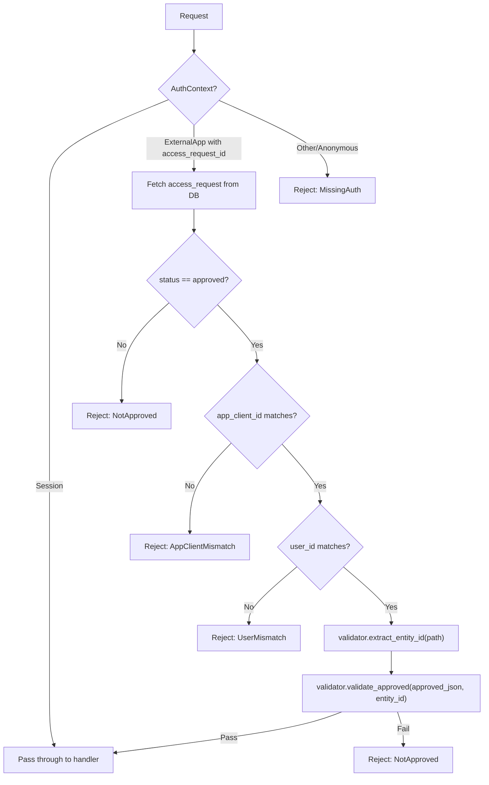
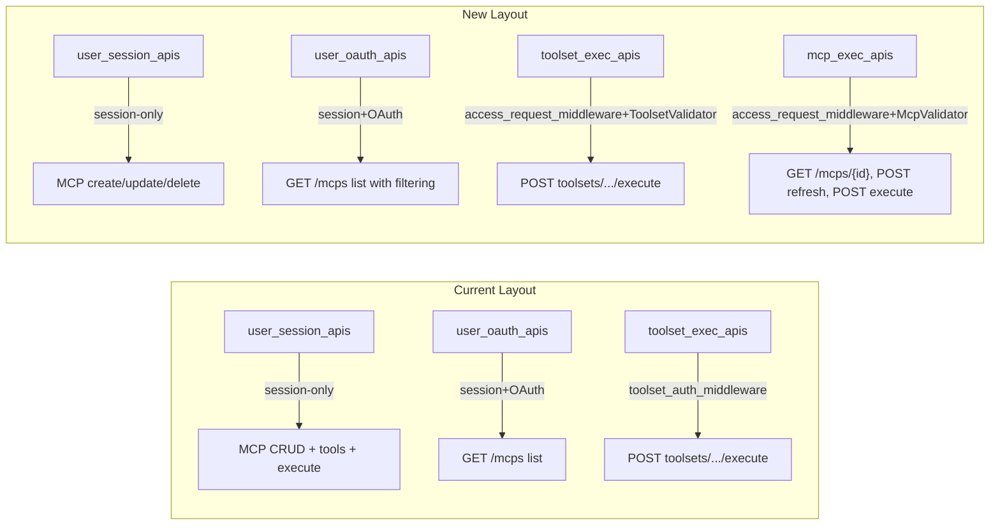

# Generic Access Request Auth Middleware for MCPs

## Context

Currently, `toolset_auth_middleware` in [crates/auth_middleware/src/toolset_auth_middleware.rs](crates/auth_middleware/src/toolset_auth_middleware.rs) handles both access-request validation AND domain-specific checks (type enabled, instance configured) for toolset execution. MCP routes are session-only with no OAuth support.

The goal is to:

1. Refactor to a generic, trait-based access_request_auth_middleware that handles ONLY access-request validation
2. Move domain-specific checks to route handlers
3. Extend the access request system to support MCP servers (requested by URL)
4. Enable OAuth access to MCP routes via the new middleware

## Key Design Decisions

- **Approved JSON structure** evolves from `{"toolset_types": [...]}` to:

```json
{
  "toolset_types": [
    {"toolset_type": "builtin-exa-search", "status": "approved", "instance_id": "uuid"}
  ],
  "mcp_servers": [
    {
      "url": "https://mcp.deepwiki.com/mcp",
      "status": "approved",
      "instances": [{"id": "uuid", "status": "approved"}]
    }
  ]
}
```

- **Requested JSON** extends to: `{"toolset_types": [...], "mcp_servers": [{"url": "https://..."}]}`
- **Middleware scope**: Only access-request checks (OAuth flow). Session users pass through. Domain validation moves to handlers.
- **Trait-based design**: `AccessRequestValidator` trait with methods for entity ID extraction and approved-list validation
- **Backward compat**: Missing `mcp_servers` key treated as empty array (no migration needed)
- **Remove** `GET /mcps/{id}/tools` endpoint (tools already included in `GET /mcps` and `GET /mcps/{id}` responses via `tools_cache`/`tools_filter` fields)

## Architecture

### Middleware Flow (OAuth only - Session passes through)




### Route Composition Changes




---

## Phase 1: Domain Types (`objs` crate)

**File**: [crates/objs/src/access_request.rs](crates/objs/src/access_request.rs)

Add MCP-related access request types alongside existing `ToolsetTypeRequest` and `ToolsetApproval`:

```rust
// Request types (what the external app asks for)
pub struct McpServerRequest {
  pub url: String,
}

// Approval types (what the resource owner grants)
pub struct McpServerApproval {
  pub url: String,
  pub status: String, // "approved" | "denied"
  pub instances: Option<Vec<McpInstanceApproval>>,
}

pub struct McpInstanceApproval {
  pub id: String,
  pub status: String, // "approved" | "denied"
}
```

---

## Phase 2: Middleware Refactoring (`auth_middleware` crate)

**Rename**: `toolset_auth_middleware.rs` -> `access_request_auth_middleware.rs`

### 2a. Define `AccessRequestValidator` trait

```rust
pub trait AccessRequestValidator: Send + Sync + 'static {
  fn extract_entity_id(&self, path: &str) -> Result<String, ApiError>;
  fn validate_approved(&self, approved_json: &Option<String>, entity_id: &str) -> Result<(), ApiError>;
}
```

### 2b. Generic middleware function

```rust
pub async fn access_request_auth_middleware(
  validator: Arc<dyn AccessRequestValidator>,
  State(state): State<Arc<dyn RouterState>>,
  req: Request<Body>,
  next: Next,
) -> Result<Response, ApiError>
```

- Session flow: pass through (no access_request checks)
- OAuth flow: common validation (status, app_client_id, user_id) then `validator.validate_approved()`

### 2c. Implement `ToolsetAccessRequestValidator`

Extracts toolset UUID from path, validates against `toolset_types` in approved JSON. Domain checks (type_enabled, has_api_key) removed from middleware.

### 2d. Implement `McpAccessRequestValidator`

Extracts MCP instance UUID from path, validates against `mcp_servers[].instances[].id` in approved JSON.

### 2e. Rename error type

`ToolsetAuthError` -> `AccessRequestAuthError` with generic variants (remove toolset-specific ones like `ToolsetNotApproved`, `ToolsetNotFound`). Keep generic: `MissingAuth`, `AccessRequestNotFound`, `AccessRequestNotApproved`, `AppClientMismatch`, `UserMismatch`, `EntityNotApproved`, `InvalidApprovedJson`.

### 2f. Update tests

Migrate existing tests to use the new trait-based approach. Keep parametric test structure.

---

## Phase 3: Access Request Service Updates (`services` crate)

**File**: `crates/services/src/access_request_service/service.rs`

### 3a. Update `create_draft`

Serialize `mcp_servers` alongside `toolset_types` into the `requested` JSON. Validate each requested MCP server URL exists in `mcp_servers` table and is enabled.

### 3b. Update `approve_request`

Accept `McpServerApproval` list alongside `ToolsetApproval` list. Serialize both into `approved` JSON. Validate each approved MCP instance belongs to the user and its server URL matches the requested URL.

---

## Phase 4: Route Updates (`routes_app` crate)

### 4a. Access Request DTOs

**File**: [crates/routes_app/src/routes_apps/types.rs](crates/routes_app/src/routes_apps/types.rs)

Update `RequestedResources` and `ApprovedResources`:

```rust
pub struct RequestedResources {
  #[serde(default)]
  pub toolset_types: Vec<ToolsetTypeRequest>,
  #[serde(default)]
  pub mcp_servers: Vec<McpServerRequest>,
}

pub struct ApprovedResources {
  #[serde(default)]
  pub toolset_types: Vec<ToolsetApproval>,
  #[serde(default)]
  pub mcp_servers: Vec<McpServerApproval>,
}
```

### 4b. Access request handlers

- **create_access_request_handler**: Accept `mcp_servers` in request body
- **get_access_request_review_handler**: Return user's MCP instances matching requested URLs
- **approve_access_request_handler**: Validate MCP instance approvals (instance exists, user owns it, server URL matches, instance enabled)

### 4c. Toolset handler migration

**File**: [crates/routes_app/src/routes_toolsets/](crates/routes_app/src/routes_toolsets/)

Move domain checks from middleware to `execute_toolset_handler`:

- `tool_service.is_type_enabled(&toolset.toolset_type)`
- `toolset.enabled` and `toolset.has_api_key` checks

### 4d. MCP route restructuring

**File**: [crates/routes_app/src/routes.rs](crates/routes_app/src/routes.rs)

Split MCP routes:

- **user_session_apis** (session-only): `POST /mcps` (create), `PUT /mcps/{id}` (update), `DELETE /mcps/{id}` (delete)
- **user_oauth_apis** (session+OAuth): `GET /mcps` (list, with handler-level filtering by approved instance IDs)
- **mcp_exec_apis** (new, session+OAuth+middleware): `GET /mcps/{id}`, `POST /mcps/{id}/tools/refresh`, `POST /mcps/{id}/tools/{tool_name}/execute`

The `mcp_exec_apis` router applies `access_request_auth_middleware` with `McpAccessRequestValidator`.

### 4e. Remove `GET /mcps/{id}/tools` endpoint

Tools are already returned in `GET /mcps` and `GET /mcps/{id}` responses via `tools_cache` and `tools_filter` fields in `McpResponse`.

### 4f. Update `GET /mcps` handler for OAuth filtering

When `AuthContext::ExternalApp`, extract approved instance IDs from the access request's `approved` JSON and filter the list to only those instances.

---

## Phase 5: Frontend Updates (`crates/bodhi/src`)

### 5a. Access request review page

Update the review/approve UI to display MCP servers (by URL) alongside toolset types. Show the user's MCP instances connected to each requested URL. Allow instance-level approval/denial.

### 5b. MCP pages OAuth compatibility

Ensure MCP list and detail pages work correctly when accessed via OAuth-filtered responses.

---

## Phase 6: E2E Tests

### 6a. OAuth MCP access flow

Test the full flow:

1. External app creates access request with `mcp_servers` URL
2. Resource owner reviews and sees their MCP instances for the URL
3. Resource owner approves specific instances
4. External app uses OAuth token to list MCPs (filtered), get MCP details, refresh tools, and execute a tool
5. Verify unauthorized instance access is denied

---

## Key Files to Modify


| Crate             | File                                    | Change                                  |
| ----------------- | --------------------------------------- | --------------------------------------- |
| `objs`            | `src/access_request.rs`                 | Add MCP request/approval types          |
| `auth_middleware` | `src/toolset_auth_middleware.rs`        | Rename, refactor to trait-based generic |
| `auth_middleware` | `src/lib.rs`                            | Update exports                          |
| `services`        | `src/access_request_service/service.rs` | Handle MCP in create/approve            |
| `routes_app`      | `src/routes_apps/types.rs`              | Extend DTOs                             |
| `routes_app`      | `src/routes_apps/handlers.rs`           | Update review/approve handlers          |
| `routes_app`      | `src/routes.rs`                         | Add mcp_exec_apis group                 |
| `routes_app`      | `src/routes_mcps/mcps.rs`               | Update handlers, remove tools endpoint  |
| `routes_app`      | `src/routes_toolsets/`                  | Move domain checks to handler           |
| `bodhi/src`       | Access request review page              | MCP approval UI                         |


