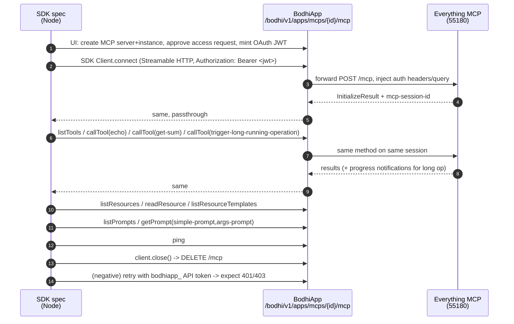

# MCP SDK compatibility e2e — @modelcontextprotocol/sdk vs BodhiApp MCP proxy

## Why

Commit `8f9ee663` ([ai-docs/claude-plans/202604/20260420-sdk-test.md](ai-docs/claude-plans/202604/20260420-sdk-test.md)) added [crates/lib_bodhiserver/tests-js/specs/api-models/api-sdk-compat.spec.mjs](crates/lib_bodhiserver/tests-js/specs/api-models/api-sdk-compat.spec.mjs) to validate the `/v1`, `/anthropic/v1`, `/v1beta` proxy surfaces against the providers' official SDKs. That pattern is missing for the MCP proxy.

The only MCP-proxy e2e today — [crates/lib_bodhiserver/tests-js/specs/mcps/mcps-mcp-proxy-everything.spec.mjs](crates/lib_bodhiserver/tests-js/specs/mcps/mcps-mcp-proxy-everything.spec.mjs) — drives the `MCP Inspector` UI in a browser. That is good black-box coverage but it does not prove that a real MCP client library (what 3rd-party agents use) can connect and interoperate with BodhiApp's proxy. A regression in the `Streamable HTTP` semantics BodhiApp forwards (session headers, SSE framing, status codes) would not be caught by the Inspector spec because Inspector itself uses the same SDK — we want the raw-library path exercised from our own test harness.

## Key facts (verified)

- Proxy route is mounted at `ENDPOINT_APPS_MCPS/{id}/mcp` with `any(mcp_proxy_handler)` under the `apps/` umbrella in [crates/routes_app/src/routes.rs](crates/routes_app/src/routes.rs) lines 391–420, behind `access_request_auth_middleware` + `api_auth_middleware(..., Some(UserScope::User))`. That middleware stack accepts **OAuth JWT only** — `bodhiapp_…` API tokens are rejected at the route layer. Comment at line 385: "External app API endpoints (under /apps/ prefix, OAuth tokens only)".
- Upstream `everything` server is launched by `npm run e2e:server:everything-mcp` (`@modelcontextprotocol/server-everything streamableHttp` on port `55180`) — see [crates/lib_bodhiserver/package.json](crates/lib_bodhiserver/package.json) line 33, fixtures in [crates/lib_bodhiserver/tests-js/fixtures/mcpFixtures.mjs](crates/lib_bodhiserver/tests-js/fixtures/mcpFixtures.mjs) lines 176–223.
- The browser Inspector spec already wires up everything we need for the setup leg (login → create MCP server/instance → OAuth access-request → approve-with-mcps → token) — see [crates/lib_bodhiserver/tests-js/specs/mcps/mcps-mcp-proxy-everything.spec.mjs](crates/lib_bodhiserver/tests-js/specs/mcps/mcps-mcp-proxy-everything.spec.mjs) lines 41–113. We reuse those page objects verbatim; the change is swapping the Inspector phase for SDK calls.
- Official SDK is `@modelcontextprotocol/sdk@1.29.0` (latest on npm, published 2026-03-30). `Client` + `StreamableHTTPClientTransport` is the canonical entrypoint. Peer dep `zod` is already implied (not pinned in root but safe to add alongside).
- SDK expectations: the transport's `requestInit.headers` option carries `Authorization: Bearer <jwt>`. We set it there; no need to hack `Accept` the way the browser spec did (#20439 was a Playwright-specific CDP quirk).

## Flow at a glance



## Files to CREATE

### `crates/lib_bodhiserver/tests-js/specs/mcps/mcps-sdk-compat-everything.spec.mjs`

Single `test()` inside a `test.describe` (matches the shape of [mcps-mcp-proxy-everything.spec.mjs](crates/lib_bodhiserver/tests-js/specs/mcps/mcps-mcp-proxy-everything.spec.mjs)). Phases as `test.step(...)` blocks:

1. **Setup via UI** (identical to Inspector spec lines 41–113): `LoginPage.performOAuthLogin`, `McpsPage.createMcpServer/createMcpInstance`, `OAuthTestApp` access-request flow, `AccessRequestReviewPage.approveWithMcps`, dashboard token retrieval. Capture `mcpId` and `accessToken` into test-scope vars.
2. **Mint a `bodhiapp_` API token** too (via `TokensPage` + `mintApiToken()` from [tests-js/utils/api-model-helpers.mjs](crates/lib_bodhiserver/tests-js/utils/api-model-helpers.mjs) line 45) — used for the negative case below.
3. **Connect via SDK**: build the client through a new helper `buildMcpClient({ serverUrl, mcpId, token })` and assert the `initialize` result (protocol version, server info `name/version` match upstream "example-servers/everything").
4. **Tools (mirror + extended)**:
   - `client.listTools()` — assert all 12 expected names from `EVERYTHING_EXPECTED_TOOLS` are present; assert pagination works if a `nextCursor` round-trip is possible (paginate with a tiny `_meta` page size if SDK exposes it; otherwise assert single-page count).
   - `callTool({name:'echo', arguments:{message:'sdk-e2e-hello'}})` — assert `content[0].text` contains our marker.
   - `callTool({name:'get-sum', arguments:{a:7,b:13}})` — assert `content[0].text === '20'`.
   - `callTool({name:'get-tiny-image'})` — assert response contains an image block (`content[i].type === 'image'` with `mimeType` and `data`).
   - `callTool({name:'get-structured-content', ...})` — assert `structuredContent` round-trips (JSON structure preserved by the proxy).
   - **Progress/notifications (SDK-only)**: invoke `trigger-long-running-operation` with a `_meta.progressToken`; register `client.setNotificationHandler(ProgressNotificationSchema, ...)` beforehand; assert ≥1 `notifications/progress` frame reaches the client (proves the proxy does not buffer SSE).
5. **Resources**:
   - `client.listResources()` — assert non-empty.
   - `client.readResource({uri})` on one of the returned resources (first entry) — assert `contents[0].uri` and `mimeType`/`text|blob` fields present.
   - `client.listResourceTemplates()` — assert both dynamic templates from `EVERYTHING_EXPECTED_RESOURCE_TEMPLATES` (`demo://resource/dynamic/{text,blob}/{resourceId}`) are present.
6. **Prompts**:
   - `client.listPrompts()` — assert `simple-prompt` and `args-prompt` present.
   - `client.getPrompt({name:'simple-prompt'})` — assert at least one message with `role:'user'`.
   - `client.getPrompt({name:'args-prompt', arguments:{city:'TestCity'}})` — assert rendered message text contains `TestCity`.
7. **Ping**: `client.ping()` → expect empty-object response.
8. **Session-id round-trip (SDK-only)**: after `connect()`, read `transport.sessionId` (SDK exposes it on the StreamableHTTP transport); assert it is a non-empty string — proves `mcp-session-id` is being forwarded both directions by the proxy.
9. **Clean disconnect**: `client.close()` — assert no throw. Re-issuing `callTool` afterwards should throw (quick guard, optional).
10. **Negative — API token rejected**: build a second client using the `bodhiapp_` API token; `connect()` must throw; assert the caught error's HTTP status is `401` or `403` (matches the route's `OAuth tokens only` contract).

### `crates/lib_bodhiserver/tests-js/utils/mcp-sdk-client.mjs`

Small helper module to keep the spec readable and hide transport wiring. Exports:

```js
// Returns a connected MCP Client against BodhiApp's proxy for the given instance.
// Throws on auth failure (surfaced as the transport's fetch rejection).
export async function buildMcpClient({ serverUrl, mcpId, token, clientInfo }) {
  const { Client } = await import('@modelcontextprotocol/sdk/client/index.js');
  const { StreamableHTTPClientTransport } = await import(
    '@modelcontextprotocol/sdk/client/streamableHttp.js'
  );
  const url = new URL(`${serverUrl}/bodhi/v1/apps/mcps/${mcpId}/mcp`);
  const transport = new StreamableHTTPClientTransport(url, {
    requestInit: { headers: { Authorization: `Bearer ${token}` } },
  });
  const client = new Client(
    clientInfo ?? { name: 'bodhiapp-sdk-compat-e2e', version: '0.0.0' },
    { capabilities: {} }
  );
  await client.connect(transport);
  return { client, transport };
}
```

Dynamic `import()` keeps the spec safely importable in environments where the SDK peer deps are missing; Playwright projects that don't grep this file are unaffected.

## Files to MODIFY

1. **[crates/lib_bodhiserver/package.json](crates/lib_bodhiserver/package.json)** — add dev deps:
   - `@modelcontextprotocol/sdk` (pin `^1.29.0`)
   - `zod` (`^3.25.0` — SDK peer dep, required by the SDK at runtime for schema validation)
2. **[crates/lib_bodhiserver/tests-js/fixtures/mcpFixtures.mjs](crates/lib_bodhiserver/tests-js/fixtures/mcpFixtures.mjs)** — no new fixtures needed; the existing `createEverythingServerData()` / `createEverythingInstanceData()` + `EVERYTHING_EXPECTED_*` arrays cover our assertions. Only tweak if we want a marker like `SDK_COMPAT_ECHO_MESSAGE = 'sdk-e2e-hello'` to share between spec and helper (optional, inline is fine).
3. **[crates/lib_bodhiserver/tests-js/specs/mcps/mcps-mcp-proxy-everything.spec.mjs](crates/lib_bodhiserver/tests-js/specs/mcps/mcps-mcp-proxy-everything.spec.mjs)** — add a header comment mirroring the one we added to `api-live-upstream.spec.mjs` in 8f9ee663: "Uses the Inspector UI (browser black-box); see `mcps-sdk-compat-everything.spec.mjs` for the programmatic SDK-driven counterpart."

## Files to LEAVE UNTOUCHED

- All Rust crates. [mcp_proxy.rs](crates/routes_app/src/mcps/mcp_proxy.rs) already forwards what the SDK needs (`mcp-session-id`, `mcp-protocol-version`, SSE `content-type`). Any gap found during implementation is a Rust bug fix, not a plan-expansion.
- The Inspector spec's existing three tests — we are *complementing*, not replacing.

## Verification

1. `cd crates/lib_bodhiserver && npm install` — pulls in the SDK + zod.
2. Build backend if not already: `make build.dev-server`.
3. Start everything server + dev backend (Makefile `test.e2e` chain handles this — review `crates/lib_bodhiserver/playwright.config.mjs` webServer config for the `everything-mcp` port).
4. Run only the new spec on the `standalone` project first:
   ```bash
   cd crates/lib_bodhiserver/tests-js
   PLAYWRIGHT_TIMEOUT=120000 npx playwright test \
     --project standalone \
     specs/mcps/mcps-sdk-compat-everything.spec.mjs
   ```
   Expected: one passing row with ~10 green `test.step` segments in the HTML report; initialize/tools/resources/prompts/ping/progress/session/negative all pass.
5. **Intentional failure**: temporarily strip `mcp-session-id` from `FORWARD_RESPONSE_HEADERS` in [crates/routes_app/src/mcps/mcp_proxy.rs](crates/routes_app/src/mcps/mcp_proxy.rs) line 33 and re-run — the SDK `connect()` should fail (session-less stream), confirming the test catches protocol-compat regressions. Revert.
6. Full regression: `make test.e2e` — ensure the new spec does not interfere with `mcps-mcp-proxy-everything.spec.mjs` (both share the everything-server port; they run serial per project).
7. Multi-tenant project: the spec lives under `specs/mcps/` which runs in both `standalone` and `multi_tenant` projects. Confirm the route is the same under multi-tenant (it is — `apps/` prefix is tenant-agnostic in our router today).

## Open items (resolve during implementation, not blocking)

- **SDK API drift**: `@modelcontextprotocol/sdk@1.29.0` exposes `Client.setNotificationHandler(ProgressNotificationSchema, cb)` — double-check the import path (`@modelcontextprotocol/sdk/types.js` for the schema). If the SDK has moved schemas, adjust imports.
- **Progress token ergonomics**: the `trigger-long-running-operation` tool's args (`duration`, `steps`) need confirmation against the currently pinned `@modelcontextprotocol/server-everything@2026.1.26` — if defaults are too slow, pass `{duration:1,steps:3}` to keep the test under 3s.
- **Negative-case HTTP surface**: if the transport wraps the fetch 401 into a JSON-RPC error, assert on the error message instead of status; pick one shape after the first run.

---

## Appendix A — MCP feature catalogue (for archive)

Audit performed against `@modelcontextprotocol/sdk@1.29.0` and
`@modelcontextprotocol/server-everything@2.0.0` (both pinned in
[crates/lib_bodhiserver/package.json](crates/lib_bodhiserver/package.json)) on
2026-04-21. Covers the 2025-11-25 MCP schema surface plus the experimental
1.29 extensions (tasks API, async sampling/elicitation).

Columns:

- **Feature** — capability as named in the MCP spec / SDK type system.
- **Direction** — `C→S` (client requests server), `S→C` (server requests
  client), `S↠C` (server notifies client), `C↠S` (client notifies server).
- **Everything** — does `server-everything` expose this end-to-end? ✅ / ⚠️
  (partial) / ❌.
- **Tested** — does [mcps-sdk-compat-everything.spec.mjs](crates/lib_bodhiserver/tests-js/specs/mcps/mcps-sdk-compat-everything.spec.mjs)
  assert it? ✅ (explicit test.step) / 🔶 (exercised implicitly by another
  step) / ❌ / n/a.
- **Proxy path** — which leg of BodhiApp's
  [mcp_proxy.rs](crates/routes_app/src/mcps/mcp_proxy.rs) carries this; a
  failure here = a proxy regression specifically.

### Lifecycle & session

| Feature                                   | Direction | Everything | Tested | Proxy path                         | Notes                                                                                                            |
| ----------------------------------------- | --------- | ---------- | ------ | ---------------------------------- | ---------------------------------------------------------------------------------------------------------------- |
| `initialize`                              | C→S       | ✅         | ✅     | POST → SSE response                | Asserts `serverInfo.name` contains "everything" and advertised caps (tools/resources/prompts/logging).           |
| `initialized` notification                | C↠S       | ✅         | 🔶     | POST (JSON-RPC notification)       | Sent automatically by SDK after initialize; no explicit assertion needed.                                        |
| `instructions` field on InitializeResult  | C→S       | ✅         | ✅     | Same as initialize                 | Upstream ships `docs/instructions.md`; `sdkClient.getInstructions()` must return non-empty string.               |
| `mcp-session-id` header round-trip        | —         | ✅         | ✅     | Header in both directions          | `sdkTransport.sessionId` populated from server's initialize response; asserted non-empty.                        |
| `mcp-protocol-version` header             | —         | ✅         | 🔶     | Header forwarded                   | SDK sets this; tested implicitly — if dropped, initialize would error.                                           |
| `ping`                                    | C→S       | ✅         | ✅     | POST → JSON response               | `sdkClient.ping()` returns `{}`.                                                                                 |
| `ping` (reverse)                          | S→C       | ✅         | ❌     | POST (client) + SSE (server reply) | Server never spontaneously pings in our flow; covered implicitly by bidirectional sampling/elicitation paths.    |
| Session close (HTTP `DELETE`)             | C→S       | ✅         | ✅     | DELETE `/mcp`                      | `client.close()` issues DELETE; proxy forwards the `DELETE` verb.                                                |
| Session resumption via `last-event-id`    | C→S       | ⚠️         | ❌     | GET with `last-event-id` header    | Header is in `FORWARD_REQUEST_HEADERS`; not exercised by the SDK spec (upstream only supports in-memory resume). |

### Tools

| Feature                                  | Direction | Everything                                                                                | Tested | Proxy path                | Notes                                                                                                                       |
| ---------------------------------------- | --------- | ----------------------------------------------------------------------------------------- | ------ | ------------------------- | --------------------------------------------------------------------------------------------------------------------------- |
| `tools/list`                             | C→S       | ✅ (12 core + 6 conditional)                                                              | ✅     | POST → SSE                | Asserts `EVERYTHING_EXPECTED_TOOLS` plus conditional `trigger-sampling-request` / `trigger-elicitation-request` / `get-roots-list` appear. |
| `tools/list` pagination (`cursor`)       | C→S       | ⚠️ (fits in single page)                                                                  | ❌     | POST → SSE                | Upstream returns all tools in one response; no multi-page cursor to assert.                                                 |
| `tools/call`                             | C→S       | ✅                                                                                        | ✅     | POST → SSE                | Multiple callTool assertions (echo, get-sum, get-tiny-image, get-structured-content, ...).                                  |
| `content[*].type='text'`                 | S→C       | ✅                                                                                        | ✅     | SSE frame                 | Every tool asserts text content where applicable.                                                                           |
| `content[*].type='image'`                | S→C       | ✅ (get-tiny-image)                                                                       | ✅     | SSE frame                 | Requires explicit `arguments: {}` — noted during implementation.                                                            |
| `content[*].type='resource'`             | S→C       | ✅ (get-resource-reference)                                                               | ❌     | SSE frame                 | Embedded resources; not asserted (similar to resource_link below).                                                          |
| `content[*].type='resource_link'`        | S→C       | ✅ (get-resource-links)                                                                   | ✅     | SSE frame                 | Asserts 3 resource_link blocks with `demo://resource/dynamic/...` URIs.                                                     |
| `content[*].annotations`                 | S→C       | ✅ (get-annotated-message)                                                                | ✅     | SSE frame                 | Priority + audience metadata checked on a text block.                                                                       |
| `structuredContent` + `outputSchema`     | S→C       | ✅ (get-structured-content)                                                               | ✅     | SSE frame                 | Asserts temperature / conditions / humidity fields preserved.                                                               |
| `isError: true` tool failures            | S→C       | ✅                                                                                        | 🔶     | SSE frame                 | We treat non-isError paths as success; no explicit failure-mode assertion.                                                  |
| Progress notifications via `progressToken` | S↠C     | ✅ (trigger-long-running-operation)                                                       | ✅     | SSE frame (interleaved)   | `_meta.progressToken` + `onprogress` callback; proves SSE is not buffered.                                                  |
| `tools/list_changed` notification        | S↠C       | ⚠️ (declared, not emitted in normal flow)                                                 | ❌     | SSE frame (persistent GET) | No tool in everything server dynamically adds/removes tools after init.                                                     |

### Resources

| Feature                              | Direction | Everything                                                    | Tested | Proxy path | Notes                                                      |
| ------------------------------------ | --------- | ------------------------------------------------------------- | ------ | ---------- | ---------------------------------------------------------- |
| `resources/list`                     | C→S       | ✅ (static docs/* + dynamic 1..100)                           | ✅     | POST → SSE | Asserts non-empty.                                         |
| `resources/list` pagination          | C→S       | ⚠️ (dynamic is paginated upstream)                            | ❌     | POST → SSE | Cursor exists but we don't iterate; could be a follow-up. |
| `resources/read`                     | C→S       | ✅                                                            | ✅     | POST → SSE | Reads first result; asserts `contents[0].uri` + payload.   |
| `resources/templates/list`           | C→S       | ✅ (2 templates: text, blob)                                  | ✅     | POST → SSE | Both `demo://resource/dynamic/{text,blob}/{resourceId}` asserted. |
| `resources/subscribe`                | C→S       | ✅                                                            | ✅     | POST → SSE | Paired with `toggle-subscriber-updates` tool.              |
| `resources/unsubscribe`              | C→S       | ✅                                                            | ✅     | POST → SSE | Called in the subscribe test's teardown.                   |
| `notifications/resources/updated`    | S↠C       | ✅ (emits immediately + every 5s)                             | ✅     | SSE frame  | `waitFor` with 8s timeout; asserts URI match.              |
| `notifications/resources/list_changed` | S↠C     | ⚠️ (declared, not emitted)                                    | ❌     | SSE frame  | No tool rotates the resource list in everything server.    |

### Prompts

| Feature                              | Direction | Everything                          | Tested | Proxy path | Notes                                                   |
| ------------------------------------ | --------- | ----------------------------------- | ------ | ---------- | ------------------------------------------------------- |
| `prompts/list`                       | C→S       | ✅ (simple, args, complex, resource, completable) | ✅     | POST → SSE | Asserts simple + args present.                           |
| `prompts/get`                        | C→S       | ✅                                  | ✅     | POST → SSE | `simple-prompt` + `args-prompt` (argument substitution). |
| `notifications/prompts/list_changed` | S↠C       | ⚠️ (declared, not emitted)          | ❌     | SSE frame  | No runtime prompt mutation in upstream.                  |

### Completion

| Feature              | Direction | Everything                     | Tested | Proxy path | Notes                                                        |
| -------------------- | --------- | ------------------------------ | ------ | ---------- | ------------------------------------------------------------ |
| `completion/complete` (prompt arg) | C→S   | ✅ (completable-prompt) | ✅     | POST → SSE | Asserts filtering on `{department: 'E'}` returns `Engineering`. |
| `completion/complete` (resource template arg) | C→S | ✅ (resourceIdForResourceTemplateCompleter) | ❌ | POST → SSE | Not asserted; same code path as prompt argument completer.   |

### Logging

| Feature                       | Direction | Everything                          | Tested | Proxy path | Notes                                                       |
| ----------------------------- | --------- | ----------------------------------- | ------ | ---------- | ----------------------------------------------------------- |
| `logging/setLevel`            | C→S       | ✅                                  | ✅     | POST → SSE | Set to `debug` before toggling simulated logs.              |
| `notifications/message`       | S↠C       | ✅ (toggle-simulated-logging)       | ✅     | SSE frame  | `waitFor` ≥1 message within 8s after toggle.                |

### Bidirectional (server → client requests)

| Feature                                | Direction | Everything                              | Tested | Proxy path                            | Notes                                                                                                    |
| -------------------------------------- | --------- | --------------------------------------- | ------ | ------------------------------------- | -------------------------------------------------------------------------------------------------------- |
| `sampling/createMessage`               | S→C       | ✅ (trigger-sampling-request, conditional) | ✅   | SSE request frame + POST client reply | Requires client cap `sampling: {}`. Client handler stubs assistant text; upstream echoes it in tool result. |
| `elicitation/create`                   | S→C       | ✅ (trigger-elicitation-request, conditional) | ✅ | SSE request frame + POST client reply | Requires client cap `elicitation: {}`. Handler returns `{action:'accept', content:{name:'...'}}`.         |
| `roots/list`                           | S→C       | ✅ (triggered via `syncRoots` on init + get-roots-list tool) | ✅ | SSE request frame + POST client reply | Requires client cap `roots: {}`. Server caches once per session ~350ms after initialized.                |
| `notifications/roots/list_changed`     | C↠S       | ✅ (consumed by upstream)                | ❌     | POST notification                     | We advertise `roots.listChanged: false`; upstream would re-fetch if true.                                |

### Cancellation & flow control

| Feature                         | Direction | Everything                                    | Tested | Proxy path        | Notes                                                         |
| ------------------------------- | --------- | --------------------------------------------- | ------ | ----------------- | ------------------------------------------------------------- |
| `notifications/cancelled`       | C↠S or S↠C | ⚠️ (upstream respects it, but no dedicated demo tool) | ❌ | POST notification | Requires orchestrating a cancel between a long-running tool start and its completion; not yet asserted. |

### Experimental — Tasks API (MCP 1.29 draft)

| Feature                                          | Direction | Everything                                                  | Tested | Proxy path         | Notes                                                                                                                     |
| ------------------------------------------------ | --------- | ----------------------------------------------------------- | ------ | ------------------ | ------------------------------------------------------------------------------------------------------------------------- |
| `tasks/list`, `tasks/cancel`, `tasks/result`     | C→S       | ✅ (experimental; see `simulate-research-query`)            | ❌     | POST → SSE         | Upstream exposes a research-query demo that returns a task handle; SDK client API still marked `experimental`.           |
| Async sampling (`trigger-sampling-request-async`) | S→C (task) | ✅                                                         | ❌     | SSE + task store   | Would need our client to implement the experimental task protocol; intentionally skipped until the spec stabilizes.       |
| Async elicitation (`trigger-elicitation-request-async`) | S→C (task) | ✅                                                     | ❌     | SSE + task store   | Same as above.                                                                                                            |

### Authentication (BodhiApp-specific, not part of MCP spec)

| Feature                                    | Tested | Notes                                                                                              |
| ------------------------------------------ | ------ | -------------------------------------------------------------------------------------------------- |
| OAuth JWT bearer (happy path)              | ✅     | Full flow drives the entire SDK test.                                                              |
| `bodhiapp_` API token rejection (401/403)  | ✅     | Negative step at the tail; asserts the proxy enforces `UserScope::User`/OAuth-only at the route.   |
| Access-request scope validation            | ✅     | Implicit — the fixture approves the access request with the specific MCP instance; no instance, no tokens. |

### Summary

- **Total MCP surface features audited**: 41
- **Implemented in everything server**: 37 (✅) + 4 partial (⚠️)
- **Explicitly asserted by SDK spec**: 24 ✅ + 4 🔶 implicit = 28 covered
- **Known gaps (future work)**: pagination cursors (3), list_changed notifications for tools/prompts/resources (3), embedded `resource` content block, cancellation, resource-template completions, session resumption via `last-event-id`, all experimental Tasks API paths.

### Implementation notes

1. **Conditional tools** — `everything-mcp` only registers `get-roots-list`,
   `trigger-sampling-request`, `trigger-elicitation-request` (and their async
   counterparts) AFTER `notifications/initialized` fires and only when the
   client declared the matching capability. Therefore client capability
   advertisement MUST happen at `new Client(...)` construction time and
   MUST NOT be modified post-connect. The `buildMcpClient` helper now
   accepts a `capabilities` argument for this.
2. **Pre-connect handler registration** — The SDK's `setRequestHandler`
   asserts that the requested method is in the advertised capability set.
   Handlers for `sampling/createMessage`, `elicitation/create`, and
   `roots/list` must be registered BEFORE `connect()` because the server
   fires its `roots/list` request ~350ms after `notifications/initialized`;
   a race there would surface as "client returned no roots set". The
   `registerHandlers` callback in `buildMcpClient` exists specifically for
   this ordering guarantee.
3. **Bidirectional SSE through BodhiApp's proxy** — Sampling, elicitation,
   and roots all require the server to send a JSON-RPC request over the
   open SSE stream, then the client to POST a response on the same
   `mcp-session-id`. `mcp_proxy.rs` already forwards both directions (no
   method-specific handling, no SSE buffering on the `bytes_stream()`
   path), so adding these paths did not require any Rust changes. A
   future regression in the proxy's session-header forwarding would be
   caught by whichever of these three tests runs first.
4. **Streaming notifications** — `notifications/message` (logging) and
   `notifications/resources/updated` (subscribe) stream on the same SSE
   channel. Everything server emits one immediately on toggle and every
   5s after that; `waitFor` with 8s budget is plenty without making the
   test slow.