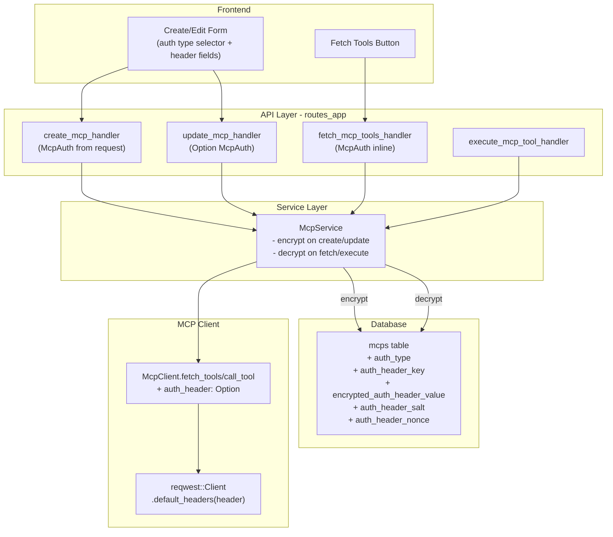
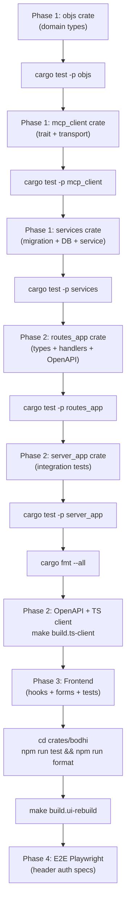

# MCP Header Auth Support

## Design Decisions Summary

Based on analysis of the reference implementation (rmcp-app) and user requirements:

- **Auth scope**: Per Mcp instance (user-owned), not McpServer (admin-managed)
- **Cardinality**: Single header key/value per Mcp instance
- **Encryption**: AES-256-GCM via existing `encrypt_api_key`/`decrypt_api_key` infrastructure (same as toolset API keys)
- **Response masking**: Never return header values; expose `auth_type`, `auth_header_key`, and `has_auth_header_value: bool` (mirrors toolset `has_api_key` pattern)
- **Update semantics**: `Option<McpAuth>` where `None` = keep existing, `Some(Public)` = clear auth, `Some(Header{...})` = set new
- **McpAuth enum**: `#[serde(tag = "auth")]` with variants `public` and `header` (with `auth_header_key`, `auth_header_value` fields), flattened into request DTOs
- **No backwards compatibility concerns** -- feature is in development, columns/fields can be added freely

## Data Flow




---

## Phase 1: Backend Foundation

### 1.1 Database Migration

Create `crates/services/migrations/0011_mcp_auth_headers.up.sql`:

```sql
ALTER TABLE mcps ADD COLUMN auth_type TEXT NOT NULL DEFAULT 'public';
ALTER TABLE mcps ADD COLUMN auth_header_key TEXT;
ALTER TABLE mcps ADD COLUMN encrypted_auth_header_value TEXT;
ALTER TABLE mcps ADD COLUMN auth_header_salt TEXT;
ALTER TABLE mcps ADD COLUMN auth_header_nonce TEXT;
```

Down migration clears columns (or drops and recreates table since no backward compat needed).

### 1.2 McpRow DB Object

Update `McpRow` in [crates/services/src/db/objs.rs](crates/services/src/db/objs.rs) to add:

```rust
pub auth_type: String,                          // "public" or "header"
pub auth_header_key: Option<String>,             // plain text header name
pub encrypted_auth_header_value: Option<String>, // AES-256-GCM encrypted
pub auth_header_salt: Option<String>,            // PBKDF2 salt (base64)
pub auth_header_nonce: Option<String>,           // GCM nonce (base64)
```

### 1.3 DB Repository Changes

Update all SQL queries in `crates/services/src/db/` that touch the `mcps` table:

- **INSERT** (create_mcp): include auth columns
- **UPDATE** (update_mcp): handle auth update with `ApiKeyUpdate`-style semantics (Keep vs Set vs Clear)
- **SELECT** (get_mcp, list_mcps, etc.): read auth columns
- **New method**: `get_mcp_auth_header(id) -> Result<Option<(String, String)>>` -- decrypts value using `decrypt_api_key()` from [crates/services/src/db/encryption.rs](crates/services/src/db/encryption.rs)

Follow the exact pattern from `get_toolset_api_key()` in [crates/services/src/db/service.rs](crates/services/src/db/service.rs) (line 1658).

### 1.4 Mcp Domain Object

Update `Mcp` struct in [crates/objs/src/mcp.rs](crates/objs/src/mcp.rs):

```rust
pub auth_type: String,                    // "public" or "header"
pub auth_header_key: Option<String>,      // header name (if auth_type = "header")
pub has_auth_header_value: bool,          // true if encrypted value exists
```

Mirrors the `has_api_key: bool` pattern on `Toolset`.

### 1.5 McpClient Trait

Update [crates/mcp_client/src/lib.rs](crates/mcp_client/src/lib.rs):

- Add `auth_header: Option<(String, String)>` parameter to both `fetch_tools()` and `call_tool()`
- In `DefaultMcpClient::connect()`, accept optional header and build `reqwest::Client` with `ClientBuilder::default_headers()` when present (same pattern as rmcp-app reference)
- Update `MockMcpClient` (automock will regenerate)

### 1.6 McpService Changes

Update [crates/services/src/mcp_service/service.rs](crates/services/src/mcp_service/service.rs):

- `**create()**`: Accept `auth_header_key: Option<String>, auth_header_value: Option<String>`. When both present, encrypt value using `encrypt_api_key(self.db_service.encryption_key(), &value)`.
- `**update()**`: Accept auth update enum. Keep = preserve existing, Clear = set all auth columns to NULL, Set = encrypt new value.
- `**fetch_tools()**` (for existing Mcp instance / refresh): Read stored auth via `db_service.get_mcp_auth_header(id)`, pass to `mcp_client.fetch_tools(url, auth_header)`.
- `**fetch_tools_for_server()**`: Accept inline `auth_header_key: Option<String>, auth_header_value: Option<String>` for the preview/test flow (not stored).
- `**execute()**`: Read stored auth via `db_service.get_mcp_auth_header(id)`, pass to `mcp_client.call_tool(url, tool, args, auth_header)`.

---

## Phase 2: API Layer

### 2.1 McpAuth Enum

Update in [crates/routes_app/src/routes_mcps/types.rs](crates/routes_app/src/routes_mcps/types.rs):

```rust
#[derive(Debug, Clone, Deserialize, Serialize, ToSchema)]
#[serde(tag = "auth")]
pub enum McpAuth {
  #[serde(rename = "public")]
  Public,
  #[serde(rename = "header")]
  Header {
    auth_header_key: String,
    auth_header_value: String,
  },
}
```

Default remains `Public`.

### 2.2 Request/Response DTOs

**FetchMcpToolsRequest** -- already uses `#[serde(flatten, default)]` with McpAuth. The Header variant is automatically supported.

**CreateMcpRequest** -- add `#[serde(flatten, default)] pub auth: McpAuth`:

```json
{"name": "...", "slug": "...", "mcp_server_id": "...", "auth": "header", "auth_header_key": "Api-Key", "auth_header_value": "xyz", ...}
```

**UpdateMcpRequest** -- add `#[serde(flatten)] pub auth: Option<McpAuth>` (None = keep existing):

```json
// Keep: omit auth fields
{"name": "...", "slug": "...", "enabled": true}
// Clear: {"name": "...", "auth": "public"}
// Set: {"name": "...", "auth": "header", "auth_header_key": "...", "auth_header_value": "..."}
```

NOTE: `Option<McpAuth>` with `#[serde(flatten)]` and internally tagged enum may have serde edge cases. If it doesn't work cleanly, fall back to a separate `auth` field (non-flattened) or a dedicated `McpAuthUpdate` enum.

**McpResponse** -- add auth metadata (never the value):

```rust
pub auth_type: String,
#[serde(skip_serializing_if = "Option::is_none")]
pub auth_header_key: Option<String>,
pub has_auth_header_value: bool,
```

### 2.3 Route Handlers

Update handlers in [crates/routes_app/src/routes_mcps/mcps.rs](crates/routes_app/src/routes_mcps/mcps.rs):

- `create_mcp_handler`: extract auth from CreateMcpRequest, pass to service
- `update_mcp_handler`: extract auth update, pass to service
- `fetch_mcp_tools_handler`: extract auth from FetchMcpToolsRequest, pass to service's `fetch_tools_for_server()` with inline auth
- `execute_mcp_tool_handler`: no change (service reads stored auth internally)

### 2.4 OpenAPI Registration

Update [crates/routes_app/src/shared/openapi.rs](crates/routes_app/src/shared/openapi.rs):

- McpAuth is already registered in schemas. The new Header variant will be picked up automatically via `ToSchema`.
- Verify all new/changed types are properly registered.

### 2.5 OpenAPI Spec and TypeScript Client

```bash
cargo run --package xtask openapi
make build.ts-client
```

---

## Phase 3: Frontend

### 3.1 Hooks Update

Update [crates/bodhi/src/hooks/useMcps.ts](crates/bodhi/src/hooks/useMcps.ts):

- Import regenerated types from `@bodhiapp/ts-client`
- Update `CreateMcpRequest`, `UpdateMcpRequest` types to include auth fields
- Update `FetchMcpToolsRequest` type

### 3.2 MCP Create Form

Update [crates/bodhi/src/app/ui/mcps/new/page.tsx](crates/bodhi/src/app/ui/mcps/new/page.tsx) (or equivalent create page):

- Add auth type selector: radio/select with "Public" and "Header" options
- When "Header" selected, show:
  - **Header Name** input with suggestions dropdown ("Authorization", "X-API-Key", "Api-Key")
  - **Header Value** input with `type="password"` for masking
- Include auth fields in the form schema (zod validation)
- Pass auth to FetchMcpToolsRequest when fetching tools
- Pass auth to CreateMcpRequest when creating

### 3.3 MCP Edit Form

Update edit page:

- Load current `auth_type`, `auth_header_key`, `has_auth_header_value` from response
- Display current auth type and header key (if header auth)
- Show "Has value configured" indicator when `has_auth_header_value` is true
- For updates:
  - If no auth change: omit auth fields (Keep)
  - If changing auth type or entering new value: send updated McpAuth
- Header value field placeholder: "Leave empty to keep existing" (same UX as toolset API key edit)

### 3.4 Fetch Tools Integration

When the "Fetch Tools" button is clicked on the create form:

- Read current auth type and header fields from form state
- Include in `FetchMcpToolsRequest`: `{mcp_server_id, auth: "header", auth_header_key: "...", auth_header_value: "..."}`
- Display fetched tools for selection

---

## Phase 4: Testing

### Execution Order and Gating Rule

**Critical**: After completing changes to each crate, run all tests in that crate before moving to the next:

- `cargo test -p objs` -- after domain type changes
- `cargo test -p mcp_client` -- after McpClient trait changes
- `cargo test -p services` -- after DB + service changes
- `cargo test -p routes_app` -- after route type/handler changes
- `cargo test -p server_app` -- after integration tests added
- `cd crates/bodhi && npm run test` -- after frontend changes
- `cargo fmt --all` -- after all Rust changes
- `cd crates/bodhi && npm run format` -- after all frontend changes

After all backend + UI changes are complete and passing:

```bash
make build.ts-client       # regenerate TypeScript client
make build.ui-rebuild      # rebuild embedded UI for E2E
```

Then proceed to E2E tests.

### 4.1 services Crate Tests (Real DB via TestDbService)

Use `TestDbService` (real SQLite + `FrozenTimeService`) for encryption roundtrip verification. Follow patterns from `[.claude/skills/test-services/SKILL.md](.claude/skills/test-services/SKILL.md)`.

**DB Layer Tests** (in `crates/services/src/db/` test modules):

- `test_create_mcp_with_header_auth` -- create MCP with auth_type="header", verify encrypted_auth_header_value/salt/nonce are stored, verify auth_header_key is plain text
- `test_create_mcp_with_public_auth` -- create MCP with auth_type="public", verify all auth columns are NULL
- `test_get_mcp_auth_header_decrypts` -- create MCP with header auth, call `get_mcp_auth_header(id)`, verify returns decrypted `(key, value)` tuple
- `test_get_mcp_auth_header_returns_none_for_public` -- public auth MCP returns None
- `test_update_mcp_auth_keep` -- update MCP with `ApiKeyUpdate::Keep`, verify encrypted value unchanged
- `test_update_mcp_auth_set_new` -- update MCP auth from public to header, verify encryption
- `test_update_mcp_auth_clear` -- update MCP auth from header to public (clear), verify all auth columns NULL

**McpService Tests** (in `crates/services/src/mcp_service/` test modules):

- `test_create_with_header_auth` -- verify service encrypts and stores, domain model has `auth_type="header"`, `has_auth_header_value=true`
- `test_create_with_public_auth` -- verify `auth_type="public"`, `has_auth_header_value=false`
- `test_update_auth_keep` -- update name only, auth unchanged
- `test_update_auth_set_header` -- switch from public to header
- `test_update_auth_clear` -- switch from header to public
- `test_fetch_tools_with_header_auth` -- verify decrypted auth header passed to McpClient
- `test_fetch_tools_for_server_with_inline_auth` -- verify inline auth passed through (not stored)
- `test_execute_with_header_auth` -- verify decrypted auth header passed to McpClient.call_tool

### 4.2 routes_app Tests (Real DB via `build_test_router()`)

Use `build_test_router()` integration approach with real DB instead of MockMcpService. This tests the full handler -> service -> DB -> encryption pipeline. Follow patterns from `[.claude/skills/test-routes-app/SKILL.md](.claude/skills/test-routes-app/SKILL.md)`.

**Test file**: `crates/routes_app/src/routes_mcps/tests/mcps_auth_test.rs` (new file)

**Create with header auth**:

```
POST /bodhi/v1/mcps
{"name": "tavily", "slug": "tavily", "mcp_server_id": "<id>",
 "auth": "header", "auth_header_key": "Authorization", "auth_header_value": "Bearer test-key",
 "enabled": true}
-> 200, response has auth_type="header", auth_header_key="Authorization", has_auth_header_value=true
-> response does NOT contain auth_header_value
```

**Create with public auth (default)**:

```
POST /bodhi/v1/mcps
{"name": "public-mcp", "slug": "public-mcp", "mcp_server_id": "<id>", "enabled": true}
-> 200, response has auth_type="public", has_auth_header_value=false
```

**Update: switch header auth to public**:

```
PUT /bodhi/v1/mcps/<id>
{"name": "tavily", "slug": "tavily", "enabled": true, "auth": "public"}
-> 200, auth_type="public", has_auth_header_value=false
```

**Update: switch public to header auth**:

```
PUT /bodhi/v1/mcps/<id>
{"name": "tavily", "slug": "tavily", "enabled": true,
 "auth": "header", "auth_header_key": "X-API-Key", "auth_header_value": "new-key"}
-> 200, auth_type="header", auth_header_key="X-API-Key", has_auth_header_value=true
```

**Update: keep existing auth (omit auth fields)**:

```
PUT /bodhi/v1/mcps/<id>
{"name": "renamed", "slug": "tavily", "enabled": true}
-> 200, auth_type and auth_header_key unchanged from before
```

**Update: change only header key (re-encrypt with new value)**:

```
PUT /bodhi/v1/mcps/<id>
{"name": "tavily", "slug": "tavily", "enabled": true,
 "auth": "header", "auth_header_key": "Api-Key", "auth_header_value": "same-value"}
-> 200, auth_header_key="Api-Key"
```

**Fetch tools with inline header auth**:

```
POST /bodhi/v1/mcps/fetch-tools
{"mcp_server_id": "<id>", "auth": "header", "auth_header_key": "Authorization", "auth_header_value": "Bearer key"}
-> 200, returns tools array (uses inline auth, not stored)
```

### 4.3 server_app Integration Tests (Multi-Step, Real Server)

Use `start_test_live_server()` + `create_test_session_for_live_server()` for multi-step state-change testing. Follow patterns from [crates/server_app/tests/test_live_mcp.rs](crates/server_app/tests/test_live_mcp.rs).

**Test file**: `crates/server_app/tests/test_live_mcp_auth.rs` (new file)

**Happy path lifecycle test** (`test_mcp_header_auth_lifecycle`):

1. **Create MCP server** (admin): `POST /bodhi/v1/mcp_servers` with Tavily URL `https://mcp.tavily.com/mcp/`
2. **Create MCP instance with header auth**: `POST /bodhi/v1/mcps` with `auth: "header"`, `auth_header_key: "Authorization"`, `auth_header_value: "Bearer <test-token>"`
3. **GET MCP**: Verify `auth_type="header"`, `auth_header_key="Authorization"`, `has_auth_header_value=true`, NO `auth_header_value` in response
4. **Update header key only**: `PUT /bodhi/v1/mcps/<id>` with `auth_header_key: "X-API-Key"`, new `auth_header_value`
5. **GET MCP**: Verify `auth_header_key="X-API-Key"`
6. **Update header value only**: `PUT /bodhi/v1/mcps/<id>` with same key, different value
7. **GET MCP**: Verify `has_auth_header_value=true` (value changed but still present)
8. **Switch to public**: `PUT /bodhi/v1/mcps/<id>` with `auth: "public"`
9. **GET MCP**: Verify `auth_type="public"`, `has_auth_header_value=false`, no `auth_header_key`
10. **Switch back to header**: `PUT /bodhi/v1/mcps/<id>` with `auth: "header"`, `auth_header_key: "Authorization"`, `auth_header_value: "Bearer <new-token>"`
11. **GET MCP**: Verify `auth_type="header"`, `has_auth_header_value=true`

### 4.4 Frontend Component Tests (Vitest + MSW)

Update existing test files and add new tests in `crates/bodhi/src/app/ui/mcps/`:

**Create form tests** (update `new/page.test.tsx`):

- Test auth type selector renders with "Public" (default) and "Header" options
- Test header fields hidden when auth type is "Public"
- Test header fields shown when auth type is "Header"
- Test header name input has suggestions ("Authorization", "X-API-Key", "Api-Key")
- Test header value input uses `type="password"`
- Test form validation: header key and value required when auth type is "Header"
- Test fetch-tools request includes auth fields when auth type is "Header"
- Test create request includes auth fields

**Edit form tests** (update edit page test file):

- Test loads existing MCP with `auth_type="header"` and shows current header key
- Test shows "Has auth configured" indicator when `has_auth_header_value=true`
- Test header value placeholder: "Leave empty to keep existing"
- Test submit with empty value sends keep/omit (no auth change)
- Test submit with new value sends Set
- Test switching from header to public clears header fields

**MSW handler updates** (update `test-utils/msw-v2/handlers/mcps.ts`):

- Update `mockMcp` factory to include `auth_type`, `auth_header_key`, `has_auth_header_value`
- Add variants for public and header auth mock data

### 4.5 E2E Playwright Tests (Live MCP Server)

Use **Tavily MCP** (`https://mcp.tavily.com/mcp/`) with header `Authorization: Bearer <TAVILY_API_KEY>` for live header auth testing. Add `TAVILY_API_KEY` to E2E test env config.

**Test config**: Add to `crates/lib_bodhiserver_napi/tests-js/.env.test`:

```
INTEG_TEST_TAVILY_API_KEY=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
```

**Fixtures update** (`crates/lib_bodhiserver_napi/tests-js/fixtures/mcpFixtures.mjs`):

```javascript
static TAVILY_URL = 'https://mcp.tavily.com/mcp/';
static TAVILY_HEADER_KEY = 'Authorization';
static TAVILY_EXPECTED_TOOL = 'tavily_search';
static TAVILY_SEARCH_PARAMS = {
  query: 'latest news from Impact AI summit in New Delhi',
  max_results: 5,
  search_depth: 'basic',
  topic: 'general'
};
```

**Page object update** (`crates/lib_bodhiserver_napi/tests-js/pages/McpsPage.mjs`):

- `selectAuthType(type)` -- select "Public" or "Header" from auth type selector
- `fillAuthHeaderKey(key)` -- fill header key input
- `fillAuthHeaderValue(value)` -- fill header value input (password field)
- `createMcpInstanceWithHeaderAuth(serverName, name, slug, description, headerKey, headerValue)` -- full flow

**Test file**: `crates/lib_bodhiserver_napi/tests-js/specs/mcps/mcps-header-auth.spec.mjs` (new)

**Test 1: Create MCP with header auth + fetch tools** (skip if no TAVILY_API_KEY):

1. Admin creates MCP server with Tavily URL
2. User creates MCP instance, selects auth type "Header", enters `Authorization` + `Bearer <key>`
3. Clicks "Fetch Tools" -- verifies tools are loaded (at least `tavily_search`)
4. Selects tools and creates MCP instance
5. Verifies MCP list shows the instance with header auth indicator

**Test 2: Edit MCP auth** (skip if no TAVILY_API_KEY):

1. Create MCP with header auth (as above)
2. Navigate to edit page
3. Verify current auth type shown as "Header", header key shown as "Authorization"
4. Verify header value NOT shown (has_auth_header_value indicator instead)
5. Switch auth type to "Public", save
6. Verify auth_type changed to "public"
7. Switch back to "Header" with new key/value, save
8. Verify auth_type is "header" again

**Test 3: Execute tool via REST with header auth** (skip if no TAVILY_API_KEY):

1. Create MCP server + instance with Tavily header auth (via API or UI)
2. Request access to the MCP (access request flow if needed)
3. Execute `tavily_search` tool via REST API:

```
POST /bodhi/v1/mcps/<id>/tools/tavily_search/execute
{
  "params": {
    "query": "latest news from Impact AI summit in New Delhi",
    "max_results": 5,
    "search_depth": "basic",
    "topic": "general"
  }
}
```

1. Verify response has `result` (not null) and no `error`
2. Verify the search results contain relevant content

**Test 4: MCP access request with header auth MCP** (skip if no TAVILY_API_KEY):

1. Admin creates MCP server (Tavily URL) + MCP instance with header auth
2. External app/user requests access to the header-auth MCP
3. Admin approves access request with the MCP
4. External app verifies MCP access via REST API -- tool listing and execution work

---

## Execution Sequence Summary




