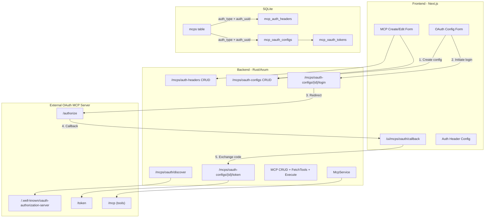

# MCP OAuth 2.1 Pre-Registered Client Authentication

## Architecture Overview




## Key Design Decisions (from interview)

- **Auth config as separate entities**: Both header configs and OAuth configs have their own CRUD endpoints, referenced by `auth_type` + `auth_uuid` on `mcps`
- **Orphan cleanup**: When switching auth types (header->public, header->oauth, etc.), delete the orphaned auth config record
- **Instance-level OAuth config**: Each user provides their own client_id/secret (not shared at server level)
- **Inline creation flow**: OAuth authorization happens as part of MCP creation wizard (form state persisted in sessionStorage)
- **Token refresh**: Proactive (check expires_at) + reactive (retry on 401)
- **Token encryption**: AES-256-GCM for client_secret, access_token, refresh_token
- **OAuth naming**: Standard terminology (authorization_endpoint, token_endpoint)
- **Discovery**: Backend endpoint fetches `.well-known/oauth-authorization-server`, pre-fills form
- **FetchTools**: Supports both `auth_uuid` reference and inline auth
- **Scopes**: Requested scopes on `mcp_oauth_configs`, granted scopes on `mcp_oauth_tokens`
- **Re-auth on expired tokens**: Pass through MCP server error; client (session/3rd-party) decides next steps
- **No backwards compatibility**: Feature in development, clean cut changes throughout

---

# Milestone 1: Header Auth Refactoring

Complete header auth migration to separate table, end-to-end, then commit.

---

## M1.1: Database Schema (Headers Only)

Modify existing migrations directly (dev-only, clean cut).

### Migration 0010 changes (`[crates/services/migrations/0010_mcp_servers.up.sql](crates/services/migrations/0010_mcp_servers.up.sql)`)

- Rename `mcps.user_id` to `created_by`
- Add `auth_type TEXT NOT NULL DEFAULT 'public'` to mcps
- Add `auth_uuid TEXT` to mcps (nullable, null for public)
- Do NOT include old auth columns (those were in 0011, which we replace)

### Migration 0011 changes (`[crates/services/migrations/0011_mcp_auth_headers.up.sql](crates/services/migrations/0011_mcp_auth_headers.up.sql)`)

Replace entirely with `mcp_auth_headers` table only (OAuth tables added later in migration 0012):

```sql
CREATE TABLE mcp_auth_headers (
  id TEXT PRIMARY KEY,
  header_key TEXT NOT NULL,
  encrypted_header_value TEXT NOT NULL,
  header_value_salt TEXT NOT NULL,
  header_value_nonce TEXT NOT NULL,
  created_by TEXT NOT NULL,
  created_at INTEGER NOT NULL,
  updated_at INTEGER NOT NULL
);
```

---

## M1.2: Header Auth Backend

Establish the separate-auth-config pattern that OAuth will follow.

### Domain types (`[crates/objs/src/mcp.rs](crates/objs/src/mcp.rs)`)

- Update `Mcp` struct: replace auth_type/auth_header_key/has_auth_header_value with `auth_type: String` + `auth_uuid: Option<String>`
- New `McpAuthHeader` struct: id, header_key, has_header_value (masked), created_by, timestamps
- New request types: `CreateAuthHeaderRequest`, `UpdateAuthHeaderRequest`
- Update `CreateMcpRequest`, `UpdateMcpRequest`: replace inline `McpAuth` with `auth_type` + `auth_uuid`
- Update `FetchMcpToolsRequest`: accept both inline auth and `auth_uuid`

### Repository (`[crates/services/src/db/](crates/services/src/db/)`)

- New `service_auth_header.rs`: CRUD for mcp_auth_headers (encrypt/decrypt header value)
- Update `service_mcp.rs`: queries use new auth_type/auth_uuid, remove old auth columns
- Update `McpRow` struct to match new schema (created_by instead of user_id)

### Routes (`[crates/routes_app/src/routes_mcps/](crates/routes_app/src/routes_mcps/)`)

- New `auth_headers.rs`: POST/GET/PUT/DELETE `/bodhi/v1/mcps/auth-headers`
- Update `mcps.rs`: MCP create/update uses auth_type + auth_uuid
- Update FetchTools handler to resolve auth from either inline or auth_uuid
- **Orphan cleanup**: When MCP update switches auth_type away from `header`, delete the old mcp_auth_headers record. When MCP is deleted, delete its associated auth config.

### McpService (`[crates/services/src/mcp_service/](crates/services/src/mcp_service/)`)

- Update tool execution to resolve auth header from mcp_auth_headers table via auth_uuid
- Decrypt header value, pass as `(key, value)` tuple to McpClient (interface unchanged)

### Tests

- Update all MCP-related tests in services, routes_app, server_app
- New tests for auth-headers CRUD endpoints
- Tests for orphan cleanup on auth type switch and MCP deletion

### Test checkpoint

```bash
cargo test -p objs
cargo test -p services
cargo test -p routes_app
cargo test -p server_app
```

---

## M1.3: Header Auth Frontend

### MCP Form (`[crates/bodhi/src/app/ui/mcps/new/page.tsx](crates/bodhi/src/app/ui/mcps/new/page.tsx)`)

- Update auth type selection (still public/header, later add OAuth)
- For header: orchestrate 2-step creation (create auth-header config via POST, then create MCP with auth_uuid)
- For edit: update header config via PUT, then update MCP if needed
- FetchTools uses auth_uuid when auth config exists, inline for preview otherwise

### Hooks / API

- New hooks: `useCreateAuthHeader`, `useUpdateAuthHeader`, `useDeleteAuthHeader`
- Update `useCreateMcp`, `useUpdateMcp` to send auth_type + auth_uuid
- Update `useFetchMcpTools` to accept auth_uuid

### Tests

- Update MSW handlers for new API shape
- Update component tests

### Test checkpoint

```bash
cd crates/bodhi && npm run test       # frontend component tests
make test.backend                     # all backend tests (includes bodhi)
```

---

## M1.4: Header Auth E2E

- Update existing E2E tests in `tests-js/specs/mcps/` for new API shape (auth-headers CRUD, auth_type+auth_uuid on MCP)
- Update page objects and fixtures as needed

### Test checkpoint

```bash
make build.ui-rebuild                 # rebuild NAPI library with UI changes
# run updated MCP E2E specs first
# then run full E2E suite:
make test.napi
```

---

## M1.5: Commit

```bash
cargo fmt
make format
# verify all green:
make test.backend
make test.napi
# commit
```

---

# Milestone 2: OAuth 2.1 Pre-Registered Client Flow

Build on the patterns established in Milestone 1.

---

## M2.1: Database Schema (OAuth Tables)

### New migration 0012 (`[crates/services/migrations/0012_mcp_oauth.up.sql](crates/services/migrations/0012_mcp_oauth.up.sql)`)

```sql
CREATE TABLE mcp_oauth_configs (
  id TEXT PRIMARY KEY,
  client_id TEXT NOT NULL,
  encrypted_client_secret TEXT NOT NULL,
  client_secret_salt TEXT NOT NULL,
  client_secret_nonce TEXT NOT NULL,
  authorization_endpoint TEXT NOT NULL,
  token_endpoint TEXT NOT NULL,
  scopes TEXT,  -- requested scopes (space-separated)
  created_by TEXT NOT NULL,
  created_at INTEGER NOT NULL,
  updated_at INTEGER NOT NULL
);

CREATE TABLE mcp_oauth_tokens (
  id TEXT PRIMARY KEY,
  mcp_oauth_config_id TEXT NOT NULL REFERENCES mcp_oauth_configs(id),
  encrypted_access_token TEXT NOT NULL,
  access_token_salt TEXT NOT NULL,
  access_token_nonce TEXT NOT NULL,
  encrypted_refresh_token TEXT,
  refresh_token_salt TEXT,
  refresh_token_nonce TEXT,
  scopes_granted TEXT,  -- granted scopes from token response
  expires_at INTEGER,   -- Unix timestamp
  created_by TEXT NOT NULL,
  created_at INTEGER NOT NULL,
  updated_at INTEGER NOT NULL
);
```

---

## M2.2: OAuth Backend

### Domain types (`[crates/objs/src/mcp.rs](crates/objs/src/mcp.rs)`)

- New `McpOAuthConfig` struct: id, client_id, authorization_endpoint, token_endpoint, scopes, created_by, timestamps (no secrets exposed)
- New `McpOAuthToken` struct: id, config_id, scopes_granted, expires_at, created_by, timestamps (no tokens exposed, has `has_access_token: bool`, `has_refresh_token: bool`)
- Request types: `CreateOAuthConfigRequest`, `UpdateOAuthConfigRequest`

### Repository (`[crates/services/src/db/](crates/services/src/db/)`)

- New `service_oauth_config.rs`: CRUD for mcp_oauth_configs (encrypt/decrypt client_secret)
- New `service_oauth_token.rs`: CRUD for mcp_oauth_tokens (encrypt/decrypt tokens)

### Routes (`[crates/routes_app/src/routes_mcps/](crates/routes_app/src/routes_mcps/)`)

**OAuth Config CRUD:**

- `POST /bodhi/v1/mcps/oauth-configs` - Create config (encrypt client_secret)
- `GET /bodhi/v1/mcps/oauth-configs/{id}` - Read config (masked secrets)
- `PUT /bodhi/v1/mcps/oauth-configs/{id}` - Update config (upsert)

**OAuth Flow:**

- `POST /bodhi/v1/mcps/oauth-configs/{id}/login` - Initiate OAuth:
  1. Generate PKCE code_verifier + challenge (S256)
  2. Generate state parameter (contains config_id)
  3. Store verifier + state in session
  4. Build authorization URL with client_id, redirect_uri, code_challenge, scope, state
  5. Return `{ authorization_url }` to frontend
- `POST /bodhi/v1/mcps/oauth-configs/{id}/token` - Exchange code:
  1. Read code_verifier from session
  2. Decrypt client_secret from mcp_oauth_configs
  3. POST to token_endpoint with grant_type=authorization_code, code, code_verifier, client_id, client_secret, redirect_uri
  4. Encrypt access_token + refresh_token, store in mcp_oauth_tokens
  5. Return token record (id, scopes_granted, expires_at)

**Discovery:**

- `POST /bodhi/v1/mcps/oauth/discover` - Fetch `.well-known/oauth-authorization-server`:
  1. Accept `{ url }` (MCP server base URL)
  2. Fetch `{url}/.well-known/oauth-authorization-server`
  3. Return `{ authorization_endpoint, token_endpoint, scopes_supported }`

### McpService - OAuth token usage

- When executing tools on an OAuth MCP instance:
  1. Read mcps.auth_uuid -> get mcp_oauth_configs record
  2. Find latest mcp_oauth_tokens by config_id
  3. **Proactive**: Check expires_at, if expired attempt refresh (POST to token_endpoint with grant_type=refresh_token)
  4. Decrypt access_token, pass as `("Authorization", "Bearer <token>")` to McpClient
  5. **Reactive**: If MCP server returns 401, attempt refresh once and retry
- **Orphan cleanup**: When MCP update switches away from `oauth-pre-registered`, delete associated mcp_oauth_configs + cascading mcp_oauth_tokens

### Tests

- OAuth config CRUD tests
- OAuth login initiation tests (mock session)
- Token exchange tests (mock external token endpoint)
- Token refresh tests (proactive + reactive)
- Discovery endpoint tests
- Orphan cleanup tests

### Test checkpoint

```bash
cargo test -p objs
cargo test -p services
cargo test -p routes_app
cargo test -p server_app
```

---

## M2.3: OAuth Frontend

### OAuth Config Form (in MCP create/edit page)

- New auth type option: "OAuth 2.1 (Pre-registered Client)"
- Fields: client_id, client_secret (password input), authorization_endpoint, token_endpoint, scopes
- "Auto-Detect" button: calls discover endpoint, pre-fills endpoint fields and scopes
- "Authorize" button: creates OAuth config (if new) -> calls login endpoint -> redirects to authorization URL
- Form state (name, slug, config_uuid, etc.) saved to sessionStorage before redirect

### OAuth Callback Page (`[crates/bodhi/src/app/ui/mcps/oauth/callback/page.tsx](crates/bodhi/src/app/ui/mcps/oauth/callback/page.tsx)`)

- Extract `code` and `state` from query params
- Read `oauth_config_id` from session (stored by login endpoint flow)
- POST to `/bodhi/v1/mcps/oauth-configs/{id}/token` with code
- On success: store token_uuid in sessionStorage, redirect to `/ui/mcps/new`
- MCP form restores state from sessionStorage, now with config_uuid + token_uuid
- User can now discover tools and create MCP instance

### Hooks / API

- `useCreateOAuthConfig`, `useUpdateOAuthConfig`
- `useOAuthLogin` (initiate flow)
- `useOAuthTokenExchange` (callback)
- `useOAuthDiscover` (well-known fetch)

### Tests

- Component tests for OAuth config form
- Callback page tests
- MSW handlers for OAuth endpoints

### Test checkpoint

```bash
cd crates/bodhi && npm run test       # frontend component tests
make test.backend                     # all backend tests (includes bodhi)
```

---

## M2.4: Test MCP OAuth Server

### Location

`crates/lib_bodhiserver_napi/test-mcp-oauth-server/`

### Technology

- TypeScript + Express
- `@modelcontextprotocol/sdk` (mcpAuthRouter, OAuthServerProvider)
- In-memory storage (no Redis)

### Implementation

- **OAuth AS**: Embedded using MCP SDK's `mcpAuthRouter`
  - `/.well-known/oauth-authorization-server` - metadata discovery
  - `/authorize` - authorization page (simple approve button)
  - `/token` - token exchange + refresh
  - `/register` - disabled (pre-registered only)
- **Pre-registered client**: client_id + client_secret read from environment (`.env.test`)
- **Login page**: Simple HTML page with "Approve" button (no real user DB)
- **MCP tools**: Simple tools (echo, ping) that verify token validity
- **Transport**: StreamableHTTP via `POST /mcp`
- **Port**: Configured in Playwright webServer (e.g., 55174)

### Configuration (.env.test)

```
TEST_MCP_OAUTH_CLIENT_ID=test-mcp-client-id
TEST_MCP_OAUTH_CLIENT_SECRET=test-mcp-client-secret
TEST_MCP_OAUTH_PORT=55174
```

---

## M2.5: OAuth E2E Tests

### Test spec: `crates/lib_bodhiserver_napi/tests-js/specs/mcps/mcps-oauth-auth.spec.mjs`

**Test flow:**

1. Admin login -> create MCP server pointing to test OAuth server URL
2. User navigates to MCP create form
3. Selects "OAuth 2.1 (Pre-registered)" auth type
4. Enters client_id + client_secret from .env.test
5. Clicks "Auto-Detect" -> authorization_endpoint, token_endpoint, scopes pre-filled
6. Clicks "Authorize" -> redirected to test server login page
7. Clicks "Approve" on test server -> redirected to `/ui/mcps/oauth/callback`
8. Callback exchanges code for tokens -> redirected back to form
9. Discovers tools, selects tools, fills name/slug
10. Creates MCP instance
11. **Session user**: executes tool from playground -> 200 OK
12. **3rd party**: test-oauth-app creates access request with MCP, gets approved, executes tool via REST API -> 200 OK

### Playwright config

- Add test-mcp-oauth-server to `webServer` array (build + serve)
- New page objects for OAuth MCP flow

### Test checkpoint

```bash
make build.ui-rebuild                 # rebuild NAPI library with UI changes
# run new OAuth MCP E2E spec first
# then run full E2E suite:
make test.napi
```

---

## M2.6: Commit

```bash
cargo fmt
make format
# verify all green:
make test.backend
make test.napi
# commit
```

---

## Development Process (applied to each milestone)

Each milestone follows a strict layered testing approach:

```
Backend (bottom-up)     Frontend          E2E
─────────────────────   ───────────       ─────────────────
1. objs (types)         4. hooks/MSW      6. build.ui-rebuild
2. services (DB/svc)    5. components     7. updated specs
3. routes_app (HTTP)       npm run test   8. make test.napi
   cargo test              make test.backend
```

- Work progresses **backend -> frontend -> E2E** within each milestone
- Run targeted crate tests as you go (`cargo test -p <crate>`)
- After frontend changes: `npm run test` then `make test.backend`
- After E2E changes: `make build.ui-rebuild` then run updated specs, then `make test.napi`
- Format before commit: `cargo fmt` + `make format`
- Full validation before commit: `make test.backend` + `make test.napi`

