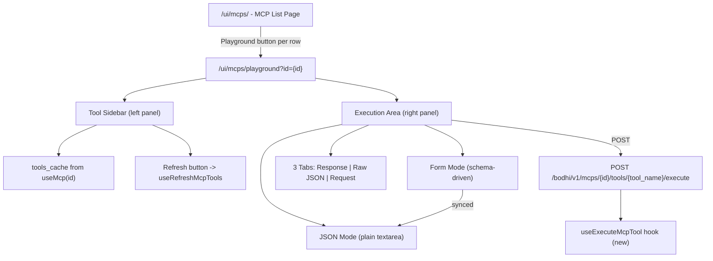

# MCP Playground Feature + E2E Tests

## Architecture Overview




## 1. New Hook: `useExecuteMcpTool`

**File**: [crates/bodhi/src/hooks/useMcps.ts](crates/bodhi/src/hooks/useMcps.ts)

Add a new mutation hook at the bottom of the existing file:

```typescript
export function useExecuteMcpTool(options?: {
  onSuccess?: (response: McpExecuteResponse) => void;
  onError?: (message: string) => void;
}): UseMutationResult<
  AxiosResponse<McpExecuteResponse>,
  AxiosError<ErrorResponse>,
  { id: string; toolName: string; params: unknown }
> {
  return useMutationQuery<McpExecuteResponse, { id: string; toolName: string; params: unknown }>(
    ({ id, toolName }) => `${MCPS_ENDPOINT}/${id}/tools/${toolName}/execute`,
    'post',
    {
      onSuccess: (response) => options?.onSuccess?.(response.data),
      onError: (error) => {
        const message = error?.response?.data?.error?.message || 'Failed to execute tool';
        options?.onError?.(message);
      },
    },
    { transformBody: ({ id: _id, toolName: _tn, ...body }) => body }
  );
}
```

## 2. MCP List Page - Add Playground Button

**File**: [crates/bodhi/src/app/ui/mcps/page.tsx](crates/bodhi/src/app/ui/mcps/page.tsx)

- Add a `Play` icon button (from `lucide-react`) in the actions column, between Edit and Delete
- Routes to `/ui/mcps/playground?id={mcp.id}`
- `data-testid="mcp-playground-button-{id}"`
- Always visible (even for disabled MCPs per user decision)

## 3. Playground Page (New)

**File**: `crates/bodhi/src/app/ui/mcps/playground/page.tsx`

### Layout: Two-Panel

```
+------------------------------------------+
| < Back to MCP Servers  |  [MCP Name]     |
|                        |  Playground     |
+------------+-----------+-----------------+
| Tool List  | Execution Area              |
| (sidebar)  |                             |
|            | [Tool Name] [Description]   |
| [Refresh]  |                             |
| Last: 2m   | [Form] [JSON] toggle        |
|            |                             |
| * tool_a   | param1: [input]             |
| * tool_b   | param2: [input]             |
|   tool_c   |                             |
|  (grayed,  | [Execute]                   |
|   warning) |                             |
|            | [Response|Raw JSON|Request] |
|            | { result: ... }             |
+------------+-----------------------------+
```

### Tool Sidebar (Left Panel)

- Load tools from `useMcp(id)` -> `mcp.tools_cache`
- Show last-refreshed indicator (relative time from `mcp.updated_at`)
- "Refresh Tools" button using `useRefreshMcpTools`
- Each tool as a clickable list item
- Tools in `tools_filter` shown normally; tools NOT in `tools_filter` shown grayed out with muted styling
- Selected tool highlighted
- `data-testid` attributes: `playground-tool-list`, `playground-tool-{name}`, `playground-refresh-button`

### Execution Area (Right Panel)

- **Header**: Selected tool name + description
- **Warning banner**: When selected tool is NOT in `tools_filter`, show an alert: "This tool is not whitelisted. Execution may be rejected by the server."
  - `data-testid="playground-not-whitelisted-warning"`
- **Input mode toggle**: Form / JSON tabs
  - `data-testid="playground-input-mode-form"`, `playground-input-mode-json`
- **Form mode**: Generate form fields from `tool.input_schema`
  - Schema `properties` mapped by type: `string` -> Input, `number/integer` -> Input type=number, `boolean` -> Checkbox, `array/object` -> Textarea (JSON)
  - Required fields marked with asterisk
  - `data-testid="playground-param-{name}"`
- **JSON mode**: Plain `<textarea>` with monospace font
  - Synced with form state (form changes serialize to JSON, JSON changes parse back to form)
  - `data-testid="playground-json-editor"`
- **Execute button**: Triggers `useExecuteMcpTool`
  - `data-testid="playground-execute-button"`
  - Shows loading spinner during execution
- **Result section**: 3 tabs
  - **Response tab**: Formatted JSON using `react-syntax-highlighter` (already in deps), success/error status indicator
    - `data-testid="playground-result-response"`
  - **Raw JSON tab**: Raw JSON string display
    - `data-testid="playground-result-raw"`
  - **Request tab**: Shows the request that was sent (tool name + params)
    - `data-testid="playground-result-request"`
  - Copy button on each tab: `data-testid="playground-copy-button"`
  - Tab selectors: `data-testid="playground-result-tab-response"`, etc.

### Form/JSON Sync Logic

- Internal state: `Record<string, unknown>` for parameter values
- Form mode reads/writes this state directly
- JSON mode: on switch-to, serialize state to `JSON.stringify(params, null, 2)`; on edit, parse JSON and update state; show parse error if invalid JSON
- Execute always reads from the internal state (form mode) or parsed JSON (JSON mode)

## 4. Navigation Update

**File**: [crates/bodhi/src/hooks/use-navigation.tsx](crates/bodhi/src/hooks/use-navigation.tsx)

Add playground as a hidden nav item under MCP Servers (with `skip: true`) so breadcrumbs work:

```typescript
{
  title: 'Playground',
  href: '/ui/mcps/playground/',
  description: 'Test MCP tools',
  icon: Play,
  skip: true,
}
```

## 5. Vitest Tests (Page-Level)

**File**: `crates/bodhi/src/app/ui/mcps/playground/page.test.tsx`

Test scenarios using MSW mocks:

- **Loading state**: Show skeleton while MCP data loads
- **Tool list rendering**: Verify all tools from tools_cache displayed, non-whitelisted ones grayed
- **Tool selection**: Click tool, verify execution area shows tool name/description
- **Non-whitelisted warning**: Select non-whitelisted tool, verify warning banner appears
- **Form generation**: Select tool with input_schema, verify form fields generated correctly
- **Form/JSON toggle**: Switch modes, verify sync
- **Execute success**: Mock execute API, verify result tabs populate
- **Execute error**: Mock execute API error, verify error displayed in response tab
- **Refresh tools**: Click refresh, verify API called and tools updated
- **Auth redirect**: Unauthenticated user redirected to login

MSW handlers needed in `crates/bodhi/src/test-utils/msw-v2/handlers/mcps.ts`:

- Add `mockExecuteMcpTool` handler for `POST /bodhi/v1/mcps/:id/tools/:tool_name/execute`

## 6. E2E Playwright Tests

**File**: [crates/lib_bodhiserver_napi/tests-js/specs/mcps/mcps-crud.spec.mjs](crates/lib_bodhiserver_napi/tests-js/specs/mcps/mcps-crud.spec.mjs)

**File**: [crates/lib_bodhiserver_napi/tests-js/pages/McpsPage.mjs](crates/lib_bodhiserver_napi/tests-js/pages/McpsPage.mjs)

### Page Object Extensions (McpsPage.mjs)

Add playground-related methods:

- `clickPlaygroundById(id)` - click playground button on list row
- `expectPlaygroundPage()` - verify playground page loaded
- `selectTool(toolName)` - click tool in sidebar
- `expectToolSelected(toolName)` - verify tool is selected
- `expectNotWhitelistedWarning()` - verify warning banner
- `clickRefreshTools()` - click refresh button
- `setFormParam(name, value)` - fill form parameter
- `switchToJsonMode()` / `switchToFormMode()` - toggle input mode
- `setJsonInput(json)` - set JSON editor content
- `clickExecute()` - click execute button
- `expectExecuteLoading()` - verify loading state
- `expectResultSuccess()` / `expectResultError()` - verify result status
- `getResultContent()` - get result tab content
- `clickResultTab(tab)` - switch result tabs
- `clickCopyButton()` - click copy
- `clickBackToList()` - navigate back

### New Test Fixtures (McpFixtures)

Add to existing fixture object:

- `createPlaygroundData()` - returns timestamped name/slug for playground test MCP
- `PLAYGROUND_TOOL`: `read_wiki_structure`
- `PLAYGROUND_PARAMS`: `{ repo_url: "https://github.com/facebook/react" }`

### E2E Test Scenarios (added to mcps-crud.spec.mjs)

**Test 3: MCP Playground - Execute Whitelisted Tool**

1. Login -> create MCP with admin enable -> fetch tools
2. Navigate back to list -> click playground button
3. Verify playground page loads with tool list
4. Select `read_wiki_structure` tool
5. Verify form fields generated from schema
6. Fill `repo_url` parameter with `https://github.com/facebook/react`
7. Click execute -> wait for result
8. Verify Response tab shows success
9. Switch to Raw JSON tab -> verify content
10. Switch to Request tab -> verify shows tool name + params
11. Click copy button -> verify it's clickable
12. Click back to list -> verify list page

**Test 4: MCP Playground - Non-Whitelisted Tool Error**

1. Login -> create MCP with admin enable -> fetch tools
2. Navigate to edit page -> deselect `ask_question` tool -> save
3. Navigate to playground
4. Select `ask_question` (should be grayed out)
5. Verify warning banner displayed
6. Fill params and execute
7. Verify error response displayed (ToolNotAllowed)

**Test 5: MCP Playground - Form/JSON Toggle**

1. Login -> create MCP with admin enable -> fetch tools
2. Navigate to playground -> select tool
3. Fill form fields with values
4. Switch to JSON mode -> verify JSON contains form values
5. Edit JSON (change a value)
6. Switch back to form mode -> verify form reflects JSON changes

**Test 6: MCP Playground - Refresh Tools**

1. Login -> create MCP with admin enable -> fetch tools
2. Navigate to playground
3. Verify tools displayed from cache
4. Click refresh -> verify loading state
5. Verify tools list updated

**Test 7: MCP Playground - Disabled MCP Execute Error**

1. Login -> create MCP with admin enable -> fetch tools
2. Navigate to edit -> disable MCP -> save
3. Navigate to playground
4. Select tool -> execute
5. Verify error: "MCP instance is disabled"

**Test 8: MCP Playground - Disabled MCP Server Execute Error**

1. Login -> create MCP with admin enable -> fetch tools
2. Disable the MCP server URL (via API or admin UI)
3. Navigate to playground -> select tool -> execute
4. Verify error: server URL not enabled

## File Change Summary


| File                                                    | Change Type                             |
| ------------------------------------------------------- | --------------------------------------- |
| `crates/bodhi/src/hooks/useMcps.ts`                     | Add `useExecuteMcpTool` hook            |
| `crates/bodhi/src/app/ui/mcps/page.tsx`                 | Add playground button to actions column |
| `crates/bodhi/src/app/ui/mcps/playground/page.tsx`      | **New** - playground page               |
| `crates/bodhi/src/app/ui/mcps/playground/page.test.tsx` | **New** - Vitest tests                  |
| `crates/bodhi/src/hooks/use-navigation.tsx`             | Add playground nav item (hidden)        |
| `crates/bodhi/src/test-utils/msw-v2/handlers/mcps.ts`   | Add execute mock handler                |
| `tests-js/pages/McpsPage.mjs`                           | Add playground page object methods      |
| `tests-js/specs/mcps/mcps-crud.spec.mjs`                | Add 6 new e2e test scenarios            |


