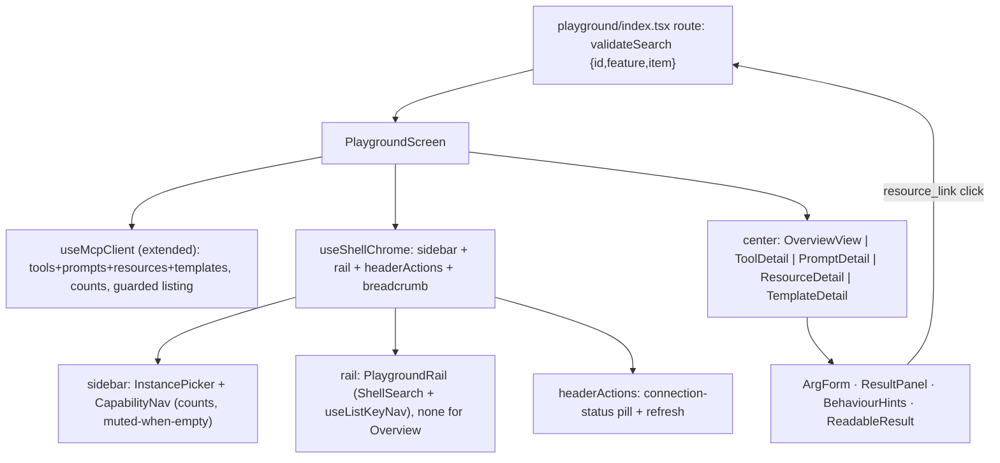

# Migrate MCP Playground to Screen-V2 (Overview / Tools / Prompts / Resources / Templates)

## Goal & constraints

Replace the legacy 2-pane playground (`ToolSidebar` + `ExecutionArea`, raw JSON) with a 3-pane Screen-V2 screen on the `AppShell` chrome. Five capability areas, readable-by-default results, instance switcher, single live MCP connection (close-before-reconnect). **Frontend-only** — no backend, OpenAPI, or `@bodhiapp/ts-client` changes; do NOT regenerate types. SDK `@modelcontextprotocol/sdk@1.29.0` already exposes `listPrompts`/`getPrompt`/`listResources`/`readResource`/`listResourceTemplates`.

Out of scope (next phase): Elicitation, Sampling, Completion. Dropped entirely: any "Use in Chat" / "Send to Chat" hand-off.

## Verified codebase facts (corrections to source plan)

- Detail-rail primitives live at `crates/bodhi/src/components/detail-rail/` (NOT `components/shell/detail-rail/`): `DetailRail`, `DetailRailBody`, `DetailRailSection`, `DetailRailRows`, `DetailRailRow{k,v,mono}`.
- Best structural template to copy: [`crates/bodhi/src/routes/mcps/-components/MyMcpsScreen.tsx`](crates/bodhi/src/routes/mcps/-components/MyMcpsScreen.tsx) — full V2 stack (validateSearch, `ShellSearch`, `useListKeyNav`, `useShellChrome({sidebar,rail,railHeader,breadcrumb})`, `select()` + `useViewTransition` + `replace:true`).
- `ShellSlots` supports BOTH `sidebar` (left, capability nav + instance picker) and `rail` (right, item list) simultaneously — the 3-pane requirement is feasible. See [`components/shell/ShellChromeContext.tsx`](crates/bodhi/src/components/shell/ShellChromeContext.tsx). Pass MEMOIZED slot nodes.
- `AppShell` auto-opens the rail when `rail` is non-null.
- Current hook [`useMcpClient.ts`](crates/bodhi/src/hooks/mcps/useMcpClient.ts) is `useRef`-stateful (clientRef/transportRef + status/tools/error state); `connect()` already calls `disconnect()` first (satisfies close-before-reconnect). Custom fetch adds `credentials:'include'`.
- `mapSdkToolsToClient` in [`toolMapping.ts`](crates/bodhi/src/hooks/mcps/toolMapping.ts) is a thin passthrough — must extend with `annotations` + `title`.
- MSW handler [`mcp-protocol.ts`](crates/bodhi/src/test-utils/msw-v2/handlers/mcp-protocol.ts) is a single `switch(method)` POST handler; today only `initialize`/`notifications/initialized`/`tools/list`/`tools/call`. Unknown method already returns JSON-RPC `-32601` (lets guarded capability listing degrade to empty).
- E2E everything server on port 55180; fixtures `EVERYTHING_EXPECTED_TOOLS/PROMPTS/RESOURCE_TEMPLATES` exist in [`fixtures/mcpFixtures.mjs`](crates/lib_bodhiserver/tests-js/fixtures/mcpFixtures.mjs). Tool names are hyphenated (`echo`, `get-sum`, `get-structured-content`, `get-resource-links`, ...).
- Prototype renderers to port: [`design/mcp-playground/pg-render.jsx`](design/mcp-playground/pg-render.jsx) (`ContentBlock`, `ToolResultView`, `Markdownish`, `DataView`, `MessagesView`, `ResultPanel`), result model `{ content: Block[], structuredContent?, isError? }`, hint vocab in `pg-tools.jsx`.

## Architecture



## URL state (extend route validateSearch, mirror `myMcpsSearchSchema`)

```ts
validateSearch: z.object({
  id: z.string().optional(),
  feature: z.enum(['overview','tools','prompts','resources','templates']).optional(), // default 'overview'
  item: z.string().optional(), // tool name / prompt name / resource uri / template uriTemplate
})
```

- Capability nav writes `?feature=`; rail selection writes `?item=` with `replace:true` inside `useViewTransition()` (the `select()` pattern).
- Instance picker writes `?id=` and resets `feature`/`item`.
- A tool result `resource_link` deep-links to `?feature=resources&item=<uri>` via an `openResource(uri)` callback (context-provided), then re-reads live.

## Data layer — extend `useMcpClient`

Add to the single-connection hook, mirroring `listTools`/`callTool`:
- `listPrompts()` + `getPrompt(name,args)` → `{messages:[{role,content}],description?}`.
- `listResources()` + `readResource(uri)` → `{contents:[{uri,text|blob,mimeType?}]}`.
- `listResourceTemplates()` → `{resourceTemplates:[{uriTemplate,name,...}]}`; client-side RFC6570 level-1 `{var}` substitution (no lib) → `readResource(resolvedUri)`.
- On `connect()`, after `listTools`, call the four list methods EACH guarded (catch Method-not-found / capability-absent → empty list, not error). Store `prompts`/`resources`/`resourceTemplates` arrays + counts in hook state.
- Extend `McpClientTool` with `annotations` + `title`; map them in `mapSdkToolsToClient`.
- Keep the `useRef` SDK-stateful pattern (not TanStack Query).

## Components (new, under `routes/mcps/playground/-components/`)

`InstancePicker.tsx` (uses `useListMcps`), `CapabilityNav.tsx` (counts + muted-when-empty), `PlaygroundRail.tsx` (config-driven `ShellSearch`+`useListKeyNav`, one config/capability), detail views `OverviewView.tsx` / `ToolDetail.tsx` / `PromptDetail.tsx` / `ResourceDetail.tsx` / `TemplateDetail.tsx`, shared `ArgForm.tsx` (salvage schema→form + `buildDefaultParams`/`cleanParams`), `ResultPanel.tsx` (status pill `data-test-state` + Result/Raw/Request tabs + copy, salvage from `ResultSection.tsx`), `BehaviourHints.tsx`, `ReadableResult.tsx` (port `pg-render.jsx` renderers), `playground.css` (scoped token-based `.pg-*`, NOT a verbatim `pg-app.css` port; reuse `EmptyState` + detail-rail primitives where they fit).

Result-model shape stays `{ content: [block...], structuredContent?, isError? }`; the real SDK call replaces the prototype's `useRunner` simulator.

## Testids (structure-matching)

`mcp-playground-instance-picker`, `mcp-playground-capability-<feature>`, `mcp-playground-rail-item-<id>`, `mcp-playground-run-button`, `mcp-playground-result-tab-<tab>`, `mcp-playground-result-status` (`data-test-state` success/error), `mcp-playground-connection-status` (`data-test-state` connected/connecting/error), plus `-prompt-*`/`-resource-*`/`-template-*` variants. Reuse legacy testids only on 1:1 element maps.

## Phasing (each phase: unit tests → `npm run test` → live-verify → grow ONE E2E spec → gate checks → local commit)

- **P1 — Shell + Overview + Tools.** 3-pane chrome (instance picker, capability nav w/ counts, tool rail), Overview dashboard, full Tools detail (hints, auto-form, Run/Reset, readable result + tabs + copy). Data-layer extension lists ALL capabilities so counts work even though only Tools detail is wired.
- **P2 — Prompts.** Prompt list + arg form + "Preview messages" → role-labelled chat bubbles.
- **P3 — Resources.** Resource list + read + readable contents; wire `resource_link` deep-link from tool results.
- **P4 — Templates.** Template list + fill-in form + live "Resolves to" URI preview + resolve & read.
- **P5 — Polish + cleanup.** Empty states, light/dark + responsive (rail→drawer), console-clean, DELETE legacy `ToolSidebar.tsx`/`ExecutionArea.tsx`/`FormInput.tsx`/`ResultSection.tsx` (fold `types.ts` in), write retro doc, update `crates/bodhi/src/CLAUDE.md`/`PACKAGE.md`.

## Testing

**Unit (Vitest + MSW), `crates/bodhi`:** rewrite [`routes/mcps/playground/index.test.tsx`](crates/bodhi/src/routes/mcps/playground/index.test.tsx) for the 3-pane structure + component/hook tests covering capability nav switching, rail selection, each detail run path, readable rendering (markdown/structured/messages/image/resource_link), Raw/Request toggles, empty states, connecting/error, instance switch (close-then-reconnect). Extend [`mcp-protocol.ts`](crates/bodhi/src/test-utils/msw-v2/handlers/mcp-protocol.ts) with `prompts/list`, `prompts/get`, `resources/list`, `resources/read`, `resources/templates/list`.

**E2E (Playwright), `crates/lib_bodhiserver/tests-js`:** new `pages/McpPlaygroundPage.mjs` (instance switch, capability nav, rail search/select, per-capability run+result, connection-status); `McpsPage` delegates playground methods to it; update call-sites in `specs/mcps/mcps-crud.spec.mjs`, `mcps-header-auth.spec.mjs` (+ OAuth playground spec). Grow ONE spec with `test.step`s: connect → Overview counts → Tools run (echo) → Prompts preview → Resources read → Templates resolve & read. Throw in `beforeAll` if everything server (55180) missing — never `test.skip()`. Set `reducedMotion:'reduce'` before navigating; no `waitForTimeout`. Both standalone AND multi_tenant must stay green.

## Gate checks before each per-phase local commit

- `cd crates/bodhi && npm run format && npm run lint`
- `cd crates/bodhi && npm run test` (green)
- E2E for touched specs green in both projects (`cd crates/lib_bodhiserver && make build.dev-server` then `npm run test:playwright:standalone` / `:multi_tenant`)
- Live GATE B (Claude-in-Chrome): light + dark + responsive (rail→drawer); console clean apart from the known swallowed view-transition `InvalidStateError`
- Local commit per phase (no push)

## Files

**Modify:** `routes/mcps/playground/index.tsx`, `hooks/mcps/useMcpClient.ts`, `hooks/mcps/toolMapping.ts`, `test-utils/msw-v2/handlers/mcp-protocol.ts`, `routes/mcps/playground/index.test.tsx`, `tests-js/pages/McpsPage.mjs`, `tests-js/specs/mcps/mcps-crud.spec.mjs`, `mcps-header-auth.spec.mjs` (+ OAuth playground spec), `crates/bodhi/src/CLAUDE.md` / `PACKAGE.md`.

**Create:** the `-components/*` set + `playground.css`, `tests-js/pages/McpPlaygroundPage.mjs`, `docs/claude-plans/202606/screen-v2/batch-<n>-mcp-playground-retro.md`.

**Delete (after P5 parity):** `ToolSidebar.tsx`, `ExecutionArea.tsx`, `FormInput.tsx`, `ResultSection.tsx`, legacy `types.ts`.