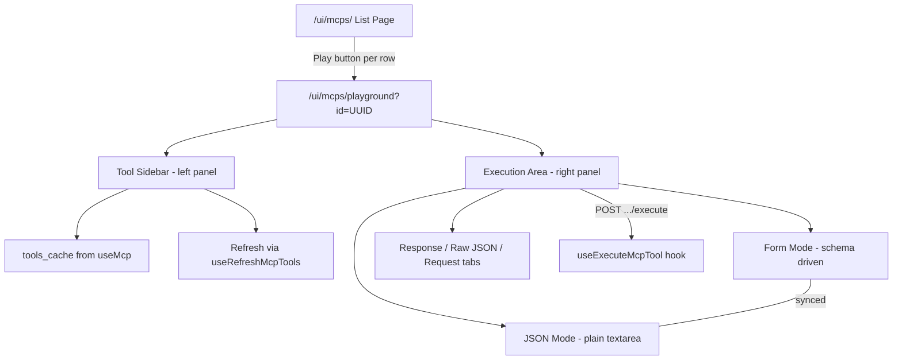

# MCP Playground Feature + E2E Tests (v2)

## Architecture




## Design Decisions (from interview)

- **Input mode**: Both form + JSON with toggle, synced bidirectionally
- **Tool refresh**: Use cached `tools_cache`, show last-refreshed time, manual refresh button
- **Layout**: Two-panel (tool sidebar left, execution area right)
- **Disabled MCP**: Playground button always visible, let backend errors surface naturally
- **Results**: Three tabs (Response with `react-syntax-highlighter`, Raw JSON, Request)
- **Execution metadata**: Just success/error status (no timing)
- **Non-whitelisted tools**: Warning banner when selected, still allow execution
- **JSON editor**: Plain `textarea` with monospace font
- **JSON viewer**: `react-syntax-highlighter` (already in deps), flat non-collapsible
- **Form/JSON sync**: Bidirectional
- **Route**: `/ui/mcps/playground?id={id}` (query param, consistent with edit pattern)
- **E2E spec**: Extend existing `mcps-crud.spec.mjs`
- **Vitest**: Page-level tests only

---

## 1. Hook: `useExecuteMcpTool` in [useMcps.ts](crates/bodhi/src/hooks/useMcps.ts)

Add mutation hook following existing patterns (`useRefreshMcpTools`, `useUpdateMcp`):

```typescript
export function useExecuteMcpTool(options?: {
  onSuccess?: (response: McpExecuteResponse) => void;
  onError?: (message: string) => void;
}): UseMutationResult<
  AxiosResponse<McpExecuteResponse>,
  AxiosError<ErrorResponse>,
  { id: string; toolName: string; params: unknown }
> {
  return useMutationQuery<McpExecuteResponse, { id: string; toolName: string; params: unknown }>(
    ({ id, toolName }) => `${MCPS_ENDPOINT}/${id}/tools/${toolName}/execute`,
    'post',
    {
      onSuccess: (response) => options?.onSuccess?.(response.data),
      onError: (error: AxiosError<ErrorResponse>) => {
        const message = error?.response?.data?.error?.message || 'Failed to execute tool';
        options?.onError?.(message);
      },
    },
    { transformBody: ({ id: _id, toolName: _tn, ...body }) => body }
  );
}
```

The `transformBody` strips `id` and `toolName` (used for URL construction) from the request body, sending only `{ params }`.

---

## 2. MCP List Page: Add Playground Button

**File**: [crates/bodhi/src/app/ui/mcps/page.tsx](crates/bodhi/src/app/ui/mcps/page.tsx)

In the actions `TableCell` (line 103-127), add a `Play` icon button between Edit and Delete:

```typescript
import { Pencil, Play, Plug, Plus, Trash2 } from 'lucide-react';
```

```tsx
<Button
  variant="ghost"
  size="sm"
  onClick={() => router.push(`/ui/mcps/playground?id=${mcp.id}`)}
  title={`Playground ${mcp.name}`}
  className="h-8 w-8 p-0"
  data-testid={`mcp-playground-button-${mcp.id}`}
>
  <Play className="h-4 w-4" />
</Button>
```

Always visible (even for disabled MCPs per design decision).

---

## 3. Navigation Update

**File**: [crates/bodhi/src/hooks/use-navigation.tsx](crates/bodhi/src/hooks/use-navigation.tsx)

Add hidden nav item under MCP Servers for breadcrumb support:

```typescript
{
  title: 'Playground',
  href: '/ui/mcps/playground/',
  description: 'Test MCP tools',
  icon: Play,
  skip: true,
}
```

---

## 4. Playground Page

**File**: `crates/bodhi/src/app/ui/mcps/playground/page.tsx` (new)

### Page Wrapper (following convention from existing pages)

```tsx
export default function McpPlaygroundPage() {
  return (
    <AppInitializer authenticated={true} allowedStatus="ready">
      <McpPlaygroundContent />
    </AppInitializer>
  );
}
```

### Two-Panel Layout

```
+-------------------------------------------------------------+
| < Back to MCP Servers    MCP Name - Playground              |
+-------------------+-----------------------------------------+
| Tool Sidebar      | Execution Area                          |
|                   |                                         |
| [Refresh] 2m ago  | Tool Name                               |
|                   | Tool description text...                |
| * tool_a          |                                         |
| * tool_b          | [!] Not whitelisted warning (if applicable)|
|   tool_c (muted)  |                                         |
|                   | [Form] [JSON]  input mode toggle        |
|                   |                                         |
|                   | param1: [_______]                       |
|                   | param2: [_______]                       |
|                   |                                         |
|                   | [Execute]                               |
|                   |                                         |
|                   | [Response] [Raw JSON] [Request] [Copy]  |
|                   | { "result": ... }                       |
+-------------------+-----------------------------------------+
```

### data-testid Conventions

Following the `{feature}-{element}` pattern from existing MCP pages (e.g., `mcp-url-input`, `mcp-tools-section`):

**Page-level:**

- `mcp-playground-page` / `mcp-playground-loading`

**Tool sidebar:**

- `mcp-playground-tool-sidebar`
- `mcp-playground-tool-list`
- `mcp-playground-tool-{name}` (each tool item)
- `mcp-playground-refresh-button`
- `mcp-playground-last-refreshed`

**Execution area:**

- `mcp-playground-tool-name` (selected tool header)
- `mcp-playground-not-whitelisted-warning`
- `mcp-playground-input-mode-form` / `mcp-playground-input-mode-json`
- `mcp-playground-param-{name}` (form field per parameter)
- `mcp-playground-json-editor` (textarea)
- `mcp-playground-execute-button`

**Result section:**

- `mcp-playground-result-section`
- `mcp-playground-result-tab-response` / `-raw` / `-request`
- `mcp-playground-result-content` (active tab content)
- `mcp-playground-result-status` with `data-test-state="success"` or `"error"`
- `mcp-playground-copy-button`

### Tool Sidebar Logic

- Load from `useMcp(id)` -> `mcp.tools_cache` array
- Show relative time from `mcp.updated_at` as "last refreshed" indicator
- Refresh button calls `useRefreshMcpTools({ id })`, then invalidates `['mcps', id]` query
- Tools in `mcp.tools_filter` shown normally; tools NOT in `tools_filter` shown with `opacity-50` / muted styling
- Selected tool highlighted with `bg-accent` class

### Form Generator (from `input_schema`)

Generate fields from `tool.input_schema.properties`:

- `string` -> `<Input type="text">`
- `number` / `integer` -> `<Input type="number">`
- `boolean` -> shadcn `<Checkbox>`
- `array` / `object` -> `<Textarea>` (user enters JSON)
- Required fields (from `input_schema.required`) marked with `*`

### Form/JSON Sync

Internal state: `Record<string, unknown>` for params.

- **Form changes** -> update state -> if user switches to JSON, serialize with `JSON.stringify(state, null, 2)`
- **JSON edits** -> parse with `JSON.parse()` -> update state -> if user switches to form, fields reflect parsed values
- **JSON parse error** -> show inline error below textarea, do not update state
- **Execute** reads from current state regardless of active mode

### Result Tabs

Using shadcn `Tabs` component:

- **Response**: Success/error badge + formatted JSON via `react-syntax-highlighter` with `json` language
- **Raw JSON**: Plain `JSON.stringify(result, null, 2)` in `<pre>` block
- **Request**: Shows `{ tool: "tool_name", params: { ... } }` that was sent
- **Copy button**: `navigator.clipboard.writeText()` on active tab content

---

## 5. MSW Mock Handler

**File**: [crates/bodhi/src/test-utils/msw-v2/handlers/mcps.ts](crates/bodhi/src/test-utils/msw-v2/handlers/mcps.ts)

Add execute handler following existing pattern:

```typescript
export function mockExecuteMcpTool(response: McpExecuteResponse = { result: { data: 'test' } }) {
  return http.post(`${BODHI_API_BASE}/mcps/:id/tools/:tool_name/execute`, () =>
    HttpResponse.json(response)
  );
}

export function mockExecuteMcpToolError({
  message = 'Tool not allowed',
  code = 'bad_request',
  type = 'bad_request',
  status = 400,
}: { message?: string; code?: string; type?: string; status?: number } = {}) {
  return http.post(`${BODHI_API_BASE}/mcps/:id/tools/:tool_name/execute`, () =>
    HttpResponse.json({ error: { message, code, type } }, { status })
  );
}
```

Add `mockExecuteMcpTool()` to the default `mcpsHandlers` array.

---

## 6. Vitest Tests (Page-Level)

**File**: `crates/bodhi/src/app/ui/mcps/playground/page.test.tsx` (new)

Following convention: test `McpPlaygroundContent` (not the wrapper), mock `AppInfo` in `beforeEach`.

**Test scenarios**:

- Loading state shows skeleton
- Tool list renders from `tools_cache`, non-whitelisted tools shown with muted styling
- Selecting a tool shows its name, description, and form fields from `input_schema`
- Warning banner appears when non-whitelisted tool selected
- Form/JSON toggle switches input modes and keeps values synced
- Execute success: mock API returns result, Response tab shows formatted JSON
- Execute error: mock API returns error, error status badge shown
- Refresh tools: button triggers API call
- Auth redirect: unauthenticated user redirected

---

## 7. E2E Playwright Tests

### Fixture Extensions

**File**: [crates/lib_bodhiserver_napi/tests-js/fixtures/mcpFixtures.mjs](crates/lib_bodhiserver_napi/tests-js/fixtures/mcpFixtures.mjs)

Add playground-specific factory and constants:

```javascript
static PLAYGROUND_TOOL = 'read_wiki_structure';
static PLAYGROUND_PARAMS = { repo_url: 'https://github.com/facebook/react' };

static createPlaygroundData() {
  const ts = Date.now();
  return {
    url: McpFixtures.MCP_URL,
    name: `Playground-${ts}`,
    slug: `pg-${ts}`,
    description: 'Playground test MCP',
  };
}
```

### Page Object Extensions

**File**: [crates/lib_bodhiserver_napi/tests-js/pages/McpsPage.mjs](crates/lib_bodhiserver_napi/tests-js/pages/McpsPage.mjs)

Add playground selectors and methods following the existing page object conventions:

**New selectors** (added to `selectors = {}` block):

```javascript
// Playground page
playgroundPage: '[data-testid="mcp-playground-page"]',
playgroundLoading: '[data-testid="mcp-playground-loading"]',
playgroundToolSidebar: '[data-testid="mcp-playground-tool-sidebar"]',
playgroundToolList: '[data-testid="mcp-playground-tool-list"]',
playgroundTool: (name) => `[data-testid="mcp-playground-tool-${name}"]`,
playgroundRefreshButton: '[data-testid="mcp-playground-refresh-button"]',
playgroundNotWhitelistedWarning: '[data-testid="mcp-playground-not-whitelisted-warning"]',
playgroundInputModeForm: '[data-testid="mcp-playground-input-mode-form"]',
playgroundInputModeJson: '[data-testid="mcp-playground-input-mode-json"]',
playgroundParam: (name) => `[data-testid="mcp-playground-param-${name}"]`,
playgroundJsonEditor: '[data-testid="mcp-playground-json-editor"]',
playgroundExecuteButton: '[data-testid="mcp-playground-execute-button"]',
playgroundResultSection: '[data-testid="mcp-playground-result-section"]',
playgroundResultStatus: '[data-testid="mcp-playground-result-status"]',
playgroundResultTabResponse: '[data-testid="mcp-playground-result-tab-response"]',
playgroundResultTabRaw: '[data-testid="mcp-playground-result-tab-raw"]',
playgroundResultTabRequest: '[data-testid="mcp-playground-result-tab-request"]',
playgroundCopyButton: '[data-testid="mcp-playground-copy-button"]',
playgroundBackButton: '[data-testid="mcp-playground-back-button"]',
mcpPlaygroundButton: (id) => `[data-testid="mcp-playground-button-${id}"]`,
```

**New methods** following prefix conventions (`navigateTo*`, `expect*`, `click*`, `fill*`, `get*`):

```javascript
// Playground navigation
async clickPlaygroundById(id)      // click Play button on list row
async expectPlaygroundPage()       // assert playground container visible

// Tool interaction
async selectPlaygroundTool(name)   // click tool in sidebar
async expectPlaygroundToolSelected(name)
async expectNotWhitelistedWarning()
async clickPlaygroundRefresh()

// Input
async fillPlaygroundParam(name, value)  // fill form field
async switchToJsonMode()
async switchToFormMode()
async fillPlaygroundJson(json)     // fill JSON textarea

// Execution
async clickPlaygroundExecute()
async expectPlaygroundResultSuccess()
async expectPlaygroundResultError()

// Results
async clickPlaygroundResultTab(tab)  // 'response' | 'raw' | 'request'
async clickPlaygroundCopy()
async getPlaygroundResultContent()

// Navigation
async clickPlaygroundBack()
```

### E2E Test Journeys

**File**: [crates/lib_bodhiserver_napi/tests-js/specs/mcps/mcps-crud.spec.mjs](crates/lib_bodhiserver_napi/tests-js/specs/mcps/mcps-crud.spec.mjs)

Add new journey tests following E2E.md conventions (user journeys with `test.step`, single login per journey, fixture-driven data):

**Test 3: MCP Playground - Tool Execution and Results**

```javascript
test('MCP Playground - Tool Execution and Results', async ({ page }) => {
  // Single login, fixture data
  const testData = McpFixtures.createPlaygroundData();

  await test.step('Login and create MCP with tools', async () => {
    // login, create MCP with admin enable, fetch tools
  });

  await test.step('Navigate to playground from list', async () => {
    // back to list, click playground button, verify playground loads
  });

  await test.step('Select tool and verify form generation', async () => {
    // select read_wiki_structure, verify param fields from schema
  });

  await test.step('Execute tool with form params', async () => {
    // fill repo_url, click execute, verify success result in Response tab
  });

  await test.step('Verify result tabs', async () => {
    // switch to Raw JSON tab, verify content
    // switch to Request tab, verify tool name + params shown
    // click copy button, verify clickable
  });

  await test.step('Test form/JSON toggle sync', async () => {
    // verify form has values, switch to JSON mode
    // verify JSON contains form values
    // edit JSON, switch back to form, verify form updated
  });
});
```

**Test 4: MCP Playground - Non-Whitelisted Tool Error**

```javascript
test('MCP Playground - Non-Whitelisted Tool Error', async ({ page }) => {
  await test.step('Login and create MCP with tools', async () => {
    // create MCP, fetch tools (all whitelisted by default)
  });

  await test.step('Deselect tool via edit page', async () => {
    // navigate to edit, uncheck ask_question tool, save
  });

  await test.step('Navigate to playground and select non-whitelisted tool', async () => {
    // navigate to playground, select ask_question (grayed)
    // verify warning banner displayed
  });

  await test.step('Execute and verify error response', async () => {
    // fill params, execute
    // verify error status and ToolNotAllowed message
  });
});
```

**Test 5: MCP Playground - Refresh Tools**

```javascript
test('MCP Playground - Refresh and Disabled States', async ({ page }) => {
  await test.step('Login and create MCP with tools', async () => { ... });

  await test.step('Navigate to playground and refresh tools', async () => {
    // navigate to playground, verify cached tools shown
    // click refresh, verify tools still present (re-fetched)
  });

  await test.step('Disable MCP and verify execution error', async () => {
    // navigate to edit, disable MCP, save
    // navigate to playground, select tool, execute
    // verify "MCP instance is disabled" error
  });

  await test.step('Disable MCP server URL and verify execution error', async () => {
    // re-enable MCP, disable mcp_server URL via API
    // navigate to playground, select tool, execute
    // verify server URL not enabled error
  });
});
```

---

## File Change Summary

- **[crates/bodhi/src/hooks/useMcps.ts](crates/bodhi/src/hooks/useMcps.ts)** -- add `useExecuteMcpTool` hook
- **[crates/bodhi/src/app/ui/mcps/page.tsx](crates/bodhi/src/app/ui/mcps/page.tsx)** -- add Play button to actions column
- **[crates/bodhi/src/hooks/use-navigation.tsx](crates/bodhi/src/hooks/use-navigation.tsx)** -- add hidden playground nav item
- `**crates/bodhi/src/app/ui/mcps/playground/page.tsx**` -- NEW: playground page
- `**crates/bodhi/src/app/ui/mcps/playground/page.test.tsx**` -- NEW: Vitest tests
- **[crates/bodhi/src/test-utils/msw-v2/handlers/mcps.ts](crates/bodhi/src/test-utils/msw-v2/handlers/mcps.ts)** -- add execute mock handlers
- **[tests-js/fixtures/mcpFixtures.mjs](crates/lib_bodhiserver_napi/tests-js/fixtures/mcpFixtures.mjs)** -- add playground fixtures
- **[tests-js/pages/McpsPage.mjs](crates/lib_bodhiserver_napi/tests-js/pages/McpsPage.mjs)** -- add playground selectors and methods
- **[tests-js/specs/mcps/mcps-crud.spec.mjs](crates/lib_bodhiserver_napi/tests-js/specs/mcps/mcps-crud.spec.mjs)** -- add 3 journey tests

## Convention Compliance Checklist

- Page wrapped in `AppInitializer` with `authenticated={true}` and `allowedStatus="ready"`
- `data-testid` follows `{feature}-{element}` pattern (prefix `mcp-playground-`)
- `data-test-state` for dynamic states (success/error on result status)
- Event handlers use `handle` prefix
- Absolute imports with `@/` prefix
- Types imported from `@bodhiapp/ts-client`
- E2E tests are user journeys (1-4 per describe), not fragmented unit tests
- `test.step()` for major phases within each journey
- Fixture-driven test data with `Date.now()` uniqueness
- Page object methods follow prefix convention (`navigateTo*`, `expect*`, `click*`, `fill*`, `get*`)
- Selectors use `data-testid`, never CSS classes
- Shared server (port 51135) with `@/fixtures.mjs` import for auto DB reset
- No inline timeouts in tests or components
- No `page.waitForTimeout()` -- use `waitForSPAReady()` and `page.waitForURL()`
- `waitForSPAReady()` after navigation
- Page objects created per-test (not in `beforeAll`)

