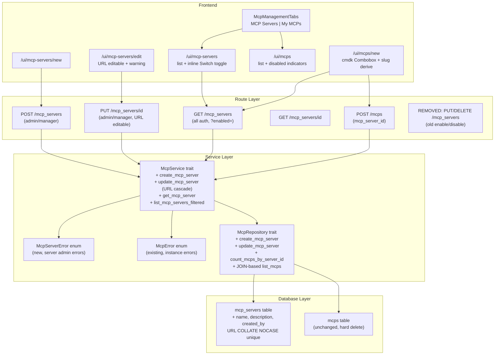

# MCP Servers & MCPs UI/API Redesign

## All Design Decisions (from interview)

### Naming Convention

- `CreateMcpServerRequest` / `McpServerResponse` -- for `mcp_servers` table operations
- `CreateMcpRequest` / `McpResponse` -- for `mcps` table operations

### API Response Shapes

- **McpResponse**: Nested `mcp_server: { id, url, name, enabled }` object (full server context)
- **McpServerResponse**: Includes `enabled_mcp_count` and `disabled_mcp_count` fields (frontend sums for display)
- **CreateMcpRequest**: Uses `mcp_server_id` directly (not `url`)
- **enabled field**: Required on ALL POST/PUT for both entities (no serde defaults)

### URL Handling

- Trim whitespace only (no trailing slash removal)
- Case-insensitive uniqueness check (COLLATE NOCASE on URL index)
- Max 2048 chars
- URL IS editable on MCP server edit -- with warning dialog showing affected MCP count
- URL edit cascades: clears `tools_cache` AND `tools_filter` on all linked MCPs

### Validation Limits

- MCP server name: max 100 chars, required
- MCP server description: max 255 chars (same as MCP instance)
- MCP server URL: max 2048 chars, valid URL format
- Name uniqueness: NOT unique (only URL is unique)

### UI/UX Decisions

- **Tab routing**: `/ui/mcp-servers` and `/ui/mcps` as separate top-level routes, shared tab component
- **Navigation**: Single "MCP" entry pointing to `/ui/mcps` (My MCPs tab)
- **Non-admin server tab**: Full list with status badges but no action buttons
- **MCP Servers form**: Separate pages at `/ui/mcp-servers/new` and `/ui/mcp-servers/edit`
- **Enable/disable toggle**: Inline Switch in table row with confirmation dialog (admin/manager only)
- **Disabled MCP indicator**: Action buttons grayed out with tooltip "Server disabled"
- **MCP create dropdown**: cmdk Combobox (Popover + Command), strict selection only
- **Combobox "Add New" option**: For admin/manager, navigates to `/ui/mcp-servers/new` (current form data is lost)
- **Slug auto-derive**: Second-level domain extraction (mcp.deepwiki.com -> "deepwiki", api.example.com -> "example")
- **No servers state**: Empty combobox with "No MCP servers available" message + link to servers page
- **No pagination**: Load all MCP servers at once

### Data Model Decisions

- **No soft delete** on either table -- hard delete for MCPs, no delete for MCP servers
- **created_by field**: Added to mcp_servers for audit
- **mcp_server_id immutable** on MCP instance update
- **Delete allowed** even when server is disabled
- **SQL JOIN** for list MCPs query (avoid N+1)
- **MCPs list URL column**: Keep showing URL (from nested mcp_server object)

### Error Handling

- New `McpServerError` enum for server admin operations (separate from existing `McpError`)
- Any admin/manager can edit any MCP server (team administration model)

### Migration Strategy

- Update existing migration 0010 in-place (not deployed yet)
- Remove old PUT/DELETE enable/disable endpoints immediately (no backward compat needed)

### Testing

- Use real DeepWiki URL for all e2e tests

---

## Phase 1: Database Migration (Update 0010 In-Place)

**Update** [crates/services/migrations/0010_mcp_servers.up.sql](crates/services/migrations/0010_mcp_servers.up.sql):

Changes to `mcp_servers` CREATE TABLE:

- Add `name TEXT NOT NULL DEFAULT ''`
- Add `description TEXT`
- Add `created_by TEXT NOT NULL`
- Change unique index to: `CREATE UNIQUE INDEX ... ON mcp_servers(url COLLATE NOCASE)`

**Update** [crates/services/migrations/0010_mcp_servers.down.sql](crates/services/migrations/0010_mcp_servers.down.sql):

- Match the schema changes

---

## Phase 2: Domain Objects (objs crate)

**Update `McpServer**` in [crates/objs/src/mcp.rs](crates/objs/src/mcp.rs):

- Add fields: `name: String`, `description: Option<String>`, `created_by: String`

**New struct `McpServerInfo**` for nested embedding in McpResponse:

```rust
pub struct McpServerInfo {
  pub id: String,
  pub url: String,
  pub name: String,
  pub enabled: bool,
}
```

**Add validation functions**:

- `validate_mcp_server_name()` -- non-empty, max 100 chars
- `validate_mcp_server_url()` -- non-empty, valid URL format, max 2048 chars
- `validate_mcp_server_description()` -- max 255 chars (reuse existing MCP description limit)

---

## Phase 3: Database Layer (services crate)

**Update `McpServerRow**` in [crates/services/src/db/objs.rs](crates/services/src/db/objs.rs):

- Add `name: String`, `description: Option<String>`, `created_by: String`

**Update `McpRepository**` in [crates/services/src/db/mcp_repository.rs](crates/services/src/db/mcp_repository.rs):

New methods:

- `create_mcp_server(row: &McpServerRow) -> Result<McpServerRow, DbError>` -- INSERT, URL trimmed, unique constraint
- `update_mcp_server(row: &McpServerRow) -> Result<McpServerRow, DbError>` -- UPDATE by id (all fields including URL)
- `list_mcp_servers_filtered(enabled: Option<bool>) -> Result<Vec<McpServerRow>, DbError>` -- optional WHERE enabled=?
- `count_mcps_by_server_id(server_id: &str) -> Result<(i64, i64), DbError>` -- returns (enabled_count, disabled_count)

Removed:

- `set_mcp_server_enabled` (replaced by create + update)

**Update list MCPs query** in [crates/services/src/db/service.rs](crates/services/src/db/service.rs):

- Use SQL JOIN with mcp_servers to return server info in a single query
- Add `McpWithServerRow` struct for the joined result

---

## Phase 4: Service Layer (services crate)

**New error enum** [crates/services/src/mcp_service/error.rs](crates/services/src/mcp_service/error.rs):

```rust
pub enum McpServerError {
  McpServerNotFound(String),
  UrlAlreadyExists(String),
  NameRequired,
  UrlRequired,
  UrlInvalid(String),
  UrlTooLong,
  NameTooLong,
  DescriptionTooLong,
  DbError(#[from] DbError),
}
```

**Update `McpService` trait** in [crates/services/src/mcp_service/service.rs](crates/services/src/mcp_service/service.rs):

New methods:

- `create_mcp_server(name, url, description, enabled, created_by) -> Result<McpServer, McpServerError>`
  - Trims URL, validates all fields, checks URL uniqueness (case-insensitive)
- `update_mcp_server(id, name, url, description, enabled, updated_by) -> Result<McpServer, McpServerError>`
  - If URL changed: clear `tools_cache` and `tools_filter` on all linked MCPs
  - Validates all fields, checks URL uniqueness excluding current server
- `get_mcp_server(id) -> Result<Option<McpServer>, McpServerError>`
- `list_mcp_servers_filtered(enabled: Option<bool>) -> Result<Vec<McpServer>, McpServerError>`

Modified methods:

- `create()` -- Accept `mcp_server_id: &str` instead of `url: &str`; look up server by ID instead of URL
- `list()` -- Use JOIN-based query, return MCPs with server info
- `get()` -- Include server info in result

Removed methods:

- `set_mcp_server_enabled` -- replaced by `update_mcp_server`
- `is_url_enabled` -- replaced by `get_mcp_server`
- `get_mcp_server_by_url` -- no longer needed externally

---

## Phase 5: Route Handlers (routes_app crate)

**New DTOs** in [crates/routes_app/src/routes_mcps/types.rs](crates/routes_app/src/routes_mcps/types.rs):

```rust
// MCP Server (mcp_servers table) DTOs
pub struct CreateMcpServerRequest {
  pub url: String,      // required
  pub name: String,     // required
  pub description: Option<String>,
  pub enabled: bool,    // required, no serde default
}

pub struct UpdateMcpServerRequest {
  pub url: String,      // editable with cascade
  pub name: String,     // required
  pub description: Option<String>,
  pub enabled: bool,    // required, no serde default
}

pub struct McpServerResponse {
  pub id: String,
  pub url: String,
  pub name: String,
  pub description: Option<String>,
  pub enabled: bool,
  pub created_by: String,
  pub updated_by: String,
  pub enabled_mcp_count: i64,
  pub disabled_mcp_count: i64,
  pub created_at: String,
  pub updated_at: String,
}

pub struct McpServerQuery {
  pub enabled: Option<bool>,
}
```

**Modified DTOs**:

- `CreateMcpRequest`: Replace `url: String` with `mcp_server_id: String`; `enabled` required (remove serde default)
- `UpdateMcpRequest`: `enabled` required (remove serde default); `mcp_server_id` not present (immutable)
- `McpResponse`: Replace `mcp_server_id: String` + `url: String` with `mcp_server: McpServerInfo`
- `ListMcpServersResponse`: uses `Vec<McpServerResponse>` (not `Vec<McpServer>`)

**New handlers** in [crates/routes_app/src/routes_mcps/mcps.rs](crates/routes_app/src/routes_mcps/mcps.rs):

- `create_mcp_server_handler` -- POST /mcp_servers (admin/manager middleware)
- `update_mcp_server_handler` -- PUT /mcp_servers/{id} (admin/manager middleware)
- `get_mcp_server_handler` -- GET /mcp_servers/{id} (all auth middleware)

**Modified handlers**:

- `list_mcp_servers_handler` -- Accept `McpServerQuery` with `?enabled=` filter; return `McpServerResponse` with counts
- `create_mcp_handler` -- Use `mcp_server_id` from request body

**Removed handlers**:

- `enable_mcp_server_handler`
- `disable_mcp_server_handler`

**Route registration** in [crates/routes_app/src/routes.rs](crates/routes_app/src/routes.rs):

Admin middleware group (line ~339):

- Replace `PUT /mcp_servers` and `DELETE /mcp_servers` with:
  - `POST /mcp_servers` -> `create_mcp_server_handler`
  - `PUT /mcp_servers/{id}` -> `update_mcp_server_handler`

All-auth middleware group (line ~189):

- Keep `GET /mcp_servers` (list_mcp_servers_handler, already exists)
- Add `GET /mcp_servers/{id}` -> `get_mcp_server_handler`

---

## Phase 6: Frontend - Shared Tab Component

**New** [crates/bodhi/src/components/McpManagementTabs.tsx](crates/bodhi/src/components/McpManagementTabs.tsx):

- Pattern: [crates/bodhi/src/components/UserManagementTabs.tsx](crates/bodhi/src/components/UserManagementTabs.tsx)
- Two tabs: "MCP Servers" (`/ui/mcp-servers`) and "My MCPs" (`/ui/mcps`)
- Active tab based on `usePathname()`

**Update** [crates/bodhi/src/hooks/use-navigation.tsx](crates/bodhi/src/hooks/use-navigation.tsx):

- Single "MCP" nav entry pointing to `/ui/mcps`

---

## Phase 7: Frontend - MCP Servers Pages

### /ui/mcp-servers/page.tsx (List)

- `McpManagementTabs` at top
- DataTable columns: Name, URL (truncated), Enabled (Switch for admin, Badge for others), MCP Count, Actions
- Admin/manager: inline Switch toggle per row with confirmation AlertDialog ("Enable/Disable 'ServerName'? This affects N MCPs.")
- Admin/manager: Edit button (navigates to edit page), "New MCP Server" button
- Non-admin: full list, status badges, no action buttons
- Uses `useMcpServers()` query hook

### /ui/mcp-servers/new/page.tsx (Create)

- Form fields: URL (required), Name (required), Description (optional), Enabled (Switch, default checked)
- All fields required explicitly (no serde defaults)
- Zod schema validation: URL format + max 2048, Name max 100, Description max 255
- Save -> POST /mcp_servers, on success navigate to /ui/mcp-servers

### /ui/mcp-servers/edit/page.tsx (Edit)

- Load via GET /mcp_servers/{id}
- Same form as create
- URL field IS editable -- on save, if URL changed, show warning: "Changing URL will clear tools cache for N MCPs. Continue?"
- Save -> PUT /mcp_servers/{id}, on success navigate to /ui/mcp-servers

---

## Phase 8: Frontend - MCP Create Form Redesign

**Update** [crates/bodhi/src/app/ui/mcps/new/page.tsx](crates/bodhi/src/app/ui/mcps/new/page.tsx):

Remove:

- URL text input, Check button, `useMcpServerCheck` hook, enable server dialog, `serverStatus` state

Add:

- **cmdk Combobox** (Popover + Command from [crates/bodhi/src/components/ui/command.tsx](crates/bodhi/src/components/ui/command.tsx) + [crates/bodhi/src/components/ui/popover.tsx](crates/bodhi/src/components/ui/popover.tsx))
  - Queries `/mcp_servers?enabled=true` on form load
  - Client-side filtering by name, url, description as user types
  - Strict selection required (cannot submit freeform text)
  - For admin/manager: "Add New MCP Server" option at bottom navigates to `/ui/mcp-servers/new`
  - Shows "No MCP servers available" with link when empty
- **Read-only URL display** below combobox showing selected server's URL
- **Pre-fill**: name + description from selected server
- **Slug auto-derive**: Extract second-level domain from URL (mcp.deepwiki.com -> "deepwiki", api.example.com -> "example", IP -> empty)
- Form sends `mcp_server_id` (not url)

**Update** [crates/bodhi/src/app/ui/mcps/page.tsx](crates/bodhi/src/app/ui/mcps/page.tsx):

- Add `McpManagementTabs` at top
- Check `mcp_server.enabled` on each row; if false, gray out Edit/Playground/Delete buttons with tooltip "MCP server is disabled"
- Delete button always enabled (regardless of server status)
- URL column reads from `mcp.mcp_server.url`

**Update** [crates/bodhi/src/hooks/useMcps.ts](crates/bodhi/src/hooks/useMcps.ts):

- Add `useCreateMcpServer`, `useUpdateMcpServer`, `useMcpServer(id)` hooks
- Update `useMcpServers` to accept `{ enabled?: boolean }` filter param
- Update types: `CreateMcpRequest` uses `mcp_server_id`, `enabled` required
- Remove `useMcpServerCheck`, `EnableMcpServerRequest`

---

## Phase 9: Backend Tests - routes_app

**File**: [crates/routes_app/src/routes_mcps/tests/mcps_test.rs](crates/routes_app/src/routes_mcps/tests/mcps_test.rs)

### MCP Server validation (rstest #[case]):

```rust
#[rstest]
#[case::missing_name("", "https://example.com/mcp", 400, "name is required")]
#[case::missing_url("Test", "", 400, "url is required")]
#[case::invalid_url("Test", "not-a-url", 400, "url is not valid")]
#[case::url_too_long("Test", &"https://x.com/".to_string() + &"a".repeat(2048), 400, "url too long")]
#[case::name_too_long(&"a".repeat(101), "https://example.com", 400, "name too long")]
```

### Additional test cases:

- POST /mcp_servers: URL trimmed (whitespace stripped), duplicate URL returns 409 Conflict
- POST /mcp_servers: case-insensitive URL duplicate check (HTTP://Example.COM same as [http://example.com](http://example.com))
- PUT /mcp_servers/{id}: not found returns 404, name required, URL change triggers cache clear
- POST /mcps: `mcp_server_id` required, server not found, server disabled
- Non-admin POST /mcp_servers returns 403
- GET /mcp_servers: filter by ?enabled=true/false
- McpResponse includes nested mcp_server object
- McpServerResponse includes enabled_mcp_count and disabled_mcp_count

### Update existing tests:

- Change `CreateMcpRequest` to use `mcp_server_id` instead of `url`
- Assert nested `mcp_server` in McpResponse instead of flat `url`/`mcp_server_id`
- Remove tests for old enable/disable handlers

---

## Phase 10: Backend Tests - server_app

**File**: [crates/server_app/tests/test_live_mcp.rs](crates/server_app/tests/test_live_mcp.rs)

Update `test_mcp_crud_flow`:

1. POST /mcp_servers with name, url, description, enabled -> 201
2. GET /mcp_servers -> assert server in list with counts
3. GET /mcp_servers/{id} -> assert all fields
4. PUT /mcp_servers/{id} update name/description -> 200
5. POST /mcps with mcp_server_id -> 201, assert nested mcp_server in response
6. GET /mcps -> assert nested mcp_server
7. DELETE /mcps/{id} -> 204

Update `test_non_admin_cannot_enable_mcp_server`:

- Change to test POST /mcp_servers returns 403 for non-admin

Update `test_mcp_tool_execution_flow`:

- Replace PUT /mcp_servers (enable) with POST /mcp_servers (create)
- Send `mcp_server_id` in POST /mcps

---

## Phase 11: E2E Tests (Playwright)

**Update page object** [crates/lib_bodhiserver_napi/tests-js/pages/McpsPage.mjs](crates/lib_bodhiserver_napi/tests-js/pages/McpsPage.mjs):

- Add MCP Server page methods: navigateToMcpServersList, clickNewMcpServer, fillMcpServerForm, clickSaveMcpServer
- Add toggle methods: toggleMcpServerEnabled, confirmToggle
- Add combobox methods: openServerCombobox, selectServer, expectNoServers

**Update test spec** [crates/lib_bodhiserver_napi/tests-js/specs/mcps/mcps-crud.spec.mjs](crates/lib_bodhiserver_napi/tests-js/specs/mcps/mcps-crud.spec.mjs):

Test 1: "MCP Server CRUD Lifecycle"

- Login -> navigate to MCP Servers tab -> create server (name, url, description) -> verify in list
- Edit server (change name) -> verify updated
- Toggle disable -> confirmation -> verify badge
- Toggle enable -> confirmation -> verify badge

Test 2: Update "MCP Server CRUD Lifecycle" (MCP instances)

- Create MCP server first (via MCP Servers tab)
- Navigate to My MCPs tab -> click New
- Select server from combobox -> verify URL shown, name/description pre-filled
- Verify slug auto-derived from domain
- Create MCP -> verify in list with server URL
- Delete MCP -> verify removed

Test 3: Update existing tool discovery and playground tests

- Use new flow (create server, then create MCP via dropdown)
- All other steps remain the same

---

## Architecture Diagram




