# MCP Single-Step Create Flow

## Summary of Decisions

- **Fetch-tools endpoint**: Accepts `mcp_server_id` (looks up URL from registered server), requires regular user auth, requires server to be enabled
- **Auth field**: Flattened internally tagged serde enum -- `{ "auth": "public" }` now, `{ "auth": "header", "auth_header_key": "...", "auth_header_value": "..." }` in future
- **Create payload**: Frontend sends both `tools_cache` and `tools_filter` -- backend trusts frontend data
- **Update payload**: Also accepts optional `tools_cache` for consistency
- **Tool fetch trigger**: Manual "Fetch Tools" button (no auto-fetch)
- **Create gate**: Requires successful fetch, but allows zero tools selected
- **Edit flow**: Unified -- edit page also uses the new fetch-tools endpoint
- **Existing refresh endpoint**: Kept alongside the new fetch-tools endpoint
- **Tools section**: Always visible from the start with empty state instructions
- **Create button**: Always labeled "Create MCP", disabled with tooltip until tools fetched
- **E2E tests**: Included in this task

## Architecture

```mermaid
flowchart TD
  subgraph newFlow [New Create Flow]
    A[User fills form fields] --> B[User clicks Fetch Tools]
    B --> C["POST /bodhi/v1/mcps/fetch-tools<br/>{mcp_server_id, auth}"]
    C --> D[Display tools with checkboxes]
    D --> E[User selects/deselects tools]
    E --> F["Create MCP enabled"]
    F --> G["POST /bodhi/v1/mcps<br/>{...fields, tools_cache, tools_filter}"]
  end

  subgraph editFlow [Unified Edit Flow]
    H[Load existing MCP] --> I[Display form + cached tools]
    I --> J["User clicks Refresh Tools"]
    J --> K["POST /bodhi/v1/mcps/fetch-tools<br/>{mcp_server_id, auth}"]
    K --> L[User adjusts selection]
    L --> M["PUT /bodhi/v1/mcps/{id}<br/>{...fields, tools_cache, tools_filter}"]
  end
```




## Backend Changes

### 1. New endpoint: `POST /bodhi/v1/mcps/fetch-tools`

**File**: [crates/routes_app/src/routes_mcps/types.rs](crates/routes_app/src/routes_mcps/types.rs)

Add new request/response types using flattened internally tagged enum:

```rust
#[derive(Debug, Deserialize, Serialize, ToSchema)]
#[serde(tag = "auth")]
pub enum McpAuth {
  #[serde(rename = "public")]
  Public,
  // Future variant:
  // #[serde(rename = "header")]
  // Header { auth_header_key: String, auth_header_value: String },
}

#[derive(Debug, Deserialize, Serialize, ToSchema)]
pub struct FetchMcpToolsRequest {
  pub mcp_server_id: String,
  #[serde(flatten, default = "default_mcp_auth")]
  pub auth: McpAuth,
}

fn default_mcp_auth() -> McpAuth {
  McpAuth::Public
}
```

This produces flat JSON: `{ "mcp_server_id": "...", "auth": "public" }`. Future header auth would be: `{ "mcp_server_id": "...", "auth": "header", "auth_header_key": "Authorization", "auth_header_value": "Bearer ..." }`.

Response reuses existing `McpToolsResponse { tools: Vec<McpTool> }`.

**File**: [crates/routes_app/src/routes_mcps/mcps.rs](crates/routes_app/src/routes_mcps/mcps.rs)

Add handler `fetch_mcp_tools_handler`:

- Extract `mcp_server_id` from request
- Look up server via `McpService::get_mcp_server`
- Validate server exists and is enabled
- Call `mcp_client.fetch_tools(&server.url)` (needs new service method or direct client access)
- Return `McpToolsResponse`

### 2. New service method: `McpService::fetch_tools_for_server`

**File**: [crates/services/src/mcp_service/service.rs](crates/services/src/mcp_service/service.rs)

Add a new method to the `McpService` trait:

```rust
async fn fetch_tools_for_server(&self, server_id: &str) -> Result<Vec<McpTool>, McpError>;
```

Implementation:

- Look up `McpServer` by ID
- Validate server is enabled
- Call `self.mcp_client.fetch_tools(&server.url)`
- Return tools (no DB side effects -- stateless)

### 3. Update `CreateMcpRequest` to accept tools

**File**: [crates/routes_app/src/routes_mcps/types.rs](crates/routes_app/src/routes_mcps/types.rs)

```rust
pub struct CreateMcpRequest {
  pub name: String,
  pub slug: String,
  pub mcp_server_id: String,
  pub description: Option<String>,
  pub enabled: bool,
  #[serde(default)]
  pub tools_cache: Option<Vec<McpTool>>,  // NEW
  #[serde(default)]
  pub tools_filter: Option<Vec<String>>,  // NEW
}
```

### 4. Update `UpdateMcpRequest` to accept tools_cache

**File**: [crates/routes_app/src/routes_mcps/types.rs](crates/routes_app/src/routes_mcps/types.rs)

```rust
pub struct UpdateMcpRequest {
  pub name: String,
  pub slug: String,
  pub description: Option<String>,
  pub enabled: bool,
  pub tools_filter: Option<Vec<String>>,
  pub tools_cache: Option<Vec<McpTool>>,  // NEW
}
```

### 5. Update service `create` method signature

**File**: [crates/services/src/mcp_service/service.rs](crates/services/src/mcp_service/service.rs)

The `McpService::create` method needs to accept `tools_cache` and `tools_filter` parameters so they can be stored during creation instead of being null.

### 6. Update service `update` method

Pass `tools_cache` through so the edit flow can update cached tools via the unified fetch-tools endpoint.

### 7. Route registration

**File**: [crates/routes_app/src/routes.rs](crates/routes_app/src/routes.rs)

Register the new endpoint in the user session APIs group (same auth level as create/update MCP):

```rust
.route(ENDPOINT_MCPS_FETCH_TOOLS, post(fetch_mcp_tools_handler))
```

### 8. OpenAPI registration

**File**: [crates/routes_app/src/shared/openapi.rs](crates/routes_app/src/shared/openapi.rs)

- Add endpoint constant: `make_ui_endpoint!(ENDPOINT_MCPS_FETCH_TOOLS, "mcps/fetch-tools")`
- Register `FetchMcpToolsRequest`, `McpAuth` in schemas
- Register `fetch_mcp_tools_handler` in paths

## Frontend Changes

### 9. New hook: `useFetchMcpTools`

**File**: [crates/bodhi/src/hooks/useMcps.ts](crates/bodhi/src/hooks/useMcps.ts)

Add types and mutation hook following the `useFetchApiModels` pattern:

```typescript
export interface FetchMcpToolsRequest {
  mcp_server_id: string;
  auth: 'public';
}

export const MCPS_FETCH_TOOLS_ENDPOINT = `${BODHI_API_BASE}/mcps/fetch-tools`;

export function useFetchMcpTools(options?) {
  return useMutationQuery<McpToolsResponse, FetchMcpToolsRequest>(
    () => MCPS_FETCH_TOOLS_ENDPOINT, 'post', { ... }
  );
}
```

### 10. Update `CreateMcpRequest` / `UpdateMcpRequest` frontend types

Add `tools_cache` and `tools_filter` to `CreateMcpRequest`. Add `tools_cache` to `UpdateMcpRequest`.

### 11. Redesign the create/edit page

**File**: [crates/bodhi/src/app/ui/mcps/new/page.tsx](crates/bodhi/src/app/ui/mcps/new/page.tsx)

Major changes:

- **Remove 2-step state machine**: No more `createdMcpId` state, no post-creation tool section
- **Tools section always visible**: Shows empty state text ("Select a server and fetch tools to see available tools") initially
- **Fetch Tools button**: Calls `useFetchMcpTools` with `mcp_server_id` instead of `useRefreshMcpTools` with MCP instance ID
- **Create MCP button**: Always present, disabled with tooltip ("Fetch tools from server first") until tools fetched. Stays disabled if fetch failed. Enabled once fetch succeeds (even with zero tools selected).
- **Single form submit**: `onSubmit` sends `{ ...fields, tools_cache, tools_filter }` in a single POST
- **Edit mode**: Uses `useFetchMcpTools` for "Refresh Tools" instead of `useRefreshMcpTools`, sends `tools_cache` + `tools_filter` in update

### 12. Remove Done/Back buttons from post-creation section

The current post-creation "Done" / "Back to List" section is no longer needed since creation is a single step. After successful creation, redirect to `/ui/mcps`.

## Test Changes

### 13. Backend unit tests

**File**: [crates/routes_app/src/routes_mcps/tests/mcps_test.rs](crates/routes_app/src/routes_mcps/tests/mcps_test.rs)

- Test `fetch_mcp_tools_handler`: success, server not found, server disabled, connection failure
- Update `create_mcp_handler` tests: include `tools_cache` and `tools_filter` in request payloads
- Update `update_mcp_handler` tests: include `tools_cache` in request payloads

### 14. Service unit tests

**File**: `crates/services/src/mcp_service/` test files

- Test `fetch_tools_for_server`: success, server not found, server disabled, client error
- Update `create` tests: verify tools_cache and tools_filter are stored
- Update `update` tests: verify tools_cache update

### 15. Frontend component tests

**File**: `crates/bodhi/src/app/ui/mcps/new/page.test.tsx` (or co-located test file)

- Test new single-step create flow
- Test tools section visibility states
- Test Create MCP button disabled/enabled states
- Test fetch tools error handling (toast)
- Test edit mode with unified fetch-tools

### 16. E2E Playwright tests

**File**: [crates/lib_bodhiserver_napi/tests-js/specs/mcps/](crates/lib_bodhiserver_napi/tests-js/specs/mcps/)

- Update existing MCP creation E2E test for the new single-step flow
- Test the full journey: select server, fetch tools, select tools, create MCP
- Test error scenario: fetch tools failure displays toast

## OpenAPI / TypeScript Client Regeneration

After backend changes, regenerate:

1. `cargo run --package xtask openapi` -- regenerate OpenAPI spec
2. `cd ts-client && npm run generate` -- regenerate TypeScript client types

