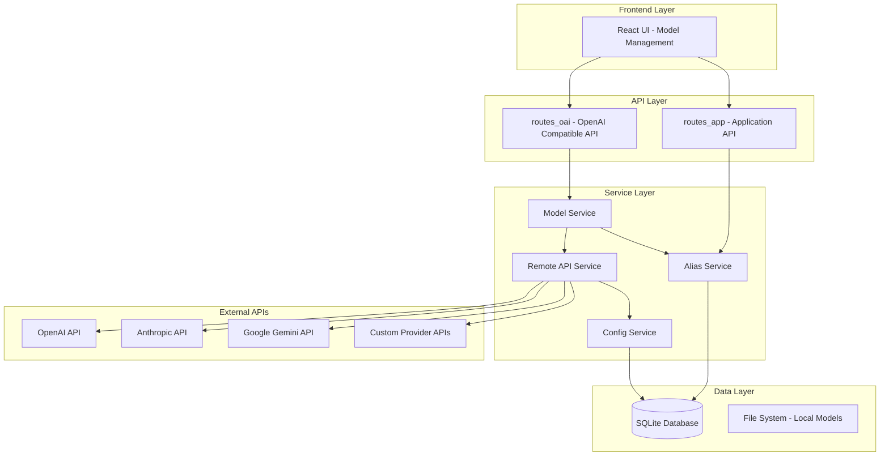
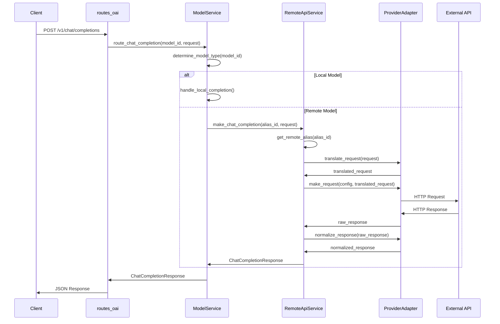
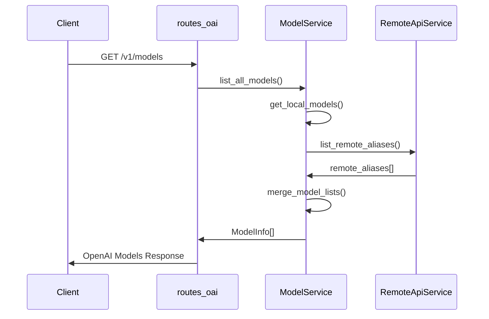

# Design Document

## Overview

This design document outlines the technical implementation for remote AI API model aliases in the Bodhi system. The feature extends the existing model alias system to support external AI providers (OpenAI, Anthropic Claude, Google Gemini, etc.) alongside local llama-server models, providing a unified interface for all AI services.

The implementation leverages the existing service-oriented architecture, adding new components for remote API integration while maintaining compatibility with the current OpenAI-compatible API endpoints and model management system.

## Architecture

### High-Level Architecture



### Component Integration

The remote API system integrates with existing components:

1. **Model Service**: Extended to handle both local and remote model aliases
2. **Alias Service**: Enhanced to support remote API alias types
3. **Routes Layer**: Modified to route requests to appropriate handlers (local vs remote)
4. **Frontend**: Updated model management UI to support remote API configuration

## Components and Interfaces

### 1. Remote API Service (`remote_api_service.rs`)

Core service responsible for managing remote API integrations.

```rust
#[async_trait]
pub trait RemoteApiService: Debug + Send + Sync {
    async fn create_remote_alias(&self, request: CreateRemoteAliasRequest) -> Result<RemoteAlias, RemoteApiError>;
    async fn update_remote_alias(&self, id: &str, request: UpdateRemoteAliasRequest) -> Result<RemoteAlias, RemoteApiError>;
    async fn delete_remote_alias(&self, id: &str) -> Result<(), RemoteApiError>;
    async fn list_remote_aliases(&self) -> Result<Vec<RemoteAlias>, RemoteApiError>;
    async fn get_remote_alias(&self, id: &str) -> Result<RemoteAlias, RemoteApiError>;
    async fn test_connection(&self, id: &str) -> Result<ConnectionStatus, RemoteApiError>;
    async fn make_chat_completion(&self, alias_id: &str, request: ChatCompletionRequest) -> Result<ChatCompletionResponse, RemoteApiError>;
    async fn stream_chat_completion(&self, alias_id: &str, request: ChatCompletionRequest) -> Result<impl Stream<Item = ChatCompletionChunk>, RemoteApiError>;
}
```

### 2. Provider Adapters

Individual adapters for each AI provider, implementing a common interface:

```rust
#[async_trait]
pub trait ProviderAdapter: Debug + Send + Sync {
    fn provider_type(&self) -> ProviderType;
    async fn validate_config(&self, config: &ProviderConfig) -> Result<(), ProviderError>;
    async fn test_connection(&self, config: &ProviderConfig) -> Result<ConnectionStatus, ProviderError>;
    async fn translate_request(&self, request: ChatCompletionRequest) -> Result<serde_json::Value, ProviderError>;
    async fn make_request(&self, config: &ProviderConfig, translated_request: serde_json::Value) -> Result<serde_json::Value, ProviderError>;
    async fn normalize_response(&self, response: serde_json::Value) -> Result<ChatCompletionResponse, ProviderError>;
    async fn stream_request(&self, config: &ProviderConfig, translated_request: serde_json::Value) -> Result<impl Stream<Item = Result<ChatCompletionChunk, ProviderError>>, ProviderError>;
}
```

#### Provider Implementations

- **OpenAI Adapter** (`providers/openai_adapter.rs`): Direct pass-through with authentication
- **Anthropic Adapter** (`providers/anthropic_adapter.rs`): Claude API integration with message format translation
- **Google Adapter** (`providers/google_adapter.rs`): Gemini API integration with safety settings
- **Custom Adapter** (`providers/custom_adapter.rs`): Configurable adapter for custom endpoints

### 3. HTTP Client Service (`http_client_service.rs`)

Centralized HTTP client management for external API calls:

```rust
#[async_trait]
pub trait HttpClientService: Debug + Send + Sync {
    async fn make_request(&self, request: HttpRequest) -> Result<HttpResponse, HttpClientError>;
    async fn stream_request(&self, request: HttpRequest) -> Result<impl Stream<Item = Result<Bytes, HttpClientError>>, HttpClientError>;
    fn create_client_for_provider(&self, provider: ProviderType) -> Result<reqwest::Client, HttpClientError>;
}
```

### 4. Credential Management Service (`credential_service.rs`)

Secure storage and retrieval of API credentials:

```rust
#[async_trait]
pub trait CredentialService: Debug + Send + Sync {
    async fn store_credentials(&self, alias_id: &str, credentials: ProviderCredentials) -> Result<(), CredentialError>;
    async fn retrieve_credentials(&self, alias_id: &str) -> Result<ProviderCredentials, CredentialError>;
    async fn update_credentials(&self, alias_id: &str, credentials: ProviderCredentials) -> Result<(), CredentialError>;
    async fn delete_credentials(&self, alias_id: &str) -> Result<(), CredentialError>;
    async fn rotate_encryption_key(&self) -> Result<(), CredentialError>;
}
```

### 5. Enhanced Model Service

Extended to handle both local and remote models:

```rust
// Extended ModelService trait
#[async_trait]
pub trait ModelService: Debug + Send + Sync {
    // Existing methods...
    async fn list_all_models(&self) -> Result<Vec<ModelInfo>, ModelError>;
    async fn get_model_info(&self, model_id: &str) -> Result<ModelInfo, ModelError>;
    async fn route_chat_completion(&self, model_id: &str, request: ChatCompletionRequest) -> Result<ChatCompletionResponse, ModelError>;
    async fn stream_chat_completion(&self, model_id: &str, request: ChatCompletionRequest) -> Result<impl Stream<Item = ChatCompletionChunk>, ModelError>;
}
```

## Data Models

### 1. Remote Alias Model

```rust
#[derive(Debug, Clone, Serialize, Deserialize, FromRow, Builder)]
pub struct RemoteAlias {
    pub id: String,                    // UUID
    pub name: String,                  // User-friendly alias name
    pub provider_type: ProviderType,   // openai, anthropic, google, custom
    pub provider_config: ProviderConfig, // Provider-specific configuration
    pub remote_model_id: String,       // Model ID on the remote service
    pub status: AliasStatus,           // active, inactive, error
    pub created_at: DateTime<Utc>,
    pub updated_at: DateTime<Utc>,
    pub last_used_at: Option<DateTime<Utc>>,
    pub error_message: Option<String>, // Last error if status is error
}
```

### 2. Provider Configuration

```rust
#[derive(Debug, Clone, Serialize, Deserialize)]
pub struct ProviderConfig {
    pub endpoint_url: String,
    pub auth_type: AuthType,           // api_key, bearer_token, custom_headers
    pub timeout_seconds: u64,
    pub max_retries: u32,
    pub provider_specific: serde_json::Value, // Provider-specific settings
}

#[derive(Debug, Clone, Serialize, Deserialize)]
pub enum AuthType {
    ApiKey { header_name: String },
    BearerToken,
    CustomHeaders { headers: HashMap<String, String> },
}
```

### 3. Provider Types

```rust
#[derive(Debug, Clone, Serialize, Deserialize, EnumString, Display, PartialEq)]
#[serde(rename_all = "kebab-case")]
#[strum(serialize_all = "kebab-case")]
pub enum ProviderType {
    OpenAI,
    Anthropic,
    Google,
    Custom,
}
```

### 4. Encrypted Credentials

```rust
#[derive(Debug, Clone, Serialize, Deserialize, FromRow)]
pub struct EncryptedCredentials {
    pub alias_id: String,
    pub encrypted_data: Vec<u8>,       // AES-256 encrypted credentials
    pub encryption_key_id: String,     // Key rotation support
    pub created_at: DateTime<Utc>,
    pub updated_at: DateTime<Utc>,
}

#[derive(Debug, Clone, Serialize, Deserialize)]
pub struct ProviderCredentials {
    pub api_key: Option<String>,
    pub bearer_token: Option<String>,
    pub custom_headers: Option<HashMap<String, String>>,
    pub additional_params: Option<serde_json::Value>,
}
```

### 5. Model Information

Extended to support both local and remote models:

```rust
#[derive(Debug, Clone, Serialize, Deserialize)]
pub struct ModelInfo {
    pub id: String,
    pub name: String,
    pub model_type: ModelType,         // local, remote
    pub provider: Option<ProviderType>, // None for local models
    pub capabilities: ModelCapabilities,
    pub status: ModelStatus,
    pub metadata: ModelMetadata,
}

#[derive(Debug, Clone, Serialize, Deserialize)]
pub enum ModelType {
    Local,
    Remote,
}

#[derive(Debug, Clone, Serialize, Deserialize)]
pub struct ModelCapabilities {
    pub supports_streaming: bool,
    pub supports_function_calling: bool,
    pub max_tokens: Option<u32>,
    pub context_window: Option<u32>,
}
```

## Database Schema

### Remote Aliases Table

```sql
CREATE TABLE remote_aliases (
    id TEXT PRIMARY KEY,
    name TEXT NOT NULL UNIQUE,
    provider_type TEXT NOT NULL,
    provider_config TEXT NOT NULL, -- JSON
    remote_model_id TEXT NOT NULL,
    status TEXT NOT NULL DEFAULT 'active',
    created_at DATETIME NOT NULL DEFAULT CURRENT_TIMESTAMP,
    updated_at DATETIME NOT NULL DEFAULT CURRENT_TIMESTAMP,
    last_used_at DATETIME,
    error_message TEXT
);

CREATE INDEX idx_remote_aliases_provider_type ON remote_aliases(provider_type);
CREATE INDEX idx_remote_aliases_status ON remote_aliases(status);
CREATE INDEX idx_remote_aliases_name ON remote_aliases(name);
```

### Encrypted Credentials Table

```sql
CREATE TABLE encrypted_credentials (
    alias_id TEXT PRIMARY KEY,
    encrypted_data BLOB NOT NULL,
    encryption_key_id TEXT NOT NULL,
    created_at DATETIME NOT NULL DEFAULT CURRENT_TIMESTAMP,
    updated_at DATETIME NOT NULL DEFAULT CURRENT_TIMESTAMP,
    FOREIGN KEY (alias_id) REFERENCES remote_aliases(id) ON DELETE CASCADE
);
```

### Migration Strategy

1. **Migration 001**: Create remote_aliases table
2. **Migration 002**: Create encrypted_credentials table
3. **Migration 003**: Add indexes for performance
4. **Migration 004**: Add any additional provider-specific columns

## Request Flow

### 1. Chat Completion Request Flow



### 2. Streaming Request Flow

Similar to above but with streaming responses using Server-Sent Events (SSE).

### 3. Model Listing Flow



## Error Handling

### Error Types Hierarchy

```rust
#[derive(Debug, thiserror::Error, errmeta_derive::ErrorMeta)]
#[error_meta(trait_to_impl = AppError)]
pub enum RemoteApiError {
    #[error(transparent)]
    ProviderError(#[from] ProviderError),
    #[error(transparent)]
    CredentialError(#[from] CredentialError),
    #[error(transparent)]
    HttpClientError(#[from] HttpClientError),
    #[error(transparent)]
    DatabaseError(#[from] DbError),
    #[error_meta(code = "REMOTE_ALIAS_NOT_FOUND", status = 404)]
    AliasNotFound { alias_id: String },
    #[error_meta(code = "REMOTE_ALIAS_INACTIVE", status = 422)]
    AliasInactive { alias_id: String },
}

#[derive(Debug, thiserror::Error, errmeta_derive::ErrorMeta)]
#[error_meta(trait_to_impl = AppError)]
pub enum ProviderError {
    #[error_meta(code = "PROVIDER_AUTH_FAILED", status = 401)]
    AuthenticationFailed { provider: ProviderType },
    #[error_meta(code = "PROVIDER_RATE_LIMITED", status = 429)]
    RateLimited { provider: ProviderType, retry_after: Option<u64> },
    #[error_meta(code = "PROVIDER_QUOTA_EXCEEDED", status = 402)]
    QuotaExceeded { provider: ProviderType },
    #[error_meta(code = "PROVIDER_MODEL_NOT_FOUND", status = 404)]
    ModelNotFound { provider: ProviderType, model_id: String },
    #[error_meta(code = "PROVIDER_REQUEST_INVALID", status = 400)]
    InvalidRequest { provider: ProviderType, details: String },
    #[error_meta(code = "PROVIDER_TIMEOUT", status = 504)]
    Timeout { provider: ProviderType },
    #[error_meta(code = "PROVIDER_UNAVAILABLE", status = 503)]
    ServiceUnavailable { provider: ProviderType },
}
```

### Error Response Mapping

Remote API errors are mapped to OpenAI-compatible error responses:

```rust
impl From<RemoteApiError> for ApiError {
    fn from(err: RemoteApiError) -> Self {
        match err {
            RemoteApiError::ProviderError(ProviderError::AuthenticationFailed { provider }) => {
                ApiError::Unauthorized {
                    message: format!("Authentication failed for provider: {}", provider),
                }
            }
            RemoteApiError::ProviderError(ProviderError::RateLimited { provider, retry_after }) => {
                ApiError::RateLimited {
                    message: format!("Rate limited by provider: {}", provider),
                    retry_after,
                }
            }
            // ... other mappings
        }
    }
}
```

## Testing Strategy

### Unit Tests

1. **Provider Adapters**: Test request translation and response normalization
2. **Remote API Service**: Test alias management and request routing
3. **Credential Service**: Test encryption/decryption and key rotation
4. **HTTP Client Service**: Test request handling and error scenarios

### Integration Tests

1. **End-to-End API Tests**: Test complete request flow from frontend to external APIs
2. **Database Integration**: Test alias persistence and credential storage
3. **Error Handling**: Test error propagation and response formatting
4. **Streaming Tests**: Test SSE streaming for remote APIs

### Mock Testing

```rust
// Mock external API responses for testing
#[cfg(test)]
mod tests {
    use super::*;
    use mockall::predicate::*;
    use wiremock::{Mock, MockServer, ResponseTemplate};

    #[tokio::test]
    async fn test_openai_chat_completion() {
        let mock_server = MockServer::start().await;
        
        Mock::given(method("POST"))
            .and(path("/v1/chat/completions"))
            .respond_with(ResponseTemplate::new(200)
                .set_body_json(json!({
                    "choices": [{"message": {"content": "Hello!"}}]
                })))
            .mount(&mock_server)
            .await;

        let adapter = OpenAIAdapter::new();
        let config = ProviderConfig {
            endpoint_url: mock_server.uri(),
            // ... other config
        };
        
        let response = adapter.make_request(&config, request).await;
        assert!(response.is_ok());
    }
}
```

## Security Considerations

### 1. Credential Encryption

- **AES-256-GCM**: Encrypt API keys and tokens before database storage
- **Key Rotation**: Support for periodic encryption key rotation
- **Memory Safety**: Clear sensitive data from memory after use

```rust
pub struct CredentialEncryption {
    current_key: Arc<[u8; 32]>,
    key_id: String,
}

impl CredentialEncryption {
    pub fn encrypt(&self, data: &[u8]) -> Result<Vec<u8>, EncryptionError> {
        // AES-256-GCM encryption implementation
    }
    
    pub fn decrypt(&self, encrypted_data: &[u8]) -> Result<Vec<u8>, EncryptionError> {
        // AES-256-GCM decryption implementation
    }
}
```

### 2. Request Validation

- **Input Sanitization**: Validate all user inputs before processing
- **Rate Limiting**: Implement per-user and per-alias rate limiting
- **Request Size Limits**: Enforce maximum request payload sizes

### 3. Network Security

- **TLS Enforcement**: Require HTTPS for all external API calls
- **Certificate Validation**: Validate SSL certificates for external services
- **Timeout Configuration**: Prevent hanging requests with configurable timeouts

### 4. Audit Logging

```rust
#[derive(Debug, Serialize)]
pub struct RemoteApiAuditLog {
    pub timestamp: DateTime<Utc>,
    pub user_id: Option<String>,
    pub alias_id: String,
    pub provider: ProviderType,
    pub action: AuditAction,
    pub request_id: String,
    pub status: RequestStatus,
    pub error_code: Option<String>,
}

#[derive(Debug, Serialize)]
pub enum AuditAction {
    CreateAlias,
    UpdateAlias,
    DeleteAlias,
    ChatCompletion,
    TestConnection,
}
```

## Performance Optimizations

### 1. Connection Pooling

```rust
pub struct HttpClientPool {
    clients: HashMap<ProviderType, reqwest::Client>,
    pool_config: PoolConfig,
}

impl HttpClientPool {
    pub fn get_client(&self, provider: ProviderType) -> &reqwest::Client {
        self.clients.get(&provider).unwrap_or(&self.default_client)
    }
}
```

### 2. Response Caching

- **Model Information**: Cache model capabilities and metadata
- **Provider Status**: Cache connection status with TTL
- **Configuration**: Cache provider configurations to reduce database queries

### 3. Async Processing

- **Concurrent Requests**: Support multiple simultaneous remote API calls
- **Background Tasks**: Health checks and status monitoring in background
- **Stream Processing**: Efficient streaming response handling

## Monitoring and Observability

### 1. Metrics Collection

```rust
pub struct RemoteApiMetrics {
    pub request_count: Counter,
    pub request_duration: Histogram,
    pub error_count: Counter,
    pub active_connections: Gauge,
}
```

### 2. Health Checks

```rust
#[async_trait]
pub trait HealthCheck {
    async fn check_health(&self) -> HealthStatus;
}

pub struct RemoteAliasHealthCheck {
    remote_api_service: Arc<dyn RemoteApiService>,
}

impl HealthCheck for RemoteAliasHealthCheck {
    async fn check_health(&self) -> HealthStatus {
        // Test connection to all active remote aliases
        // Return aggregated health status
    }
}
```

### 3. Logging Strategy

- **Structured Logging**: Use structured logs for better observability
- **Request Tracing**: Trace requests across service boundaries
- **Error Tracking**: Detailed error logging with context
- **Performance Logging**: Log request durations and performance metrics

## Frontend Integration

### 1. Model Management UI

Extended React components for remote API management:

```typescript
// Components for remote alias management
interface RemoteAliasFormProps {
  onSubmit: (alias: CreateRemoteAliasRequest) => void;
  providers: ProviderType[];
}

interface RemoteAliasListProps {
  aliases: RemoteAlias[];
  onEdit: (id: string) => void;
  onDelete: (id: string) => void;
  onTest: (id: string) => void;
}
```

### 2. Provider-Specific Forms

Dynamic forms based on selected provider:

```typescript
const ProviderConfigForm: React.FC<{
  provider: ProviderType;
  config: ProviderConfig;
  onChange: (config: ProviderConfig) => void;
}> = ({ provider, config, onChange }) => {
  switch (provider) {
    case 'openai':
      return <OpenAIConfigForm config={config} onChange={onChange} />;
    case 'anthropic':
      return <AnthropicConfigForm config={config} onChange={onChange} />;
    // ... other providers
  }
};
```

### 3. Status Monitoring

Real-time status display for remote aliases:

```typescript
interface AliasStatusProps {
  alias: RemoteAlias;
  onRefresh: () => void;
}

const AliasStatus: React.FC<AliasStatusProps> = ({ alias, onRefresh }) => {
  const { data: status } = useQuery({
    queryKey: ['alias-status', alias.id],
    queryFn: () => api.testConnection(alias.id),
    refetchInterval: 30000, // Refresh every 30 seconds
  });

  return (
    <div className="flex items-center space-x-2">
      <StatusIndicator status={status} />
      <span>{status?.message}</span>
      <Button onClick={onRefresh} size="sm">Refresh</Button>
    </div>
  );
};
```

## Migration and Deployment

### 1. Database Migrations

Sequential migrations to add remote API support:

```sql
-- Migration 001: Create remote_aliases table
-- Migration 002: Create encrypted_credentials table  
-- Migration 003: Add indexes
-- Migration 004: Add audit logging tables
```

### 2. Feature Flags

Gradual rollout using feature flags:

```rust
pub struct FeatureFlags {
    pub remote_api_enabled: bool,
    pub provider_openai_enabled: bool,
    pub provider_anthropic_enabled: bool,
    pub provider_google_enabled: bool,
}
```

### 3. Backward Compatibility

- **API Compatibility**: Maintain existing OpenAI API compatibility
- **Model Listing**: Include remote models in existing model endpoints
- **Configuration**: Support existing local model configurations

## Future Extensions

### 1. Additional Providers

- **Cohere**: Text generation and embeddings
- **AI21**: Jurassic models
- **Hugging Face Inference API**: Access to hosted models
- **Azure OpenAI**: Microsoft's OpenAI service

### 2. Advanced Features

- **Function Calling**: Support for provider-specific function calling
- **Embeddings**: Remote embedding model support
- **Fine-tuning**: Integration with provider fine-tuning APIs
- **Multi-modal**: Support for vision and audio models

### 3. Enterprise Features

- **Cost Tracking**: Monitor and track API usage costs
- **Usage Analytics**: Detailed usage reporting and analytics
- **Team Management**: Multi-tenant support with team-based access
- **Compliance**: SOC2, GDPR compliance features

This design provides a comprehensive foundation for implementing remote AI API model aliases while maintaining the existing system's architecture and patterns.