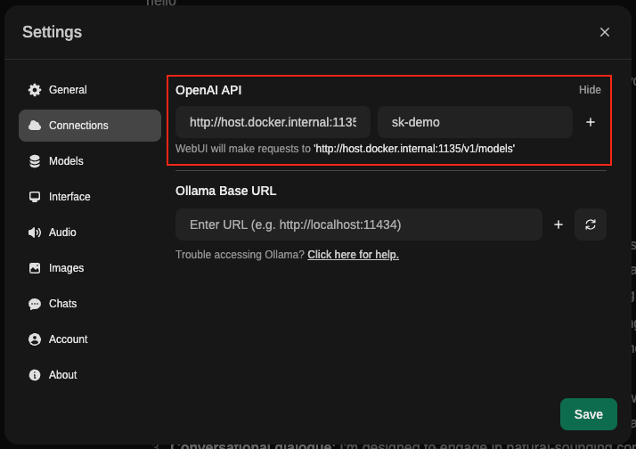

# Bodhi App

[](https://github.com/BodhiSearch/BodhiApp/actions) [](https://github.com/BodhiSearch/BodhiApp/actions) [](https://github.com/BodhiSearch/BodhiApp/actions) [](https://codecov.io/gh/BodhiSearch/BodhiApp)

<p align="center">
  
</p>

## Table of Contents

- [Overview](#overview)
- [Features](#features)
- [Installation](#installation)
- [Usage](#usage)
- [Documentation](#documentation)
- [API Client](#api-client)
- [Community](#community)
- [Powered By](#powered-by)

## Overview

Bodhi App allows you to run Open Source LLMs locally. It utilizes the Huggingface ecosystem for accessing open-source LLM weights and information and is powered by [llama.cpp](https://github.com/ggerganov/llama.cpp).

While many apps that help you run LLMs locally are targeted at technical users, Bodhi App is designed with both technical and non-technical users in mind.

For technical users, it provides OpenAI-compatible chat completions and models API endpoints. It includes comprehensive API documentation following OpenAPI standards and features a built-in SwaggerUI that allows developers to explore and test all API endpoints live.

For non-technical users, it comes with a built-in Chat UI that is quick to start and easy to understand. Users can quickly get started with open-source models and adjust various settings to suit their needs. The app also enables users to discover, explore, and download new open-source models that fit their requirements and are compatible with their local hardware.

## Features

- **Built-in Chat UI:** Enjoy an intuitive, responsive chat interface with real-time streaming, markdown support, and customizable settings
- **Model Management:** Download and manage GGUF model files directly from HuggingFace
- **API Token Management:** Securely generate and manage API tokens for external integrations
- **Dynamic App Settings:** Easily adjust application parameters (like execution variant and idle timeout) on the fly
- **Responsive Design:** A fully adaptive layout that works seamlessly across desktop and mobile devices
- **Robust Error Handling:** Comprehensive error logging and troubleshooting guides to help quickly identify and resolve issues

## Installation

Bodhi App is currently released only for the Mac platform. You can install it either by downloading the release from the GitHub release page or using Homebrew.

### Homebrew

Bodhi App hosts its external cask at `BodhiSearch/homebrew-apps`. Install Bodhi App using this command:

```shell
brew install --cask BodhiSearch/apps/bodhi
```

Once installed, launch `Bodhi App.app` from the `/Applications` folder. You should see the Bodhi App icon in your system tray. Launch the homepage from the system tray menu by selecting `Open Homepage`.

### GitHub Releases

Download the latest release for your platform from the [Releases](https://github.com/BodhiSearch/BodhiApp/releases) page.

Unzip and move `Bodhi.app` to your `/Applications` folder, then launch it. You should see the Bodhi App icon in your system tray. Launch the homepage from the system tray menu by selecting `Open Homepage`.

### Docker

Bodhi App is available as Docker images with multiple hardware acceleration variants. Each variant is optimized for specific hardware configurations to provide the best performance.

#### Available Variants

- **CPU Variant**: Standard CPU-only inference for maximum compatibility (multi-platform: AMD64 + ARM64)
- **CUDA Variant**: NVIDIA GPU acceleration for faster inference on NVIDIA hardware
- **ROCm Variant**: AMD GPU acceleration for AMD graphics cards
- **Vulkan Variant**: Cross-vendor GPU acceleration supporting multiple GPU vendors

#### Quick Start

**CPU Variant (Most Compatible - Auto-detects AMD64/ARM64):**
```bash
docker run -p 8080:8080 \
  -v ./bodhi_home:/data/bodhi_home \
  -v ./hf_home:/data/hf_home \
  ghcr.io/bodhisearch/bodhiapp:latest-cpu
```

**CUDA Variant (NVIDIA GPU):**
```bash
docker run --gpus all -p 8080:8080 \
  -v ./bodhi_home:/data/bodhi_home \
  -v ./hf_home:/data/hf_home \
  ghcr.io/bodhisearch/bodhiapp:latest-cuda
```

**ROCm Variant (AMD GPU):**
```bash
docker run --device=/dev/kfd --device=/dev/dri --group-add video -p 8080:8080 \
  -v ./bodhi_home:/data/bodhi_home \
  -v ./hf_home:/data/hf_home \
  ghcr.io/bodhisearch/bodhiapp:latest-rocm
```

**Vulkan Variant (Cross-vendor GPU):**
```bash
docker run --device=/dev/dri -p 8080:8080 \
  -v ./bodhi_home:/data/bodhi_home \
  -v ./hf_home:/data/hf_home \
  ghcr.io/bodhisearch/bodhiapp:latest-vulkan
```

#### Hardware Requirements

- **CPU**: Standard x86_64 (AMD64) or ARM64 processor (auto-detected)
- **CUDA**: NVIDIA GPU with CUDA 12.4+ support and compatible drivers
- **ROCm**: AMD GPU with ROCm 6.4+ support and compatible drivers
- **Vulkan**: GPU with Vulkan API support and compatible drivers

#### Volume Mounts

- `/data/bodhi_home`: Application data, configuration, and downloaded models
- `/data/hf_home`: HuggingFace cache directory for model downloads

After starting the container, Bodhi App will be available at `http://localhost:8080`.

### Setup

On first launch, Bodhi App starts with a setup flow. Follow this process to configure and install Bodhi App for your local machine and get started.

## Documentation

Bodhi App comes with built-in documentation:

- User Guide: Access at [http://localhost:1135/docs/](http://localhost:1135/docs/)
- Technical Documentation: Available as OpenAPI Swagger UI at [http://localhost:1135/swagger-ui/](http://localhost:1135/swagger-ui/)

## API Client

Bodhi App provides a TypeScript client for easy integration with the API:

### Installation

```bash
npm install @bodhiapp/ts-client
```

### Usage

```typescript
import { BodhiClient } from "@bodhiapp/ts-client";

// Initialize the client
const client = new BodhiClient({
  baseUrl: "http://localhost:1135",
  apiKey: "your-api-key",
});

// Create a chat completion
async function chatWithBodhi() {
  const response = await client.createChatCompletion({
    model: "gpt-3.5-turbo",
    messages: [
      { role: "system", content: "You are a helpful assistant." },
      { role: "user", content: "Hello, who are you?" },
    ],
  });

  console.log(response.choices[0].message.content);
}
```

For more information, see the [ts-client documentation](./ts-client/README.md).

# Community

## Web & Desktop

### [Open WebUI](https://github.com/open-webui/open-webui)

{width=600px}

(Open up a pull request on README.md to include community integrations)

# Powered By

[llama.cpp](https://github.com/ggerganov/ggml/)

[huggingface.co](https://huggingface.co/)
