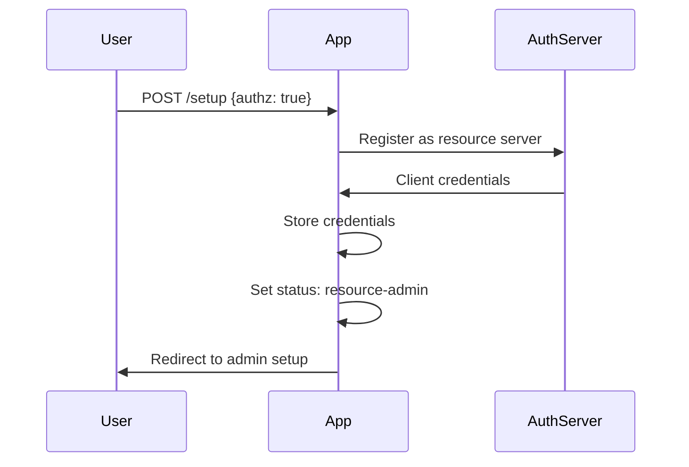
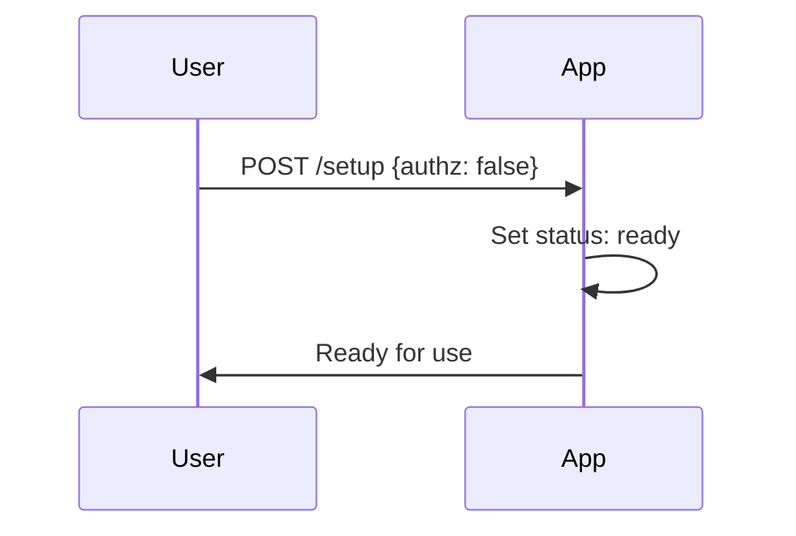

# Bodhi App: Technical Architecture Overview

## System Architecture

Bodhi App is a comprehensive Rust-based application that provides local Large Language Model (LLM) inference with OpenAI-compatible APIs and a modern web interface. The architecture combines a multi-crate backend with a React frontend, deployable as both a standalone server and a Tauri desktop application.

### Architectural Layers

```
┌─────────────────────────────────────────────────────────────┐
│                    Frontend Layer                           │
│  React + TypeScript + Vite + TailwindCSS + Shadcn UI      │
└─────────────────────────────────────────────────────────────┘
                              │
┌─────────────────────────────────────────────────────────────┐
│                    Routes Layer                             │
│  routes_all → routes_oai + routes_app                      │
│  (HTTP endpoints, OpenAPI docs, middleware)                │
└─────────────────────────────────────────────────────────────┘
                              │
┌─────────────────────────────────────────────────────────────┐
│                   Services Layer                            │
│  Business logic, external integrations, data management    │
└─────────────────────────────────────────────────────────────┘
                              │
┌─────────────────────────────────────────────────────────────┐
│                   Domain Layer                              │
│  objs (types, errors, validation, localization)           │
└─────────────────────────────────────────────────────────────┘
                              │
┌─────────────────────────────────────────────────────────────┐
│                Infrastructure Layer                         │
│  llama_server_proc, database, file system, auth           │
└─────────────────────────────────────────────────────────────┘
```

### Crate Organization

#### Foundation Crates
1. **objs** - Domain objects, types, errors, validation
2. **services** - Business logic, external integrations
3. **server_core** - HTTP server infrastructure
4. **auth_middleware** - Authentication and authorization

#### API Crates
5. **routes_oai** - OpenAI-compatible API endpoints
6. **routes_app** - Application-specific API endpoints
7. **routes_all** - Unified route composition

#### Application Crates
8. **server_app** - Standalone HTTP server
9. **bodhi/src-tauri** - Tauri desktop application
10. **commands** - CLI interface

#### Utility Crates
11. **llama_server_proc** - LLM process management
12. **errmeta_derive** - Error metadata macros
13. **integration-tests** - End-to-end testing
14. **xtask** - Build automation

## Key Features

### Local LLM Inference
- **llama.cpp Integration**: Native llama.cpp compilation and process management
- **Model Management**: Download, load, and manage GGUF models from HuggingFace
- **Hardware Acceleration**: CUDA, OpenCL, Metal support
- **Multi-Model Support**: Run multiple models simultaneously

### OpenAI Compatibility
- **API Compatibility**: Full OpenAI API compatibility for chat completions
- **Streaming Support**: Real-time response streaming via Server-Sent Events
- **Model Endpoints**: Model listing and information endpoints
- **Client Library Support**: Works with existing OpenAI client libraries

### Authentication & Security
- **OAuth2 Integration**: External authentication provider support
- **JWT Tokens**: Secure token-based authentication
- **Role-Based Access**: Admin, PowerUser, BasicUser roles
- **API Keys**: API token management for programmatic access

## Application States

### Setup Mode (`setup`)
- Initial state requiring authentication mode selection
- No API access except setup endpoints
- Transitions to either `resource-admin` or `ready`

### Resource Admin Mode (`resource-admin`)
- Intermediate state for authenticated mode
- Waiting for first admin user registration
- Limited API access for admin setup

### Ready Mode (`ready`)
- Fully operational state
- All APIs accessible
- Authentication enforced if enabled

## Data Flow

### Chat Completion Flow
1. **Frontend Request** → React UI sends chat request
2. **Route Handling** → routes_oai processes OpenAI-compatible request
3. **Service Layer** → services orchestrate business logic
4. **LLM Inference** → llama_server_proc manages llama.cpp process
5. **Response Streaming** → Real-time response via SSE
6. **Frontend Update** → React UI updates with streamed response

### Model Management Flow
1. **Model Discovery** → HuggingFace Hub integration for model search
2. **Download Management** → Background download with progress tracking
3. **Model Loading** → Dynamic model loading into llama.cpp
4. **Alias Management** → User-friendly model naming and organization

### Authentication Flow

#### Authenticated Mode Setup


#### Non-Authenticated Mode Setup


## API Compatibility

### OpenAI Compatibility
- `/v1/models` - List available models
- `/v1/chat/completions` - Chat completion API
- Compatible with OpenAI client libraries

### Ollama Compatibility
- `/api/tags` - List model tags
- `/api/show` - Model information
- `/api/chat` - Chat completion
- Drop-in replacement for Ollama clients

## Key Design Patterns

### Dependency Injection
- Services injected into route handlers via Axum extensions
- Mock implementations for testing
- Clear separation of concerns

### Error Handling
- Centralized error types with metadata (`errmeta_derive`)
- Localization support for error messages
- Structured error responses for APIs

### Configuration Management
- Environment-based configuration
- Runtime configuration updates
- Validation and defaults

### Real-Time Communication
- Server-Sent Events for streaming
- WebSocket support for bidirectional communication
- Event-driven architecture

## Token System

### Session Tokens
- Used for web UI authentication
- Short-lived with refresh capability
- Stored in session cookie

### API Tokens
- Long-lived offline tokens
- Used for programmatic access
- Can be named and managed
- Status tracking (active/inactive)

## Model Aliases

Model aliases provide user-friendly names for complex model configurations:

```json
{
  "alias": "llama2:chat",
  "repo": "TheBloke/Llama-2-7B-Chat-GGUF",
  "filename": "llama-2-7b-chat.Q4_K_M.gguf",
  "source": "huggingface",
  "chat_template": "llama2",
  "model_params": {},
  "request_params": {
    "temperature": 0.7,
    "top_p": 0.95
  },
  "context_params": {
    "max_tokens": 4096
  }
}
```

## Integration Points

### External Services
- **HuggingFace Hub** → Model discovery and download
- **OAuth2 Providers** → Authentication integration
- **System Services** → OS integration and notifications

### Client Integration
- **OpenAI Libraries** → Compatible with existing tools
- **Custom Clients** → REST API for custom integrations
- **CLI Tools** → Command-line interface for automation

## Performance Considerations

### LLM Optimization
- **Hardware Acceleration** → GPU support for inference
- **Memory Management** → Efficient model loading and caching
- **Batch Processing** → Optimized inference batching

### Web Performance
- **Streaming Responses** → Real-time response delivery
- **Caching** → Intelligent caching strategies
- **Compression** → Response compression and optimization

### Scalability
- **Async Architecture** → Non-blocking I/O throughout
- **Connection Pooling** → Efficient resource management
- **Load Balancing** → Support for multiple instances

## Security Model

### Authentication
- **Multi-Provider OAuth2** → Flexible authentication
- **JWT Security** → Secure token handling
- **Session Management** → Secure session lifecycle

### Authorization
- **Role-Based Access** → Granular permission control
- **API Scoping** → Limited API token permissions
- **Resource Protection** → Protected endpoints and resources

### Data Security
- **Local Storage** → All data stored locally by default
- **Encryption** → Sensitive data encryption
- **Privacy** → No external data transmission required

## Development Workflow

### Code Generation
- **OpenAPI Specs** → Automatic generation from Rust code
- **TypeScript Types** → Generated from OpenAPI for frontend
- **API Documentation** → Swagger UI with interactive docs

### Testing Strategy
- **Unit Tests** → Individual crate testing
- **Integration Tests** → End-to-end API testing
- **Frontend Tests** → React component and integration testing
- **Performance Tests** → Load testing and benchmarking

### Build System
- **Cargo Workspace** → Multi-crate Rust workspace
- **xtask Automation** → Custom build tasks and code generation
- **Cross-Platform** → Windows, macOS, Linux support
- **CI/CD Integration** → GitHub Actions automation

## Related Documentation

- **[Frontend Architecture](frontend-architecture.md)** - React frontend details
- **[Tauri Desktop Architecture](tauri-architecture.md)** - Desktop application architecture
- **[Backend Integration](backend-integration.md)** - API integration patterns
- **[Authentication](authentication.md)** - Security implementation details
- **[Testing Architecture](testing-architecture.md)** - Testing patterns and utilities
- **[Design System](design-system.md)** - UI design patterns and specifications
