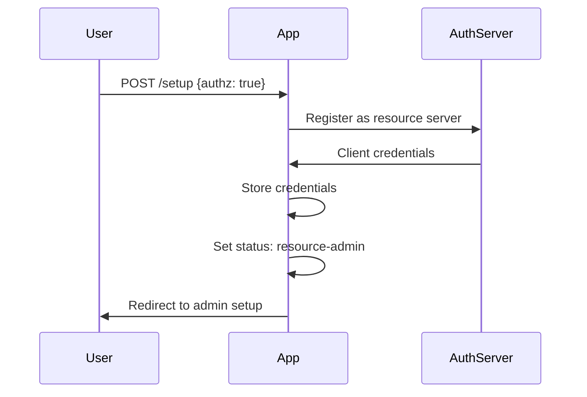
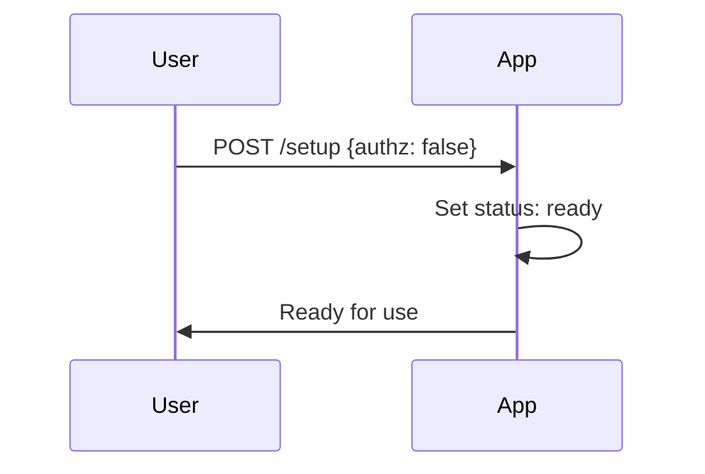

# System Overview

This document provides a high-level overview of the Bodhi App system architecture, crate organization, and key architectural decisions.

## Application Overview

Bodhi App is an AI-powered application for running Large Language Models (LLMs) locally. It utilizes the Huggingface ecosystem for accessing open-source LLM weights and information and is powered by llama.cpp.

While many apps that help you run LLMs locally are targeted at technical users, Bodhi App is designed with both technical and non-technical users in mind.

For technical users, it provides OpenAI-compatible chat completions and models API endpoints. It includes comprehensive API documentation following OpenAPI standards and features a built-in SwaggerUI that allows developers to explore and test all API endpoints live.

For non-technical users, it comes with a built-in Chat UI that is quick to start and easy to understand. Users can quickly get started with open-source models and adjust various settings to suit their needs. The app also enables users to discover, explore, and download new open-source models that fit their requirements and are compatible with their local hardware.

### Key Features

### Local LLM Inference
- **llama.cpp Integration**: Native llama.cpp compilation and process management
- **Model Management**: Download, load, and manage GGUF models from HuggingFace
- **Hardware Acceleration**: CUDA, OpenCL, Metal support
- **Multi-Model Support**: Run multiple models simultaneously

### OpenAI Compatibility
- **API Compatibility**: Full OpenAI API compatibility for chat completions
- **Streaming Support**: Real-time response streaming via Server-Sent Events
- **Model Endpoints**: Model listing and information endpoints
- **Client Library Support**: Works with existing OpenAI client libraries

### Ollama Compatibility
- **API Compatibility**: Drop-in replacement for Ollama clients
- **Endpoint Support**: `/api/tags`, `/api/show`, `/api/chat` endpoints
- **Model Information**: Compatible model listing and metadata
- **Client Integration**: Works with existing Ollama client tools

### Authentication & Security
- **OAuth2 Integration**: External authentication provider support
- **JWT Tokens**: Secure token-based authentication
- **Role-Based Access**: Admin, PowerUser, BasicUser roles
- **API Keys**: API token management for programmatic access

### User Experience Features
- **Built-in Chat UI**: Intuitive, responsive chat interface with real-time streaming, markdown support, and customizable settings
- **Model Management**: Download and manage GGUF model files directly from HuggingFace
- **API Token Management**: Securely generate and manage API tokens for external integrations
- **Dynamic App Settings**: Easily adjust application parameters (like execution variant and idle timeout) on the fly
- **Responsive Design**: Fully adaptive layout that works seamlessly across desktop and mobile devices
- **Robust Error Handling**: Comprehensive error logging and troubleshooting guides to help quickly identify and resolve issues

## Core Capabilities

BodhiApp provides:
- Local LLM server management via llama.cpp integration
- OpenAI-compatible API endpoints
- Web-based chat interface
- Model management and downloading
- Authentication and authorization
- Multi-user support

## System Architecture

Bodhi App is a comprehensive Rust-based application that provides local Large Language Model (LLM) inference with OpenAI-compatible APIs and a modern web interface. The architecture combines a multi-crate backend with a React frontend, deployable as both a standalone server and a Tauri desktop application.

### Architectural Layers

```
┌─────────────────────────────────────────────────────────────┐
│                    Frontend Layer                           │
│  React + TypeScript + Next.js v14 + TailwindCSS + Shadcn UI│
└─────────────────────────────────────────────────────────────┘
                              │
┌─────────────────────────────────────────────────────────────┐
│                    Routes Layer                             │
│  routes_all → routes_oai + routes_app                      │
│  (HTTP endpoints, OpenAPI docs, middleware)                │
└─────────────────────────────────────────────────────────────┘
                              │
┌─────────────────────────────────────────────────────────────┐
│                   Services Layer                            │
│  Business logic, external integrations, data management    │
└─────────────────────────────────────────────────────────────┘
                              │
┌─────────────────────────────────────────────────────────────┐
│                   Domain Layer                              │
│  objs (types, errors, validation, localization)           │
└─────────────────────────────────────────────────────────────┘
                              │
┌─────────────────────────────────────────────────────────────┐
│                Infrastructure Layer                         │
│  llama_server_proc, database, file system, auth           │
└─────────────────────────────────────────────────────────────┘
```

### Crate Organization

#### Foundation Crates
1. **objs** - Domain objects, types, errors, validation
2. **services** - Business logic, external integrations
3. **server_core** - HTTP server infrastructure
4. **auth_middleware** - Authentication and authorization

#### API Crates
5. **routes_oai** - OpenAI-compatible API endpoints
6. **routes_app** - Application-specific API endpoints
7. **routes_all** - Unified route composition

#### Application Crates
8. **server_app** - Standalone HTTP server
9. **bodhi/src-tauri** - Tauri desktop application
10. **commands** - CLI interface

#### Utility Crates
11. **llama_server_proc** - LLM process management
12. **errmeta_derive** - Error metadata macros
13. **integration-tests** - End-to-end testing
14. **xtask** - Build automation

## Application States

### Setup Mode (`setup`)
- Initial state requiring authentication mode selection
- No API access except setup endpoints
- Transitions to either `resource-admin` or `ready`

### Resource Admin Mode (`resource-admin`)
- Intermediate state for authenticated mode
- Waiting for first admin user registration
- Limited API access for admin setup

### Ready Mode (`ready`)
- Fully operational state
- All APIs accessible
- Authentication enforced if enabled

## Data Flow Patterns

### Chat Completion Flow
1. **Frontend Request** → React UI sends chat request
2. **Route Handling** → routes_oai processes OpenAI-compatible request
3. **Service Layer** → services orchestrate business logic
4. **LLM Inference** → llama_server_proc manages llama.cpp process
5. **Response Streaming** → Real-time response via SSE
6. **Frontend Update** → React UI updates with streamed response

### Model Management Flow
1. **Model Discovery** → HuggingFace Hub integration for model search
2. **Download Management** → Background download with progress tracking
3. **Model Loading** → Dynamic model loading into llama.cpp
4. **Alias Management** → User-friendly model naming and organization

### Authentication Flow

#### Authenticated Mode Setup


#### Non-Authenticated Mode Setup


## Key Design Patterns

### Dependency Injection
- Services injected into route handlers via Axum extensions
- Mock implementations for testing
- Clear separation of concerns

### Error Handling
- Centralized error types with metadata (`errmeta_derive`)
- Localization support for error messages
- Structured error responses for APIs

### Configuration Management
- Environment-based configuration
- Runtime configuration updates
- Validation and defaults

### Real-Time Communication
- Server-Sent Events for streaming
- WebSocket support for bidirectional communication
- Event-driven architecture

## Token System

### Session Tokens
- Used for web UI authentication
- Short-lived with refresh capability
- Stored in session cookie

### API Tokens
- Long-lived offline tokens
- Used for programmatic access
- Can be named and managed
- Status tracking (active/inactive)

## Model Aliases

Model aliases provide user-friendly names for complex model configurations:

```json
{
  "alias": "llama2:chat",
  "repo": "TheBloke/Llama-2-7B-Chat-GGUF",
  "filename": "llama-2-7b-chat.Q4_K_M.gguf",
  "source": "huggingface",
  "chat_template": "llama2",
  "model_params": {},
  "request_params": {
    "temperature": 0.7,
    "top_p": 0.95
  },
  "context_params": {
    "max_tokens": 4096
  }
}
```

## Integration Points

### External Services
- **HuggingFace Hub** → Model discovery and download
- **OAuth2 Providers** → Authentication integration
- **System Services** → OS integration and notifications

### Client Integration
- **OpenAI Libraries** → Compatible with existing tools
- **Custom Clients** → REST API for custom integrations
- **CLI Tools** → Command-line interface for automation

## Technology Stack

### Key Technologies
- **Backend**: Rust, Axum, SQLx, Tokio
- **Frontend**: React, TypeScript, Next.js v14, TailwindCSS, Shadcn UI
- **Desktop**: Tauri
- **LLM**: llama.cpp integration
- **API**: OpenAI-compatible endpoints
- **Auth**: OAuth2, JWT
- **Database**: SQLite (via SQLx)
- **Documentation**: OpenAPI/Swagger via utoipa

### Architecture Patterns
1. **Layered Architecture**: Clear separation between routes, services, and domain objects
2. **Dependency Injection**: Services are injected into route handlers
3. **Error Handling**: Centralized error types with metadata
4. **API-First**: OpenAPI documentation generated from code
5. **Modular Design**: Each crate has a specific responsibility
6. **Test-Driven**: Comprehensive testing at multiple levels

## Related Documentation

- **[Frontend React](frontend-react.md)** - React frontend development patterns
- **[Rust Backend](rust-backend.md)** - Backend service architecture
- **[Tauri Desktop](tauri-desktop.md)** - Desktop application architecture
- **[Authentication](authentication.md)** - Security implementation details
- **[API Integration](api-integration.md)** - Frontend-backend integration patterns
- **[App Status & Lifecycle](app-status.md)** - Application state management

---

*For detailed implementation guidance, see the technology-specific architecture documents and the [Crates](../03-crates/) documentation.*
