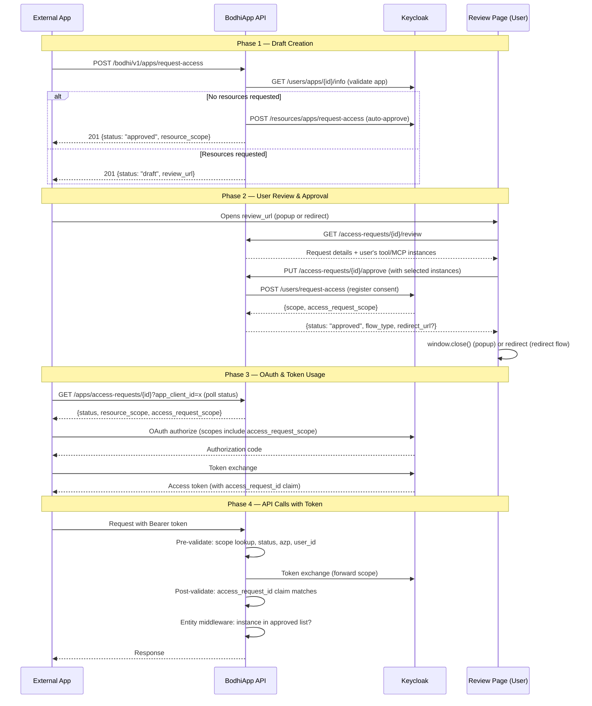

# App Access Request Feature — Context

> **Scope**: This document covers the **App Access Request** flow — how external OAuth apps request user-consented access to specific Toolset and MCP instances. It does **not** cover the separate User Access Request flow (role assignment via admin approval).

## File Loading Guide

No files are mandatory — this document is ~80% self-contained.

**Tier 1 — Recommended for implementation work:**
- `phase-0-keycloak-reqs.md` — Keycloak SPI contract (endpoints, auth, request/response shapes)
- `auth-refactor-ctx.md` — Q&A for AuthContext migration context

**Tier 2 — Specific deep dives:**
- `phase-3-plan.md` — API endpoint implementation details (9 execution phases, all design decisions)
- `phase-4-plan.md` — Auth middleware + pre/post token exchange validation
- `phase-6-plan.md` — Frontend review page implementation
- `phase-9-e2e-tests.md` — 8 defined E2E test journeys

**Tier 3 — Historical only:**
- `kickoff-prompt.md`, `checklist.md`, `NEXT-SESSION-KICKOFF.md`, session-specific files

---

## Implementation Status

| Component | Status |
|---|---|
| Domain Objects (`objs`) | Done |
| Service Layer | Done |
| DB Repository | Done |
| API Endpoints (5 handlers) | Done |
| Auth Middleware (entity validation) | Done |
| Token Service (pre/post exchange) | Done |
| Frontend Review Page | Done |
| Unit Tests (routes, service) | Partial |
| E2E Tests (real Keycloak) | Not started |

---

## Feature Overview

**Problem**: External apps (e.g., a third-party chat client) need user-consented access to specific Toolset instances and MCP server instances managed by BodhiApp. The old approach registered OAuth scopes directly via server-to-server calls — users had no visibility or control.

**Solution**: A draft → review → approve/deny lifecycle where:
1. The external app creates a draft access request describing what resources it needs
2. The user reviews the request in BodhiApp's UI and selects specific instances to grant
3. Approval registers consent in Keycloak, enabling the app to obtain scoped OAuth tokens
4. At runtime, middleware validates that the app's token grants access to the specific entity being accessed

**Key actors**: External App, BodhiApp Backend, User (via browser), Keycloak

---

## End-to-End Flow



**Non-obvious behaviors:**
- **Auto-approval**: When the app requests no specific resources (empty `requested`), the flow skips user review entirely — Keycloak registers a resource scope via a service account call
- **Draft expiry**: Drafts expire after 10 minutes; expired drafts return 410 Gone
- **Status polling**: The app polls `GET /apps/access-requests/{id}` with its `app_client_id` as a query param — the UUID + client_id combination prevents unauthorized status checks
- **Redirect URL**: For redirect flow, the server appends `?id={uuid}` to the provided `redirect_url` at draft creation time
- **Post-login redirect**: If the user isn't logged in when opening the review URL, `sessionStorage('bodhi-return-url')` preserves the review URL across the login redirect

---

## A. Draft Creation (App-Facing)

**Endpoint**: `POST /bodhi/v1/apps/request-access` (unauthenticated)

**Request**:
```json
{
  "app_client_id": "my-app-client",
  "flow_type": "popup",
  "redirect_url": "https://myapp.com/callback",
  "requested": {
    "toolset_types": [{"toolset_type": "builtin-exa-search"}],
    "mcp_servers": [{"url": "https://mcp.example.com/sse"}]
  }
}
```

- `flow_type`: `"popup"` or `"redirect"` — determines post-approval behavior
- `redirect_url`: Required for redirect flow, optional for popup
- `requested`: Optional — omit or leave empty for auto-approval path

**Response (draft)**: `201`
```json
{
  "status": "draft",
  "id": "<uuid>",
  "review_url": "{frontend_url}/ui/apps/access-requests/review?id={uuid}"
}
```

**Response (auto-approved)**: `201`
```json
{
  "status": "approved",
  "id": "<uuid>",
  "resource_scope": "scope_resource-xyz"
}
```

**Status polling**: `GET /bodhi/v1/apps/access-requests/{id}?app_client_id=xxx` (unauthenticated)

```json
{
  "id": "<uuid>",
  "status": "draft|approved|denied|failed",
  "resource_scope": "scope_resource-xyz",
  "access_request_scope": "scope_access_request:<uuid>"
}
```

---

## B. Review & Approval (User-Facing)

**Review**: `GET /bodhi/v1/access-requests/{id}/review` (session auth, User role)

Returns the request details enriched with the user's available instances for each requested resource type:
```json
{
  "id": "<uuid>",
  "app_client_id": "my-app-client",
  "app_name": "My App",
  "app_description": "...",
  "flow_type": "popup",
  "status": "draft",
  "requested": { "toolset_types": [...], "mcp_servers": [...] },
  "tools_info": [
    {
      "toolset_type": "builtin-exa-search",
      "name": "Exa Search",
      "description": "...",
      "instances": [{"id": "uuid-1", "name": "My Exa", ...}]
    }
  ],
  "mcps_info": [
    {
      "url": "https://mcp.example.com/sse",
      "instances": [{"id": "uuid-2", "name": "My MCP", ...}]
    }
  ]
}
```

**Approve**: `PUT /bodhi/v1/access-requests/{id}/approve` (session auth, User role)

```json
{
  "approved": {
    "toolsets": [
      {"toolset_type": "builtin-exa-search", "status": "approved", "instance": {"id": "uuid-1"}}
    ],
    "mcps": [
      {"url": "https://mcp.example.com/sse", "status": "approved", "instance": {"id": "uuid-2"}}
    ]
  }
}
```

Response: `{ "status": "approved", "flow_type": "popup", "redirect_url": null }`

**Deny**: `POST /bodhi/v1/access-requests/{id}/deny` (session auth, User role, no body)

Response: `{ "status": "denied", "flow_type": "popup", "redirect_url": null }`

**Post-action behavior**:
- Popup flow: review page calls `window.close()`
- Redirect flow: browser navigates to `redirect_url` (which has `?id={uuid}` appended)

---

## C. OAuth & Token Usage (App-Facing)

After approval, the app uses the scopes from the status response to launch an OAuth flow:

1. **OAuth authorize**: App requests scopes `"openid profile email scope_user_user {resource_scope} {access_request_scope}"`
2. **Keycloak consent**: KC shows consent screen with the registered description
3. **Token issued**: KC adds `access_request_id` claim to the token

**Token validation at BodhiApp** (two phases):

**Pre-exchange** (in token_service, before KC token exchange):
1. Extract `scope_access_request:<uuid>` from incoming token
2. Look up DB record by `access_request_scope` column
3. Validate: `status == approved`, `app_client_id == token.azp`, `user_id == token.sub`
4. Failure → 403

**Post-exchange** (after KC token exchange):
5. Extract `access_request_id` claim from exchanged token
6. Verify claim matches the DB record's `id`
7. Inject `X-BodhiApp-Access-Request-Id` header for downstream middleware

**Entity-level enforcement** (per-request, in `access_request_auth_middleware`):
- Extracts entity ID from the request path
- Loads access request from DB using `access_request_id`
- Validates: status approved, azp match, user_id match
- Checks that the specific entity UUID exists in the `approved` JSON (toolsets or MCPs)
- Session-auth requests bypass this check entirely

---

## Keycloak Integration

**Abstraction**: `AuthService::register_access_request_consent()` in the services crate

**Underlying KC API** (user consent registration):
```
POST {auth_url}/realms/{realm}/bodhi/users/request-access
Authorization: Bearer {user_access_token}
```
```json
{
  "app_client_id": "my-app-client",
  "access_request_id": "<uuid>",
  "description": "Access to Exa Search, My MCP Server"
}
```

**Responses**:
- `201 Created` — first registration: `{ "scope": "scope_resource-xyz", "access_request_id": "<uuid>", "access_request_scope": "scope_access_request:<uuid>" }`
- `200 OK` — idempotent retry: same response body
- `409 Conflict` — UUID collision (different context): DB record marked as `failed`
- `401` — invalid/expired user token

**Auto-approve KC API** (service account, no user involvement):
```
POST {auth_url}/realms/{realm}/bodhi/resources/apps/request-access
Authorization: Bearer {service_account_token}
```
```json
{ "app_client_id": "my-app-client", "access_request_id": "<uuid>" }
```
Response: `{ "scope": "scope_resource-xyz" }` (no `access_request_scope`)

**Dynamic scope**: `scope_access_request:<uuid>` is a dynamic scope at the realm level — all clients can request it. After consent registration, KC's consent screen shows the registered description.

---

## Data Model

### Status Flow
```
draft → approved   (user approved via review page)
draft → denied     (user denied via review page)
draft → failed     (KC returned 409 UUID collision)
draft → [expired]  (10-minute TTL, returns 410 on access)
```

### DB Table: `app_access_requests` (migration `0009`)

Key columns: `id` (UUID PK), `app_client_id`, `app_name`, `app_description`, `flow_type`, `redirect_uri`, `status`, `requested` (JSON), `approved` (JSON), `user_id`, `resource_scope`, `access_request_scope`, `error_message`, `expires_at`, `created_at`, `updated_at`

Indexes: status, app_client_id, unique on `access_request_scope` (NULL-aware — NULLs allowed for auto-approve, non-NULLs unique)

### Resource JSON Shapes

**Requested** (set at draft creation):
```json
{
  "toolset_types": [{"toolset_type": "builtin-exa-search"}],
  "mcp_servers": [{"url": "https://mcp.example.com/sse"}]
}
```

**Approved** (set at approval, stores user's instance selections):
```json
{
  "toolsets": [
    {"toolset_type": "builtin-exa-search", "status": "approved", "instance": {"id": "<uuid>"}}
  ],
  "mcps": [
    {"url": "https://mcp.example.com/sse", "status": "approved", "instance": {"id": "<uuid>"}}
  ]
}
```

### Scopes
- `resource_scope`: KC-assigned scope like `scope_resource-xyz` — present on all approved requests
- `access_request_scope`: `scope_access_request:<uuid>` — present only when user-approved (not auto-approved). Used to look up the access request during token validation

---

## Key File Paths

### Domain Objects
- `crates/objs/src/access_request.rs` — `AppAccessRequestStatus`, `AccessRequestFlowType`, `RequestedResources`, `ApprovedResources`, `ToolsetTypeRequest`, `ToolsetApproval`, `McpServerRequest`, `McpApproval`

### Service Layer
- `crates/services/src/access_request_service/service.rs` — `AccessRequestService` trait + `DefaultAccessRequestService`
- `crates/services/src/access_request_service/error.rs` — `AccessRequestError` enum
- `crates/services/src/auth_service/service.rs` — `register_access_request_consent()` (KC integration)

### Database
- `crates/services/src/db/access_request_repository.rs` — `AccessRequestRepository` trait
- `crates/services/src/db/service_access_request.rs` — SQLx implementation
- `crates/services/src/db/objs.rs` — `AppAccessRequestRow`
- `crates/services/migrations/0009_app_access_requests.up.sql` — table creation

### Routes
- `crates/routes_app/src/routes_apps/handlers.rs` — 5 endpoint handlers
- `crates/routes_app/src/routes_apps/types.rs` — request/response DTOs
- `crates/routes_app/src/routes_apps/error.rs` — `AppAccessRequestError` enum
- `crates/routes_app/src/routes_apps/test_access_request.rs` — handler tests
- `crates/routes_app/src/routes_apps/test_access_request_auth.rs` — auth tier tests

### Auth Middleware
- `crates/auth_middleware/src/access_request_auth_middleware/middleware.rs` — `access_request_auth_middleware`, `AccessRequestValidator` trait, `ToolsetAccessRequestValidator`, `McpAccessRequestValidator`
- `crates/auth_middleware/src/access_request_auth_middleware/tests.rs` — middleware tests
- `crates/auth_middleware/src/token_service/service.rs` — pre/post token exchange validation
- `crates/auth_middleware/src/auth_context.rs` — `AuthContext::ExternalApp` variant (carries `access_request_id`)

### Frontend
- `crates/bodhi/src/app/ui/apps/access-requests/review/page.tsx` — review page
- `crates/bodhi/src/app/ui/apps/access-requests/review/ToolTypeCard.tsx` — tool instance selector
- `crates/bodhi/src/app/ui/apps/access-requests/review/McpServerCard.tsx` — MCP instance selector
- `crates/bodhi/src/hooks/useAppAccessRequests.ts` — React Query hooks
- `crates/bodhi/src/app/ui/apps/access-requests/review/page.test.tsx` — component tests

### E2E
- `crates/lib_bodhiserver_napi/tests-js/pages/AccessRequestReviewPage.mjs` — Page Object

---

## Reference Index

### Core Design
| File | Summary |
|---|---|
| `kickoff-prompt.md` | Original problem statement and requirements |
| `checklist.md` | Full task checklist with completion tracking |
| `README.md` | Index of all documents and phase status |
| `quick-ref.md` | Code snippets: handler signatures, DTOs, service interface |

### Phase Plans
| File | Summary |
|---|---|
| `phase-0-keycloak-reqs.md` | KC SPI contract: endpoints, auth, shapes |
| `phase-1-db-domain.md` | DB schema and domain object design |
| `phase-2-service-layer.md` | Repository trait + AuthService KC extension |
| `phase-3-api-endpoints.md` | Original endpoint design (5 endpoints) |
| `phase-3-plan.md` | Implementation record: 9 phases, 416 tests |
| `phase-4-plan.md` | Auth middleware + Phase 4b pre/post validation |
| `phase-4-auth-middleware.md` | Auth middleware design + Phase 4b record |
| `phase-6-plan.md` | Frontend implementation: 5 sub-phases, 764 tests |

### Context Q&A
| File | Summary |
|---|---|
| `phase-0-1-2-ctx.md` | Token sources, URL routing, service architecture |
| `phase-3-ctx.md` | LNA flow, auth model, auto-approve, redirect handling |
| `phase-4-final-ctx.md` | Pre/post validation: scope validation, error types |
| `auth-refactor-ctx.md` | AuthContext migration cleanup Q&A |

### Post-Implementation
| File | Summary |
|---|---|
| `phase-5-cleanup-old.md` | Old OAuth scope code removal checklist |
| `phase-6-frontend.md` | Frontend review page design spec |
| `tech-debt.md` | Future: merge ToolsetDefinition, unified role header |
| `20260217-auth-ctx.md` | AuthContext enum design (4 variants) |
| `20260217-optional-auth-refactor.md` | auth_middleware holistic cleanup (completed) |
| `20260217-scope-role-optional.md` | ExternalApp.role optional, ResourceScope move |

### E2E & Fixes
| File | Summary |
|---|---|
| `20260214-e2e-fix-access-requests.md` | 17 E2E tests migration plan |
| `20260214-e2e-fix-refactor-oauth-test-app.md` | OAuth test app HTML rewrite |
| `20260214-post-login-redirect.md` | Post-login redirect consolidation |
| `20260215-e2e-fix-2-step-login.md` | Two-step login flow split |
| `20260215-e2e-fix-remove-hacks.md` | Remove KC SPI direct calls from E2E |

### Session-Specific
| File | Summary |
|---|---|
| `NEXT-SESSION-KICKOFF.md` | Phase 3 handler test continuation guide |
| `phase-3-prompt-fix-services.md` | Fix 18 compilation errors after Phase 3 |
| `phase-7-rust-tests.md` | Planned: comprehensive Rust unit tests |
| `phase-8-frontend-tests.md` | Planned: frontend component test plan |
| `phase-9-e2e-tests.md` | Planned: 8 E2E test journeys |
