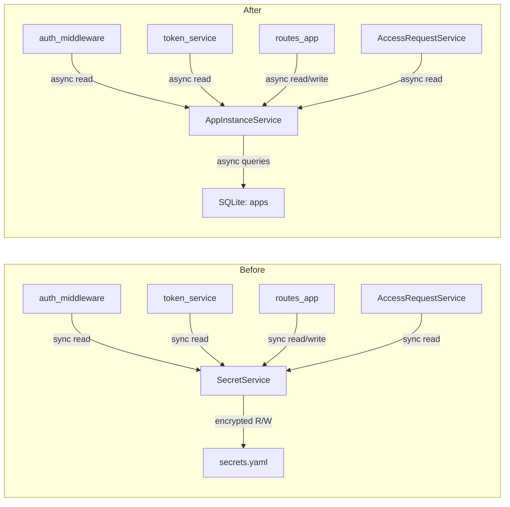

# Move AppRegInfo from secrets.yaml to Database

## Summary of Decisions

- **New table**: `apps` with `client_id` as PRIMARY KEY
- **Columns**: `client_id`, `encrypted_client_secret`, `salt_client_secret`, `nonce_client_secret`, `scope`, `app_status`, `created_at`, `updated_at`
- **New domain type**: `AppInstance` replaces `AppRegInfo`
- **New service**: `AppInstanceService` (async trait) replaces `SecretService` (sync trait)
- **No caching**: All reads go to DB (async), no in-memory optimization
- **Full cleanup**: Remove `SecretService`, `secrets.yaml`, `secrets_path()`, `fs2` dependency
- **No backwards compatibility**: Clean removal, no migration of existing data

## Architecture Change




## Phase 1: `objs` crate

**Files changed**: `[crates/objs/src/error/objs.rs](crates/objs/src/error/objs.rs)`, `[crates/objs/src/lib.rs](crates/objs/src/lib.rs)`

- Remove `AppRegInfoMissingError` struct (line 22-24 of `objs.rs`). It will be replaced by `AppInstanceError::NotFound` in the services crate.
- Remove corresponding re-export from `lib.rs`.
- Run `cargo test -p objs` to verify no regressions.

## Phase 2: `services` crate (largest change)

### 2a. New migration

Create `[crates/services/migrations/0014_apps.up.sql](crates/services/migrations/0014_apps.up.sql)`:

```sql
CREATE TABLE IF NOT EXISTS apps (
  client_id TEXT PRIMARY KEY,
  encrypted_client_secret TEXT NOT NULL,
  salt_client_secret TEXT NOT NULL,
  nonce_client_secret TEXT NOT NULL,
  scope TEXT NOT NULL DEFAULT '',
  app_status TEXT NOT NULL DEFAULT 'setup',
  created_at INTEGER NOT NULL,
  updated_at INTEGER NOT NULL
);
```

And corresponding `0014_apps.down.sql`.

### 2b. New domain type

In `[crates/services/src/objs.rs](crates/services/src/objs.rs)`:

- Replace `AppRegInfo` with `AppInstance`:

```rust
pub struct AppInstance {
  pub client_id: String,
  pub client_secret: String, // decrypted
  pub scope: String,
  pub status: AppStatus,
  pub created_at: DateTime<Utc>,
  pub updated_at: DateTime<Utc>,
}
```

### 2c. New repository

- Create `AppInstanceRepository` trait in `[crates/services/src/db/app_instance_repository.rs](crates/services/src/db/app_instance_repository.rs)` with `get_app_instance()`, `upsert_app_instance()`, `update_app_instance_status()`, `delete_app_instance()`.
- Implement on `SqliteDbService` in `crates/services/src/db/service_app_instance.rs` using the existing `encrypt_api_key`/`decrypt_api_key` from `[crates/services/src/db/encryption.rs](crates/services/src/db/encryption.rs)`.
- Add `AppInstanceRepository` to `DbService` super-trait in `[crates/services/src/db/service.rs](crates/services/src/db/service.rs)`.

### 2d. New service

- Create `AppInstanceService` async trait + `DefaultAppInstanceService` implementation.
- Error type: `AppInstanceError` with variants: `NotFound`, `Db(DbError)`, `Io(IoError)`.
- Service methods:
  - `get_instance() -> Result<Option<AppInstance>>`
  - `get_status() -> Result<AppStatus>` (returns `Setup` if no row)
  - `create_instance(client_id, client_secret, scope, status) -> Result<AppInstance>`
  - `update_status(status) -> Result<()>`

### 2e. Remove old code

- Delete `[crates/services/src/secret_service.rs](crates/services/src/secret_service.rs)`
- Delete `[crates/services/src/service_ext.rs](crates/services/src/service_ext.rs)`
- Delete `[crates/services/src/test_utils/secret.rs](crates/services/src/test_utils/secret.rs)`
- Remove `secrets_path()` from `SettingService` trait and implementations in `[crates/services/src/setting_service/](crates/services/src/setting_service/)`
- Remove `fs2` from `[crates/services/Cargo.toml](crates/services/Cargo.toml)`

### 2f. Update AppService trait

In `[crates/services/src/app_service.rs](crates/services/src/app_service.rs)`:

- Replace `fn secret_service() -> Arc<dyn SecretService>` with `fn app_instance_service() -> Arc<dyn AppInstanceService>`
- Update `DefaultAppService` struct and implementation

### 2g. Update AccessRequestService

In `[crates/services/src/access_request_service/service.rs](crates/services/src/access_request_service/service.rs)`:

- Replace `secret_service: Arc<dyn SecretService>` constructor param with `app_instance_service: Arc<dyn AppInstanceService>`
- Change `self.secret_service.app_reg_info()?.ok_or(...)?.client_id` to `self.app_instance_service.get_instance().await?.ok_or(...)?.client_id`

### 2h. Update test utilities

In `[crates/services/src/test_utils/app.rs](crates/services/src/test_utils/app.rs)`:

- Replace `SecretServiceStub` with `MockAppInstanceService` or a new `AppInstanceServiceStub`
- Update `AppServiceStub` builder to use new service

### 2i. Update exports

In `[crates/services/src/lib.rs](crates/services/src/lib.rs)`:

- Remove all `SecretService*` exports
- Add `AppInstanceService`, `AppInstance`, `AppInstanceError` exports

Run: `cargo test -p services`

## Phase 3: `auth_middleware` crate

**~6 files affected**

### 3a. Middleware

In `[crates/auth_middleware/src/auth_middleware/middleware.rs](crates/auth_middleware/src/auth_middleware/middleware.rs)`:

- Replace `secret_service` with `app_instance_service` (fetched from `app_service.app_instance_service()`)
- Replace `app_status_or_default(&secret_service)` calls with `app_instance_service.get_status().await?`
- Replace `AuthError::SecretService(SecretServiceError)` variant with `AppInstance(AppInstanceError)` variant

### 3b. Token service

In `[crates/auth_middleware/src/token_service/service.rs](crates/auth_middleware/src/token_service/service.rs)`:

- Replace `secret_service: Arc<dyn SecretService>` field with `app_instance_service: Arc<dyn AppInstanceService>`
- All `self.secret_service.app_reg_info()?.ok_or(AppRegInfoMissingError)?` become `self.app_instance_service.get_instance().await?.ok_or(AppInstanceError::NotFound)?`
- Access `instance.client_id`, `instance.client_secret` instead of `app_reg_info.client_id`

### 3c. Utils

In `[crates/auth_middleware/src/utils.rs](crates/auth_middleware/src/utils.rs)`:

- Make `app_status_or_default` async, taking `&Arc<dyn AppInstanceService>` instead of `&Arc<dyn SecretService>`

### 3d. Error types

In `[crates/auth_middleware/src/api_auth_middleware.rs](crates/auth_middleware/src/api_auth_middleware.rs)`:

- Replace `SecretService(#[from] SecretServiceError)` variant with `AppInstance(#[from] AppInstanceError)`

### 3e. Tests

Update test files: `tests.rs`, `token_service/tests.rs`, `test_live_auth_middleware.rs` to use new service mocks.

Run: `cargo test -p auth_middleware`

## Phase 4: `routes_app` crate

**~12 files affected (mostly tests)**

### 4a. Route handlers

- `[crates/routes_app/src/routes_setup/route_setup.rs](crates/routes_app/src/routes_setup/route_setup.rs)`: Replace `secret_service.set_app_reg_info()` / `set_app_status()` with `app_instance_service.create_instance()` / `update_status()`
- `[crates/routes_app/src/routes_auth/login.rs](crates/routes_app/src/routes_auth/login.rs)`: Replace `secret_service.app_reg_info()` / `app_status()` / `set_app_status()` with new service calls
- `[crates/routes_app/src/routes_dev.rs](crates/routes_app/src/routes_dev.rs)`: Replace debug dump

### 4b. Test utilities

- `[crates/routes_app/src/test_utils/router.rs](crates/routes_app/src/test_utils/router.rs)`: Update to use `AppInstanceService` mocks instead of `SecretServiceStub`

### 4c. Test files

Update all test files referencing SecretService:

- `test_setup.rs`, `test_setup_auth.rs`
- `test_login_initiate.rs`, `test_login_callback.rs`, `test_login_resource_admin.rs`
- `test_access_request.rs`, `test_access_request_admin.rs`
- `test_api_models_*.rs`

Run: `cargo test -p routes_app`

## Phase 5: `lib_bodhiserver` crate

### 5a. AppOptions

In `[crates/lib_bodhiserver/src/app_options.rs](crates/lib_bodhiserver/src/app_options.rs)`:

- Replace `AppRegInfo` references with equivalent fields for `AppInstance`
- `AppStateOption`: replace `app_reg_info: Option<AppRegInfo>` with instance init fields (`client_id`, `client_secret`, `scope`)
- Update `AppOptionsBuilder::set_app_reg_info()` to use new types

### 5b. AppServiceBuilder

In `[crates/lib_bodhiserver/src/app_service_builder.rs](crates/lib_bodhiserver/src/app_service_builder.rs)`:

- Remove `get_or_build_secret_service()` method and `secret_service` field
- Add `build_app_instance_service()` that creates `DefaultAppInstanceService` wrapping `DbService`
- Make `update_with_option` async
- Remove `SecretService` from `build_access_request_service()` parameters, replace with `AppInstanceService`

### 5c. Tests

Update `[crates/lib_bodhiserver/src/test_app_service_builder.rs](crates/lib_bodhiserver/src/test_app_service_builder.rs)`.

Run: `cargo test -p lib_bodhiserver`

## Phase 6: Downstream crates

### 6a. lib_bodhiserver_napi

In `[crates/lib_bodhiserver_napi/src/server.rs](crates/lib_bodhiserver_napi/src/server.rs)`:

- `update_with_option` call becomes `.await` (it's already in an async context)

### 6b. server_app

In `[crates/server_app/tests/utils/live_server_utils.rs](crates/server_app/tests/utils/live_server_utils.rs)`:

- Update test utilities to use new service

Run: `cargo test -p server_app`, `cargo test -p lib_bodhiserver_napi`

## Phase 7: Full validation

- `make test.backend` -- full backend test suite
- `cargo fmt --all` -- formatting
- `make build.ts-client` -- regenerate TS types if API changed (AppStatus endpoint response)
- `cd crates/bodhi && npm run test` -- frontend tests (unlikely to need changes)

## Impact Summary


| Crate                | Files Changed | New Files | Deleted Files |
| -------------------- | ------------- | --------- | ------------- |
| objs                 | 2             | 0         | 0             |
| services             | ~12           | 4         | 3             |
| auth_middleware      | ~6            | 0         | 0             |
| routes_app           | ~12           | 0         | 0             |
| lib_bodhiserver      | ~4            | 0         | 0             |
| lib_bodhiserver_napi | 1             | 0         | 0             |
| server_app           | 1             | 0         | 0             |


