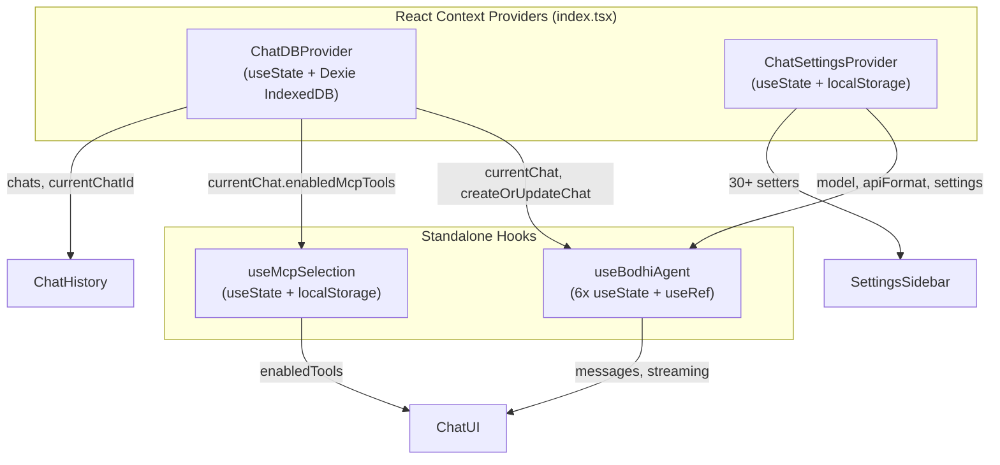
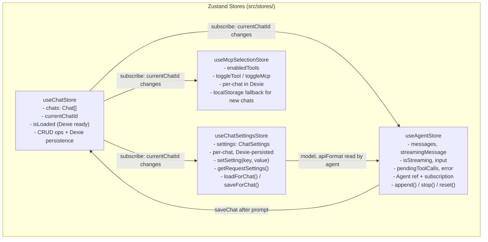

# Zustand Chat State Migration

## Problem Analysis

The chat page at [crates/bodhi/src/routes/chat/](crates/bodhi/src/routes/chat/) has grown complex with **4 separate Context/hook-based state systems** that interact poorly:

### Current State Architecture



### Identified Bugs and Issues

1. **New Chat is broken** ([useChatDb.tsx:200-203](crates/bodhi/src/hooks/chat/useChatDb.tsx)): `createNewChat` returns early (no-op) when `currentChat` is null or has no messages. Even when it does create a new chat, `useBodhiAgent` is never told to reset -- old messages stay on screen while the DB thinks the user is on a new empty chat.

2. **Chat switching leaves stale messages**: `useBodhiAgent` keeps its own `messages` via `useState`. Switching `currentChatId` (sidebar click) does not clear or replace agent messages. Stored messages are only restored inside `append()` when `agent.state.messages.length === 0` ([useBodhiAgent.ts:257](crates/bodhi/src/hooks/chat/useBodhiAgent.ts)), so clicking an existing chat shows nothing until the next send.

3. **URL sync race condition** ([index.tsx:86-94](crates/bodhi/src/routes/chat/index.tsx)): `ChatUrlSync` uses an `isInitialSync` ref that fires once. If Dexie `chats` haven't loaded yet on first render, the URL chat ID is permanently lost because the guard prevents subsequent attempts.

4. **Settings are global, not per-chat**: `ChatSettingsProvider` stores one set of settings in localStorage. Switching between chats that used different models/params does not restore those settings.

5. **30+ individual setter functions**: `ChatSettingsProvider` context value includes 30+ setter callbacks, causing all consumers to re-render when any setting changes.

6. **Duplicate state sources**: Chat messages exist in both `useBodhiAgent` (in-memory) and `useChatDB` (Dexie). No single source of truth, no sync mechanism.

7. **No test coverage for ChatUI.tsx or ChatMessage.tsx**: These files have no colocated unit tests. `index.test.tsx` only partially covers page-level behavior with heavily mocked agent state, and never asserts on streaming, tool calls, stop button, or error UI.

8. **`verifyChatEmpty` uses `waitForTimeout(1000)`** ([ChatPage.mjs:288](crates/lib_bodhiserver_napi/tests-js/pages/ChatPage.mjs)) -- violates the no-arbitrary-timeouts rule.

---

## Decided Behaviors (from discussion)

These decisions drive the store design:

- **New Chat on empty chat**: Stay on current empty chat, but **reset agent state** (clear input, messages, streaming state).
- **Chat switching**: **Immediately restore** the selected chat's stored messages into the agent/UI. No blank screen.
- **Settings scope**: **Per-chat**. Each chat stores its own settings in Dexie. New chats start with **default settings** (not inherited from previous chat). The left panel defaults (most disabled) are the initial state.
- **New Chat preserves model**: When creating a new chat, carry the currently selected **model** over (since selecting a model is a common first step), but reset all other settings to defaults.
- **URL semantics**: `/chat/?model=xyz` creates a new chat with that model pre-selected. `/chat/?id=abc&model=xyz` opens existing chat `abc` and overrides its model to `xyz`.

## Architecture Decisions

- **State library: Zustand** (confirmed). Already a dependency (`^5.0.11`), already used in `mcpFormStore.ts`, no-provider model, simpler mental model than Jotai's atoms. Streaming re-render performance managed via granular selectors (e.g., `useAgentStore(s => s.isStreaming)` instead of selecting the whole store).
- **Dexie schema: modify v1 in-place** (no migration needed). The feature is still in development; there is no production data to migrate. Just update the `ChatRecord` interface and the v1 schema directly.
- **Component splitting: only if over 500 lines**. `ChatUI.tsx` is 454 lines, stays as-is. `index.tsx` simplifies in-place after removing providers. If any file grows past 500 lines during migration, split at that point.
- **index.tsx layout: simplify in-place**. Removing `ChatDBProvider` + `ChatSettingsProvider` already reduces nesting enough. No need to extract layout wrappers to a separate file.

---

## Proposed Zustand Store Architecture

Zustand is already a dependency (`"zustand": "^5.0.11"` in [package.json](crates/bodhi/package.json)) with an existing store pattern at [src/stores/mcpFormStore.ts](crates/bodhi/src/stores/mcpFormStore.ts).

### Store Design



### Key Design Decisions

- **4 separate zustand stores** (not 1 mega-store) -- follows zustand best practice: granular subscriptions, independent re-renders, easy testing. Each store is focused on one domain.
- **Granular selectors for streaming performance**: Components subscribe to specific fields (e.g., `useAgentStore(s => s.isStreaming)`) rather than the whole store, so streaming message updates only re-render the message list, not the sidebar or settings.
- **Cross-store subscriptions via `subscribe()`**: When `chatStore.currentChatId` changes, the other 3 stores react: agent resets and restores messages, settings loads for that chat, MCP selection loads for that chat. This is set up once at store creation time, not in components.
- **Per-chat settings in Dexie**: Just a new non-indexed field on `ChatRecord` (no Dexie version bump needed -- feature is in development, no production data).
- **No more React Context providers** for chat state -- eliminates `ChatDBProvider` and `ChatSettingsProvider` from the component tree; store hooks work anywhere without provider nesting.
- **Agent reset on chat switch** -- the core fix for New Chat and chat-switching bugs.

---

## Implementation Plan

### Phase 0: Dexie Schema Update (in-place)

Update [src/lib/chatDb.ts](crates/bodhi/src/lib/chatDb.ts):

- Add `settings?: ChatSettings` field to `ChatRecord` interface (not indexed, just stored data)
- **No version bump needed** -- Dexie's indexed columns (`'id, userId, createdAt, updatedAt'`) are unchanged; `settings` is a non-indexed data field that Dexie stores without needing a schema declaration. Simply adding the field to the TypeScript interface is sufficient.
- Define a `PersistedChatSettings` type (subset of the full `ChatSettings` from the settings store) for what gets stored per-chat in Dexie

```typescript
// In ChatRecord interface -- just add the field:
export interface ChatRecord {
  id: string;
  userId: string;
  title: string;
  model?: string;
  createdAt: number;
  updatedAt?: number;
  enabledMcpTools?: Record<string, string[]>;
  settings?: PersistedChatSettings; // NEW -- non-indexed, no schema change
}
```

### Phase 1: Create Zustand Stores (new files only)

**1a. [src/stores/chatStore.ts](crates/bodhi/src/stores/chatStore.ts)** -- Chat DB store

Replaces [useChatDb.tsx](crates/bodhi/src/hooks/chat/useChatDb.tsx).

State:
- `chats: Chat[]`, `currentChatId: string | null`, `isLoaded: boolean`

Actions:
- `loadChats(userId)`, `setCurrentChatId(id)`, `createNewChat()`, `createOrUpdateChat(chat)`, `deleteChat(id)`, `clearChats()`, `getChat(id)`
- Computed: `currentChat` as a getter derived from `chats` + `currentChatId`

Behavior changes from current:
- `createNewChat()`: If current chat is already empty, **do not** create a new DB record, but **do** call `useAgentStore.getState().reset()` to clear stale agent state. If current chat has messages, create a new empty record and switch to it.
- `setCurrentChatId(id)`: Persists to localStorage (same key `current-chat-id`). The `subscribe` listeners in other stores handle the cascade.
- `loadChats()` sets `isLoaded = true` after initial Dexie load, solving the URL sync race.

**1b. [src/stores/chatSettingsStore.ts](crates/bodhi/src/stores/chatSettingsStore.ts)** -- Per-chat settings store

Replaces [useChatSettings.tsx](crates/bodhi/src/hooks/chat/useChatSettings.tsx).

State: Same `ChatSettings` interface (model, apiFormat, temperature, temperature_enabled, etc.)

Actions:
- `setSetting(key, value)` -- generic setter, auto-toggles `{key}_enabled`
- `setModel(model)`, `setApiFormat(format)` -- convenience aliases
- `getRequestSettings()` -- returns only enabled settings for the API call
- `reset(preserveModel?)` -- resets to defaults; optionally keeps model
- `loadForChat(chatId)` -- reads from Dexie `ChatRecord.settings`; if null, uses defaults
- `saveForChat(chatId)` -- writes current settings to Dexie `ChatRecord.settings`

Cross-store wiring:
- On `chatStore.currentChatId` change: call `loadForChat(newId)` to load that chat's settings
- On settings change (debounced): call `saveForChat(currentChatId)` to persist

New chat initialization:
- When `createNewChat` fires, settings reset to defaults but **model carries over** from the previous chat.

URL override:
- `/chat/?model=xyz` sets model after loadForChat completes, overriding stored model.

**1c. [src/stores/agentStore.ts](crates/bodhi/src/stores/agentStore.ts)** -- Agent/streaming store

Replaces [useBodhiAgent.ts](crates/bodhi/src/hooks/chat/useBodhiAgent.ts).

State:
- `input: string`, `isStreaming: boolean`, `messages: AgentMessage[]`, `streamingMessage: AgentMessage | undefined`, `pendingToolCalls: ReadonlySet<string>`, `errorMessage: string | undefined`

Actions:
- `setInput(value)`, `append(content)`, `stop()`, `reset()`
- Internal: Agent instance ref, event subscription, chatId tracking, streamFn with API token

Key behavior:
- `reset()`: Aborts current agent, creates a **new** Agent instance, clears all message/streaming state. Then checks if the new `currentChat` has stored messages and **immediately restores** them into the agent and into React state. This is the fix for both New Chat and chat switching.
- `append(content)`: Reads settings from `useChatSettingsStore.getState()`, reads `currentChatId` from `useChatStore.getState()`. After prompt completes, calls `useChatStore.getState().createOrUpdateChat(...)` to persist.
- `stop()`: Calls `agent.abort()`.

Cross-store wiring:
- Subscribes to `chatStore.currentChatId` changes. When it changes, calls `reset()`.

**1d. [src/stores/mcpSelectionStore.ts](crates/bodhi/src/stores/mcpSelectionStore.ts)** -- MCP tool selection store

Replaces [useMcpSelection.ts](crates/bodhi/src/hooks/mcps/useMcpSelection.ts).

State:
- `enabledTools: Record<string, string[]>`, `hasChanges: boolean`

Actions:
- `toggleTool(mcpId, toolName)`, `toggleMcp(mcpId, allToolNames)`, `setEnabledTools(tools)`, `isMcpEnabled(mcpId)`, `isToolEnabled(mcpId, toolName)`, `getMcpCheckboxState(mcpId, totalTools)`

Persistence:
- Per-chat: stored in `Chat.enabledMcpTools` (already exists in Dexie schema)
- Fallback for new chats: `localStorage` key `bodhi-last-mcp-selection`

Cross-store wiring:
- Subscribes to `chatStore.currentChatId`. On change: loads from `currentChat.enabledMcpTools` if available, otherwise from localStorage fallback.

### Phase 2: Migrate Components to Use Stores

**2a. [index.tsx](crates/bodhi/src/routes/chat/index.tsx)** -- Remove providers, new URL sync

Before (current nesting):
```
AppInitializer > ChatDBProvider > SidebarProvider > ChatUrlSync + ChatWithHistory
  > ChatSettingsProvider > SidebarProvider > ChatWithSettings
```

After:
```
AppInitializer > SidebarProvider > ChatWithHistory
  > SidebarProvider > ChatWithSettings
```

New URL sync logic (replaces `ChatUrlSync` component):
- `useEffect` in the route component watches `search.model`, `search.id`, and `chatStore.isLoaded`
- If `isLoaded` is false, skip (fixes the race condition)
- If `search.id` provided and chat exists: `chatStore.setCurrentChatId(search.id)`. If `search.model` also provided: `chatSettingsStore.setModel(search.model)` (override).
- If only `search.model` provided (no `search.id`): let current chat stay, but set the model.
- Reverse sync: when `currentChatId` changes, update URL via `navigate({ search: { model, id: currentChatId }, replace: true })`.

**2b. [ChatUI.tsx](crates/bodhi/src/routes/chat/-components/ChatUI.tsx)** -- Use zustand selectors

Replace:
- `useChatDB()` -> `useChatStore(s => s.currentChat)`
- `useChatSettings()` -> `useChatSettingsStore(s => s.model)`
- `useBodhiAgent(...)` -> `useAgentStore(s => ({ input: s.input, ... }))` (note: agent setup like tools is moved to a `useEffect` in ChatUI that calls `useAgentStore.getState().setTools(agentTools)`)
- `useMcpSelection()` -> `useMcpSelectionStore(s => s.enabledTools)`

**2c. Sidebar components** -- Replace hooks with store selectors

- [ChatHistory.tsx](crates/bodhi/src/routes/chat/-components/ChatHistory.tsx): `useChatDB()` -> `useChatStore(s => ({ chats: s.chats, currentChatId: s.currentChatId, ... }))`
- [NewChatButton.tsx](crates/bodhi/src/routes/chat/-components/NewChatButton.tsx): `useChatDB().createNewChat` -> `useChatStore(s => s.createNewChat)`
- [SettingsSidebar.tsx](crates/bodhi/src/routes/chat/-components/settings/SettingsSidebar.tsx): `useChatSettings()` -> `useChatSettingsStore()`
- [AliasSelector.tsx](crates/bodhi/src/routes/chat/-components/settings/AliasSelector.tsx): Same
- [SystemPrompt.tsx](crates/bodhi/src/routes/chat/-components/settings/SystemPrompt.tsx): Same
- [StopWords.tsx](crates/bodhi/src/routes/chat/-components/settings/StopWords.tsx): Same

**2d. [McpsPopover.tsx](crates/bodhi/src/routes/chat/-components/McpsPopover.tsx)** -- `useMcpSelectionStore`

### Phase 3: Delete Old Code

- Remove `ChatDBProvider` / `useChatDB` export from [useChatDb.tsx](crates/bodhi/src/hooks/chat/useChatDb.tsx). Keep the file if only `chatDb` schema imports remain, otherwise delete.
- Delete [useChatSettings.tsx](crates/bodhi/src/hooks/chat/useChatSettings.tsx) entirely
- Delete [useBodhiAgent.ts](crates/bodhi/src/hooks/chat/useBodhiAgent.ts) entirely
- Delete [useMcpSelection.ts](crates/bodhi/src/hooks/mcps/useMcpSelection.ts) entirely
- Update barrel [hooks/chat/index.ts](crates/bodhi/src/hooks/chat/index.ts) to export from stores instead

### Phase 4: Tests

**4a. Store unit tests (new files)**

| Store | Test file | Key test scenarios |
|-------|-----------|--------------------|
| `chatStore` | `src/stores/__tests__/chatStore.test.ts` | Init with empty state; createOrUpdateChat persists to Dexie; createNewChat on empty chat resets agent (spy); createNewChat on chat-with-messages creates new record; deleteChat switches to another; loadChats respects userId isolation; currentChat derived correctly; setCurrentChatId persists to localStorage |
| `chatSettingsStore` | `src/stores/__tests__/chatSettingsStore.test.ts` | Default state matches defaults; setSetting auto-toggles enabled; getRequestSettings only includes enabled; reset preserves model when told; loadForChat reads from Dexie; saveForChat writes to Dexie; apiFormat management; stop array normalization |
| `agentStore` | `src/stores/__tests__/agentStore.test.ts` | Init idle state; append calls agent.prompt; stop calls agent.abort; reset clears all state and creates new Agent; **auto-reset on currentChatId change** (subscribe); **immediate message restore** on chat switch; save chat after successful prompt; error handling; AbortError silenced |
| `mcpSelectionStore` | `src/stores/__tests__/mcpSelectionStore.test.ts` | Toggle tool/MCP; checkbox states; load from currentChat.enabledMcpTools; fallback to localStorage; persist to localStorage |

**4b. Migrate component unit tests**

Each test file changes from `vi.mock('@/hooks/chat', ...)` to `store.setState(...)` before render:

| Test file | Key changes |
|-----------|-------------|
| [index.test.tsx](crates/bodhi/src/routes/chat/index.test.tsx) | Remove `vi.mock` for `useBodhiAgent` / providers. Use `useAgentStore.setState(...)` and `useChatStore.setState(...)`. Remove `createWrapper()` provider wrappers for chat-specific providers. Add tests for URL sync (`?model=`, `?id=`). |
| [ChatHistory.test.tsx](crates/bodhi/src/routes/chat/-components/ChatHistory.test.tsx) | Replace `vi.mocked(useChatDB)` with `useChatStore.setState({ chats: mockChats, ... })` |
| [NewChatButton.test.tsx](crates/bodhi/src/routes/chat/-components/NewChatButton.test.tsx) | Replace `vi.mock` with `useChatStore.setState({ createNewChat: mockFn })` |
| [SettingsSidebar.test.tsx](crates/bodhi/src/routes/chat/-components/settings/SettingsSidebar.test.tsx) | Replace `useChatSettings` mock with `useChatSettingsStore.setState(...)` |
| [AliasSelector.test.tsx](crates/bodhi/src/routes/chat/-components/settings/AliasSelector.test.tsx) | Same pattern |
| [SystemPrompt.test.tsx](crates/bodhi/src/routes/chat/-components/settings/SystemPrompt.test.tsx) | Same pattern |
| [StopWords.test.tsx](crates/bodhi/src/routes/chat/-components/settings/StopWords.test.tsx) | Same pattern |
| [SettingSlider.test.tsx](crates/bodhi/src/routes/chat/-components/settings/SettingSlider.test.tsx) | No change (purely props-driven, no hook mocking) |
| [ThinkingBlock.test.tsx](crates/bodhi/src/routes/chat/-components/ThinkingBlock.test.tsx) | No change (purely presentational) |

Old hook test files to **delete** (replaced by store tests):
- [useChatDb.test.tsx](crates/bodhi/src/hooks/chat/useChatDb.test.tsx)
- [useChatSettings.test.tsx](crates/bodhi/src/hooks/chat/useChatSettings.test.tsx)
- [useBodhiAgent.test.tsx](crates/bodhi/src/hooks/chat/useBodhiAgent.test.tsx)

Unchanged:
- [useMcpAgentTools.test.ts](crates/bodhi/src/hooks/chat/useMcpAgentTools.test.ts) -- pure `useMemo` hook, no context dependency

### Phase 5: E2E Tests

E2E tests interact with DOM, not hooks. Most should continue working. Specific attention:

**Page objects to verify/update:**
- [ChatPage.mjs](crates/lib_bodhiserver_napi/tests-js/pages/ChatPage.mjs): Fix `verifyChatEmpty` to remove `waitForTimeout(1000)` -- use `waitForSelector` on empty state instead. Verify `startNewChat` / `startNewChatInline` still work with new behavior.
- [ChatHistoryPage.mjs](crates/lib_bodhiserver_napi/tests-js/pages/ChatHistoryPage.mjs): No expected changes.
- [ChatSettingsPage.mjs](crates/lib_bodhiserver_napi/tests-js/pages/ChatSettingsPage.mjs): No expected changes (settings UI stays the same).

**Existing specs to verify:**
- [chat.spec.mjs](crates/lib_bodhiserver_napi/tests-js/specs/chat/chat.spec.mjs): The `multi-chat management` test creates 3 chats via `startNewChat` + `sendMessage`. This should now work better since agent state resets on new chat. Verify the assertions still pass.
- [chat-mcps.spec.mjs](crates/lib_bodhiserver_napi/tests-js/specs/chat/chat-mcps.spec.mjs): MCP persistence across new chat -- verify with per-chat MCP storage.

**New e2e scenarios to add in `chat.spec.mjs`:**
- New Chat from empty state clears any stale agent messages
- Switching to existing chat shows its stored messages immediately
- Per-chat settings: change model on chat A, switch to chat B, verify B has its own model
- URL deep link `/chat/?model=xyz` lands with correct model

### Phase 6: Validation

1. `cd crates/bodhi && npm test` -- all unit tests pass
2. `cd crates/bodhi && npm run lint` -- no lint errors
3. `make build.ui-rebuild` -- embedded UI builds clean
4. `make test.napi` -- all e2e tests pass
5. `cd crates/bodhi && npm run format` -- formatting clean

---

## Zustand Testing Patterns

Following [zustand testing docs](https://zustand.docs.pmnd.rs/guides/testing) and the existing [mcpFormStore.ts](crates/bodhi/src/stores/mcpFormStore.ts) pattern:

**Store tests (no rendering needed):**
```typescript
import { useChatStore } from '@/stores/chatStore';

beforeEach(async () => {
  // Reset to initial state between tests
  useChatStore.setState(initialState, true);
  await chatDb.chats.clear();
  await chatDb.messages.clear();
});

it('creates a new chat', async () => {
  await useChatStore.getState().createNewChat();
  expect(useChatStore.getState().currentChatId).not.toBeNull();
});
```

**Component tests (state injection):**
```typescript
import { useChatStore } from '@/stores/chatStore';

beforeEach(() => {
  useChatStore.setState({
    chats: mockChats,
    currentChatId: 'chat-1',
    deleteChat: vi.fn(),
    setCurrentChatId: vi.fn(),
  }, true);
});

it('renders chat list', () => {
  render(<ChatHistory />);
  expect(screen.getByText('Today Chat')).toBeInTheDocument();
});
```

No provider wrappers needed for chat state. `SidebarProvider` wrapper still required for shadcn sidebar components.

---

## Files Changed Summary

**New files (8):**
- `src/stores/chatStore.ts`
- `src/stores/chatSettingsStore.ts`
- `src/stores/agentStore.ts`
- `src/stores/mcpSelectionStore.ts`
- `src/stores/__tests__/chatStore.test.ts`
- `src/stores/__tests__/chatSettingsStore.test.ts`
- `src/stores/__tests__/agentStore.test.ts`
- `src/stores/__tests__/mcpSelectionStore.test.ts`

**Modified files (~20):**
- `src/lib/chatDb.ts` (add `settings` field to `ChatRecord` interface, no version change)
- `src/routes/chat/index.tsx` (remove providers, new URL sync)
- `src/routes/chat/-components/ChatUI.tsx`
- `src/routes/chat/-components/ChatHistory.tsx`
- `src/routes/chat/-components/NewChatButton.tsx`
- `src/routes/chat/-components/McpsPopover.tsx`
- `src/routes/chat/-components/settings/SettingsSidebar.tsx`
- `src/routes/chat/-components/settings/AliasSelector.tsx`
- `src/routes/chat/-components/settings/SystemPrompt.tsx`
- `src/routes/chat/-components/settings/StopWords.tsx`
- `src/hooks/chat/index.ts` (update exports)
- 7 component test files in `routes/chat/` (migrated mocking pattern)
- `tests-js/pages/ChatPage.mjs` (fix `verifyChatEmpty` timeout)
- `tests-js/specs/chat/chat.spec.mjs` (new scenarios)

**Deleted files (6):**
- `src/hooks/chat/useChatDb.tsx` (logic moves to chatStore)
- `src/hooks/chat/useChatSettings.tsx` (logic moves to chatSettingsStore)
- `src/hooks/chat/useBodhiAgent.ts` (logic moves to agentStore)
- `src/hooks/mcps/useMcpSelection.ts` (logic moves to mcpSelectionStore)
- `src/hooks/chat/useChatDb.test.tsx` (replaced by store test)
- `src/hooks/chat/useChatSettings.test.tsx` (replaced by store test)
- `src/hooks/chat/useBodhiAgent.test.tsx` (replaced by store test)
