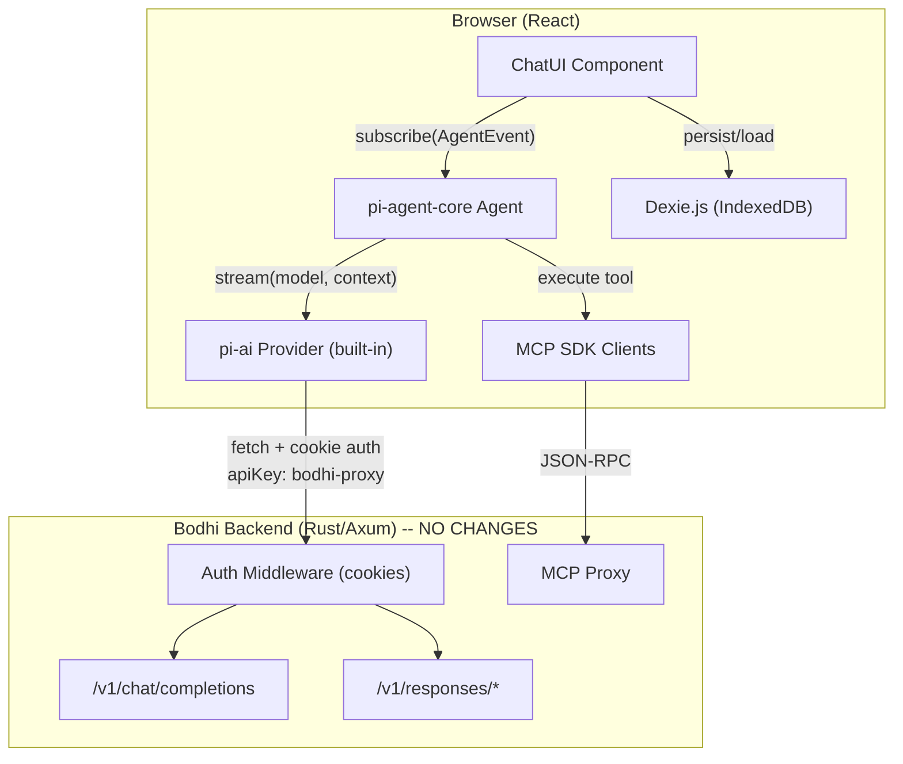
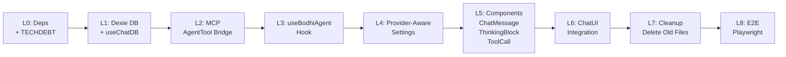

# Migrate Chat UI to pi-ai / pi-agent-core

## Scope

**In scope (Phase 1 + Phase 2):**
- Replace hand-rolled SSE parsing + agentic loop with pi-ai Agent
- Support `openai-completions` (Phase 1) and `openai-responses` (Phase 2) providers
- Thinking block rendering
- Dexie.js persistence with userId
- MCP tool calling via AgentTool bridge
- Provider-aware settings sidebar

**Out of scope (future work):**
- Anthropic Messages API provider + backend proxy
- Google Gemini provider + backend proxy
- OAuth token support for providers
- These are documented as future phases in [TECHDEBT.md](ai-docs/claude-plans/202604/20260408-chat-ui/TECHDEBT.md)

## Key Finding: No Backend Changes Needed

The Bodhi backend **already supports both endpoints** required for Phase 1 and Phase 2:
- `POST /v1/chat/completions` -- implemented in [routes_oai_chat.rs](crates/routes_app/src/oai/routes_oai_chat.rs)
- `POST /v1/responses` (+ GET/DELETE/cancel) -- implemented in [routes_oai_responses.rs](crates/routes_app/src/oai/routes_oai_responses.rs)
- `ApiFormat` enum already has `OpenAI` and `OpenAIResponses` variants in [model_objs.rs](crates/services/src/models/model_objs.rs)
- `api_format` is already exposed in `ApiAliasResponse` via [types.gen.ts](ts-client/src/types/types.gen.ts)

This migration is **purely frontend** (`crates/bodhi/src/`), plus E2E test updates.

## Architecture



## Authentication Strategy

**Dummy API key trick**: Pass `apiKey: 'bodhi-proxy'` to pi-ai's built-in OpenAI providers. `baseUrl` = `window.origin` (Bodhi backend). Browser cookies auto-sent. Backend ignores the dummy `Authorization: Bearer bodhi-proxy` header and authenticates via session cookie, then injects real provider credentials.

> **TECHDEBT**: Goal is to upstream a patch to pi-ai making `apiKey` optional, then remove the dummy key.

## MCP Tool Bridge

MCP tools become `AgentTool` instances:
- `parameters`: MCP `inputSchema` (JSON Schema) passed directly via `Type.Unsafe()` (pi-ai uses AJV on JSON Schema internally, no TypeBox conversion needed)
- `execute`: calls `useMcpClients.callTool(mcpId, toolName, args)` -> `AgentToolResult`
- Tool name encoding: `mcp__{slug}__{toolName}` preserved
- Execution mode: parallel (matching current `Promise.allSettled`)

## Layered Implementation Approach

Each layer builds on the previous. Gate checks ensure tests pass before committing. Commits happen at each layer boundary.



---

## Phase 1: Core Migration (openai-completions)

### P1-L0: Dependencies + TECHDEBT

**Actions:**
- `cd crates/bodhi && npm install @mariozechner/pi-ai @mariozechner/pi-agent-core dexie`
- `cd crates/bodhi && npm install -D fake-indexeddb`
- Create `ai-docs/claude-plans/202604/20260408-chat-ui/TECHDEBT.md`:
  - Dummy apiKey workaround (pros: works with all built-in providers, no fork; cons: sends fake auth header; resolution: upstream PR to make apiKey optional)
  - llama.cpp timings loss (pi-ai's openai-completions provider does not capture vendor extension fields like `timings`; resolution: custom provider or `onPayload` hook)
  - Future providers: Anthropic Messages, Gemini (need backend proxy routes)
  - Future auth: OAuth token support

**Gate:** `npm install` succeeds, no lockfile conflicts
**Commit:** `feat(chat): add pi-ai, pi-agent-core, dexie dependencies`

### P1-L1: Dexie Chat Database + useChatDB Refactor

**New file:** [crates/bodhi/src/lib/chatDb.ts](crates/bodhi/src/lib/chatDb.ts)

```typescript
class BodhiChatDB extends Dexie {
  chats!: Table<ChatRecord>;
  messages!: Table<MessageRecord>;
  constructor() {
    super('bodhi-chat');
    this.version(1).stores({
      chats: 'id, userId, createdAt',
      messages: '++id, chatId, [chatId+createdAt]',
    });
  }
}
```

- `ChatRecord`: id, userId, title, model, createdAt, updatedAt, enabledMcpTools
- `MessageRecord`: id (auto), chatId, role, content (serialized pi-ai `AgentMessage`), metadata, createdAt

**Refactor:** [crates/bodhi/src/hooks/chat/useChatDb.tsx](crates/bodhi/src/hooks/chat/useChatDb.tsx)
- Replace localStorage reads/writes with Dexie queries
- Add `userId` parameter from auth context (use existing `useUser` hook)
- `listChats(userId)` -> `db.chats.where('userId').equals(userId).reverse().sortBy('createdAt')`
- `createOrUpdateChat` -> `db.chats.put()` + `db.messages.bulkPut()`
- Keep same public API shape for downstream consumers
- Max 100 chats per user (enforce on insert via count check)

**Test update:** [crates/bodhi/src/hooks/chat/useChatDb.test.tsx](crates/bodhi/src/hooks/chat/useChatDb.test.tsx)
- Add `import 'fake-indexeddb/auto'` in test setup
- Replace localStorage assertions with Dexie DB reads
- Add userId filtering tests
- Verify message CRUD operations
- Existing 6 test cases restructured for Dexie semantics

**Gate:** `cd crates/bodhi && npm run test -- --run useChatDb.test`
**Commit:** `feat(chat): migrate chat persistence from localStorage to Dexie with userId`

### P1-L2: MCP-to-AgentTool Bridge

**New file:** [crates/bodhi/src/hooks/chat/useMcpAgentTools.ts](crates/bodhi/src/hooks/chat/useMcpAgentTools.ts)

```typescript
import { Type } from '@mariozechner/pi-ai';
import type { AgentTool } from '@mariozechner/pi-agent-core';

const useMcpAgentTools = (
  enabledMcpTools: Record<string, string[]>,
  mcpClients: McpClientsHook,
): AgentTool[] => {
  return useMemo(() => {
    const tools: AgentTool[] = [];
    for (const [mcpId, toolNames] of Object.entries(enabledMcpTools)) {
      const slug = mcpClients.getSlug(mcpId);
      const clientTools = mcpClients.allTools.get(mcpId) ?? [];
      for (const t of clientTools.filter(t => toolNames.includes(t.name))) {
        tools.push({
          name: encodeMcpToolName(slug, t.name),
          description: t.description ?? '',
          parameters: Type.Unsafe(t.inputSchema),
          execute: async (toolCallId, params, signal) => {
            const result = await mcpClients.callTool(mcpId, t.name, params);
            return { content: [{ type: 'text', text: JSON.stringify(result.content) }] };
          },
        });
      }
    }
    return tools;
  }, [enabledMcpTools, mcpClients.allTools]);
};
```

**New test:** [crates/bodhi/src/hooks/chat/useMcpAgentTools.test.ts](crates/bodhi/src/hooks/chat/useMcpAgentTools.test.ts)
- Test tool list construction from mock MCP clients
- Test tool name encoding (mcp__slug__toolName)
- Test execute calls through to mcpClients.callTool
- Test error handling in execute
- Test empty/disabled tools produce empty array

**Gate:** `cd crates/bodhi && npm run test -- --run useMcpAgentTools.test`
**Commit:** `feat(chat): add MCP-to-AgentTool bridge hook`

### P1-L3: useBodhiAgent Hook

**New file:** [crates/bodhi/src/hooks/chat/useBodhiAgent.ts](crates/bodhi/src/hooks/chat/useBodhiAgent.ts)

Core hook replacing `useChatCompletion` + `useChat`. Key responsibilities:

- **Model builder**: `buildPiAiModel(alias, apiFormat)` -> pi-ai `Model` object
  - `api_format: "openai"` -> `{ api: "openai-completions", baseUrl: window.origin, id: modelId, provider: "bodhi", ... }`
  - `apiKey: 'bodhi-proxy'` in StreamOptions
- **Agent lifecycle**: Create `Agent` instance, configure with model + tools + settings
- **Event subscription**: `agent.subscribe((event) => {...})` maps AgentEvents to React state:
  - `agent_start` -> `setIsLoading(true)`
  - `message_update` with `assistantMessageEvent` -> update `streamingMessage`
  - `message_end` -> finalize message, append to committed list
  - `tool_execution_start/end` -> update `pendingToolCalls`
  - `agent_end` -> `setIsLoading(false)`, persist to Dexie
- **Public API**: `{ send, stop, isLoading, streamingMessage, pendingToolCalls, messages, error }`
- **Settings mapping**: `useChatSettings.getRequestSettings()` -> pi-ai `StreamOptions` (temperature, maxTokens, etc.)
- **System prompt**: injected via `Agent` systemPrompt when enabled

**New test:** [crates/bodhi/src/hooks/chat/useBodhiAgent.test.tsx](crates/bodhi/src/hooks/chat/useBodhiAgent.test.tsx)
- MSW handler for `/v1/chat/completions` (pi-ai's OpenAI provider calls this endpoint)
- Test send -> streaming -> message complete flow
- Test stop/abort
- Test tool call flow (mock MCP tools)
- Test error handling (API error, network error)
- Test settings mapping (temperature, maxTokens passed through)
- Mock `useChatDB` and `useChatSettings` as in existing `useChat.test.tsx` patterns

**Gate:** `cd crates/bodhi && npm run test -- --run useBodhiAgent.test`
**Commit:** `feat(chat): add useBodhiAgent hook wrapping pi-agent-core Agent`

### P1-L4: Provider-Aware Settings

**Refactor:** [crates/bodhi/src/hooks/chat/useChatSettings.tsx](crates/bodhi/src/hooks/chat/useChatSettings.tsx)

- Add `apiFormat` field derived from selected model's `ApiAliasResponse.api_format`
- Add `getProviderCapabilities(apiFormat)` returning which settings are supported:
  - `openai`: all current settings
  - `openai_responses`: exclude n, logit_bias, seed; add reasoning effort
- Add `getStreamOptions()` that maps settings to pi-ai `StreamOptions` shape
- Keep `getRequestSettings()` for backwards compat during transition

**Test update:** [crates/bodhi/src/hooks/chat/useChatSettings.test.tsx](crates/bodhi/src/hooks/chat/useChatSettings.test.tsx)
- Add tests for `getProviderCapabilities` with different api_format values
- Add tests for `getStreamOptions` mapping
- Existing 15 test cases remain (settings persistence, enable/disable, etc.)

**Refactor:** [crates/bodhi/src/routes/chat/-components/settings/SettingsSidebar.tsx](crates/bodhi/src/routes/chat/-components/settings/SettingsSidebar.tsx)
- Conditionally render settings controls based on `getProviderCapabilities()`

**Test update:** [crates/bodhi/src/routes/chat/-components/settings/SettingsSidebar.test.tsx](crates/bodhi/src/routes/chat/-components/settings/SettingsSidebar.test.tsx)
- Add tests for settings visibility per provider

**Gate:** `cd crates/bodhi && npm run test -- --run useChatSettings.test SettingsSidebar.test`
**Commit:** `feat(chat): add provider-aware settings with api_format support`

### P1-L5: Message Components

**New file:** [crates/bodhi/src/routes/chat/-components/ThinkingBlock.tsx](crates/bodhi/src/routes/chat/-components/ThinkingBlock.tsx)
- Shadcn `Collapsible` with "Thinking..." header
- `isStreaming` prop: when true, auto-expanded with pulse animation CSS class
- When complete: collapsed by default, click to expand
- Content: `MemoizedReactMarkdown` for thinking text

**Refactor:** [crates/bodhi/src/routes/chat/-components/ChatMessage.tsx](crates/bodhi/src/routes/chat/-components/ChatMessage.tsx)
- Assistant messages: iterate `message.content` blocks (pi-ai `AssistantMessage.content`)
  - `{ type: "text", text }` -> existing `MemoizedReactMarkdown`
  - `{ type: "thinking", text }` -> `ThinkingBlock`
  - `{ type: "toolCall", ... }` -> adapted `ToolCallsDisplay`
- User messages: handle pi-ai user message format (string or content parts)
- Skip `toolResult` role messages (rendered inline in ToolCallsDisplay, same as before)
- Preserve existing `data-testid` attributes: `user-message`, `assistant-message`, `user-message-content`, `assistant-message-content`, `message-completed` for E2E compatibility

**Refactor:** [crates/bodhi/src/routes/chat/-components/ToolCallMessage.tsx](crates/bodhi/src/routes/chat/-components/ToolCallMessage.tsx)
- Adapt from OpenAI `ToolCall` (`id`, `function.name`, `function.arguments`) to pi-ai `ToolCall` (`id`, `name`, `arguments` as parsed object)
- Tool results from `AgentToolResult` instead of `role: 'tool'` message content
- Keep `decodeMcpToolName` for display
- Preserve `data-testid` attributes: `tool-call-message`, `tool-call-expand`, `tool-call-status`, `tool-call-content`

**Refactor:** [crates/bodhi/src/types/chat.ts](crates/bodhi/src/types/chat.ts)
- Replace hand-rolled `Message`, `ToolCall`, `Chat` types with pi-ai equivalents
- Import `AgentMessage`, `AssistantMessage`, `ToolCall` from `@mariozechner/pi-agent-core`
- Keep `ChatRecord` and `MessageRecord` types for Dexie (from L1)
- Remove `MessageMetadata` (pi-ai `Usage` replaces it)

**Tests:**
- New: `ThinkingBlock.test.tsx` - collapsed/expanded states, streaming animation, content rendering
- Update: ChatMessage rendering tests for pi-ai message format
- Update: ToolCallMessage tests for pi-ai ToolCall shape

**Gate:** `cd crates/bodhi && npm run test -- --run ChatMessage ToolCallMessage ThinkingBlock`
**Commit:** `feat(chat): update message components for pi-ai format + add ThinkingBlock`

### P1-L6: ChatUI Integration

**Refactor:** [crates/bodhi/src/routes/chat/-components/ChatUI.tsx](crates/bodhi/src/routes/chat/-components/ChatUI.tsx)
- Replace `useChat(options)` with `useBodhiAgent(options)`
- MCP wiring stays the same: `useMcpClients`, `useMcpSelection`, `useListMcps`
- Pass `useMcpAgentTools(enabledMcpTools, mcpClients)` result to agent hook
- Rendering logic: split messages into committed list + streaming message (pi-web-ui "two-layer" pattern)
- `handleSubmit` -> `agent.send(input)`
- Stop button -> `agent.stop()`

**Test update:** [crates/bodhi/src/routes/chat/index.test.tsx](crates/bodhi/src/routes/chat/index.test.tsx)
- The largest test file (10 tests). Key changes:
  - MSW handlers: pi-ai's OpenAI provider hits same `/v1/chat/completions` endpoint, but request body format may differ slightly (pi-ai builds its own `messages` array). Verify MSW handler request matching still works.
  - Metadata assertions: pi-ai exposes `Usage` (token counts) but not llama.cpp `timings`. Update "Speed: X tokens/s" assertions if those metrics are no longer available.
  - Streaming assertions: DOM selectors should remain compatible if we preserve `data-testid` attributes and CSS classes (`chat-ai-streaming`, `message-completed`).
  - Multi-turn: verify conversation state carries through agent loop correctly
  - Error scenarios: API error and streaming error tests need MSW response format alignment

**Gate:** `cd crates/bodhi && npm run test` (full test suite -- all 77 test files must pass)
**Commit:** `feat(chat): integrate useBodhiAgent into ChatUI`

### P1-L7: Cleanup + Delete Obsolete Files

**Delete files:**
- [crates/bodhi/src/hooks/chat/useChatCompletions.ts](crates/bodhi/src/hooks/chat/useChatCompletions.ts) + its test
- [crates/bodhi/src/hooks/chat/useChat.tsx](crates/bodhi/src/hooks/chat/useChat.tsx) + its test
- [crates/bodhi/src/hooks/chat/constants.ts](crates/bodhi/src/hooks/chat/constants.ts)
- [crates/bodhi/src/test-utils/msw-v2/handlers/chat-completions.ts](crates/bodhi/src/test-utils/msw-v2/handlers/chat-completions.ts) (replace with new pi-ai-compatible handlers created in L3/L6)
- [crates/bodhi/src/test-utils/fixtures/chat.ts](crates/bodhi/src/test-utils/fixtures/chat.ts) (replace with pi-ai message format fixtures)

**Update:** [crates/bodhi/src/hooks/chat/index.ts](crates/bodhi/src/hooks/chat/index.ts)
- Remove old exports: `useChat`, `useChatCompletion`, `toApiMessage`, `accumulateToolCallChunk`, `CompletionResult`, `ENDPOINT_OAI_CHAT_COMPLETIONS`
- Add new exports: `useBodhiAgent`, `useMcpAgentTools`
- Keep: `useChatDB`, `ChatDBProvider`, `useChatSettings`, `ChatSettingsProvider`

**Gate:** `cd crates/bodhi && npm run test` (full suite -- verify no imports of deleted files remain)
**Commit:** `refactor(chat): remove hand-rolled SSE + agentic loop code`

### P1-L8: E2E Tests (Playwright)

**Prerequisite:** `make build.ui-rebuild` (rebuilds Vite frontend into `crates/bodhi/out/` + NAPI bindings)

**Page object updates:**

[ChatPage.mjs](crates/lib_bodhiserver_napi/tests-js/pages/ChatPage.mjs):
- Verify selectors still match: `chat-ui`, `chat-input`, `send-button`, `message-list`, `user-message`, `assistant-message`, `user-message-content`, `assistant-message-content`
- `simulateNetworkFailure()` route pattern: still `**/v1/chat/completions` (pi-ai calls same endpoint)
- `waitForResponseComplete` / `waitForStreamingComplete` / `waitForAgenticResponseComplete`: verify CSS classes (`.chat-ai-streaming`, `.message-completed`) still emitted by new components
- If metadata display changes (loss of timings), update `verifyMessageInHistory` assertions

[ChatSettingsPage.mjs](crates/lib_bodhiserver_napi/tests-js/pages/ChatSettingsPage.mjs):
- Model selection should be unchanged
- If settings controls added/removed for provider-awareness, update selectors

[ChatHistoryPage.mjs](crates/lib_bodhiserver_napi/tests-js/pages/ChatHistoryPage.mjs):
- History now from IndexedDB (not localStorage). Server-side reset via `resetDatabase` in fixtures should still work (server DB), but chat history is now client-side IndexedDB. May need `page.evaluate(() => indexedDB.deleteDatabase('bodhi-chat'))` in test setup.

**Spec updates:**

[chat.spec.mjs](crates/lib_bodhiserver_napi/tests-js/specs/chat/chat.spec.mjs) (core chat):
- Simple Q&A flow should work if selectors preserved
- Multi-chat / history: IndexedDB persistence across page navigations
- Network failure: route pattern unchanged
- Edge cases from `ChatFixtures`: still relevant

[chat-mcps.spec.mjs](crates/lib_bodhiserver_napi/tests-js/specs/chat/chat-mcps.spec.mjs) (MCP tool calling):
- MCP popover selectors: `mcps-popover-trigger`, `mcps-badge`, etc. -- should be unchanged
- Tool call display: `tool-call-message`, `tool-call-expand` -- verify pi-ai ToolCall renders with same testids
- `waitForAgenticResponseComplete` timing may change with pi-agent-core's loop

[oauth-chat-streaming.spec.mjs](crates/lib_bodhiserver_napi/tests-js/specs/oauth/oauth-chat-streaming.spec.mjs):
- Uses separate test app (`test-app/ChatPage.mjs`) with different selectors -- NOT affected by this migration
- Only the main Bodhi chat UI page objects need updating

**Gate:** `make test.napi.standalone` (runs Playwright standalone project)
**Commit:** `test(e2e): update Playwright chat tests for pi-ai migration`

---

## Phase 2: OpenAI Responses API

### P2-L1: Extend Model Builder + Settings

**Refactor:** [crates/bodhi/src/hooks/chat/useBodhiAgent.ts](crates/bodhi/src/hooks/chat/useBodhiAgent.ts)
- `buildPiAiModel()`: when `api_format === "openai_responses"`, build `{ api: "openai-responses", baseUrl: window.origin, ... }`
- Map settings to `OpenAIResponsesOptions` (reasoning effort, etc.)

**Refactor:** [crates/bodhi/src/hooks/chat/useChatSettings.tsx](crates/bodhi/src/hooks/chat/useChatSettings.tsx)
- `getProviderCapabilities("openai_responses")`: exclude n, logit_bias, seed
- Add `reasoning` effort level setting (low/medium/high) when model supports it

**Refactor:** [crates/bodhi/src/routes/chat/-components/settings/SettingsSidebar.tsx](crates/bodhi/src/routes/chat/-components/settings/SettingsSidebar.tsx)
- Hide excluded controls for responses models
- Add reasoning effort dropdown

**Tests:** Update settings tests for responses-specific behavior
**Gate:** `cd crates/bodhi && npm run test -- --run useBodhiAgent.test useChatSettings.test SettingsSidebar.test`
**Commit:** `feat(chat): support openai-responses provider in model builder + settings`

### P2-L2: MSW Handlers + Integration Tests

- New MSW handlers for `/v1/responses` endpoint (pi-ai's openai-responses provider expects OpenAI Responses API SSE format)
- Test useBodhiAgent with responses-format model
- Test streaming events from responses API (different SSE event types than completions)
- Test tool calling via responses API if applicable

**Gate:** `cd crates/bodhi && npm run test` (full suite)
**Commit:** `test(chat): add MSW handlers and tests for openai-responses provider`

### P2-L3: E2E for Responses Models

- Update or add E2E spec for responses-format API models
- Requires a real OpenAI API key configured with `api_format: "openai_responses"` alias
- Verify chat flow works end-to-end through Bodhi backend's `/v1/responses` proxy

**Gate:** `make test.napi.standalone`
**Commit:** `test(e2e): add E2E coverage for openai-responses chat flow`

---

## Test Inventory (files affected)

### UI Unit Tests (`crates/bodhi/` -- `npm run test`)

| Test file | Layer | Change type |
|-----------|-------|-------------|
| `hooks/chat/useChatDb.test.tsx` (6 tests) | L1 | **Rewrite** for Dexie + userId |
| `hooks/chat/useMcpAgentTools.test.ts` | L2 | **New** |
| `hooks/chat/useBodhiAgent.test.tsx` | L3 | **New** (replaces useChat.test + useChatCompletions.test) |
| `hooks/chat/useChatSettings.test.tsx` (15 tests) | L4 | **Extend** with provider capabilities |
| `routes/chat/-components/ThinkingBlock.test.tsx` | L5 | **New** |
| `routes/chat/-components/ChatMessage.test.tsx` | L5 | **Update** for pi-ai message format (if exists) |
| `routes/chat/-components/ToolCallMessage.test.tsx` | L5 | **Update** for pi-ai ToolCall shape (if exists) |
| `routes/chat/index.test.tsx` (10 tests) | L6 | **Update** MSW + assertions |
| `routes/chat/-components/settings/SettingsSidebar.test.tsx` (5 tests) | L4 | **Update** for provider-aware visibility |
| `hooks/chat/useChatCompletions.test.tsx` (6 tests) | L7 | **Delete** |
| `hooks/chat/useChat.test.tsx` (6 tests) | L7 | **Delete** |

**Unaffected tests (47 files):** All non-chat hooks (models, auth, tokens, users, mcps CRUD), non-chat routes, shared components. These should continue passing throughout.

### E2E Tests (`crates/lib_bodhiserver_napi/tests-js/` -- `make test.napi.standalone`)

| Spec file | Change type |
|-----------|-------------|
| `specs/chat/chat.spec.mjs` | **Update** selectors/assertions if DOM changes |
| `specs/chat/chat-mcps.spec.mjs` | **Update** tool call selectors |
| `specs/chat/local-models.spec.mjs` | **Verify** still works (standalone only) |
| `specs/oauth/oauth-chat-streaming.spec.mjs` | **No change** (uses separate test app) |

| Page object | Change type |
|-------------|-------------|
| `pages/ChatPage.mjs` | **Update** if selectors/wait strategies change |
| `pages/ChatSettingsPage.mjs` | **Update** if settings controls change |
| `pages/ChatHistoryPage.mjs` | **Update** for IndexedDB reset instead of localStorage |

---

## Risk Assessment

- **Dummy apiKey**: OpenAI SDK sends `Authorization: Bearer bodhi-proxy`. Backend's `api_auth_middleware` authenticates via session cookie first; the Bearer header with an invalid token is ignored when cookie auth succeeds. Verified: backend uses `CookieJar` extraction before token validation.
- **SSE format compatibility**: Bodhi backend proxies transparently (byte-for-byte) from upstream providers. pi-ai's built-in OpenAI providers expect the same SSE format the real OpenAI API sends. This should "just work."
- **Dexie in tests**: `fake-indexeddb` is the standard approach for testing Dexie in Node/jsdom. Import `fake-indexeddb/auto` in Vitest setup file.
- **pi-ai version pinning**: Pin exact versions in package.json. The library is actively developed; breaking changes possible.
- **E2E IndexedDB reset**: Playwright tests need `page.evaluate(() => indexedDB.deleteDatabase('bodhi-chat'))` instead of localStorage clear in fixtures.
