# Architecture Diagrams: Token Refresh Concurrency Control

This document contains Mermaid diagrams illustrating the architecture and flow of the token refresh concurrency control solution.

## System Architecture

### Overall Component Architecture

## Race Condition Flow (Before Fix)

### Problem: Concurrent Refresh Without Lock

```mermaid
sequenceDiagram
    participant R1 as Request 1
    participant R2 as Request 2
    participant TS as TokenService
    participant Session as Session Store
    participant Auth as AuthService
    participant KC as Keycloak

    Note over R1,KC: Both requests detect expired token simultaneously

    R1->>TS: get_valid_session_token()
    R2->>TS: get_valid_session_token()

    TS->>TS: Check expiration (R1)
    TS->>TS: Check expiration (R2)

    Note over TS: Both see expired token!

    TS->>Session: get refresh_token (R1)
    TS->>Session: get refresh_token (R2)

    Session-->>TS: "ey***og" (R1)
    Session-->>TS: "ey***og" (R2)

    Note over TS,KC: Both use SAME refresh token

    TS->>Auth: refresh_token("ey***og") [R1]
    TS->>Auth: refresh_token("ey***og") [R2]

    Auth->>KC: POST /token [R1]
    Auth->>KC: POST /token [R2]

    KC-->>Auth: 200 OK + new tokens [R1]
    Note over KC: Invalidate "ey***og"

    KC-->>Auth: 400 Token is not active [R2]

    Auth-->>TS: Success [R1]
    Auth-->>TS: Error [R2]

    TS-->>R1: 200 OK
    TS-->>R2: 500 Internal Server Error ❌
```

## Solution Flow (After Fix)

### With Concurrency Control Lock

```mermaid
sequenceDiagram
    participant R1 as Request 1
    participant R2 as Request 2
    participant TS as TokenService
    participant CS as ConcurrencyService
    participant Session as Session Store
    participant Auth as AuthService
    participant KC as Keycloak

    Note over R1,KC: Both requests detect expired token simultaneously

    R1->>TS: get_valid_session_token()
    R2->>TS: get_valid_session_token()

    TS->>TS: Check expiration (R1)
    TS->>TS: Check expiration (R2)

    Note over TS: Both see expired token

    TS->>CS: acquire_lock("user:123:token_refresh") [R1]
    TS->>CS: acquire_lock("user:123:token_refresh") [R2]

    CS-->>TS: Lock acquired ✅ [R1]
    Note over CS: R2 waits for lock...

    TS->>Session: get access_token (R1)
    Session-->>TS: current token (R1)
    TS->>TS: Re-check expiration (R1)
    Note over TS: Still expired, proceed with refresh

    TS->>Session: get refresh_token (R1)
    Session-->>TS: "ey***og" (R1)

    TS->>Auth: refresh_token("ey***og") [R1]
    Auth->>KC: POST /token [R1]
    KC-->>Auth: 200 OK + new tokens [R1]
    Auth-->>TS: Success [R1]

    TS->>Session: save new tokens (R1)
    Session-->>TS: Saved (R1)

    TS-->>R1: 200 OK ✅
    Note over TS: Lock released (R1)

    CS-->>TS: Lock acquired ✅ [R2]

    TS->>Session: get access_token (R2)
    Session-->>TS: NEW token (R2)
    TS->>TS: Re-check expiration (R2)
    Note over TS: Token VALID (refreshed by R1)!

    TS-->>R2: 200 OK (using R1's token) ✅
    Note over TS: Lock released (R2)

    Note over R1,KC: ✅ Success: Single refresh, both requests succeed
```

## ConcurrencyControlService Architecture

### Service Abstraction Design

## Token Service Integration

### DefaultTokenService with ConcurrencyControlService

## Deployment Architectures

### Single Instance Deployment (Local)

### Distributed Deployment (Redis - Phase 2)

## Lock Acquisition State Machine

## Double-Check Pattern Flow

```mermaid
flowchart TD
    Start([Token Refresh Request]) --> CheckExpired{Token Expired?}
    CheckExpired -->|No| ReturnValid[Return Valid Token]
    CheckExpired -->|Yes| AcquireLock[Acquire Lock for user:ID]

    AcquireLock --> LockAcquired{Lock Acquired?}
    LockAcquired -->|Timeout| Error[Return Error]
    LockAcquired -->|Yes| DoubleCheck{Re-check Token Expiration}

    DoubleCheck -->|Still Expired| RefreshToken[Call AuthService.refresh_token]
    DoubleCheck -->|Now Valid| ReturnCachedToken[Return Current Token ✅]

    RefreshToken --> RefreshSuccess{Refresh Success?}
    RefreshSuccess -->|No| Error
    RefreshSuccess -->|Yes| SaveSession[Save New Tokens to Session]

    SaveSession --> ReleaseLock1[Release Lock]
    ReleaseLock1 --> ReturnNew[Return New Token ✅]

    ReturnCachedToken --> ReleaseLock2[Release Lock]
    ReleaseLock2 --> ReturnCached[Return Cached Token ✅]

    ReturnValid --> End([End])
    ReturnNew --> End
    ReturnCached --> End
    Error --> End

    style DoubleCheck fill:#FFD700
    style ReturnCachedToken fill:#90EE90
    style RefreshToken fill:#87CEEB
```

## Performance Comparison

### Lock Acquisition Latency by Implementation

```mermaid
graph LR
    subgraph "Local Implementation"
        L1[No Contention<br/>~1-10 μs]
        L2[Low Contention<br/>~10-100 μs]
        L3[High Contention<br/>~100-1000 μs]
    end

    subgraph "Redis Implementation"
        R1[No Contention<br/>~1-5 ms]
        R2[Low Contention<br/>~5-20 ms]
        R3[High Contention<br/>~20-100 ms]
    end

    style L1 fill:#90EE90
    style L2 fill:#90EE90
    style L3 fill:#90EE90
    style R1 fill:#FFB6C1
    style R2 fill:#FFB6C1
    style R3 fill:#FFB6C1
```

## Cleanup Mechanism

### Local Lock Cleanup Task

## Error Handling Flow

## Integration Points

### Service Composition in AppService

---

## Legend

- 🟢 **Green**: Success path / Optimal performance
- 🔴 **Red**: Error path / High latency
- 🟡 **Yellow**: Critical component / Decision point
- 💙 **Blue**: Standard flow / Medium latency

## Rendering

These diagrams use Mermaid syntax and can be rendered in:
- GitHub Markdown
- VS Code with Mermaid extension
- Online Mermaid editors (https://mermaid.live/)
- Documentation generators supporting Mermaid
