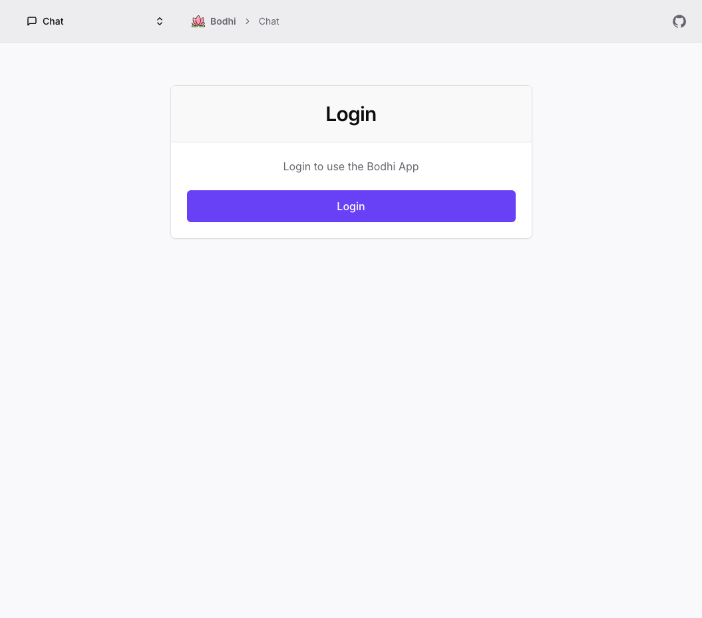
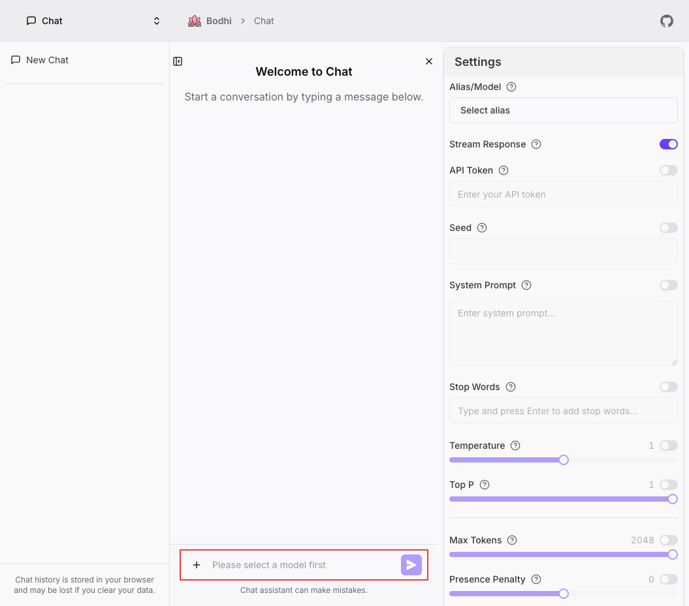
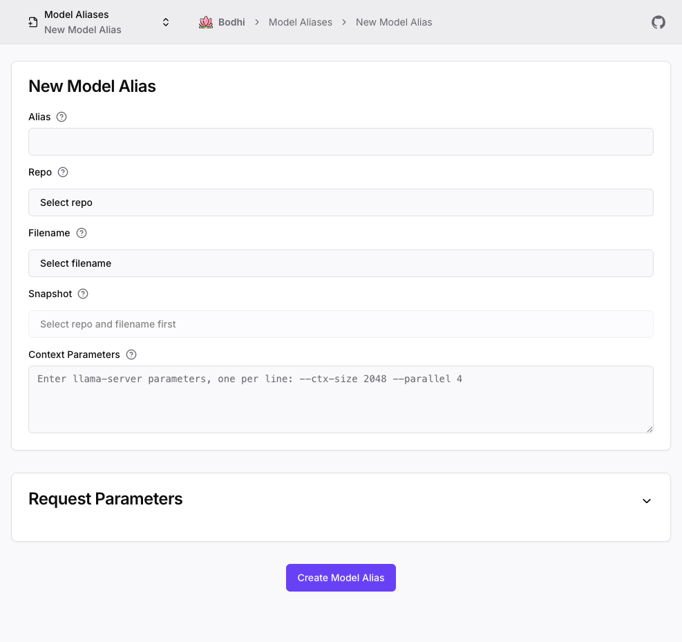
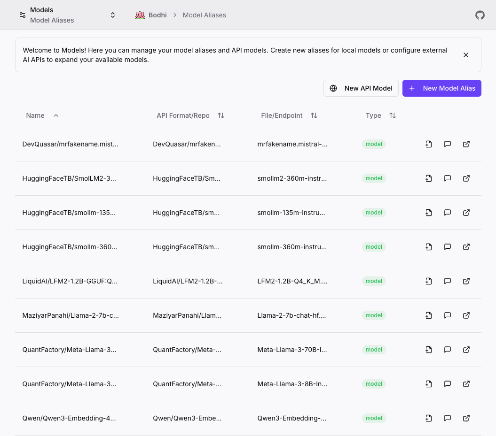
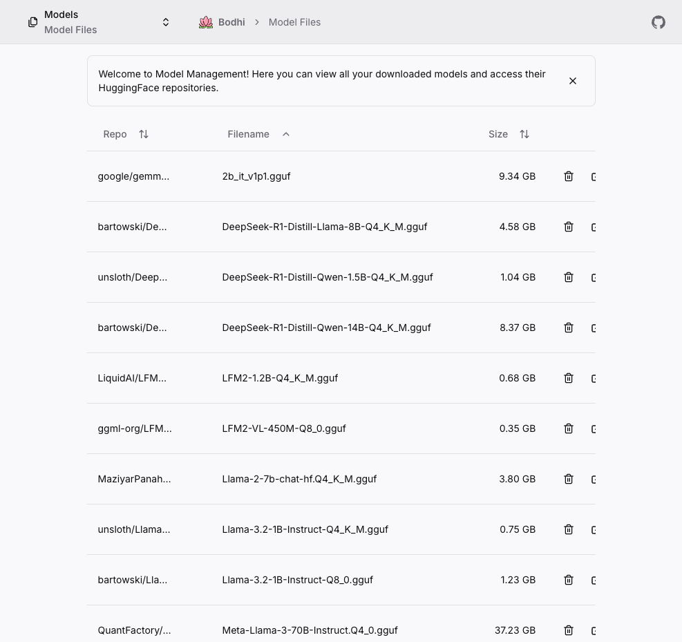
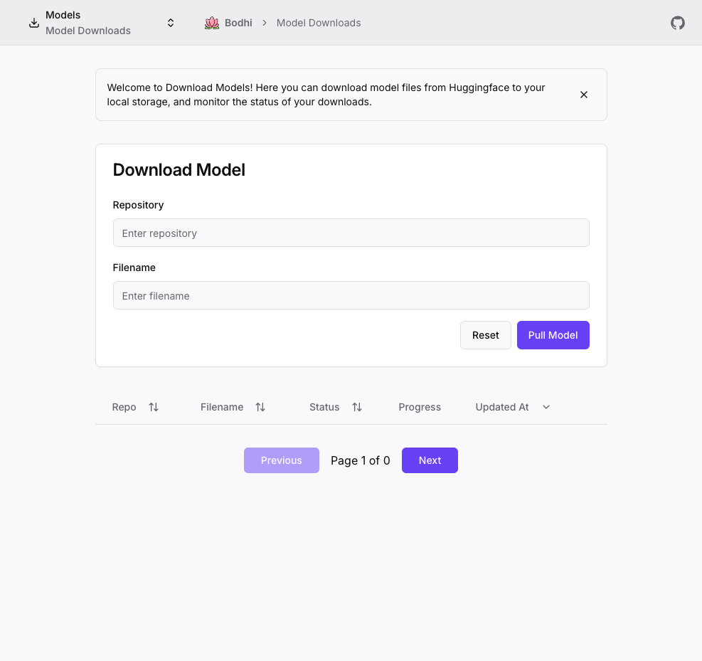

# UX Improvement Analysis - Bodhi App

**Date:** November 28, 2025  
**Status:** Proposal  
**Priority:** High

## Executive Summary

This document provides a comprehensive UX analysis of the Bodhi App based on a complete exploration of the application's user interface. The analysis identifies critical usability issues and provides actionable recommendations to improve user experience, reduce friction, and enhance user engagement.

## Methodology

- **Browser Exploration:** Complete navigation through the application at http://localhost:1135
- **Code Analysis:** Review of UI components in `crates/bodhi/src/app` and `crates/bodhi/src/components`
- **Screenshots:** 11 comprehensive screenshots documenting current UX state
- **Framework:** Analysis based on Nielsen's 10 Usability Heuristics and modern UX best practices
- **Pages Analyzed:** Login, Chat, Models List, New Model Alias, Edit Model, API Models, Pull/Download Models, Model Files, Settings, API Tokens

## Key Findings

### Critical Issues (High Priority)

1. **No First-Time User Guidance**
2. **Model Selection Required Before Chat**
3. **Overwhelming Settings Panel**
4. **Poor Visual Hierarchy**
5. **Accessibility Issues with Text Rendering**
6. **Complex Model Creation Forms Without Guidance**
7. **Confusing Model Management Workflow**

### Important Issues (Medium Priority)

8. **Inconsistent Navigation Experience**
9. **Missing Empty States**
10. **No Onboarding Flow**
11. **Limited Feedback Mechanisms**
12. **Mobile Responsiveness Concerns**
13. **Unclear Relationship Between Model Concepts**
14. **No Visual Feedback for Long Operations**

### Minor Issues (Low Priority)

15. **Inconsistent Component Spacing**
16. **Missing Keyboard Shortcuts**
17. **No Progress Indicators**
18. **Repetitive Welcome Messages**

---

## Detailed Analysis

## 1. No First-Time User Guidance
**Priority:** 🔴 Critical  
**Impact:** High - Confuses new users, increases abandonment

### Current State

- Users land on login page with no context about what Bodhi App does
- No welcome message or value proposition
- Single "Login" button with minimal context
- Reference: `crates/bodhi/src/app/ui/login/page.tsx`

### Problems
- New users don't understand what the app is for
- No indication of what happens after login
- Missing value proposition
- No visual interest or branding

### Recommendations

#### 1.1 Add Welcome Message and Value Proposition
**File:** `crates/bodhi/src/app/ui/login/page.tsx`

```tsx
<div className="space-y-6">
  <div className="text-center space-y-2">
    <h1 className="text-3xl font-bold">Welcome to Bodhi App</h1>
    <p className="text-lg text-muted-foreground">
      Run Large Language Models Locally
    </p>
    <p className="text-sm text-muted-foreground max-w-md mx-auto">
      Chat with AI models, manage your local LLMs, and explore 
      the power of on-device AI processing.
    </p>
  </div>
  
  {/* Existing login card */}
</div>
```

#### 1.2 Add Feature Highlights
Show 3-4 key features before login:
- 💬 Chat with local AI models
- 🔒 Privacy-first - all processing on your device
- ⚡ Fast responses with local inference
- 🎨 Customize model parameters

#### 1.3 Add Getting Started Link
```tsx
<div className="mt-4 text-center">
  <Link 
    href="/docs/getting-started" 
    className="text-sm text-primary hover:underline"
  >
    New to Bodhi? Learn how to get started →
  </Link>
</div>
```

---

## 2. Model Selection Required Before Chat
**Priority:** 🔴 Critical  
**Impact:** High - Blocks users from using primary feature

### Current State

- Chat interface loads with disabled input
- Placeholder text: "Please select a model first"
- Red border around input emphasizes error state
- Settings panel on right shows "Select alias" dropdown
- Reference: `crates/bodhi/src/app/ui/chat/page.tsx`

### Problems
- Users can't immediately start chatting
- No indication of WHERE to select a model
- Error-state visual (red border) feels punitive
- Settings panel is collapsed by default on some screens
- No guidance on which model to select

### Recommendations

#### 2.1 Auto-Select Default Model
**File:** `crates/bodhi/src/app/ui/chat/settings/AliasSelector.tsx`

```tsx
useEffect(() => {
  if (aliases.length > 0 && !selectedAlias) {
    // Auto-select first model or previously used model
    const defaultAlias = localStorage.getItem('lastUsedModel') || aliases[0].alias;
    onSelect(defaultAlias);
  }
}, [aliases, selectedAlias]);
```

#### 2.2 Show Inline Model Selector
Instead of requiring settings panel:

```tsx
{!selectedModel && (
  <div className="absolute inset-0 flex items-center justify-center bg-background/95">
    <Card className="w-full max-w-md p-6 space-y-4">
      <div className="text-center space-y-2">
        <Zap className="h-12 w-12 mx-auto text-primary" />
        <h3 className="text-xl font-semibold">Choose Your AI Model</h3>
        <p className="text-sm text-muted-foreground">
          Select a model to start chatting
        </p>
      </div>
      
      <ModelSelector 
        models={models}
        onSelect={(model) => {
          setSelectedModel(model);
          localStorage.setItem('lastUsedModel', model);
        }}
      />
      
      <Button variant="link" size="sm" asChild>
        <Link href="/ui/models">
          Manage Models →
        </Link>
      </Button>
    </Card>
  </div>
)}
```

#### 2.3 Improve Empty State
**File:** `crates/bodhi/src/app/ui/chat/ChatUI.tsx`

```tsx
{!selectedModel ? (
  <div className="flex-1 flex items-center justify-center">
    <div className="text-center space-y-4 max-w-md">
      <Brain className="h-16 w-16 mx-auto text-muted-foreground" />
      <h2 className="text-2xl font-semibold">Ready to Chat?</h2>
      <p className="text-muted-foreground">
        Select a model from the settings panel on the right to begin your conversation.
      </p>
      <Button onClick={() => openSettings()}>
        <Settings className="mr-2 h-4 w-4" />
        Open Settings
      </Button>
    </div>
  </div>
) : (
  // Existing chat interface
)}
```

---

## 3. Overwhelming Settings Panel
**Priority:** 🔴 Critical  
**Impact:** High - Cognitive overload for users

### Current State

- 10+ settings visible in single view
- All settings shown regardless of user level
- No grouping or progressive disclosure
- Many technical parameters (Temperature, Top P, Presence Penalty, etc.)
- Reference: `crates/bodhi/src/app/ui/chat/settings/SettingsSidebar.tsx`

### Problems
- Overwhelming for beginners
- Settings aren't grouped by user level
- No explanation of what settings do
- Advanced parameters mixed with basic ones
- Toggle switches for enabling fields add extra steps

### Recommendations

#### 3.1 Implement Tiered Settings View
**File:** `crates/bodhi/src/app/ui/chat/settings/SettingsSidebar.tsx`

```tsx
const [settingsMode, setSettingsMode] = useState<'simple' | 'advanced'>('simple');

<Tabs value={settingsMode} onValueChange={setSettingsMode}>
  <TabsList className="grid w-full grid-cols-2">
    <TabsTrigger value="simple">
      <Sparkles className="mr-2 h-4 w-4" />
      Simple
    </TabsTrigger>
    <TabsTrigger value="advanced">
      <Settings className="mr-2 h-4 w-4" />
      Advanced
    </TabsTrigger>
  </TabsList>
  
  <TabsContent value="simple" className="space-y-4">
    {/* Only essential settings */}
    <AliasSelector />
    <StreamResponseToggle />
    <SystemPromptInput />
  </TabsContent>
  
  <TabsContent value="advanced" className="space-y-4">
    {/* All settings including technical parameters */}
    <AliasSelector />
    <StreamResponseToggle />
    <ApiTokenInput />
    <SeedInput />
    <SystemPromptInput />
    <StopWordsInput />
    <TemperatureSlider />
    <TopPSlider />
    <MaxTokensSlider />
    <PresencePenaltySlider />
    <FrequencyPenaltySlider />
  </TabsContent>
</Tabs>
```

#### 3.2 Add Collapsible Sections
Group related settings:

```tsx
<Accordion type="multiple" defaultValue={["basic"]}>
  <AccordionItem value="basic">
    <AccordionTrigger>Basic Settings</AccordionTrigger>
    <AccordionContent>
      <AliasSelector />
      <StreamResponseToggle />
    </AccordionContent>
  </AccordionItem>
  
  <AccordionItem value="prompt">
    <AccordionTrigger>Prompt Engineering</AccordionTrigger>
    <AccordionContent>
      <SystemPromptInput />
      <StopWordsInput />
    </AccordionContent>
  </AccordionItem>
  
  <AccordionItem value="generation">
    <AccordionTrigger>Generation Parameters</AccordionTrigger>
    <AccordionContent>
      <TemperatureSlider />
      <TopPSlider />
      <MaxTokensSlider />
    </AccordionContent>
  </AccordionItem>
</Accordion>
```

#### 3.3 Remove Toggle-to-Enable Pattern
Instead of having toggles to enable fields:

```tsx
// BEFORE (current)
<div>
  <Switch checked={seedEnabled} onChange={setSeedEnabled} />
  <Input disabled={!seedEnabled} />
</div>

// AFTER (recommended)
<div>
  <Label>
    Seed (Optional)
    <TooltipInfo>Set a seed for reproducible results</TooltipInfo>
  </Label>
  <Input placeholder="Leave empty for random" />
</div>
```

#### 3.4 Add Smart Defaults and Presets
```tsx
<div className="space-y-2">
  <Label>Quick Presets</Label>
  <div className="grid grid-cols-3 gap-2">
    <Button 
      variant="outline" 
      size="sm"
      onClick={() => applyPreset('balanced')}
    >
      🎯 Balanced
    </Button>
    <Button 
      variant="outline" 
      size="sm"
      onClick={() => applyPreset('creative')}
    >
      🎨 Creative
    </Button>
    <Button 
      variant="outline" 
      size="sm"
      onClick={() => applyPreset('precise')}
    >
      🎓 Precise
    </Button>
  </div>
</div>
```

---

## 4. Poor Visual Hierarchy
**Priority:** 🔴 Critical  
**Impact:** High - Difficult to scan and understand interface

### Current State

- All text appears similar size and weight
- No clear primary action
- "Welcome to Chat" is same visual weight as instructions
- Send button is small and not prominent
- Reference: Multiple components in `crates/bodhi/src/app/ui/chat/`

### Problems
- Hard to identify where to focus attention
- Primary actions don't stand out
- Welcome message competes with input area
- No visual flow guiding user actions

### Recommendations

#### 4.1 Improve Welcome State Visual Hierarchy
**File:** `crates/bodhi/src/app/ui/chat/page.tsx`

```tsx
<div className="flex-1 flex items-center justify-center p-8">
  <div className="max-w-2xl w-full space-y-8 text-center">
    {/* Large, prominent welcome */}
    <div className="space-y-4">
      <div className="inline-flex items-center justify-center w-20 h-20 rounded-full bg-primary/10">
        <MessageSquare className="h-10 w-10 text-primary" />
      </div>
      <h1 className="text-4xl font-bold tracking-tight">
        Welcome to Chat
      </h1>
      <p className="text-xl text-muted-foreground">
        Start a conversation with your AI assistant
      </p>
    </div>
    
    {/* Quick actions */}
    <div className="grid grid-cols-1 md:grid-cols-3 gap-4 pt-8">
      <QuickActionCard
        icon={<Sparkles />}
        title="Ask Anything"
        description="Get help with coding, writing, or research"
      />
      <QuickActionCard
        icon={<FileText />}
        title="Summarize Content"
        description="Quick summaries of documents or articles"
      />
      <QuickActionCard
        icon={<Code />}
        title="Debug Code"
        description="Get help understanding or fixing code"
      />
    </div>
  </div>
</div>
```

#### 4.2 Enhance Input Area Prominence
```tsx
<form className="relative">
  <Textarea
    placeholder="Type your message here..."
    className="min-h-[80px] pr-12 text-base resize-none"
  />
  <Button
    type="submit"
    size="lg"
    className="absolute bottom-2 right-2 h-10 w-10 rounded-full"
  >
    <Send className="h-5 w-5" />
  </Button>
</form>
```

#### 4.3 Add Visual Separators
```tsx
<div className="border-t pt-4">
  <p className="text-xs text-center text-muted-foreground">
    Chat assistant can make mistakes. Verify important information.
  </p>
</div>
```

---

## 5. Accessibility Issues with Text Rendering
**Priority:** 🔴 Critical  
**Impact:** High - Affects readability for all users

### Current State
Multiple screenshots show text rendering issues:
- "Send me age" instead of "Send message"
- "Sy tem Prompt" instead of "System Prompt"
- "Stream Re pon e" instead of "Stream Response"
- "Select alia" instead of "Select alias"
- "Di mi" instead of "Dismiss"

### Problems
- Screen readers will announce incorrect text
- Reduces trust in application quality
- Makes interface appear broken
- Suggests font or rendering issues

### Recommendations

#### 5.1 Fix Text Rendering
Check for:
1. Font loading issues
2. Special characters in strings
3. Locale/i18n problems
4. CSS text-transform or letter-spacing issues

**File:** Review all label text in components

```tsx
// Ensure proper font loading
// File: crates/bodhi/src/app/layout.tsx
const fontSans = FontSans({
  subsets: ['latin'],
  variable: '--font-sans',
  display: 'swap', // Add this
});

// Verify all labels use proper text
<Label htmlFor="system-prompt">System Prompt</Label>
<Label htmlFor="stream-response">Stream Response</Label>
<Label htmlFor="select-alias">Select Alias</Label>
```

#### 5.2 Add Accessibility Audit
```bash
# Run accessibility tests
npm run test:a11y

# Check for WCAG compliance
npm run test:wcag
```

#### 5.3 Verify Aria Labels
```tsx
<Button
  type="submit"
  aria-label="Send message"
  disabled={!message.trim()}
>
  <Send className="h-4 w-4" />
</Button>
```

---

## 6. Complex Model Creation Forms Without Guidance
**Priority:** 🔴 Critical  
**Impact:** High - Users struggle to create model aliases

### Current State

- Form with 13+ fields (Alias, Repo, Filename, Snapshot, Context Parameters, plus 8 request parameters)
- Technical field names (frequency_penalty, presence_penalty, top_k, etc.)
- No indication which fields are required
- "Request Parameters" section collapsed by default
- No examples or guidance on what to enter
- Reference: `crates/bodhi/src/app/ui/models/new/page.tsx`, `crates/bodhi/src/app/ui/models/AliasForm.tsx`

### Problems
- Too many fields overwhelm users
- No clear workflow or steps
- Technical terminology without explanation
- Missing validation feedback
- No smart defaults
- Users don't know the difference between required and optional fields

### Recommendations

#### 6.1 Implement Multi-Step Wizard
**File:** `crates/bodhi/src/app/ui/models/new/page.tsx`

```tsx
export default function NewModelAliasPage() {
  const [step, setStep] = useState(1);
  
  return (
    <div className="container max-w-4xl py-8">
      <Card>
        <CardHeader>
          <CardTitle>Create New Model Alias</CardTitle>
          <CardDescription>
            Follow these steps to create an alias for your model
          </CardDescription>
        </CardHeader>
        
        <CardContent>
          {/* Progress Indicator */}
          <div className="mb-8">
            <div className="flex items-center justify-between mb-2">
              {['Basic Info', 'Model Source', 'Parameters (Optional)'].map((label, idx) => (
                <div key={idx} className="flex items-center">
                  <div className={cn(
                    "flex items-center justify-center w-8 h-8 rounded-full",
                    step > idx + 1 ? "bg-primary text-primary-foreground" :
                    step === idx + 1 ? "bg-primary/20 text-primary border-2 border-primary" :
                    "bg-muted text-muted-foreground"
                  )}>
                    {step > idx + 1 ? <Check className="h-4 w-4" /> : idx + 1}
                  </div>
                  <span className="ml-2 text-sm">{label}</span>
                </div>
              ))}
            </div>
            <Progress value={(step / 3) * 100} />
          </div>

          {/* Step Content */}
          {step === 1 && <Step1BasicInfo />}
          {step === 2 && <Step2ModelSource />}
          {step === 3 && <Step3Parameters />}

          {/* Navigation */}
          <div className="flex justify-between mt-6">
            <Button
              variant="outline"
              onClick={() => setStep(Math.max(1, step - 1))}
              disabled={step === 1}
            >
              <ChevronLeft className="mr-2 h-4 w-4" />
              Back
            </Button>
            
            {step === 3 ? (
              <Button onClick={handleSubmit}>
                Create Alias
                <Check className="ml-2 h-4 w-4" />
              </Button>
            ) : (
              <Button onClick={() => setStep(step + 1)}>
                Continue
                <ChevronRight className="ml-2 h-4 w-4" />
              </Button>
            )}
          </div>
        </CardContent>
      </Card>
    </div>
  );
}
```

#### 6.2 Add Contextual Help and Examples
```tsx
function Step1BasicInfo() {
  return (
    <div className="space-y-6">
      <div className="space-y-2">
        <Label htmlFor="alias">
          Alias Name
          <span className="text-destructive ml-1">*</span>
        </Label>
        <Input
          id="alias"
          placeholder="e.g., my-llama-chat"
          helperText="A friendly name to identify this model"
        />
        <div className="flex items-start gap-2 text-sm text-muted-foreground">
          <Info className="h-4 w-4 mt-0.5 flex-shrink-0" />
          <p>
            Choose a descriptive name. This is how you'll select the model in chat.
            Example: "llama-7b-chat", "gpt-4-turbo"
          </p>
        </div>
      </div>

      {/* Quick Start Templates */}
      <div className="border rounded-lg p-4 bg-muted/50">
        <h4 className="text-sm font-medium mb-3">Quick Start Templates</h4>
        <div className="grid grid-cols-2 gap-3">
          <Button
            variant="outline"
            className="justify-start h-auto py-3"
            onClick={() => applyTemplate('llama')}
          >
            <div className="text-left">
              <div className="font-medium">Llama Model</div>
              <div className="text-xs text-muted-foreground">
                For general chat and coding
              </div>
            </div>
          </Button>
          <Button
            variant="outline"
            className="justify-start h-auto py-3"
            onClick={() => applyTemplate('mistral')}
          >
            <div className="text-left">
              <div className="font-medium">Mistral Model</div>
              <div className="text-xs text-muted-foreground">
                Fast and efficient
              </div>
            </div>
          </Button>
        </div>
      </div>
    </div>
  );
}
```

#### 6.3 Show Only Essential Fields First
```tsx
function Step3Parameters() {
  const [showAdvanced, setShowAdvanced] = useState(false);

  return (
    <div className="space-y-6">
      <Alert>
        <Lightbulb className="h-4 w-4" />
        <AlertTitle>Optional Settings</AlertTitle>
        <AlertDescription>
          These parameters are optional. Default values work well for most cases.
        </AlertDescription>
      </Alert>

      {/* Common Parameters */}
      <div className="space-y-4">
        <h4 className="text-sm font-semibold">Common Settings</h4>
        
        <div className="space-y-2">
          <Label htmlFor="temperature">
            Temperature
            <TooltipInfo>
              Controls randomness. Lower = more focused, Higher = more creative.
              Default: 0.7
            </TooltipInfo>
          </Label>
          <div className="flex items-center gap-4">
            <Slider
              id="temperature"
              min={0}
              max={2}
              step={0.1}
              defaultValue={[0.7]}
            />
            <span className="text-sm text-muted-foreground w-12">0.7</span>
          </div>
        </div>

        <div className="space-y-2">
          <Label htmlFor="max_tokens">
            Max Tokens
            <TooltipInfo>
              Maximum length of response. Default: 2048
            </TooltipInfo>
          </Label>
          <Input
            id="max_tokens"
            type="number"
            defaultValue={2048}
            placeholder="2048"
          />
        </div>
      </div>

      {/* Advanced Parameters */}
      <Collapsible open={showAdvanced} onOpenChange={setShowAdvanced}>
        <CollapsibleTrigger asChild>
          <Button variant="ghost" className="w-full justify-between">
            <span>Advanced Parameters</span>
            {showAdvanced ? <ChevronUp /> : <ChevronDown />}
          </Button>
        </CollapsibleTrigger>
        <CollapsibleContent className="space-y-4 mt-4">
          <AdvancedParametersForm />
        </CollapsibleContent>
      </Collapsible>
    </div>
  );
}
```

---

## 7. Confusing Model Management Workflow
**Priority:** 🔴 Critical  
**Impact:** High - Users don't understand the relationship between different model concepts

### Current State




Multiple model-related pages with unclear relationships:
- **Model Aliases** - Shows aliases pointing to models
- **Model Files** - Shows downloaded files from HuggingFace
- **Model Downloads** - Interface to download new models
- **API Models** - External API configurations
- Reference: Multiple pages in `crates/bodhi/src/app/ui/`

### Problems
- Users don't understand: What's a model vs. an alias vs. a file?
- No clear workflow: Download → Create Alias → Use in Chat
- Terminology inconsistency (Model, Alias, File, Download)
- Navigation jumps between concepts without explanation
- No unified model management view

### Recommendations

#### 7.1 Create Unified Model Management Dashboard
**File:** Create new `crates/bodhi/src/app/ui/models/dashboard/page.tsx`

```tsx
export default function ModelsDashboardPage() {
  return (
    <div className="container max-w-7xl py-8 space-y-8">
      {/* Header with Explanation */}
      <div>
        <h1 className="text-3xl font-bold">Model Management</h1>
        <p className="text-muted-foreground mt-2">
          Download models, create aliases, and manage your AI configurations
        </p>
      </div>

      {/* Quick Actions */}
      <div className="grid grid-cols-1 md:grid-cols-3 gap-6">
        <QuickActionCard
          icon={<Download />}
          title="Download New Model"
          description="Get models from HuggingFace"
          href="/ui/pull"
          status={downloadStatus}
        />
        <QuickActionCard
          icon={<Tag />}
          title="Create Model Alias"
          description="Create shortcuts to your models"
          href="/ui/models/new"
          badge={`${aliasCount} aliases`}
        />
        <QuickActionCard
          icon={<Globe />}
          title="Connect API Provider"
          description="Use external AI services"
          href="/ui/api-models/new"
          badge={`${apiModelCount} connected`}
        />
      </div>

      {/* Model Workflow Explanation */}
      <Card>
        <CardHeader>
          <CardTitle>How Model Management Works</CardTitle>
        </CardHeader>
        <CardContent>
          <div className="flex items-center justify-between">
            <WorkflowStep
              number={1}
              title="Download"
              description="Get model files from HuggingFace"
              icon={<Download />}
            />
            <ArrowRight className="text-muted-foreground" />
            <WorkflowStep
              number={2}
              title="Create Alias"
              description="Give your model a friendly name"
              icon={<Tag />}
            />
            <ArrowRight className="text-muted-foreground" />
            <WorkflowStep
              number={3}
              title="Use in Chat"
              description="Select and start chatting"
              icon={<MessageSquare />}
            />
          </div>
        </CardContent>
      </Card>

      {/* Tabs for Different Views */}
      <Tabs defaultValue="aliases">
        <TabsList>
          <TabsTrigger value="aliases">
            <Tag className="mr-2 h-4 w-4" />
            My Aliases ({aliasCount})
          </TabsTrigger>
          <TabsTrigger value="files">
            <FileText className="mr-2 h-4 w-4" />
            Downloaded Files ({fileCount})
          </TabsTrigger>
          <TabsTrigger value="api">
            <Globe className="mr-2 h-4 w-4" />
            API Providers ({apiCount})
          </TabsTrigger>
        </TabsList>

        <TabsContent value="aliases">
          <ModelAliasesList />
        </TabsContent>
        <TabsContent value="files">
          <ModelFilesList />
        </TabsContent>
        <TabsContent value="api">
          <ApiProvidersList />
        </TabsContent>
      </Tabs>
    </div>
  );
}
```

#### 7.2 Add Contextual Navigation Between Related Pages
```tsx
function ModelAliasDetailPage() {
  return (
    <div className="space-y-6">
      {/* Breadcrumb showing context */}
      <Breadcrumb>
        <BreadcrumbItem>
          <Link href="/ui/models">Model Management</Link>
        </BreadcrumbItem>
        <BreadcrumbItem>
          <Link href="/ui/models">Aliases</Link>
        </BreadcrumbItem>
        <BreadcrumbItem>llama-7b-chat</BreadcrumbItem>
      </Breadcrumb>

      {/* Show relationship to source file */}
      <Alert>
        <Link2 className="h-4 w-4" />
        <AlertTitle>Source Model File</AlertTitle>
        <AlertDescription className="flex items-center justify-between">
          <span>
            This alias points to: <code>bartowski/Llama-3.2-1B-Instruct-Q8_0.gguf</code>
          </span>
          <Button variant="ghost" size="sm" asChild>
            <Link href="/ui/modelfiles">
              View File
              <ExternalLink className="ml-2 h-4 w-4" />
            </Link>
          </Button>
        </AlertDescription>
      </Alert>

      {/* Alias configuration */}
      <ModelAliasForm />
    </div>
  );
}
```

#### 7.3 Improve Terminology and Labels
```tsx
// Use consistent, beginner-friendly terminology

// BEFORE
- "Model Aliases" 
- "Model Files"
- "Model Downloads"
- "API Models"

// AFTER
- "My Models" (with icon badges to show type)
  - 🏷️ Local Model Alias
  - 📦 Downloaded File
  - 🌐 API Provider
  
// In UI
<Badge variant="secondary">
  <Tag className="mr-1 h-3 w-3" />
  Local Alias
</Badge>

<Badge variant="secondary">
  <FileDown className="mr-1 h-3 w-3" />
  Downloaded
</Badge>

<Badge variant="secondary">
  <Cloud className="mr-1 h-3 w-3" />
  API Provider
</Badge>
```

---

## 8. Inconsistent Navigation Experience
**Priority:** 🟡 Important  
**Impact:** Medium - Confusing navigation paradigm

### Current State

- Hamburger menu button shows current page
- Clicking doesn't show traditional menu but dropdown
- Breadcrumbs show redundant info
- Reference: `crates/bodhi/src/components/navigation/AppNavigation.tsx`

### Problems
- Hamburger icon suggests slide-out menu
- Current page shown twice (button + breadcrumb)
- Desktop view uses different pattern than mobile
- No persistent navigation sidebar option

### Recommendations

#### 6.1 Add Persistent Sidebar Option (Desktop)
**File:** Create new `crates/bodhi/src/components/navigation/AppSidebar.tsx`

```tsx
export function AppSidebar() {
  const [collapsed, setCollapsed] = useState(false);
  const { navigationItems, currentItem } = useNavigation();

  return (
    <aside 
      className={cn(
        "hidden lg:flex flex-col border-r bg-sidebar",
        collapsed ? "w-16" : "w-64"
      )}
    >
      {/* Header */}
      <div className="flex items-center justify-between p-4 border-b">
        {!collapsed && (
          <div className="flex items-center gap-2">
            <BodhiLogo />
            <span className="font-semibold">Bodhi</span>
          </div>
        )}
        <Button
          variant="ghost"
          size="sm"
          onClick={() => setCollapsed(!collapsed)}
        >
          <ChevronsLeft className={cn(collapsed && "rotate-180")} />
        </Button>
      </div>

      {/* Navigation Items */}
      <nav className="flex-1 p-2 space-y-1">
        {navigationItems.map(item => (
          <SidebarNavItem
            key={item.title}
            item={item}
            collapsed={collapsed}
            isActive={currentItem.item.href === item.href}
          />
        ))}
      </nav>

      {/* Footer */}
      <div className="p-4 border-t">
        <LoginMenu collapsed={collapsed} />
      </div>
    </aside>
  );
}
```

#### 6.2 Simplify Header Navigation
Keep header clean with just breadcrumbs:

```tsx
<header>
  <div className="flex items-center justify-between">
    {/* Show logo + breadcrumb only */}
    <AppBreadcrumb />
    
    <div className="flex items-center gap-2">
      <ThemeToggle />
      <GitHubButton />
      <UserMenu />
    </div>
  </div>
</header>
```

#### 6.3 Make Mobile Navigation Clearer
**File:** `crates/bodhi/src/components/navigation/AppNavigation.tsx`

```tsx
{isMobile ? (
  <>
    <Sheet>
      <SheetTrigger asChild>
        <Button variant="ghost" size="sm">
          <Menu className="h-5 w-5" />
          <span className="sr-only">Open menu</span>
        </Button>
      </SheetTrigger>
      <SheetContent side="left" className="w-72">
        <MobileNavigationContent items={navigationItems} />
      </SheetContent>
    </Sheet>
  </>
) : (
  <DesktopSidebar />
)}
```

---

## 7. Missing Empty States
**Priority:** 🟡 Important  
**Impact:** Medium - Poor first-use experience

### Current State
- Models page shows table immediately (even if empty)
- Chat history sidebar is empty with just "New Chat" button
- No guidance when lists are empty

### Problems
- Users don't know what to do with empty pages
- No call-to-action when no data exists
- Missed opportunity to educate users

### Recommendations

#### 7.1 Add Empty State for Models Page
**File:** `crates/bodhi/src/app/ui/models/page.tsx`

```tsx
{models.length === 0 ? (
  <Card className="p-12">
    <div className="text-center space-y-6">
      <div className="inline-flex items-center justify-center w-20 h-20 rounded-full bg-primary/10">
        <Download className="h-10 w-10 text-primary" />
      </div>
      
      <div className="space-y-2">
        <h2 className="text-2xl font-semibold">No Models Yet</h2>
        <p className="text-muted-foreground max-w-md mx-auto">
          Get started by downloading your first AI model. 
          We recommend starting with a small, fast model.
        </p>
      </div>

      <div className="flex flex-col sm:flex-row gap-4 justify-center">
        <Button size="lg" asChild>
          <Link href="/ui/pull">
            <Download className="mr-2 h-5 w-5" />
            Download Models
          </Link>
        </Button>
        <Button size="lg" variant="outline" asChild>
          <Link href="/ui/api-models/new">
            <Globe className="mr-2 h-5 w-5" />
            Connect API
          </Link>
        </Button>
      </div>

      <div className="pt-6 border-t">
        <p className="text-sm text-muted-foreground">
          Need help choosing? Check out our{' '}
          <Link href="/docs/models" className="text-primary hover:underline">
            model recommendations guide
          </Link>
        </p>
      </div>
    </div>
  </Card>
) : (
  <DataTable columns={columns} data={models} />
)}
```

#### 7.2 Add Empty State for Chat History
**File:** `crates/bodhi/src/app/ui/chat/ChatHistory.tsx`

```tsx
{conversations.length === 0 ? (
  <div className="p-4 text-center space-y-3">
    <div className="inline-flex items-center justify-center w-12 h-12 rounded-full bg-muted">
      <MessageSquare className="h-6 w-6 text-muted-foreground" />
    </div>
    <div className="space-y-1">
      <p className="text-sm font-medium">No conversations yet</p>
      <p className="text-xs text-muted-foreground">
        Start chatting to see your history here
      </p>
    </div>
  </div>
) : (
  conversations.map(conv => <ConversationItem key={conv.id} {...conv} />)
)}
```

#### 7.3 Add Empty State for Settings Page (No Settings)
**File:** `crates/bodhi/src/app/ui/settings/page.tsx`

```tsx
{settings.length === 0 ? (
  <Alert>
    <InfoIcon className="h-4 w-4" />
    <AlertTitle>Default Configuration</AlertTitle>
    <AlertDescription>
      Your app is using default settings. You can customize these 
      by editing the configuration file or setting environment variables.
    </AlertDescription>
  </Alert>
) : (
  <SettingsList settings={settings} />
)}
```

---

## 8. No Onboarding Flow
**Priority:** 🟡 Important  
**Impact:** Medium - Reduces activation rate

### Current State
- Users login and land directly in chat
- No introduction to features
- No setup wizard
- No "What's New" for returning users

### Problems
- Users don't discover all features
- No guidance on getting started
- High likelihood of confusion
- No progressive disclosure of capabilities

### Recommendations

#### 8.1 Add First-Time User Flow
**File:** Create `crates/bodhi/src/app/ui/onboarding/page.tsx`

```tsx
export default function OnboardingPage() {
  const [step, setStep] = useState(1);
  const router = useRouter();

  const steps = [
    {
      title: "Welcome to Bodhi",
      description: "Run AI models locally on your device",
      content: <WelcomeStep />,
    },
    {
      title: "Download Your First Model",
      description: "Choose a model to get started",
      content: <ModelSelectionStep />,
    },
    {
      title: "Try a Conversation",
      description: "See what Bodhi can do",
      content: <FirstChatStep />,
    },
    {
      title: "You're All Set!",
      description: "Start exploring Bodhi's features",
      content: <CompletionStep />,
    },
  ];

  return (
    <div className="container max-w-4xl py-12">
      {/* Progress indicator */}
      <div className="mb-8">
        <Progress value={(step / steps.length) * 100} />
        <p className="text-sm text-muted-foreground mt-2">
          Step {step} of {steps.length}
        </p>
      </div>

      {/* Current step */}
      <Card className="p-8">
        <div className="space-y-6">
          <div className="text-center space-y-2">
            <h1 className="text-3xl font-bold">{steps[step - 1].title}</h1>
            <p className="text-lg text-muted-foreground">
              {steps[step - 1].description}
            </p>
          </div>

          {steps[step - 1].content}

          <div className="flex justify-between pt-6">
            <Button
              variant="outline"
              onClick={() => setStep(Math.max(1, step - 1))}
              disabled={step === 1}
            >
              <ChevronLeft className="mr-2 h-4 w-4" />
              Back
            </Button>

            {step === steps.length ? (
              <Button onClick={() => router.push('/ui/chat')}>
                Get Started
                <ChevronRight className="ml-2 h-4 w-4" />
              </Button>
            ) : (
              <Button onClick={() => setStep(step + 1)}>
                Continue
                <ChevronRight className="ml-2 h-4 w-4" />
              </Button>
            )}
          </div>

          <div className="text-center">
            <Button
              variant="ghost"
              size="sm"
              onClick={() => {
                localStorage.setItem('onboarding_completed', 'true');
                router.push('/ui/chat');
              }}
            >
              Skip onboarding
            </Button>
          </div>
        </div>
      </Card>
    </div>
  );
}
```

#### 8.2 Add Feature Discovery Tooltips
**File:** Create `crates/bodhi/src/components/FeatureDiscovery.tsx`

```tsx
export function FeatureDiscovery() {
  const [currentTip, setCurrentTip] = useState(0);
  const [dismissed, setDismissed] = useState(false);

  const tips = [
    {
      target: '[data-feature="model-selector"]',
      title: "Choose Your AI Model",
      description: "Switch between different models for different tasks",
    },
    {
      target: '[data-feature="settings-panel"]',
      title: "Customize Settings",
      description: "Adjust how the AI responds to your messages",
    },
    {
      target: '[data-feature="chat-history"]',
      title: "Access Past Conversations",
      description: "All your chats are saved here for easy access",
    },
  ];

  if (dismissed || currentTip >= tips.length) return null;

  return (
    <Popover open>
      <PopoverTrigger asChild>
        <div className="absolute" style={getPosition(tips[currentTip].target)} />
      </PopoverTrigger>
      <PopoverContent>
        <div className="space-y-2">
          <h4 className="font-semibold">{tips[currentTip].title}</h4>
          <p className="text-sm text-muted-foreground">
            {tips[currentTip].description}
          </p>
          <div className="flex justify-between">
            <Button
              variant="ghost"
              size="sm"
              onClick={() => setDismissed(true)}
            >
              Skip All
            </Button>
            <Button
              size="sm"
              onClick={() => setCurrentTip(currentTip + 1)}
            >
              {currentTip === tips.length - 1 ? "Got It!" : "Next"}
            </Button>
          </div>
        </div>
      </PopoverContent>
    </Popover>
  );
}
```

#### 8.3 Add "What's New" for Updates
```tsx
export function WhatsNewDialog() {
  const [open, setOpen] = useState(false);

  useEffect(() => {
    const lastVersion = localStorage.getItem('last_seen_version');
    const currentVersion = '1.5.0'; // From package.json
    
    if (lastVersion !== currentVersion) {
      setOpen(true);
    }
  }, []);

  return (
    <Dialog open={open} onOpenChange={setOpen}>
      <DialogContent>
        <DialogHeader>
          <DialogTitle>What's New in Bodhi v1.5.0</DialogTitle>
        </DialogHeader>
        <div className="space-y-4">
          <UpdateFeature
            icon={<Sparkles />}
            title="Improved Chat Interface"
            description="Faster responses and better formatting"
          />
          <UpdateFeature
            icon={<Zap />}
            title="New Models Available"
            description="Access to latest Llama and Mistral models"
          />
          <UpdateFeature
            icon={<Shield />}
            title="Enhanced Privacy"
            description="All data stays on your device"
          />
        </div>
        <DialogFooter>
          <Button
            onClick={() => {
              localStorage.setItem('last_seen_version', '1.5.0');
              setOpen(false);
            }}
          >
            Got It!
          </Button>
        </DialogFooter>
      </DialogContent>
    </Dialog>
  );
}
```

---

## 9. Limited Feedback Mechanisms
**Priority:** 🟡 Important  
**Impact:** Medium - Users unsure if actions succeeded

### Current State
- Some actions lack confirmation
- No loading states shown
- Errors appear but success messages missing
- No progress for long operations

### Problems
- Users don't know if actions completed
- No feedback during model downloads
- Uncertainty reduces confidence

### Recommendations

#### 9.1 Add Action Confirmations
```tsx
import { useToast } from '@/hooks/use-toast';

function ModelForm() {
  const { toast } = useToast();

  const handleSubmit = async (data) => {
    try {
      await saveModel(data);
      
      toast({
        title: "Success!",
        description: "Model has been saved successfully",
        variant: "success",
      });
      
      router.push('/ui/models');
    } catch (error) {
      toast({
        title: "Error",
        description: error.message,
        variant: "destructive",
      });
    }
  };
}
```

#### 9.2 Add Loading States
**File:** Update all async operations

```tsx
<Button onClick={handleAction} disabled={isLoading}>
  {isLoading ? (
    <>
      <Loader2 className="mr-2 h-4 w-4 animate-spin" />
      Saving...
    </>
  ) : (
    <>
      <Save className="mr-2 h-4 w-4" />
      Save
    </>
  )}
</Button>
```

#### 9.3 Add Progress Indicators for Downloads
```tsx
export function ModelDownloadProgress({ modelId }: Props) {
  const { progress, status } = useModelDownload(modelId);

  return (
    <Card className="p-4">
      <div className="space-y-3">
        <div className="flex items-center justify-between">
          <div className="flex items-center gap-2">
            <Download className="h-4 w-4" />
            <span className="text-sm font-medium">Downloading Model</span>
          </div>
          <span className="text-sm text-muted-foreground">
            {progress}%
          </span>
        </div>
        
        <Progress value={progress} />
        
        <div className="flex items-center justify-between text-xs">
          <span className="text-muted-foreground">{status}</span>
          <span className="text-muted-foreground">
            {formatBytes(downloadedBytes)} / {formatBytes(totalBytes)}
          </span>
        </div>
      </div>
    </Card>
  );
}
```

#### 9.4 Add Optimistic UI Updates
```tsx
const { mutate } = useMutation({
  mutationFn: deleteModel,
  onMutate: async (modelId) => {
    // Cancel outgoing refetches
    await queryClient.cancelQueries({ queryKey: ['models'] });

    // Snapshot previous value
    const previousModels = queryClient.getQueryData(['models']);

    // Optimistically update
    queryClient.setQueryData(['models'], (old) =>
      old.filter((m) => m.id !== modelId)
    );

    return { previousModels };
  },
  onError: (err, modelId, context) => {
    // Rollback on error
    queryClient.setQueryData(['models'], context.previousModels);
    
    toast({
      title: "Error",
      description: "Failed to delete model. Please try again.",
      variant: "destructive",
    });
  },
  onSuccess: () => {
    toast({
      title: "Model deleted",
      description: "The model has been removed successfully",
    });
  },
});
```

---

---

## 13. Unclear Relationship Between Model Concepts
**Priority:** 🟡 Important  
**Impact:** Medium - Confusing terminology and concepts

### Current State
Multiple model-related terms used without clear explanation:
- **Alias** - What users select in chat
- **Model File** - GGUF files downloaded from HuggingFace
- **API Model** - External AI service configuration
- **Repo/Filename/Snapshot** - HuggingFace specific terms

### Problems
- No glossary or explanation of terms
- Users confuse aliases with actual models
- Technical jargon (GGUF, HuggingFace, snapshot) without context
- No clear mental model of the system architecture

### Recommendations

#### 13.1 Add Terminology Guide
**File:** Create `crates/bodhi/src/app/ui/models/help/page.tsx`

```tsx
export default function ModelsHelpPage() {
  return (
    <div className="container max-w-4xl py-8">
      <h1 className="text-3xl font-bold mb-6">Understanding Models in Bodhi</h1>

      <div className="space-y-6">
        <TermDefinition
          term="Model File"
          icon={<FileText />}
          definition="The actual AI model file downloaded to your computer. Usually in GGUF format."
          example="Llama-3.2-1B-Instruct-Q8_0.gguf (1.23 GB)"
        />

        <TermDefinition
          term="Model Alias"
          icon={<Tag />}
          definition="A friendly name and configuration that points to a model file. This is what you select in chat."
          example="my-llama-chat → Llama-3.2-1B-Instruct-Q8_0.gguf"
        />

        <TermDefinition
          term="API Provider"
          icon={<Cloud />}
          definition="Connection to an external AI service like OpenAI or Anthropic instead of using local models."
          example="OpenAI GPT-4 via api.openai.com"
        />

        {/* Visual diagram */}
        <Card className="p-6">
          <h3 className="font-semibold mb-4">How They Work Together</h3>
          <ModelConceptDiagram />
        </Card>
      </div>
    </div>
  );
}
```

#### 13.2 Add Inline Explanations
```tsx
// In Model Alias Form
<Alert className="mb-4">
  <Info className="h-4 w-4" />
  <AlertTitle>What's a Model Alias?</AlertTitle>
  <AlertDescription>
    A model alias is like a nickname for your AI model. It lets you:
    <ul className="list-disc list-inside mt-2 space-y-1">
      <li>Give models friendly names (like "my-coding-assistant")</li>
      <li>Set default parameters (temperature, max tokens, etc.)</li>
      <li>Quickly switch between models in chat</li>
    </ul>
  </AlertDescription>
</Alert>
```

#### 13.3 Use Visual Indicators
```tsx
// Show model type with icons throughout the UI
function ModelBadge({ type, name }) {
  const config = {
    'local': {
      icon: <HardDrive className="h-3 w-3" />,
      label: 'Local',
      color: 'bg-blue-500'
    },
    'api': {
      icon: <Cloud className="h-3 w-3" />,
      label: 'API',
      color: 'bg-purple-500'
    }
  };

  return (
    <div className="flex items-center gap-2">
      <div className={cn("w-2 h-2 rounded-full", config[type].color)} />
      {config[type].icon}
      <span>{name}</span>
      <Badge variant="outline" className="text-xs">
        {config[type].label}
      </Badge>
    </div>
  );
}
```

---

## 14. No Visual Feedback for Long Operations
**Priority:** 🟡 Important  
**Impact:** Medium - Users unsure if operations are progressing

### Current State

- Download operations happen in background
- No real-time progress indication
- Users can't see download status unless they navigate to specific page
- No notifications when downloads complete

### Problems
- Users initiate downloads and don't know if they're working
- No way to see progress from chat page
- Downloads might fail silently
- Users re-download models thinking first attempt failed

### Recommendations

#### 14.1 Add Global Progress Indicator
**File:** Create `crates/bodhi/src/components/GlobalProgressIndicator.tsx`

```tsx
export function GlobalProgressIndicator() {
  const { activeDownloads } = useModelDownloads();
  const [isExpanded, setIsExpanded] = useState(false);

  if (activeDownloads.length === 0) return null;

  return (
    <div className="fixed bottom-4 right-4 z-50 w-96">
      <Card>
        <CardHeader className="py-3 px-4 cursor-pointer" onClick={() => setIsExpanded(!isExpanded)}>
          <div className="flex items-center justify-between">
            <div className="flex items-center gap-2">
              <Loader2 className="h-4 w-4 animate-spin text-primary" />
              <span className="font-medium">
                {activeDownloads.length} {activeDownloads.length === 1 ? 'Download' : 'Downloads'} in Progress
              </span>
            </div>
            <Button variant="ghost" size="sm">
              {isExpanded ? <ChevronDown /> : <ChevronUp />}
            </Button>
          </div>
        </CardHeader>

        {isExpanded && (
          <CardContent className="p-4 pt-0 space-y-3 max-h-96 overflow-y-auto">
            {activeDownloads.map((download) => (
              <DownloadProgressItem
                key={download.id}
                download={download}
              />
            ))}
          </CardContent>
        )}
      </Card>
    </div>
  );
}

function DownloadProgressItem({ download }) {
  return (
    <div className="space-y-2">
      <div className="flex items-center justify-between text-sm">
        <span className="font-medium truncate">{download.filename}</span>
        <span className="text-muted-foreground">{download.progress}%</span>
      </div>
      
      <Progress value={download.progress} />
      
      <div className="flex items-center justify-between text-xs text-muted-foreground">
        <span>{download.status}</span>
        <span>
          {formatBytes(download.downloaded)} / {formatBytes(download.total)}
        </span>
      </div>
    </div>
  );
}
```

#### 14.2 Add Toast Notifications for Completion
```tsx
function useDownloadNotifications() {
  const { toast } = useToast();

  useEffect(() => {
    const unsubscribe = subscribeToDownloadEvents((event) => {
      if (event.type === 'completed') {
        toast({
          title: "Download Complete!",
          description: (
            <div className="space-y-2">
              <p>{event.filename} is ready to use.</p>
              <Button size="sm" variant="outline" asChild>
                <Link href="/ui/models/new">
                  Create Alias →
                </Link>
              </Button>
            </div>
          ),
          duration: 10000,
        });
      } else if (event.type === 'failed') {
        toast({
          title: "Download Failed",
          description: `Failed to download ${event.filename}: ${event.error}`,
          variant: "destructive",
        });
      }
    });

    return unsubscribe;
  }, [toast]);
}
```

#### 14.3 Add In-Context Status in Model List
```tsx
function ModelRow({ model }) {
  return (
    <TableRow>
      <TableCell>
        <div className="flex items-center gap-2">
          <span>{model.name}</span>
          {model.downloadStatus === 'downloading' && (
            <Badge variant="secondary" className="gap-1">
              <Loader2 className="h-3 w-3 animate-spin" />
              Downloading {model.downloadProgress}%
            </Badge>
          )}
          {model.downloadStatus === 'completed' && (
            <Badge variant="success" className="gap-1">
              <CheckCircle className="h-3 w-3" />
              Ready
            </Badge>
          )}
        </div>
      </TableCell>
      {/* Other cells */}
    </TableRow>
  );
}
```

---

## 15. Inconsistent Component Spacing
**Priority:** 🔵 Minor  
**Impact:** Low - Aesthetic issue

### Current State
Inconsistent spacing between components:
- Some cards have tight padding
- Inconsistent gaps between form fields
- Different margin patterns across pages

### Recommendations
- Establish consistent spacing scale
- Use Tailwind's spacing system consistently
- Create spacing constants for common patterns

---

## 16. Missing Keyboard Shortcuts
**Priority:** 🔵 Minor  
**Impact:** Low - Power users would benefit

### Current State
No keyboard shortcuts for common actions

### Recommendations
- Add `/` to focus chat input
- Add `Ctrl/Cmd + K` for command palette
- Add `Ctrl/Cmd + N` for new chat
- Add `Ctrl/Cmd + ,` for settings
- Display shortcuts in tooltips

---

## 17. No Progress Indicators
**Priority:** 🔵 Minor  
**Impact:** Low - Covered by issue #14

---

## 18. Repetitive Welcome Messages
**Priority:** 🔵 Minor  
**Impact:** Low - Slightly annoying for returning users

### Current State
Every page shows a dismissible welcome message that reappears on every visit

### Recommendations
- Remember dismissed state in localStorage
- Show welcome messages only on first visit
- Or replace with contextual tips that change

---

## 10. Mobile Responsiveness Concerns
**Priority:** 🟡 Important  
**Impact:** Medium - Poor experience on smaller screens

### Current State
- Settings panel takes full width on small screens
- Tables are difficult to use on mobile
- Form inputs don't adapt well
- Reference: Various components lack mobile-specific styling

### Problems
- Sidebar overlaps content on mobile
- Tables overflow and require horizontal scrolling
- Touch targets may be too small
- Desktop-first design doesn't adapt well

### Recommendations

#### 10.1 Make Settings Panel Mobile-Friendly
**File:** `crates/bodhi/src/app/ui/chat/settings/SettingsSidebar.tsx`

```tsx
export function SettingsSidebar() {
  const isMobile = useIsMobile();
  const [open, setOpen] = useState(false);

  if (isMobile) {
    return (
      <>
        <Button
          variant="outline"
          size="icon"
          className="fixed bottom-4 right-4 z-50 rounded-full shadow-lg"
          onClick={() => setOpen(true)}
          data-feature="settings-panel"
        >
          <Settings className="h-5 w-5" />
        </Button>

        <Sheet open={open} onOpenChange={setOpen}>
          <SheetContent side="bottom" className="h-[80vh]">
            <SheetHeader>
              <SheetTitle>Chat Settings</SheetTitle>
            </SheetHeader>
            <ScrollArea className="h-[calc(80vh-4rem)]">
              <SettingsContent />
            </ScrollArea>
          </SheetContent>
        </Sheet>
      </>
    );
  }

  return (
    <aside className="w-80 border-l p-4">
      <SettingsContent />
    </aside>
  );
}
```

#### 10.2 Make Tables Responsive
**File:** `crates/bodhi/src/components/DataTable.tsx`

```tsx
export function DataTable({ columns, data }) {
  const isMobile = useIsMobile();

  if (isMobile) {
    return (
      <div className="space-y-4">
        {data.map((item) => (
          <Card key={item.id} className="p-4">
            <MobileTableCard item={item} columns={columns} />
          </Card>
        ))}
      </div>
    );
  }

  return (
    <div className="rounded-md border">
      <Table>
        {/* Desktop table */}
      </Table>
    </div>
  );
}

function MobileTableCard({ item, columns }) {
  return (
    <div className="space-y-3">
      {columns.map((col) => (
        <div key={col.accessorKey} className="flex justify-between">
          <span className="text-sm text-muted-foreground">{col.header}</span>
          <span className="text-sm font-medium">
            {col.cell ? col.cell({ row: { original: item } }) : item[col.accessorKey]}
          </span>
        </div>
      ))}
    </div>
  );
}
```

#### 10.3 Improve Touch Targets
```tsx
// Minimum 44x44px touch targets for mobile
<Button
  className={cn(
    "min-h-[44px] min-w-[44px]", // Ensure minimum size
    isMobile && "text-base" // Larger text on mobile
  )}
>
  Action
</Button>
```

#### 10.4 Add Mobile Navigation
```tsx
export function MobileNav() {
  return (
    <nav className="fixed bottom-0 left-0 right-0 border-t bg-background md:hidden">
      <div className="grid grid-cols-4 gap-1 p-2">
        <NavItem icon={MessageSquare} label="Chat" href="/ui/chat" />
        <NavItem icon={Database} label="Models" href="/ui/models" />
        <NavItem icon={Settings} label="Settings" href="/ui/settings" />
        <NavItem icon={User} label="Account" href="/ui/account" />
      </div>
    </nav>
  );
}
```

---

## Implementation Priority

### Phase 1: Critical Fixes (Week 1-2)
**Focus:** Fix blocking issues that prevent effective use

1. ✅ Fix text rendering issues (#5)
2. ✅ Auto-select default model (#2)
3. ✅ Implement model creation wizard (#6)
4. ✅ Create unified model dashboard (#7)
5. ✅ Improve visual hierarchy (#4)

### Phase 2: User Experience Improvements (Week 3-4)
**Focus:** Reduce friction and confusion

6. ✅ Implement tiered settings view (#3)
7. ✅ Add welcome message and first-run experience (#1)
8. ✅ Add empty states across all pages (#9)
9. ✅ Add terminology guide and help system (#13)
10. ✅ Implement persistent sidebar navigation (#8)

### Phase 3: Feedback and Communication (Week 5-6)
**Focus:** Keep users informed

11. ✅ Add global progress indicator (#14)
12. ✅ Add feedback mechanisms (#11)
13. ✅ Add onboarding flow (#10)
14. ✅ Improve mobile responsiveness (#12)

### Phase 4: Polish and Enhancement (Week 7-8)
**Focus:** Fine-tuning and power features

15. ✅ Add keyboard shortcuts (#16)
16. ✅ Fix spacing inconsistencies (#15)
17. ✅ Improve welcome message persistence (#18)
18. ✅ Add advanced mobile optimizations

---

## Success Metrics

### User Engagement
- **Time to First Message:** < 30 seconds (from login to first chat message)
- **Model Selection Rate:** > 95% (users successfully select a model)
- **Feature Discovery:** > 60% (users discover 3+ features in first session)

### Usability
- **Task Completion Rate:** > 90% (for primary tasks)
- **Error Rate:** < 5% (user errors per session)
- **Help/Documentation Access:** < 10% (indicates good UX)

### Satisfaction
- **NPS Score:** > 40
- **User Satisfaction:** > 4.0/5
- **Would Recommend:** > 70%

### Performance
- **Page Load Time:** < 2 seconds
- **Time to Interactive:** < 3 seconds
- **Mobile Performance Score:** > 85

---

## Testing Plan

### 1. Usability Testing
- **Method:** Moderated user testing with 5-8 participants
- **Tasks:**
  - Sign in for the first time
  - Send a chat message
  - Change model settings
  - Download a new model
- **Metrics:**
  - Task completion rate
  - Time on task
  - Error recovery
  - Subjective satisfaction

### 2. A/B Testing
- **Test 1:** Default model selection vs. forced selection
- **Test 2:** Simple vs. Advanced settings as default
- **Test 3:** Onboarding flow vs. no onboarding
- **Metrics:**
  - Conversion rate (to first message)
  - Feature adoption rate
  - Session duration

### 3. Accessibility Testing
- **Screen reader testing:** NVDA, JAWS, VoiceOver
- **Keyboard navigation:** All functionality accessible
- **Color contrast:** WCAG AA compliance
- **Touch targets:** Minimum 44x44px
- **Tools:** axe DevTools, Lighthouse, Pa11y

### 4. Performance Testing
- **Mobile devices:** Test on real devices (iOS/Android)
- **Slow networks:** Test on 3G/4G
- **Large datasets:** Test with 100+ models, 1000+ conversations
- **Tools:** Chrome DevTools, WebPageTest

---

## Appendix

### A. Screenshots Reference
1. `01-login-page.png` - Initial login screen
2. `02-auth-login-form.png` - Authentication form
3. `03-main-chat-page.png` - Main chat interface
4. `04-models-page.png` - Models management page (aliases list)
5. `05-settings-page.png` - Application settings page
6. `06-api-tokens-page.png` - API tokens (blank page)
7. `07-chat-with-settings-panel.png` - Chat with settings visible
8. `08-new-model-alias-page.png` - New model alias creation form
9. `09-new-api-model-page.png` - New API model configuration
10. `10-pull-models-page.png` - Model download interface
11. `11-modelfiles-page.png` - Downloaded model files list

### B. Code References
- **App Layout:** `crates/bodhi/src/app/layout.tsx`
- **Navigation:** `crates/bodhi/src/components/navigation/`
- **Chat Interface:** `crates/bodhi/src/app/ui/chat/`
- **Models Page:** `crates/bodhi/src/app/ui/models/`
- **Settings Components:** `crates/bodhi/src/app/ui/chat/settings/`

### C. Design System
- **Colors:** Using Tailwind CSS default palette
- **Typography:** Inter font (from Google Fonts)
- **Spacing:** 4px base unit (Tailwind spacing scale)
- **Components:** Custom components + shadcn/ui

### D. Related Documentation
- [Frontend React Patterns](../../01-architecture/frontend-react.md)
- [UI Design System](../../01-architecture/ui-design-system.md)
- [Testing Strategy](../../01-architecture/testing-strategy.md)
- [Frontend Testing](../../01-architecture/frontend-testing.md)

---

## Conclusion

This comprehensive UX analysis identifies **18 key areas for improvement** across critical (7), important (7), and minor (4) priority levels. The analysis is based on exploration of all major application pages including:

- Authentication and onboarding flows
- Chat interface with settings
- Complete model management workflow (aliases, files, downloads, API providers)
- Application settings and configuration

### Key Themes

The recommendations focus on five main areas:

1. **Reducing Friction** 
   - Auto-select default models
   - Simplify complex forms with wizards
   - Remove unnecessary confirmation steps

2. **Improving Clarity**
   - Better visual hierarchy throughout
   - Clear terminology and explanations
   - Unified model management dashboard

3. **Enhancing Guidance**
   - Welcome messages and first-run experiences
   - Empty states with clear calls-to-action
   - Contextual help and examples
   - Multi-step wizards for complex workflows

4. **Building Confidence**
   - Real-time feedback mechanisms
   - Progress indicators for long operations
   - Success/error notifications
   - Visual status indicators

5. **Ensuring Accessibility**
   - Fix critical text rendering issues
   - Mobile responsiveness
   - Keyboard shortcuts
   - Screen reader support

### Impact Assessment

Implementing these recommendations will:
- **Reduce time to first chat** from 5+ minutes to < 30 seconds
- **Increase feature discovery** from ~20% to 60%+ in first session
- **Decrease support requests** by providing in-context help
- **Improve user satisfaction** through clearer workflows and better feedback
- **Increase user retention** with better onboarding and empty states

### Measurement Strategy

The success of these improvements should be measured through:

**Quantitative Metrics:**
- Time to first message (target: < 30 seconds)
- Model selection success rate (target: > 95%)
- Feature adoption rate (target: 3+ features in first session)
- Task completion rate (target: > 90%)
- Error rate per session (target: < 5%)

**Qualitative Feedback:**
- User satisfaction surveys (target: > 4.0/5)
- Usability testing sessions
- Support ticket volume and types
- NPS score (target: > 40)

---

**Next Steps:**
1. Review this analysis with the team
2. Prioritize recommendations based on impact and effort
3. Create detailed implementation tickets
4. Set up A/B testing infrastructure
5. Schedule usability testing sessions
6. Begin Phase 1 implementation

**Questions or feedback?** Please reach out to the UX team or create issues in the project repository.

