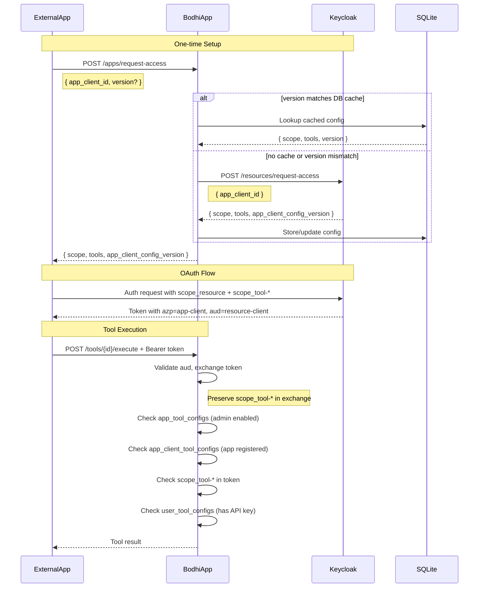

# External App Tool Access (Phase 7.6)

> Layer: `auth_middleware`, `services`, `routes_app` crates | Status: ✅ Complete | Updated: 2026-01-15

## Overview

This spec defines the implementation for external app tool access via OAuth tokens. It fixes Phase 7.5's incorrect Keycloak integration and adds proper scope-based authorization for external applications.

## Problem Statement

Phase 7.5 incorrectly:
- Added/removed client scopes on the resource-client (BodhiApp) instead of app-client
- Did not preserve `scope_tool-*` through token exchange
- Did not support external app tool authorization via OAuth scopes

## Corrected Architecture



## Authorization Flow Summary

| Auth Type | Check 1 | Check 2 | Check 3 | Check 4 |
|-----------|---------|---------|---------|---------|
| Session/First-party | app_tool_configs (admin enabled) | - | - | user_tool_configs (enabled + API key) |
| External OAuth | app_tool_configs (admin enabled) | app_client_tool_configs (registered) | scope_tool-* in token | user_tool_configs (API key) |

## Database Schema

### New Table: app_client_tool_configs

Caches app-client tool configurations from Keycloak to avoid repeated calls.

```sql
CREATE TABLE IF NOT EXISTS app_client_tool_configs (
    id INTEGER PRIMARY KEY AUTOINCREMENT,
    app_client_id TEXT NOT NULL UNIQUE,
    config_version TEXT NOT NULL,
    tools_json TEXT NOT NULL,  -- JSON array: [{"tool_id":"...","tool_scope":"..."}]
    resource_scope TEXT NOT NULL,
    created_at INTEGER NOT NULL,
    updated_at INTEGER NOT NULL
);
CREATE INDEX IF NOT EXISTS idx_app_client_tool_configs_client_id ON app_client_tool_configs(app_client_id);
```

### Row Structure

```rust
pub struct AppClientToolConfigRow {
    pub id: i64,
    pub app_client_id: String,
    pub config_version: String,
    pub tools_json: String,
    pub resource_scope: String,
    pub created_at: i64,
    pub updated_at: i64,
}
```

## Token Exchange Updates

### Preserve Tool Scopes

Current code in `token_service.rs` filters only `scope_user_*`:

```rust
// BEFORE
let mut scopes: Vec<&str> = claims
  .scope
  .split_whitespace()
  .filter(|s| s.starts_with("scope_user_"))
  .collect();

// AFTER
let mut scopes: Vec<&str> = claims
  .scope
  .split_whitespace()
  .filter(|s| s.starts_with("scope_user_") || s.starts_with("scope_tool-"))
  .collect();
```

### New Headers

Add headers to pass tool scopes and azp to downstream handlers:

```rust
pub const KEY_HEADER_BODHIAPP_TOOL_SCOPES: &str = "X-BodhiApp-Tool-Scopes";
pub const KEY_HEADER_BODHIAPP_AZP: &str = "X-BodhiApp-Azp";
```

After token exchange, inject these headers:

```rust
// Extract tool scopes from exchanged token (space-separated, matches JWT format)
let tool_scopes: Vec<&str> = scope_claims.scope
  .split_whitespace()
  .filter(|s| s.starts_with("scope_tool-"))
  .collect();

if !tool_scopes.is_empty() {
  req.headers_mut().insert(
    KEY_HEADER_BODHIAPP_TOOL_SCOPES,
    tool_scopes.join(" ").parse().unwrap()
  );
}

// Also inject azp for app-client identification
req.headers_mut().insert(
  KEY_HEADER_BODHIAPP_AZP,
  claims.azp.parse().unwrap()
);
```

## API Changes

### /apps/request-access Endpoint

Update request/response to include tools and caching:

**Request:**
```rust
#[derive(Deserialize)]
pub struct AppAccessRequest {
  pub app_client_id: String,
  pub version: Option<String>,  // Cache key from app-client
}
```

**Response:**
```rust
#[derive(Serialize)]
pub struct AppAccessResponse {
  pub scope: String,
  pub tools: Vec<AppClientTool>,
  pub app_client_config_version: String,
}

#[derive(Serialize, Deserialize, Clone)]
pub struct AppClientTool {
  pub tool_id: String,
  pub tool_scope: String,
}
```

**Handler Logic:**
1. If `version` provided, check DB cache by `app_client_id`
2. If cache hit and `config_version` matches `version`, return cached data
3. Otherwise, call Keycloak `/resources/request-access`
4. Store/update response in `app_client_tool_configs` table
5. Log warning if version mismatch (app sent X, Keycloak returned Y)
6. Return response to caller

## AuthService Changes

### Remove Incorrect Methods

Remove from `AuthService` trait and `KeycloakAuthService`:
- `enable_tool_scope()`
- `disable_tool_scope()`

### Update request_access Response

```rust
#[derive(Deserialize)]
pub struct KeycloakRequestAccessResponse {
  pub scope: String,
  pub tools: Vec<AppClientTool>,
  pub app_client_config_version: String,
}
```

## ToolService Changes

### Remove Keycloak Calls ✅

Updated `set_app_tool_enabled()` to only update the database, not call Keycloak.
Removed `AuthService` dependency from `DefaultToolService`.

### New Methods ✅

Added to `ToolService` trait:

```rust
// Check if app-client is registered for a tool (looks up cached app_client_tool_configs)
async fn is_app_client_registered_for_tool(&self, app_client_id: &str, tool_id: &str) 
  -> Result<bool, ToolError>;
```

Note: App-client config CRUD is handled directly in `DbService` and the `/apps/request-access` handler, not through `ToolService`, as the config caching is tied to the API flow.

## tool_auth_middleware Updates

Rewrite authorization logic to support session, first-party token, and OAuth flows:

```rust
async fn _impl(...) -> Result<Response, ToolAuthError> {
  let headers = req.headers();
  let user_id = extract_user_id(headers)?;
  
  // Determine auth type:
  // - Session: has ROLE header (from session tokens)
  // - First-party token: SCOPE starts with "scope_token_" (bodhiapp_ API keys)
  // - OAuth (external app): SCOPE starts with "scope_user_" (OAuth tokens)
  let is_session_auth = headers.contains_key(KEY_HEADER_BODHIAPP_ROLE);
  let scope_header = headers.get(KEY_HEADER_BODHIAPP_SCOPE).unwrap_or("");
  let is_first_party_token = scope_header.starts_with("scope_token_");
  let is_oauth_auth = scope_header.starts_with("scope_user_") && !is_session_auth;

  // 1. Check app-level enabled (all auth types)
  if !tool_service.is_tool_enabled_for_app(&tool_id).await? {
    return Err(ToolError::ToolAppDisabled.into());
  }

  if is_oauth_auth {
    // 2. Check app-client registered for tool
    let azp = headers.get(KEY_HEADER_BODHIAPP_AZP)?;
    if !tool_service.is_app_client_registered_for_tool(azp, &tool_id).await? {
      return Err(ToolAuthError::AppClientNotRegistered);
    }
    
    // 3. Check scope_tool-* in token
    let tool_scopes_header = headers.get(KEY_HEADER_BODHIAPP_TOOL_SCOPES).unwrap_or("");
    let required_scope = ToolScope::scope_for_tool_id(&tool_id)?;
    if !tool_scopes_header.split_whitespace().any(|s| s == required_scope) {
      return Err(ToolAuthError::MissingToolScope);
    }
  }

  // 4. Check user has tool configured (API key required for execution)
  if !tool_service.is_tool_available_for_user(user_id, &tool_id).await? {
    return Err(ToolError::ToolNotConfigured.into());
  }

  Ok(next.run(req).await)
}
```

## New Error Types

Added to `ToolAuthError` (in `tool_auth_middleware.rs`):

```rust
#[error("app_client_not_registered")]
#[error_meta(error_type = ErrorType::Forbidden)]
AppClientNotRegistered,

#[error("missing_tool_scope")]
#[error_meta(error_type = ErrorType::Forbidden)]
MissingToolScope,

#[error("missing_azp_header")]
#[error_meta(error_type = ErrorType::Forbidden)]
MissingAzpHeader,
```

Note: Uses `ErrorType::Forbidden` (not `Authorization`) as per project's error type enum.

## Implementation Status

### New Files ✅
- `crates/services/migrations/0008_app_client_tool_configs.up.sql` ✅
- `crates/services/migrations/0008_app_client_tool_configs.down.sql` ✅

### Modified Files ✅
- `crates/services/src/auth_service.rs` ✅ - Removed tool scope methods, updated request_access response
- `crates/services/src/tool_service.rs` ✅ - Added `is_app_client_registered_for_tool`, removed Keycloak calls
- `crates/services/src/db/service.rs` ✅ - Added CRUD for app_client_tool_configs
- `crates/services/src/db/objs.rs` ✅ - Added AppClientToolConfigRow
- `crates/auth_middleware/src/token_service.rs` ✅ - Preserved scope_tool-* in exchange
- `crates/auth_middleware/src/auth_middleware.rs` ✅ - Added KEY_HEADER_BODHIAPP_TOOL_SCOPES, KEY_HEADER_BODHIAPP_AZP injection
- `crates/auth_middleware/src/tool_auth_middleware.rs` ✅ - Full auth logic rewrite with 4-tier OAuth checks
- `crates/routes_app/src/routes_login.rs` ✅ - Updated /apps/request-access endpoint with caching
- `crates/lib_bodhiserver/src/app_service_builder.rs` ✅ - Updated ToolService construction (removed AuthService dependency)
- `crates/services/src/test_utils/db.rs` ✅ - Added mock methods for app_client_tool_configs

## Test Cases

### Token Exchange ✅
- External token with `scope_tool-*` preserves scopes through exchange
- Tool scopes header is set after exchange
- AZP header is set after exchange

### /apps/request-access ✅
- Cache hit returns cached data without Keycloak call
- Cache miss calls Keycloak and stores result
- Version mismatch logs warning and updates cache
- Missing version always calls Keycloak

### tool_auth_middleware ✅
- Session auth: checks app-level + user config only (`test_session_auth_tool_available`, `test_session_auth_app_disabled`)
- First-party token auth: same as session (`test_first_party_token_auth_tool_available`)
- OAuth auth: checks all 4 levels (`test_oauth_token_tool_configured`)
- Missing tool scope returns 403 (`test_oauth_token_missing_tool_scope`)
- Unregistered app-client returns 403 (`test_oauth_token_app_client_not_registered`)
- Tool not configured returns 400 (`test_oauth_token_tool_not_configured`, `test_session_auth_tool_not_configured`)

### ToolService ✅
- `is_app_client_registered_for_tool` returns true when tool in config
- `is_app_client_registered_for_tool` returns false when tool not in config
- `upsert_app_client_tool_config` creates new record
- `upsert_app_client_tool_config` updates existing record

## Related Documents

- [09-keycloak-extension-contract.md](./09-keycloak-extension-contract.md) - Keycloak extension API contract
- [05.5-app-level-tool-config.md](./05.5-app-level-tool-config.md) - App-level tool enable/disable (partially superseded)
- [05-auth-scopes.md](./05-auth-scopes.md) - Tool scope model
