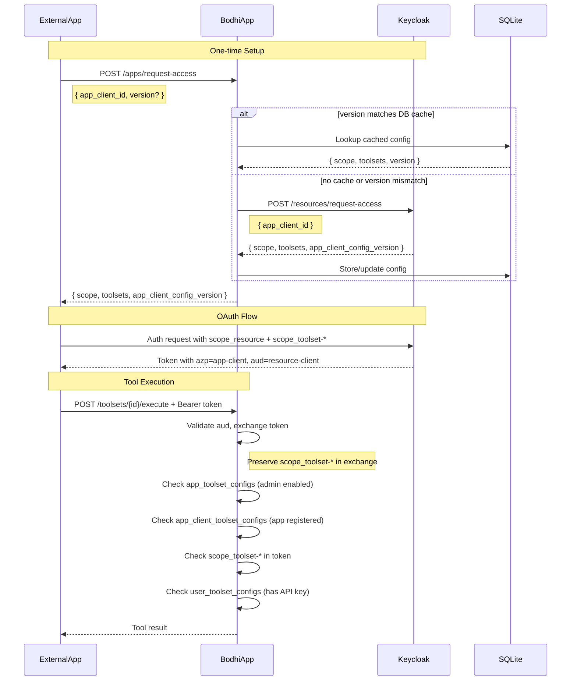

# External App Toolset Access

> Layer: `auth_middleware`, `services`, `routes_app` crates | Status: ✅ Complete

## Overview

External app toolset access via OAuth tokens with scope-based authorization. Implements four-tier authorization for OAuth tokens.

## Architecture



## Authorization Flow Summary

| Auth Type | Check 1 | Check 2 | Check 3 | Check 4 |
|-----------|---------|---------|---------|---------|
| Session/First-party | app_toolset_configs (admin enabled) | - | - | user_toolset_configs (enabled + API key) |
| External OAuth | app_toolset_configs (admin enabled) | app_client_toolset_configs (registered) | scope_toolset-* in token | user_toolset_configs (API key) |

## Database Schema

### app_client_toolset_configs Table

Caches app-client toolset configurations from Keycloak.

```sql
CREATE TABLE IF NOT EXISTS app_client_toolset_configs (
    id INTEGER PRIMARY KEY AUTOINCREMENT,
    app_client_id TEXT NOT NULL UNIQUE,
    config_version TEXT NOT NULL,
    toolsets_json TEXT NOT NULL,  -- JSON array: [{"toolset_id":"...","toolset_scope":"..."}]
    resource_scope TEXT NOT NULL,
    created_at INTEGER NOT NULL,
    updated_at INTEGER NOT NULL
);
CREATE INDEX IF NOT EXISTS idx_app_client_toolset_configs_client_id ON app_client_toolset_configs(app_client_id);
```

### Row Structure

```rust
pub struct AppClientToolsetConfigRow {
    pub id: i64,
    pub app_client_id: String,
    pub config_version: String,
    pub toolsets_json: String,
    pub resource_scope: String,
    pub created_at: i64,
    pub updated_at: i64,
}
```

## Token Exchange Updates

### Preserve Toolset Scopes

Token exchange preserves `scope_toolset-*` scopes:

```rust
// crates/auth_middleware/src/token_service.rs
let mut scopes: Vec<&str> = claims
  .scope
  .split_whitespace()
  .filter(|s| s.starts_with("scope_user_") || s.starts_with("scope_toolset-"))
  .collect();
```

### New Headers

```rust
pub const KEY_HEADER_BODHIAPP_TOOLSET_SCOPES: &str = "X-BodhiApp-Toolset-Scopes";
pub const KEY_HEADER_BODHIAPP_AZP: &str = "X-BodhiApp-Azp";
```

After token exchange, inject these headers:

```rust
let toolset_scopes: Vec<&str> = scope_claims.scope
  .split_whitespace()
  .filter(|s| s.starts_with("scope_toolset-"))
  .collect();

if !toolset_scopes.is_empty() {
  req.headers_mut().insert(
    KEY_HEADER_BODHIAPP_TOOLSET_SCOPES,
    toolset_scopes.join(" ").parse().unwrap()
  );
}

req.headers_mut().insert(
  KEY_HEADER_BODHIAPP_AZP,
  claims.azp.parse().unwrap()
);
```

## API: /apps/request-access

**Request:**
```rust
#[derive(Deserialize)]
pub struct AppAccessRequest {
  pub app_client_id: String,
  pub version: Option<String>,  // Cache key
}
```

**Response:**
```rust
#[derive(Serialize)]
pub struct AppAccessResponse {
  pub scope: String,
  pub toolsets: Vec<AppClientToolset>,
  pub app_client_config_version: String,
}

#[derive(Serialize, Deserialize, Clone)]
pub struct AppClientToolset {
  pub toolset_id: String,
  pub toolset_scope: String,
}
```

**Handler Logic:**
1. If `version` provided, check DB cache by `app_client_id`
2. If cache hit and `config_version` matches `version`, return cached data
3. Otherwise, call Keycloak `/resources/request-access`
4. Store/update response in `app_client_toolset_configs` table
5. Return response to caller

## ToolsetService Methods

```rust
// Check if app-client is registered for a toolset
async fn is_app_client_registered_for_toolset(&self, app_client_id: &str, toolset_id: &str) 
  -> Result<bool, ToolsetError>;
```

## toolset_auth_middleware

Full authorization logic:

```rust
async fn _impl(...) -> Result<Response, ToolsetAuthError> {
  let headers = req.headers();
  let user_id = extract_user_id(headers)?;
  
  // Determine auth type
  let is_session_auth = headers.contains_key(KEY_HEADER_BODHIAPP_ROLE);
  let scope_header = headers.get(KEY_HEADER_BODHIAPP_SCOPE).unwrap_or("");
  let is_first_party_token = scope_header.starts_with("scope_token_");
  let is_oauth_auth = scope_header.starts_with("scope_user_") && !is_session_auth;

  // 1. Check app-level enabled (all auth types)
  if !toolset_service.is_toolset_enabled_for_app(&toolset_id).await? {
    return Err(ToolsetError::ToolsetAppDisabled.into());
  }

  if is_oauth_auth {
    // 2. Check app-client registered for toolset
    let azp = headers.get(KEY_HEADER_BODHIAPP_AZP)?;
    if !toolset_service.is_app_client_registered_for_toolset(azp, &toolset_id).await? {
      return Err(ToolsetAuthError::AppClientNotRegistered);
    }
    
    // 3. Check scope_toolset-* in token
    let toolset_scopes_header = headers.get(KEY_HEADER_BODHIAPP_TOOLSET_SCOPES).unwrap_or("");
    let required_scope = ToolsetScope::scope_for_toolset_id(&toolset_id)?;
    if !toolset_scopes_header.split_whitespace().any(|s| s == required_scope.to_string()) {
      return Err(ToolsetAuthError::MissingToolsetScope);
    }
  }

  // 4. Check user has toolset configured (API key required)
  if !toolset_service.is_toolset_available_for_user(user_id, &toolset_id).await? {
    return Err(ToolsetError::ToolsetNotConfigured.into());
  }

  Ok(next.run(req).await)
}
```

## Error Types

```rust
#[error("app_client_not_registered")]
#[error_meta(error_type = ErrorType::Forbidden)]
AppClientNotRegistered,

#[error("missing_toolset_scope")]
#[error_meta(error_type = ErrorType::Forbidden)]
MissingToolsetScope,

#[error("missing_azp_header")]
#[error_meta(error_type = ErrorType::Forbidden)]
MissingAzpHeader,
```

## Test Cases

### Token Exchange
- External token with `scope_toolset-*` preserves scopes through exchange
- Toolset scopes header is set after exchange
- AZP header is set after exchange

### /apps/request-access
- Cache hit returns cached data without Keycloak call
- Cache miss calls Keycloak and stores result
- Version mismatch logs warning and updates cache

### toolset_auth_middleware
- Session auth: checks app-level + user config only
- First-party token auth: same as session
- OAuth auth: checks all 4 levels
- Missing toolset scope returns 403
- Unregistered app-client returns 403
- Toolset not configured returns 400

### ToolsetService
- `is_app_client_registered_for_toolset` returns true when toolset in config
- `is_app_client_registered_for_toolset` returns false when toolset not in config

## Related Documents

- [09-keycloak-extension-contract.md](./09-keycloak-extension-contract.md) - Keycloak extension API contract
- [05.5-app-level-toolset-config.md](./05.5-app-level-toolset-config.md) - App-level toolset enable/disable
- [05-auth-scopes.md](./05-auth-scopes.md) - Toolset scope model
