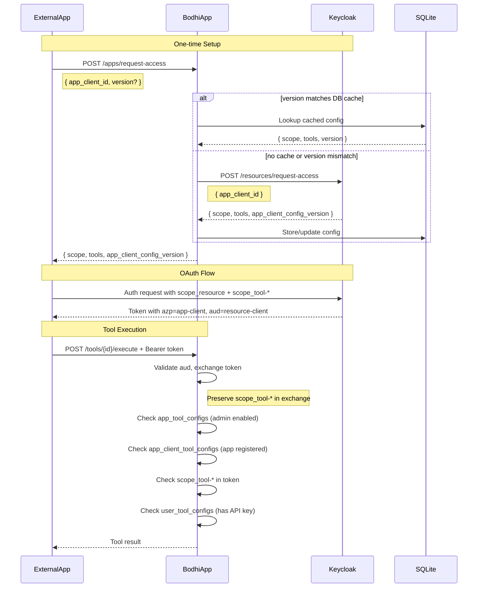

# Phase 7.6: External App Tool Access and OAuth Scope Fix

## Problem Statement

Phase 7.5 implemented incorrect Keycloak integration:

- Incorrectly added/removed client scopes on the resource-client (BodhiApp) instead of app-client
- Did not preserve `scope_tool-*` through token exchange
- Did not support external app tool authorization via OAuth scopes

## Keycloak Implementation Status

**Keycloak extension has been implemented and deployed** to `main-id.getbodhi.app`.

Key implementation details from Keycloak:

- Response returns 400 (not 404) when app-client not found
- Attributes use dot notation: `bodhi.tools`, `bodhi.config_version`
- Additional `bodhi.client_type` validation (resource/app) - implementation detail
- Tool management endpoints added for developer console (not used by BodhiApp)

## Corrected Architecture



## Changes Required

### 1. Remove Incorrect Keycloak Integration

**Files to modify:**

- [crates/services/src/auth_service.rs](crates/services/src/auth_service.rs): Remove `enable_tool_scope()` and `disable_tool_scope()` methods from trait and implementation
- [crates/services/src/tool_service.rs](crates/services/src/tool_service.rs): Remove `set_app_tool_enabled()` Keycloak calls, keep only DB update
- [crates/routes_app/src/routes_tools.rs](crates/routes_app/src/routes_tools.rs): Update `enable_app_tool`/`disable_app_tool` to not call Keycloak

### 2. New Database Table: app_client_tool_configs

**File:** [crates/services/migrations/0008_app_client_tool_configs.up.sql](crates/services/migrations/0008_app_client_tool_configs.up.sql)

```sql
CREATE TABLE IF NOT EXISTS app_client_tool_configs (
    id INTEGER PRIMARY KEY AUTOINCREMENT,
    app_client_id TEXT NOT NULL UNIQUE,
    config_version TEXT NOT NULL,
    tools_json TEXT NOT NULL,  -- JSON array: [{"tool_id":"...","tool_scope":"..."}]
    resource_scope TEXT NOT NULL,
    created_at INTEGER NOT NULL,
    updated_at INTEGER NOT NULL
);
CREATE INDEX IF NOT EXISTS idx_app_client_tool_configs_client_id ON app_client_tool_configs(app_client_id);
```

### 3. Update Token Exchange to Preserve Tool Scopes

**File:** [crates/auth_middleware/src/token_service.rs](crates/auth_middleware/src/token_service.rs)

Current code filters only `scope_user_*`:

```rust
let mut scopes: Vec<&str> = claims
  .scope
  .split_whitespace()
  .filter(|s| s.starts_with("scope_user_"))  // FIX: Also keep scope_tool-*
  .collect();
```

Change to:

```rust
let mut scopes: Vec<&str> = claims
  .scope
  .split_whitespace()
  .filter(|s| s.starts_with("scope_user_") || s.starts_with("scope_tool-"))
  .collect();
```

### 4. Add Tool Scopes Header

**File:** [crates/auth_middleware/src/lib.rs](crates/auth_middleware/src/lib.rs)

Add new header constant:

```rust
pub const KEY_HEADER_BODHIAPP_TOOL_SCOPES: &str = "X-BodhiApp-Tool-Scopes";
```

**File:** [crates/auth_middleware/src/api_auth.rs](crates/auth_middleware/src/api_auth.rs) (or equivalent)

After token exchange, extract and inject tool scopes:

```rust
// Extract tool scopes from exchanged token
let tool_scopes: Vec<&str> = scope_claims.scope
  .split_whitespace()
  .filter(|s| s.starts_with("scope_tool-"))
  .collect();

if !tool_scopes.is_empty() {
  req.headers_mut().insert(
    KEY_HEADER_BODHIAPP_TOOL_SCOPES,
    tool_scopes.join(" ").parse().unwrap()  // Space-separated (matches JWT scope format)
  );
}
```

### 5. Update /apps/request-access Endpoint

**File:** [crates/routes_app/src/routes_login.rs](crates/routes_app/src/routes_login.rs)

Update request/response types:

```rust
#[derive(Deserialize)]
pub struct AppAccessRequest {
  pub app_client_id: String,
  pub version: Option<String>,  // NEW: cache key
}

#[derive(Serialize)]
pub struct AppAccessResponse {
  pub scope: String,
  pub tools: Vec<AppClientTool>,  // NEW
  pub app_client_config_version: String,  // NEW
}

#[derive(Serialize, Deserialize)]
pub struct AppClientTool {
  pub tool_id: String,
  pub tool_scope: String,
}
```

Update handler logic:

1. If `version` provided, check DB cache
2. If cache hit (version matches), return cached data
3. Otherwise, call Keycloak `/resources/request-access`
4. Store response in `app_client_tool_configs` table
5. Return response to caller

### 6. Update AuthService for New Keycloak Contract

**File:** [crates/services/src/auth_service.rs](crates/services/src/auth_service.rs)

Update `request_access` method response type:

```rust
#[derive(Deserialize)]
pub struct KeycloakRequestAccessResponse {
  pub scope: String,
  pub tools: Vec<AppClientTool>,
  pub app_client_config_version: String,
}
```

### 7. Update tool_auth_middleware

**File:** [crates/auth_middleware/src/tool_auth_middleware.rs](crates/auth_middleware/src/tool_auth_middleware.rs)

New authorization logic:

```rust
async fn _impl(...) -> Result<Response, ToolAuthError> {
  let headers = req.headers();
  let user_id = extract_user_id(headers)?;
  
  // Determine auth type
  let is_session_auth = headers.contains_key(KEY_HEADER_BODHIAPP_ROLE);
  let is_oauth_auth = headers.contains_key(KEY_HEADER_BODHIAPP_SCOPE) 
                      && !is_session_auth;

  // 1. Check app-level enabled (both auth types)
  if !tool_service.is_tool_enabled_for_app(&tool_id).await? {
    return Err(ToolError::ToolAppDisabled.into());
  }

  if is_oauth_auth {
    // 2. Check app-client registered for tool
    let azp = headers.get(KEY_HEADER_BODHIAPP_AZP)?;  // Need to add this header
    if !tool_service.is_app_client_registered_for_tool(azp, &tool_id).await? {
      return Err(ToolError::AppClientNotRegistered.into());
    }
    
    // 3. Check scope_tool-* in token
    let tool_scopes = headers.get(KEY_HEADER_BODHIAPP_TOOL_SCOPES)?;
    let required_scope = ToolScope::scope_for_tool_id(&tool_id)?;
    if !tool_scopes.contains(required_scope) {
      return Err(ToolError::MissingToolScope.into());
    }
  }

  // 4. Check user has tool configured (API key required for execution)
  if !tool_service.is_tool_available_for_user(user_id, &tool_id).await? {
    return Err(ToolError::ToolNotConfigured.into());
  }

  Ok(next.run(req).await)
}
```

### 8. Update Keycloak Contract Spec

**File:** [ai-docs/specs/20260114-tools-backend/09-keycloak-extension-contract.md](ai-docs/specs/20260114-tools-backend/09-keycloak-extension-contract.md)

Remove the `POST/DELETE /resources/tools` endpoints (incorrect).

Update `/resources/request-access` contract:

- Request: `{ app_client_id: string }`
- Response: `{ scope: string, tools: [{tool_id, tool_scope}], app_client_config_version: string }`
- Keycloak reads `bodhi.tools` and `bodhi.config_version` attributes from app-client
- Returns 400 (not 404) when app-client not found
- Adds `scope_resource-xyz` to app-client's optional scopes (existing behavior)
- Tool scopes (`scope_tool-*`) already configured on app-client by developer portal

### 9. New ToolService Methods

**File:** [crates/services/src/tool_service.rs](crates/services/src/tool_service.rs)

```rust
// Add to trait
async fn is_app_client_registered_for_tool(&self, app_client_id: &str, tool_id: &str) 
  -> Result<bool, ToolError>;
async fn get_app_client_tool_config(&self, app_client_id: &str) 
  -> Result<Option<AppClientToolConfig>, ToolError>;
async fn upsert_app_client_tool_config(&self, config: &AppClientToolConfig) 
  -> Result<AppClientToolConfig, ToolError>;
```

## Summary of Auth Flow

| Auth Type | Check 1 | Check 2 | Check 3 | Check 4 |

|-----------|---------|---------|---------|---------|

| Session/First-party | app_tool_configs (admin enabled) | - | - | user_tool_configs (enabled + API key) |

| External OAuth | app_tool_configs (admin enabled) | app_client_tool_configs (registered) | scope_tool-* in token | user_tool_configs (API key) |

## Files Summary

**New files:**

- `crates/services/migrations/0008_app_client_tool_configs.up.sql`
- `crates/services/migrations/0008_app_client_tool_configs.down.sql`

**Modified files:**

- `crates/services/src/auth_service.rs` - Remove tool scope methods, update request_access response
- `crates/services/src/tool_service.rs` - Add app-client methods, remove Keycloak calls
- `crates/services/src/db/service.rs` - Add CRUD for app_client_tool_configs
- `crates/services/src/db/objs.rs` - Add AppClientToolConfigRow
- `crates/auth_middleware/src/token_service.rs` - Preserve scope_tool-* in exchange
- `crates/auth_middleware/src/lib.rs` - Add KEY_HEADER_BODHIAPP_TOOL_SCOPES
- `crates/auth_middleware/src/tool_auth_middleware.rs` - Full auth logic rewrite
- `crates/routes_app/src/routes_login.rs` - Update /apps/request-access endpoint with caching
- `ai-docs/specs/20260114-tools-backend/09-keycloak-extension-contract.md` - Finalize with implementation details