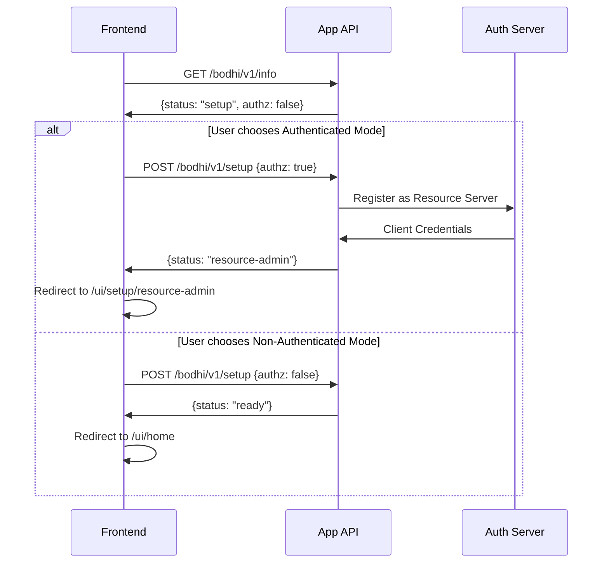

# Application Setup Flow

## Overview
The Bodhi App requires an initial setup to determine its authentication mode. This guide explains the setup process, API endpoints, and the flow between different states.

## Setup Flow



## API Endpoints

### 1. Check App Status
```http
GET /bodhi/v1/info
```

Response:
```json
{
  "version": "0.1.0",
  "authz": false,
  "status": "setup"
}
```

### 2. Setup Application
```http
POST /bodhi/v1/setup
Content-Type: application/json

{
  "authz": true|false
}
```

Success Responses:
```json
// For authenticated mode
{
  "status": "resource-admin"
}

// For non-authenticated mode
{
  "status": "ready"
}
```

Error Response:
```json
{
  "error": {
    "message": "app is already setup",
    "type": "invalid_request_error",
    "code": "app_service_error-already_setup"
  }
}
```

## Setup Process

### Initial State
- App starts in `setup` status
- Frontend checks app status using `/bodhi/v1/info`
- User is presented with setup choices:
  - Authenticated Mode (with role-based access)
  - Non-Authenticated Mode (open access)

### Authenticated Mode Setup
1. Frontend sends `POST /bodhi/v1/setup` with `{"authz": true}`
2. Backend:
   - Validates app is in setup status
   - Registers with auth server as a resource server
   - Receives and securely stores client credentials
   - Updates app status to `resource-admin`
   - Sets `authz` flag to `true`
3. Frontend redirects to `/ui/setup/resource-admin` for admin user setup

### Non-Authenticated Mode Setup
1. Frontend sends `POST /bodhi/v1/setup` with `{"authz": false}`
2. Backend:
   - Validates app is in setup status
   - Sets `authz` flag to `false`
   - Updates app status directly to `ready`
3. Frontend redirects to `/ui/home`

## Security Considerations

### Authentication Mode
- Requires valid auth server configuration
- Securely stores client credentials
- Enforces role-based access control
- First user to log in becomes admin
- All API endpoints require authentication

### Non-Authentication Mode
- No authentication required
- All endpoints are publicly accessible
- Authorization headers are ignored
- Suitable for local development/testing
- No user roles or permissions

## Error Handling

### Common Errors
1. Already Setup
   - Occurs when setup is attempted on an already configured app
   - Returns 400 Bad Request

2. Auth Server Registration Failed
   - Occurs during authenticated mode setup
   - Returns 500 Internal Server Error
   - Includes detailed error message

### Important Notes
- Setup can only be performed once
- Authentication mode cannot be changed after setup
- All setup choices are persisted across app restarts
- Setup endpoint validates current app status before proceeding