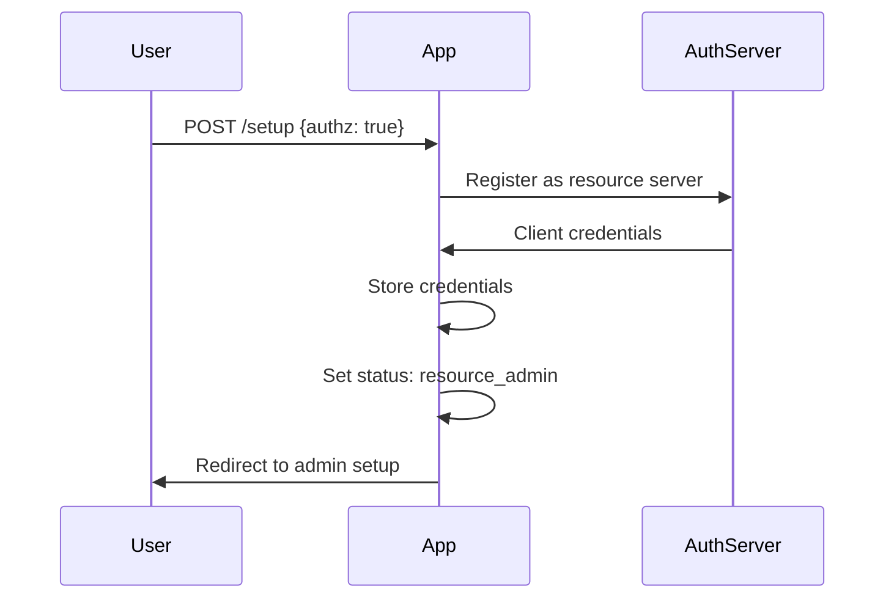

# System Overview

This document provides a high-level overview of the Bodhi App system architecture, crate organization, and key architectural decisions.

## Application Overview

Bodhi App is an AI-powered application for running Large Language Models (LLMs) locally. It utilizes the Huggingface ecosystem for accessing open-source LLM weights and information and is powered by llama.cpp.

While many apps that help you run LLMs locally are targeted at technical users, Bodhi App is designed with both technical and non-technical users in mind.

For technical users, it provides OpenAI-compatible chat completions and models API endpoints. It includes comprehensive API documentation following OpenAPI standards and features a built-in SwaggerUI that allows developers to explore and test all API endpoints live.

For non-technical users, it comes with a built-in Chat UI that is quick to start and easy to understand. Users can quickly get started with open-source models and adjust various settings to suit their needs. The app also enables users to discover, explore, and download new open-source models that fit their requirements and are compatible with their local hardware.

### Key Features

### Local LLM Inference
- **llama.cpp Integration**: Native llama.cpp compilation and process management
- **Model Management**: Download, load, and manage GGUF models from HuggingFace
- **Hardware Acceleration**: CUDA, OpenCL, Metal support
- **Multi-Model Support**: Run multiple models simultaneously

### API Compatibility
- **OpenAI**: Full OpenAI API compatibility for chat completions (`/v1/chat/completions`, `/v1/models`)
- **Ollama**: Drop-in replacement endpoints (`/api/tags`, `/api/show`, `/api/chat`)
- **Anthropic**: Messages API proxy under `/anthropic/v1/*`
- **Responses**: OpenAI Responses API support
- **Streaming**: Real-time response streaming via Server-Sent Events
- **Client Library Support**: Works with existing OpenAI / Ollama / Anthropic client libraries

### Authentication & Security
- **OAuth2 Integration**: External authentication provider (Keycloak) support
- **JWT Tokens**: Secure token-based authentication
- **Role-Based Access**: `ResourceRole` hierarchy — `Anonymous < Guest < User < PowerUser < Manager < Admin`
- **API Keys**: DB-backed API token management for programmatic access

### User Experience Features
- **Built-in Chat UI**: Intuitive, responsive chat interface with real-time streaming, markdown support, and customizable settings
- **Model Management**: Download and manage GGUF model files directly from HuggingFace
- **API Token Management**: Securely generate and manage API tokens for external integrations
- **Dynamic App Settings**: Easily adjust application parameters (like execution variant and idle timeout) on the fly
- **Responsive Design**: Fully adaptive layout that works seamlessly across desktop and mobile devices
- **Robust Error Handling**: Comprehensive error logging and troubleshooting guides to help quickly identify and resolve issues

## Core Capabilities

BodhiApp provides:
- Local LLM server management via llama.cpp integration
- OpenAI-compatible API endpoints
- Web-based chat interface
- Model management and downloading
- Authentication and authorization
- Multi-user support

## System Architecture

Bodhi App is a comprehensive Rust-based application that provides local Large Language Model (LLM) inference with OpenAI-compatible APIs and a modern web interface. The architecture combines a multi-crate backend with a Vite + React frontend, deployable as both a standalone server and a Tauri desktop application.

### Crate Dependency Chain

The backend is organized as focused, single-responsibility crates layered upstream-to-downstream. The canonical chain (see root `CLAUDE.md` and [`crates/CLAUDE.md`](../../crates/CLAUDE.md)):

```
errmeta_derive (proc-macro)
       │
    errmeta (AppError, ErrorType, IoError, EntityError)
    /      \
llama_server_proc    mcp_client
       \                 /
        \               /
         services (ALL domain types + business logic)
        /          \
server_core         │
        \          /
         routes_app (ApiError, OpenAIApiError, auth middleware)
             │
         server_app
             │
      lib_bodhiserver
      /             \
lib_bodhiserver_napi  bodhi/src-tauri
```

There is no separate `objs` crate — domain types were merged into `services`, which is now the single hub for all domain objects co-located with the business logic that uses them.

### Crate Roles

| Crate | Purpose |
|-------|---------|
| `errmeta_derive` | Proc macro: `#[derive(ErrorMeta)]` generating `AppError` impl |
| `errmeta` | Error foundation: `AppError`, `ErrorType`, `IoError`, `EntityError` |
| `llama_server_proc` | LLM process lifecycle: Server trait, health checks, binary resolution |
| `mcp_client` | MCP protocol client over Streamable HTTP |
| `services` | Domain types + business logic hub: AppService, DbService, SeaORM, all domain modules |
| `server_core` | HTTP infrastructure: SharedContext, SSE streaming, InferenceService |
| `routes_app` | API endpoints + auth middleware: AuthScope, ApiError, JWT, session, OpenAPI |
| `server_app` | Standalone HTTP server: ServeCommand, graceful shutdown, live integration tests |
| `lib_bodhiserver` | Embeddable server library: AppServiceBuilder, setup_app_dirs, re-exports, `bodhiserver_dev` bin + Playwright E2E suite |
| `lib_bodhiserver_napi` | NAPI bindings: `@bodhiapp/app-bindings` (external Node.js consumers) |
| `bodhi/src` | Vite + React + TanStack Router + TanStack Query v5 frontend |
| `bodhi/src-tauri` | Tauri desktop + container server: native feature flag, dual-mode |
| `xtask` | Build automation: OpenAPI spec + TypeScript client generation |

For full crate index, shared conventions, and cross-crate patterns, see [`crates/CLAUDE.md`](../../crates/CLAUDE.md) and individual `crates/<crate>/CLAUDE.md` files.

## Application States

### Setup Mode (`setup`)
- Initial state requiring authentication mode selection
- No API access except setup endpoints
- Transitions to either `resource_admin` or `ready`

### Resource Admin Mode (`resource_admin`)
- Intermediate state for authenticated mode
- Waiting for first admin user registration
- Limited API access for admin setup

### Ready Mode (`ready`)
- Fully operational state
- All APIs accessible
- Authentication enforced if enabled

## Data Flow Patterns

### Chat Completion Flow
1. **Frontend Request** → React UI sends chat request
2. **Route Handling** → `routes_app` OAI handlers process the OpenAI-compatible request
3. **Service Layer** → services orchestrate business logic
4. **LLM Inference** → llama_server_proc manages llama.cpp process
5. **Response Streaming** → Real-time response via SSE
6. **Frontend Update** → React UI updates with streamed response

### Model Management Flow
1. **Model Discovery** → HuggingFace Hub integration for model search
2. **Download Management** → Background download with progress tracking
3. **Model Loading** → Dynamic model loading into llama.cpp
4. **Alias Management** → User-friendly model naming and organization

### Authentication Flow

#### Authenticated Mode Setup


## Key Design Patterns

### Dependency Injection
- Services injected into route handlers via Axum extensions
- Mock implementations for testing
- Clear separation of concerns

### Error Handling
- Centralized error types with metadata (`errmeta_derive`)
- Localization support for error messages
- Structured error responses for APIs

### Configuration Management
- Environment-based configuration
- Runtime configuration updates
- Validation and defaults

### Real-Time Communication
- Server-Sent Events for streaming
- WebSocket support for bidirectional communication
- Event-driven architecture

## Token System

### Session Tokens
- Used for web UI authentication
- Short-lived with refresh capability
- Stored in session cookie

### API Tokens
- Long-lived offline tokens
- Used for programmatic access
- Can be named and managed
- Status tracking (active/inactive)

## Model Aliases

Model aliases provide user-friendly names for complex model configurations:

```json
{
  "alias": "llama2:chat",
  "repo": "TheBloke/Llama-2-7B-Chat-GGUF",
  "filename": "llama-2-7b-chat.Q4_K_M.gguf",
  "source": "huggingface",
  "chat_template": "llama2",
  "model_params": {},
  "request_params": {
    "temperature": 0.7,
    "top_p": 0.95
  },
  "context_params": {
    "max_tokens": 4096
  }
}
```

## Integration Points

### External Services
- **HuggingFace Hub** → Model discovery and download
- **OAuth2 Providers** → Authentication integration
- **System Services** → OS integration and notifications

### Client Integration
- **OpenAI Libraries** → Compatible with existing tools
- **Custom Clients** → REST API for custom integrations
- **CLI Tools** → Command-line interface for automation

## Technology Stack

### Key Technologies
- **Backend**: Rust, Axum, SeaORM, Tokio
- **Frontend**: Vite, React, TypeScript, TanStack Router, TanStack Query v5, TailwindCSS, Shadcn UI
- **Desktop**: Tauri
- **LLM**: llama.cpp integration
- **API**: OpenAI-compatible + Ollama + Anthropic + Responses endpoints
- **Auth**: OAuth2, JWT (Keycloak)
- **Database**: SeaORM over SQLite (dev/desktop) and PostgreSQL (production/Docker)
- **Documentation**: OpenAPI/Swagger via utoipa

### Architecture Patterns
1. **Layered Crate Architecture**: Single-responsibility crates layered upstream-to-downstream
2. **Dependency Injection**: Services injected into route handlers via `AuthScopedAppService`
3. **Error Handling**: Centralized error types with metadata (`errmeta` + `errmeta_derive`)
4. **API-First**: OpenAPI documentation generated from code, TypeScript client auto-generated
5. **Multi-Tenant**: Tenant-scoped DB operations with PostgreSQL RLS
6. **Test-Driven**: Comprehensive testing at unit / integration / E2E levels

## Related Documentation

- **[Tauri Desktop](tauri-desktop.md)** - Desktop application architecture
- **[Authentication](authentication.md)** - Security implementation details
- **[App Status & Lifecycle](app-status.md)** - Application state management
- **[Architectural Decisions](architectural-decisions.md)** - Key ADRs and rationale
- **Frontend patterns** - [`crates/bodhi/src/CLAUDE.md`](../../crates/bodhi/src/CLAUDE.md)
- **Backend service patterns** - [`crates/services/CLAUDE.md`](../../crates/services/CLAUDE.md)

---

*For detailed implementation guidance, see the canonical crate docs at [`crates/CLAUDE.md`](../../crates/CLAUDE.md) and the per-crate `crates/<crate>/CLAUDE.md` files.*
