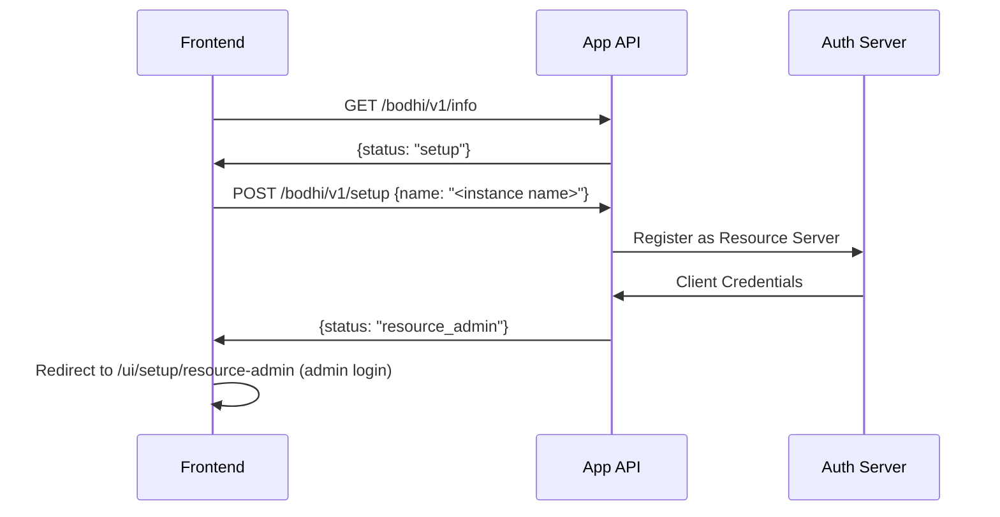

# Application Setup Flow

How a fresh Bodhi App instance transitions from first boot to a usable, authenticated server. Setup is **always authenticated** — there is no non-authenticated mode. Authoritative types: `SetupRequest` / `AppStatus` in `crates/routes_app/src/setup/setup_api_schemas.rs` and `crates/services/src/tenants/tenant_objs.rs`.

## States (`AppStatus`)

`setup` (default) → `resource_admin` → `ready`. Serialized snake_case.



## API

### Check status

```
GET /bodhi/v1/info
```

Returns the current `AppStatus` (`{"status": "setup"}` on a fresh instance).

### Run setup

```
POST /bodhi/v1/setup
Content-Type: application/json

{ "name": "<user-provided instance name>" }
```

The request body carries a mandatory user-provided `name` (no `authz` flag — auth is unconditional). Backend:

1. Validates the app is in `setup` status.
2. Registers with the auth server as a resource server.
3. Securely stores the returned client credentials.
4. Advances status to `resource_admin`.

Response: `{ "status": "resource_admin" }`. Frontend then routes to admin login (`/ui/setup/resource-admin`); the first user to log in becomes the resource admin, after which status becomes `ready`.

Error (already configured):

```json
{
  "error": {
    "message": "app is already setup",
    "type": "invalid_request_error",
    "code": "app_service_error-already_setup"
  }
}
```

## Frontend Routing

`AppInitializer` (`crates/bodhi/src/components/AppInitializer.tsx`) reads `/bodhi/v1/info` and redirects by status + deployment mode:

- `setup` + standalone → `/setup`
- `setup` + multi_tenant → `/setup/tenants`
- `resource_admin` → `/setup/resource-admin`
- `ready` → `/chat` (or `/login` for multi_tenant with no client_id)

See `crates/bodhi/src/CLAUDE.md` (App Initialization Flow) for the full table.

## Rules

- Setup runs **once**; re-running on a configured app returns 400 (`already_setup`).
- Authentication is always enforced — all API endpoints require auth, RBAC applies.
- Choices persist across restarts.
- Auth-server registration failure surfaces as a 500 with a detailed message.

## Related

- Product/architecture vision of Bodhi as an OAuth2 LLM resource server: `docs/conventions/llm-resource-server.md`.
- Multi-tenant tenant registration: `crates/services/CLAUDE.md` (tenants module).
